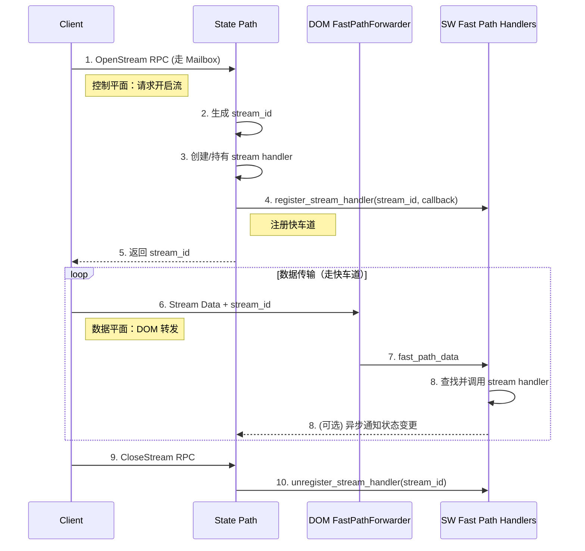

# Actor-RTC Web 双层架构设计

> 当前实现说明：本文描述的 State Path / Fast Path 概念仍然有效，但 Fast Path 的处理位置已从早期“DOM 本地 registry/callback”调整为“DOM 固定转发层 → SW runtime / stream handlers”。当前源码锚点：`packages/actr-dom/src/fast-path-forwarder.ts`、`packages/web-sdk/src/actor.sw.js`、`crates/sw-host/src/runtime.rs::handle_dom_fast_path`。

## 核心概念

### State Path vs Fast Path

Actor-RTC Web 采用**双层架构**，将消息处理分为两条路径：

```
┌─────────────────────────────────────────────────────────┐
│                     State Path (慢车道)                   │
│                                                           │
│  RPC Request/Response, 流控制信令 (Open/CloseStream)      │
│         ↓                                                 │
│  Mailbox (持久化队列)                                      │
│         ↓                                                 │
│  Scheduler (串行化调度)                                    │
│         ↓                                                 │
│  Actor 业务逻辑 (状态变更)                                 │
│                                                           │
│  特点：顺序保证、状态安全、延迟较高，需 benchmark 确认     │
└─────────────────────────────────────────────────────────┘

┌─────────────────────────────────────────────────────────┐
│                     Fast Path (快车道)                    │
│                                                           │
│  Stream Data (VideoChunk, AudioSample, FileChunk)        │
│         ↓                                                 │
│  DOM FastPathForwarder → SW handle_dom_fast_path          │
│         ↓                                                 │
│  SW runtime.handle_fast_path / stream_handlers            │
│         ↓                                                 │
│  数据处理 + 可选的异步通知 State Path                       │
│                                                           │
│  特点：绕过 Mailbox/Scheduler、高吞吐、无状态或最终一致性  │
└─────────────────────────────────────────────────────────┘
```

## 设计原则

### 职责分离

> **State Path 负责建立和拆除 Fast Path 的"轨道"，Fast Path 负责在建好的轨道上高速"行车"**

#### State Path（控制平面）
- **职责**: 状态管理、生命周期控制、流控制信令
- **消息类型**: RPC 请求/响应、OpenStream、CloseStream
- **处理方式**: 持久化 → 调度 → 串行执行
- **延迟**: 需当前 benchmark 确认

#### Fast Path（数据平面）
- **职责**: 高吞吐数据传输（音视频、文件）
- **消息类型**: DataChunk、MediaFrame
- **处理方式**: DOM 转发 `fast_path_data`，SW 派发 stream handlers
- **延迟**: 不在本文声明固定数字；以当前 e2e/benchmark 为准

## 协作流程



## Web 环境适配

### 传输层支持

| Lane 类型 | Service Worker | DOM/Window | 支持 PayloadType | 用途 |
|----------|----------------|------------|------------------|------|
| **WebSocket** | ✅ | ✅ | 全部（RPC_*, STREAM_*） | C/S 架构，信令服务器通信 |
| **WebRTC DataChannel** | ❌ | ✅ | 全部（RPC_*, STREAM_*） | P2P 架构，端到端通信 |
| **WebRTC MediaTrack** | ❌ | ✅ | MEDIA_RTP | P2P 媒体流（音视频） |
| **PostMessage** | ✅ | ✅ | 全部 | SW ↔ DOM 通信 |

**关键约束**:
- Service Worker 无法访问 WebRTC API
- 必须在 DOM 侧创建 PeerConnection

### 双进程职责划分

#### Service Worker 侧（主控）
- **职责**: State Path 全流程
- **组件**:
  - PeerTransport (发送)
  - InboundPacketDispatcher (接收 RPC)
  - Mailbox + Scheduler (Actor)
- **通信**: WebSocket（直接）, PostMessage（与 DOM）

#### DOM 侧（辅助 + WebRTC HAL）
- **职责**: WebRTC 管理 + Fast Path 转发
- **组件**:
  - WebRtcCoordinator (创建 P2P)
  - FastPathForwarder (`fast_path_data`)
  - ServiceWorkerBridge (PostMessage + Transferable)
- **通信**: WebRTC（P2P）, PostMessage（与 SW）

## 消息路由决策

### RPC 消息

| 接收源 | 路由 | 延迟 |
|--------|------|------|
| WebSocket (SW) | 直接 Mailbox ✅ | 需当前 benchmark 确认 |
| WebRTC DC (DOM) | 转发 SW Mailbox | 需当前 benchmark 确认 |

**结论**: WebSocket (SW) 最优（无需转发）

### Stream 消息

| 接收源 | 路由 | 延迟 |
|--------|------|------|
| WebSocket (SW) | SW fast path / handlers | 需实测 |
| WebRTC DC (DOM) | FastPathForwarder → SW handlers ✅ | 需实测 |

**结论**: WebRTC 由 DOM 承载，但当前数据处理进入 SW handlers。

### MediaTrack

| 接收源 | 路由 | 延迟 |
|--------|------|------|
| WebRTC Track (DOM) | DOM/当前媒体路径 | 需实测 |

**结论**: WebRTC Track 只能由 DOM API 承载，具体处理路径需随实现校准。

## 最佳实践

### 使用场景选择

| 场景 | 路径选择 | 原因 |
|------|----------|------|
| **用户认证** | State Path | 需要状态管理和顺序保证 |
| **数据库查询** | State Path | 需要事务和一致性 |
| **文件上传** | Fast Path | 高吞吐，可容忍丢包 |
| **视频通话** | Fast Path (MediaTrack) | 极低延迟，实时性要求高 |
| **聊天消息** | State Path | 需要持久化和顺序 |
| **屏幕共享** | Fast Path | 高帧率，低延迟 |

### 性能优化

1. **RPC 优先使用 WebSocket (SW 侧)**
   - 避免 DOM → SW 转发开销

2. **Stream 优先使用 WebRTC (DOM 侧承载)**
   - 绕过 Mailbox/Scheduler，进入 SW fast path handlers

3. **Media 必须使用 WebRTC MediaTrack**
   - 浏览器原生 API 只在 DOM 可用，完整性能需实测

4. **合理设置 Mailbox 优先级**
   - 控制信令（OpenStream）: 高优先级
   - 普通 RPC: 正常优先级
   - 批量操作: 低优先级

## 实现状态

| 组件 | 完成度 | 说明 |
|------|--------|------|
| State Path 基础设施 | 95% | Mailbox + Dispatcher 完整 |
| Fast Path data stream baseline | 当前已接入 | DOM FastPathForwarder → SW handle_dom_fast_path → stream handlers |
| WebRTC 集成 | 70% | 完整传输栈 + ICE restart + MessagePort 桥接 |
| Scheduler | ✅ 100% | 串行调度 + 优先级 + 事件驱动 |

---

**相关文档**:
- [架构总览](./overview.zh.md) - 整体架构设计
- [API 层设计](./api-layer.zh.md) - Gate/Context/ActrRef
- [完成度评估](./completion-status.zh.md) - 详细进度分析
