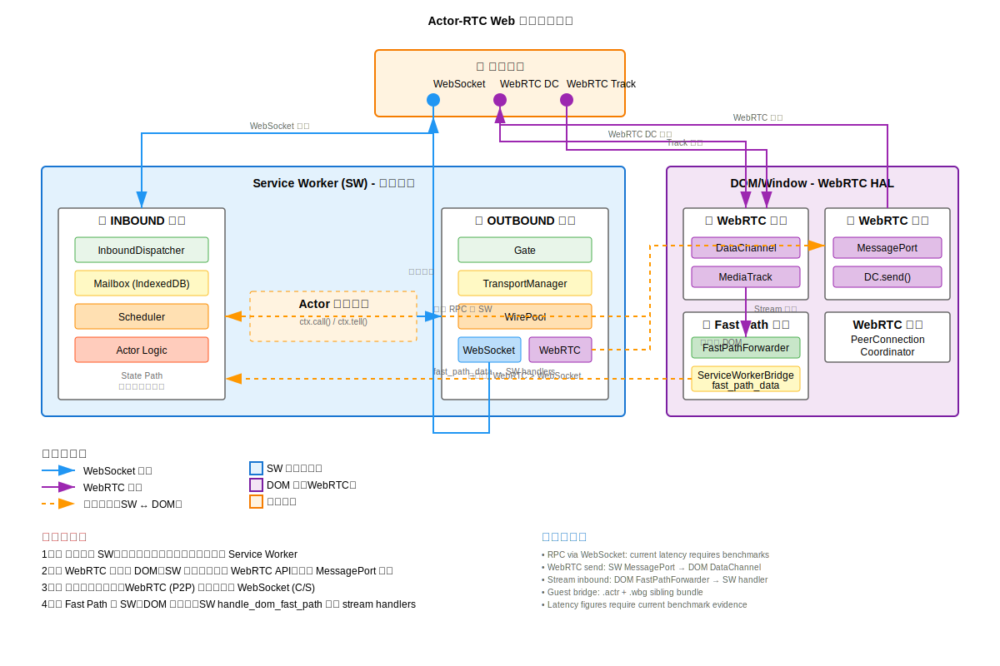
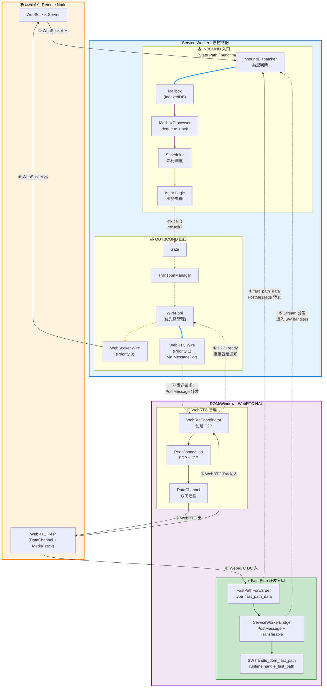

# Actor-RTC Web 架构总览

**版本**: 2025-11-11 (更新: 2026-01-08)
**状态**: 当前实现总览（Option U / wasm-bindgen guest path）

> 当前源码事实：浏览器 guest 只走 Option U。`actor.sw.js` 加载 sw-host WASM 和 `.wbg` guest bundle，DOM 侧只负责 WebRTC 与固定转发；Fast Path 不是 DOM 本地 registry/callback，而是 DOM WebRTC coordinator → `FastPathForwarder` → SW `handle_dom_fast_path` → SW runtime / stream handlers。

## 架构全览图

> **💡 核心理念**：出入的总控制器都在 SW，但只要涉及 WebRTC 就转发 DOM

### SVG 版本（推荐）



### Mermaid 版本（交互式）



**流程编号说明**：
- ① WebSocket 入：远程 → SW InboundDispatcher
- ② WebRTC DC 入：远程 → DOM Fast Path（DataChannel）
- ③ WebRTC Track 入：远程 → DOM Fast Path（MediaTrack）
- ④ Fast Path 转发：DOM → SW（`fast_path_data`，Transferable ArrayBuffer）
- ⑤ Stream 分发：SW `handle_dom_fast_path` → `handle_fast_path` → stream handlers
- ⑥ P2P Ready 通知：DOM → SW（连接建立完成信号）
- ⑦ 发送转发：SW → DOM（通过 MessagePort 发送 WebRTC 数据）
- ⑧ WebSocket 出：SW → 远程（直接发送）
- ⑨ WebRTC 出：DOM → 远程（P2P 发送）

**线条颜色说明**：
- 🔵 **蓝色实线**：WebSocket 路径（①⑧）- SW 可直接使用
- 🟣 **紫色实线**：WebRTC 路径（②③⑨）- 必须通过 DOM
- 🟠 **橙色虚线**：PostMessage 转发（④⑦）- SW ↔ DOM 跨域通信
- 🟢 **绿色虚线**：控制与优化（⑤⑥）- SW stream handler 分发和状态通知

**关键要点**：
1. **总控在 SW**：所有入口（InboundDispatcher）、出口（Gate）、路由决策都在 Service Worker
2. **WebRTC 转发**：SW 无法直接访问 WebRTC API，通过 MessagePort 桥接到 DOM
3. **优先级管理**：WirePool 自动选择，WebRTC (P2P) 优先级高于 WebSocket (C/S)
4. **Fast Path**：Stream/DataChannel 数据绕过 Mailbox，但当前处理点在 SW；DOM 只做 WebRTC 与 `fast_path_data` 转发

---

## 核心架构（详细说明）

### 双进程模型

```
┌────────────────────────────────────────────────────┐
│            Service Worker (主控)                   │
│                                                    │
│  ┌─────────────── 发送 (Transport) ──────────┐   │
│  │  PeerTransport                   │   │
│  │    → DestTransport                         │   │
│  │      → WirePool (WebSocket + WebRTC)       │   │
│  └────────────────────────────────────────────┘   │
│                                                    │
│  ┌─────────────── 接收 (State Path) ─────────┐   │
│  │  InboundPacketDispatcher                   │   │
│  │    → Mailbox (IndexedDB)                   │   │
│  │      → MailboxProcessor                    │   │
│  │        → Scheduler → Actor                 │   │
│  └────────────────────────────────────────────┘   │
│                                                    │
└─────────────────┬──────────────────────────────────┘
                  │ PostMessage
┌─────────────────┴──────────────────────────────────┐
│                 DOM (辅助 + WebRTC HAL)             │
│                                                    │
│  ┌─────────── WebRTC 管理 ──────────┐             │
│  │  WebRtcCoordinator                │             │
│  │    → 创建 PeerConnection          │             │
│  │    → 通知 SW P2P 就绪             │             │
│  └───────────────────────────────────┘             │
│                                                    │
│  ┌─────────── Fast Path 转发 ────────┐            │
│  │  WebRtcCoordinator                 │            │
│  │    → FastPathForwarder             │            │
│  │    → ServiceWorkerBridge           │            │
│  └───────────────────────────────────┘             │
│                                                    │
└────────────────────────────────────────────────────┘
```

## 核心组件

### Transport 层（发送）

| 组件 | 职责 |
|------|------|
| PeerTransport | 统一发送接口，管理所有 Dest |
| WireBuilder | 工厂模式创建连接 |
| DestTransport | 单 Dest 管理，事件驱动发送 |
| WirePool | 连接池，优先级选择 |
| WireHandle | WebSocket/WebRTC 统一封装 |

### Message 处理（接收）

#### State Path (RPC 消息)

```
接收 → InboundPacketDispatcher
  ↓
Mailbox.enqueue(from, data, priority)
  ↓
MailboxProcessor (dequeue 循环)
  ├─ dequeue(batch)
  ├─ handler(msg)
  └─ ack(msg_id)  ✅ 可靠处理
      ↓
Scheduler → Actor
```

**延迟**: 受持久化、调度和浏览器运行状态影响，具体数值需以当前 benchmark 为准。

#### Fast Path (Stream 消息)

```
DOM WebRTC DataChannel
  ↓
FastPathForwarder.forward(stream_id, data)
  ↓
ServiceWorkerBridge.sendToSW({ type: "fast_path_data" }, [buffer])
  ↓
SW actor.sw.js → wasm_bindgen.handle_dom_fast_path(client_id, payload)
  ↓
Runtime.handle_fast_path()
  ↓
stream_handlers[logical_stream_id](data)
```

**特性**:
- 绕过 Mailbox 和 Scheduler，不走 State Path
- 使用 Transferable ArrayBuffer 减少 DOM → SW 转发拷贝
- 当前文档不声明固定毫秒级数字；需要以 e2e benchmark 结果为准

## 关键设计模式

### 事件驱动（零轮询）

```rust
// ✅ 正确（事件驱动）
let mut watcher = wire_pool.subscribe_changes();
loop {
    if ready { break; }
    watcher.changed().await;  ⭐
}
```

### SW 主控

- **SW (主控)**:
  - PeerTransport (发送)
  - InboundPacketDispatcher (接收 RPC)
  - Mailbox + Scheduler (Actor)

- **DOM (辅助)**:
  - WebRtcCoordinator (创建 P2P)
  - FastPathForwarder (转发 `fast_path_data`)
  - ServiceWorkerBridge (PostMessage + Transferable)

### 双路径

- **State Path (RPC)**:
  - 持久化 Mailbox
  - 可靠处理（dequeue-ack）
  - 优先级队列
  - 延迟需以当前 benchmark 为准

- **Fast Path (Stream/Media)**:
  - 零持久化
  - DOM 转发，SW stream handlers 处理
  - 绕过 Mailbox 和 Scheduler
  - 延迟需以当前 benchmark 为准

## 与 actr 对比

| 组件 | actr | actr-web | 一致性 |
|------|------|----------|--------|
| PeerTransport | ✓ | ✓ | 当前接口已对齐 |
| DestTransport | ✓ | ✓ | 当前接口已对齐 |
| WirePool | ✓ | ✓ | 当前核心路径已对齐，浏览器边界不同 |
| InboundPacketDispatcher | ✓ | ✓ | 当前接口已对齐 |
| Mailbox | SQLite | IndexedDB | 当前语义已对齐，存储后端不同 |
| DataStream Fast Path | ✓ | ✓ | 当前 baseline 已进 SW handlers |

**总体一致性**: 当前核心路径和接口 baseline 已对齐；精确覆盖率需要基于当前测试和 benchmark 重新评估。

差异主要在存储、浏览器 WebRTC API 边界、Service Worker 生命周期和 wasm-bindgen guest bridge。

## 性能指标

以下为当前架构事实；具体数值需要重新运行当前 benchmark 后记录。

| 指标 | 当前说明 |
|------|-----|
| 首次发送 | 依赖连接状态、Service Worker 生命周期和传输路径 |
| State Path | 持久化 Mailbox + 可靠处理路径，延迟需以当前 benchmark 为准 |
| Fast Path | 需以当前 benchmark 为准 |
| MediaTrack | 需以当前实现和 benchmark 为准 |

## 后续工作

- [x] Actor Scheduler 完整实现
- [x] WebRTC 连接逻辑完善（完整传输栈 + ICE restart + MessagePort 桥接）
- [ ] 端到端测试
- [ ] 性能优化（批量、压缩）

---

**相关文档**:
- [双层架构设计](./dual-layer.zh.md) - State Path vs Fast Path 详细设计
- [API 层设计](./api-layer.zh.md) - Gate/Context/ActrRef 实现
- [完成度评估](./completion-status.zh.md) - 相对 actr 的完成度分析
