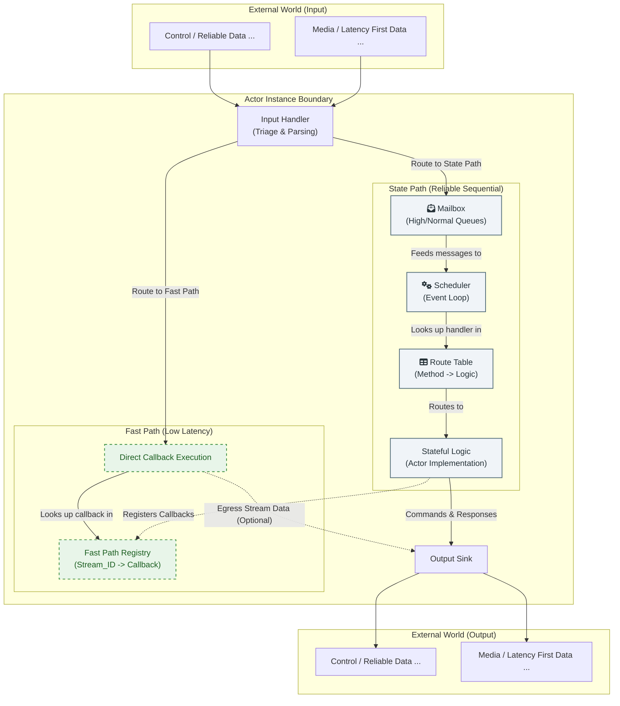

### **理念与架构**

#### **1. 摘要**

本文档阐述了一个专为构建高性能分布式应用的编程框架。其核心在于将经典的 Actor 模型思想与 WebRTC 提供的现代化、多通道点对点通信能力相结合。

框架的设计目标，是为开发者提供一个清晰、健壮的基础架构，以简化构建复杂分布式系统的难度。这既包括中心化的服务节点，也涵盖了运行于边缘设备或用户本地的点对点应用。

#### **2. 设计哲学与核心选择**

*   **2.1. 基础：WebRTC 与 Actor 模型的结合**

    我们选择 WebRTC 作为底层的通信基石，因为它天生提供了构建现代实时应用所需的多样化通道：可靠有序的数据通道、不可靠无序的数据通道以及高效的音视频媒体通道。同时，我们借鉴 Actor 模型作为组织上层应用逻辑的核心思想，因为它提供了强大的状态隔离和消息驱动的并发模型，能有效降低复杂系统的开发难度。

    本框架的使命，就是将这两者的优势有机地融合在一起。

    更重要的是，WebRTC 内置了对 **ICE (Interactive Connectivity Establishment)** 协议的支持，并可通过 STUN 和 TURN 服务器实现强大的 **NAT（网络地址转换）穿透**能力。这意味着，基于本框架构建的 Actor 进程，即使一方位于复杂的家庭或企业内网中，另一方在移动网络下，双方依然有很大概率可以建立直接的点对点连接。这为实现去中心化的、私有的、低延迟的创新应用（例如，远程桌面、私有文件共享、物联网设备直连）提供了坚实的基础，而无需让所有流量都经过中心服务器中转。

*   **2.2. 范式选择：专注于“宏观 Actor” (The 'Macro-Actor' Model)**

    “宏观 Actor”是我们框架区别于传统 Actor 模式（如 Akka, Erlang）的核心理念。传统框架中的 Actor 通常是微观的、轻量级的，开发者会创建成千上万个实例。

    我们的不同之处在于：
    1.  **宏观层面**: 我们在进程级别（一个独立的服务单元）应用 Actor 模型的思想。**每个进程恰好是一个宏观的 Actor**，无论在云端或边缘。它拥有独立的状态，通过消息与网络中的其他 Actor 进程隔离。
    2.  **分布式视角**: 整个系统由多个这样的 Actor 进程组成，它们通过 WebRTC 相互连接。每个进程内部只有一个 Actor（通过类型系统保证），但网络中可以有任意多个这样的进程。
    3.  **微观层面**: 框架在 Actor 内部的微观并发和组织结构上，是完全不干涉的。开发者可以根据业务场景和自己技术栈偏好，在该宏观 Actor(进程)之下自由选择组织方式，甚至是再组织一层经典 Actor 或者使用其他任何模式。

    我们做出这一选择，是因为我们希望在宏观上，为开发者提供 Actor 模型带来的状态隔离、消息驱动等核心价值，从而简化分布式系统的设计；同时在微观上，将最大的灵活性交还给开发者。

*   **2.3. 架构基石：双路径处理模型**

    分布式应用的数据流天然具有不同的特性。例如，一个 RPC 调用要求可靠按序，而一个游戏的位置同步则优先考虑低延迟。为了高效处理这些差异，框架引入了双路径处理的核心机制。

    框架提供了一个默认的、经过优化的处理策略，我们称之为“**双路径模型**”：
    *   **状态路径 (The State Path)**：此路径用于处理需要与 Actor 核心状态交互的、必须保证顺序性和原子性的消息。例如，服务的建立与销毁、元数据的交换、状态变更请求等。默认情况下，这些消息会被送入 `Mailbox`，由 `Scheduler` 进行串行化处理，以确保状态变更的安全性。
        
        **重要提示**: `State Path` 内部又有两条独立的 FIFO 通道：
        - **高优通道**：用于系统关键操作（如连接管理、流生命周期控制）
        - **普通通道**：用于一般业务逻辑
        
        每条通道内部严格保证 FIFO 顺序，但框架不保证两条通道间的执行顺序。因此，如果一组业务操作需要严格的先后顺序，开发者必须确保将这些消息稳定地发送到同一个通道中。

    *   **快车道 (The Fast Path)**：此路径用于处理高吞吐量、低延迟的流式数据，例如音视频流或大量的数据块。默认情况下，这些数据会绕过 `Mailbox`，被直接路由到预先绑定的处理回调函数上，以获得最低的处理开销。

    **关键在于，这套“双路径”行为是框架的默认推荐实践，而非强制约束。** 开发者可以通过自定义**输入处理器 (Handler)**，来精确地控制任何类型的数据应该遵循哪条路径，从而为特定的业务场景实现最恰如其分的性能与一致性权衡。

    **重要提示**: 和 `State Path` 内有两条独立 FIFO 通道，继而需要开发者需要确保同一组操作序列的消息，必须稳定地发送到同一个通道中类似，当需要结合使用 `State Path` 和 `Fast Path` 时，开发者也需要充分理解它们之间的关系和特点，以确保能正确地组织业务逻辑。

*   **2.4. 核心交互接口：`Context` 对象**

    为了将 Actor 的业务逻辑与底层系统能力安全地解耦，框架引入了 `Context` 对象的概念。在任何被调用的 Actor 方法中，`context` 都是其与外部世界交互的唯一、受控的接口。这一设计的核心是“请求，而非命令” (Ask, Don't Command) 原则，它将所有副作用（如 I/O 操作、定时任务）转化为对系统的“请求”，从而最大化业务逻辑的纯粹性和可测试性。

    `Context` 对象主要承载三项职责：

    1.  **副作用的桥梁**: Actor 不直接执行日志记录、网络通信或定时器等操作，而是通过 `context` 发出请求（例如 `context.logger.info(...)`, `context.schedule_tell(...)`）。这使得在测试中可以轻易地用一个模拟的 `Context` 来验证 Actor 的行为，而无需执行真实的 I/O。

    2.  **请求上下文的载体**: `Context` 封装了每次方法调用的环境信息，如调用者身份 (`caller_id`) 和分布式追踪ID (`trace_id`)。这使得业务逻辑可以访问必要的环境信息，而无需污染方法签名。

    3.  **Actor间通信的媒介**: `Context` 提供了类型安全的 `tell` (发送单向消息) 和 `call` (发送请求-响应消息) 方法，用于 Actor 之间的交互。它将 `.proto` 文件中定义的 `service` 契约，转化为符合 Actor 思想的、基于消息传递的 API，保证了通信的健壮性和类型安全。

    > 关于 `Context` 设计哲学的更完整阐述，请参阅《[专题解析之：Context 的设计哲学](./3.2-The-Context-Philosophy.zh.md)》。

#### **3. 整体架构与数据流**

框架的内部结构由一系列协同工作的核心组件构成，其交互关系和数据流向如下图所示：

*   **数据在框架中的旅程**
    1.  所有数据首先到达**输入处理器 (Input Handler)**。
    2.  Handler 进行分诊：需要可靠处理的**状态类消息**被送入 **State Path - Mailbox**；需要高性能处理的**流式数据**被直接派发至**Fast Path**。
    3.  **调度器 (Scheduler)** 以预设的优先级策略，从 **Mailbox** 中取出消息。
    4.  **调度器 (Scheduler)** 使用 **路由表 (Route Table)** 解析消息，并将其分派给相应 Actor 的具体业务逻辑。
    5.  这些业务逻辑可能会改变 Actor 的内部状态，或在**快车道注册表 (Fast Path Registry)** 中增删条目。
    6.  当业务逻辑需要向外发送数据时，统一通过**输出接口 (Sink)** 完成。

#### **4. 从架构到 API：开发者体验优先**

一个优秀的底层架构，其最终价值体现在能为上层应用开发者提供一套简单、安全、高效的编程接口。本框架通过以下设计，将强大的内部机制转化为对开发者友好的体验：

*   **4.1. 以契约为中心的开发 (Contract-Driven)**
    框架的开发流程始于一份 Protobuf (`.proto`) 文件。开发者通过 `service` 和 `message` 关键字，以一种语言无关的方式，精确地定义 Actor 的能力与数据结构。这份“契约”是整个系统类型安全的基石。

*   **4.2. 自动化与类型安全 (Automation & Type Safety)**
    基于 `.proto` 契约，框架通过代码生成插件，自动创建开发者所需的服务端接口和客户端存根。这免除了大量重复、易错的模板代码编写工作。开发者在实现业务逻辑或调用远程服务时，可以享受到完整的编译时类型检查和 IDE 自动补全，极大地提升了开发效率和代码质量。

*   **4.3. 分层通信模式 (Layered Communication Patterns)**
    强大的底层架构使得优雅的高级 API 设计成为可能。框架提供了一系列分层的通信模式，开发者可以根据需求选用：
    *   **基础层 (`Call`/`Tell`)**: 提供原子的请求-响应和单向消息能力。
    *   **模式层 (`Pub/Sub`, `Streaming`)**: 在基础层之上构建了经典的发布订阅和长连接流式会话模型。
    *   **应用层 (`Media Track Pub/Sub`)**: 领域特定的 API，将复杂的 WebRTC 媒体协商流程封装为简单的发布和订阅调用。

    这些高级模式让开发者得以使用熟悉的、声明式的 API 来表达复杂的业务意图。而框架则在内部负责将这些意图正确地映射到底层通道或平面上。例如，一个流式会话的建立和关闭信令会自动走状态路径，而其间传输的大量数据则会自动走快车道，整个过程对开发者透明。

#### **5. 总结**

本框架并非意图创造一个全新的并发模型，而是站在巨人（WebRTC, Actor Model）的肩膀上，做了一次专注而务实的整合。它通过聚焦于宏观层面的 Actor 抽象，并提供一套灵活且高性能的数据分类处理机制，致力于为开发者构建下一代实时分布式应用，提供一个简单、可靠、高效的基础。其最终目标，是让开发者能将精力聚焦于业务创新本身，而非底层的复杂性。
