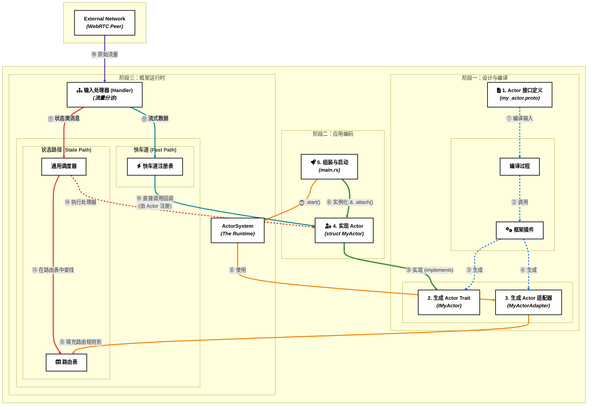

# 开发者指南

这份指南站在使用者的角度，以 Rust 为示例语言，通过实际的代码和简明的步骤，展示如何利用这个框架构建应用。它会尽量避免掺杂内部原理，而是专注于“如何做”。

## **1. 宏观视角：开发者眼中的框架工作流**

在你深入代码之前，理解框架的工作流程至关重要。下图展示了从设计到运行的完整生命周期，以及你的代码在其中扮演的角色。



**你的工作流程**:
1.  **定义 (①)**: 在 `.proto` 文件中定义 Actor 的接口。
2.  **生成 (②, ③, ④)**: 框架的插件为你生成需要实现的 Rust `trait` 和一个内部使用的 `适配器`。
3.  **实现 (⑤)**: 你创建自己的 `struct` 并为它实现生成的 `trait`，在这里编写核心业务逻辑。
4.  **组装 (⑥, ⑦)**: 在 `main.rs` 中，你实例化你的 Actor，并将它的逻辑 `attach` 到 `ActorSystem` 上，然后调用 `.start()`。

**框架的工作**:
*   启动时 (⑧, ⑨)，`ActorSystem` 使用生成的 `适配器` 来了解你的 Actor 的能力，并填充其内部的**路由表**。
*   运行时 (⑩-⑯)，`ActorSystem` 的**输入处理器**会对所有网络流量进行分诊，将**状态类消息**交给**通用调度器**处理，将**流式数据**交给**快车道**处理，最终都将调用到你实现的 Actor 方法上。

## **2. 快速入门：构建一个 WebRTC 回声服务**

本节将指导你完成一个完整的、可通过 WebRTC 数据通道进行回声测试的 Actor 服务。

### **2.1. 环境准备**

*   **Rust 工具链**: `rustup toolchain install stable`
*   **`protoc` 编译器**:
    *   **Ubuntu/Debian**: `sudo apt update && sudo apt install protobuf-compiler`
    *   **macOS (Homebrew)**: `brew install protobuf`
*   **本框架的代码生成插件**:
    > [!NOTE]
    > 功能规划中：本插件是框架设计的核心部分，但目前尚未作为独立工具发布。下面的安装命令暂时无法使用。

    `# cargo install protoc-gen-actorframework`

### **2.2. 项目搭建**

#### **Step 1: 创建项目与配置依赖**

```bash
cargo new webrtc_echo_actor --bin
cd webrtc_echo_actor
```

编辑 `Cargo.toml` 文件：
```toml
# Cargo.toml
[package]
name = "webrtc_echo_actor"
version = "0.1.0"
edition = "2021"

[dependencies]
actor_framework = "0.1.0" # 示例版本
tonic = "0.8"
prost = "0.11"
tokio = { version = "1.0", features = ["macros", "rt-multi-thread", "sync"] }
async-trait = "0.1.58"
# --- 信令适配器所需 ---
tokio-tungstenite = { version = "0.17", features = ["native-tls"] }
futures-util = "0.3"
serde = { version = "1.0", features = ["derive"] }
serde_json = "1.0"
url = "2.2"

[build-dependencies]
tonic-build = "0.8"
```

#### **Step 2: 编写 Protobuf 契约**

创建 `proto/echo.proto` 文件：
```protobuf
// proto/echo.proto
syntax = "proto3";
package echo;

message EchoRequest { string message = 1; }
message EchoResponse { string reply = 1; }

service EchoService {
  rpc SendEcho(EchoRequest) returns (EchoResponse);
}
```

#### **Step 3: 配置代码生成 (`build.rs`)**
创建 `build.rs` 文件：
```rust
// build.rs
fn main() -> Result<(), Box<dyn std::error::Error>> {
    println!("cargo:rerun-if-changed=proto/echo.proto");
    tonic_build::configure()
        .protoc_arg("--plugin=protoc-gen-actorframework")
        .protoc_arg(format!("--actorframework_out={}", std::env::var("OUT_DIR").unwrap()))
        .compile(&["proto/echo.proto"], &["proto/"])?;
    Ok(())
}
```

#### Step 4: 实现信令适配器

`ActorSystem` 需要通过一个实现了 `Signaling` trait 的适配器来与外部的信令服务器通信。你需要根据你的信令协议来实现这个 `trait`。

**注意**: 框架有专用的配套信令服务。以下是一个基于 WebSocket 的通用、简化示例，仅为阐述概念。在实际项目中，您通常只需要使用配套的信令客户端即可。

```rust
// src/signaling.rs

use actor_framework::signaling::{Signaling, SignalingEvent, SignalingCommand, SignalingError};
use async_trait::async_trait;
use futures_util::StreamExt;
use tokio::sync::mpsc;
use tokio_tungstenite::{connect_async, tungstenite::Message};

pub struct WebSocketSignaling {
    server_url: String,
}

impl WebSocketSignaling {
    pub fn new(url: &str) -> Self {
        Self { server_url: url.to_string() }
    }
}

#[async_trait]
impl Signaling for WebSocketSignaling {
    async fn start(
        &mut self,
        // command_tx 用于将信令事件包装成指令，发送给 ActorSystem
        _command_tx: mpsc::Sender<SignalingCommand>,
    ) -> Result<mpsc::Receiver<SignalingEvent>, SignalingError> {

        // 创建一个 channel，用于从信令端接收事件，并转发给 ActorSystem
        let (event_tx, event_rx) = mpsc::channel(128);

        // 连接到 WebSocket 服务器
        let (ws_stream, _) = connect_async(&self.server_url).await
            .map_err(|e| SignalingError::ConnectionFailed(e.to_string()))?;

        let (_, mut ws_receiver) = ws_stream.split();

        // 派生一个任务，专门监听来自 WebSocket 的消息
        tokio::spawn(async move {
            while let Some(Ok(msg)) = ws_receiver.next().await {
                if let Message::Text(text) = msg {
                    // 假设服务器发送的是 JSON 格式的 SignalingEvent
                    if let Ok(event) = serde_json::from_str::<SignalingEvent>(&text) {
                        // 成功解析后，发送给 ActorSystem
                        if event_tx.send(event).await.is_err() {
                            // ActorSystem 已关闭，退出监听
                            break;
                        }
                    }
                }
            }
        });

        // ActorSystem 如何将指令（如 SDP Offer）发送给信令服务器，
        // 通常由 trait 的其他方法（本示例未展示）或一个独立的句柄处理。
        // 这里我们只需正确实现 start 方法的签名即可。

        Ok(event_rx)
    }

    async fn shutdown(&mut self) {
        // 实现关闭 WebSocket 连接的逻辑
    }
}
```

#### **Step 5: 实现 Actor 并启动系统**

现在，在 `src/main.rs` 中将所有部分组合起来。

```rust
// src/main.rs
mod signaling;

// --- 引入生成的代码 ---
pub mod echo { tonic::include_proto!("echo"); }
// 这是我们插件生成的适配器和 trait
include!(concat!(env!("OUT_DIR"), "/echo_actor.rs"));

// --- 业务逻辑与启动 ---
use echo::{EchoRequest, EchoResponse};
use echo_actor::IEchoService;
use actor_framework::{Context, ActorSystem};
use async_trait::async_trait;
use std::sync::Arc;
use signaling::WebSocketSignaling;

// 1. 定义 Actor 状态
#[derive(Default)]
struct MyEchoActor;

// 2. 为 Actor 实现业务 trait
#[async_trait]
impl IEchoService for MyEchoActor {
    async fn send_echo(&self, request: EchoRequest, _context: Arc<Context>) -> Result<EchoResponse, tonic::Status> {
        println!("收到消息: '{}'", request.message);
        let reply = format!("回声: {}", request.message);
        Ok(EchoResponse { reply })
    }
}

// 3. 程序入口
#[tokio::main]
async fn main() -> Result<(), Box<dyn std::error::Error>> {
    // 4. 实例化 Actor（注意：每个进程只能有一个Actor）
    let actor = Arc::new(MyEchoActor::default());
    
    // 5. 实例化信令适配器
    let signaling_adapter = WebSocketSignaling::new("wss://your-signaling-server.com/ws");

    println!("正在通过信令服务器启动 ActorSystem...");

    // 6. 组装并启动 ActorSystem
    // 注意：attach() 返回一个新的类型状态，防止重复attach
    let system = ActorSystem::new()
        .with_signaling(Box::new(signaling_adapter))
        .attach(actor);  // 一次性操作：将本地唯一Actor附加到系统
    
    // 只有attached后的system才能start
    system.start().await?;

    Ok(())
}
```

## **3. 核心 API 与最佳实践**

*   **`ActorSystem`**: 每个进程的Actor运行时。使用 `.with_signaling()` 配置信令，使用 `.attach()` 将本地唯一的 Actor 附加到系统（只能调用一次），最后用 `.start()` 启动。
*   **`Signaling` Trait**: 框架与外界信令服务器沟通的桥梁，是你唯一需要为不同信令协议编写的适配层。
*   **`Context` 对象**: Actor 在运行时与系统交互的句柄。用它来获取调用者信息 (`get_caller_id`)、记录日志 (`logger`)、安排延迟任务 (`schedule_tell`)。
*   **状态管理**: 将 Actor 的状态封装在 `struct` 中。对于需要在异步方法间共享的可变状态，请使用 `tokio::sync::Mutex`。
*   **错误处理**: 在你的 `trait` 方法实现中，返回 `Err(tonic::Status::...)` 来向对等端传递结构化的业务错误。
*   **测试**: 你的 `Actor` `struct` 可以被独立进行单元测试。只需模拟 `Request` 和 `Context`，然后断言其方法的返回值即可，无需任何网络组件。