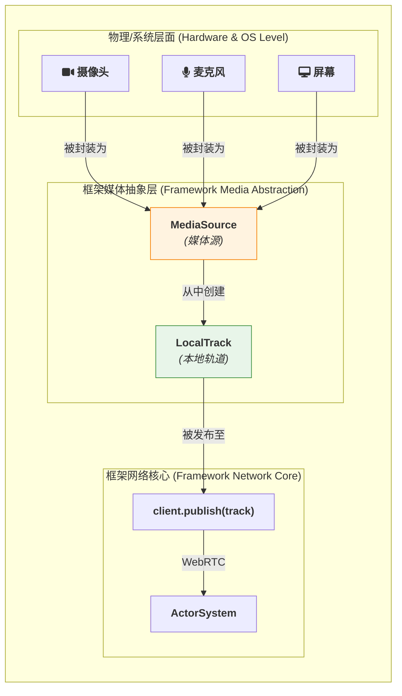

# **连接现实世界 — 媒体源与轨道抽象**

一个端到端的 WebRTC 应用框架，如果只提供服务端 `Actor` 的逻辑，而没有为客户端（尤其是原生客户端）提供一套易于使用的媒体处理工具，那么它的开发者体验就是不完整的。

用户不应该去手动处理原始的摄像头视频帧或麦克风音频样本。我们需要一个更高层的抽象，就像浏览器中的 `MediaStream` 和 `MediaStreamTrack` API 一样。

这篇文章将专注于客户端（或任何需要处理物理设备的对等端），解释框架如何提供一套高级 API 来简化本地媒体的管理，并将其无缝地集成到 `ActorSystem` 的 `Media Track Pub/Sub` 模式中。

## **1. 问题的核心：弥合硬件与网络的鸿沟**

直接操作硬件（摄像头、麦克风、屏幕捕捉）并将其原始数据流编码、打包成 RTP 包是一个极其复杂的过程。浏览器为 Web 开发者处理了这一切，但对于原生应用（Rust, C++, etc.）的开发者来说，这是一个巨大的负担。

本框架通过提供一个名为 **`MediaSource`** 和 **`LocalTrack`** 的高级抽象层，来解决这个问题。


*图 1: 从物理设备到网络发布的抽象流程*

*   **`MediaSource`**: 代表一个可以产生媒体流的物理或虚拟设备。
*   **`LocalTrack`**: 代表一个具体的、可被发布到网络上的媒体轨道（如“前置摄像头的视频轨”或“默认麦克风的音频轨”）。

## **2. `MediaSource` API：发现和选择你的设备**

`MediaSource` 模块的职责是**发现**系统上可用的媒体设备，并允许开发者**选择**一个来使用。

**【伪代码】**
```rust
use actor_framework::media::{MediaSource, DeviceKind};

async fn main() {
    // 1. 枚举系统上所有的视频输入设备 (摄像头)
    let video_devices = MediaSource::enumerate_devices(DeviceKind::Video).await;

    // 打印设备信息
    for device in &video_devices {
        println!("找到摄像头: id={}, label='{}'", device.id(), device.label());
    }

    // 2. 选择一个摄像头来创建媒体源
    //    可以通过 ID 选择，或者直接获取默认设备
    let selected_source = match video_devices.first() {
        Some(device) => MediaSource::from_device(device).await,
        None => MediaSource::get_default_video_source().await, // 获取系统默认摄像头
    };

    if let Some(source) = selected_source {
        // ... 现在我们可以从这个 source 创建轨道了
    }
}
```
这个 API 的背后，框架会使用特定平台的库（如 `v4l` on Linux, `AVFoundation` on macOS, `MediaFoundation` on Windows）来与操作系统和硬件驱动交互。

## **3. `LocalTrack` API：控制和处理本地媒体**

一旦你有了一个 `MediaSource`，你就可以从中创建 `LocalTrack`。`LocalTrack` 是你进行**发布前**所有操作的核心对象。

*   **`LocalVideoTrack`** 和 **`LocalAudioTrack`** 分别代表视频和音频。

**【伪代码】**
```rust
// ... 接上文，我们已经有了一个 `source: MediaSource`

// 1. 从源创建一个视频轨道，并可以指定约束 (分辨率、帧率)
let video_track: LocalVideoTrack = source.create_video_track(VideoConstraints {
    resolution: Resolution::HD720p,
    frame_rate: 30,
}).await?;

// 2. 在发布前，可以对轨道进行操作
//    例如，将其渲染到本地 UI 窗口进行预览 (伪代码)
my_ui_video_player.render(&video_track);

// 3. LocalTrack 提供了控制能力
video_track.mute();    // 暂停发送数据 (发送黑帧)
video_track.unmute();  // 恢复
let is_muted = video_track.is_muted();

// 4. (高级) 访问原始数据
//    为轨道附加一个“拦截器”，可以在数据被编码和发送前，
//    对其进行读取或处理 (例如添加水印、做人脸识别等)
video_track.add_interceptor(|frame: &VideoFrame| {
    // 在这里可以访问原始视频帧 (e.g., I420 format)
    // 注意：这个回调是在高性能的媒体处理线程上执行的
    process_frame_for_watermark(frame);
});
```

## **4. 无缝集成到 `Media Track Pub/Sub` 模式**

`LocalTrack` 被设计为可以被 `ActorSystem` 的客户端**直接发布**。

`client.publish()` 方法被重载，以接收一个 `LocalTrack` 对象。当它被调用时，框架的客户端 SDK 会在幕后处理所有复杂的 WebRTC 流程：

1.  获取 `LocalTrack` 内部的原始媒体流。
2.  创建一个 `RTCPeerConnection` (如果尚不存在)。
3.  创建一个 `RtpSender` 并将轨道附加到其中 (`addTrack`)。
4.  自动处理编码、RTP 打包等所有底层细节。
5.  与远端的 `ActorSystem` 进行信令协商，完成轨道的发布。

**【伪代码】**
```rust
// 假设 client 是一个 ActorSystem 客户端实例

// ... 我们已经创建好了 video_track: LocalVideoTrack

// 5. 将本地轨道直接发布到网络
//    这一行代码背后隐藏了所有 WebRTC 的复杂性
let publication = client.publish(video_track).await?;

println!("视频轨道发布成功！ID: {}", publication.id());

// 后续可以通过 publication 对象来控制已发布的轨道
publication.set_encoding_parameters(EncodingParameters { max_bitrate: 500_000 });
publication.unpublish().await?; // 停止发布
```

## **5. 动态添加与移除轨道**

在许多场景下，我们需要在一个已经建立的 WebRTC 连接上动态地增加或移除媒体。最典型的例子就是在视频通话中途，用户决定“开始/停止分享屏幕”。

本框架的 API 设计旨在让这个操作尽可能地简单直观。开发者不需要手动处理复杂的 SDP 协商，只需再次调用 `client.publish()` 或对已有的 `publication` 对象调用 `unpublish()` 即可。

**【伪代码】**
```rust
// ...接上文，我们已经与远端建立连接，并发布了一个 video_track
// let video_publication = client.publish(video_track).await?;

// 1. 现在，用户决定分享屏幕
let screen_source = MediaSource::get_screen_source().await?;
let screen_track = screen_source.create_video_track(Default::default()).await?;

// 2. 在现有的会话上，直接发布这个新的轨道
//    框架足够智能，会自动处理底层的“重新协商”流程
let screen_publication = client.publish(screen_track).await?;
println!("屏幕分享轨道发布成功！ID: {}", screen_publication.id());

// ... 一段时间后，用户停止分享屏幕

// 3. 只需取消发布对应的轨道即可
//    框架同样会自动处理重新协商，通知远端该轨道已被移除
screen_publication.unpublish().await?;
println!("屏幕分享已停止。");
```

**关键点**:

*   **统一的 API**: 无论是初次发布还是后续添加，都使用统一的 `client.publish()` 方法。框架会自动检测当前会话状态，并采取正确的行为（初次协商或重新协商）。
*   **透明的信令**: 调用 `client.publish()` 或 `publication.unpublish()` 会自动触发在《[3.3 信令机制](./3.3-Signaling.zh.md)》中所描述的**重新协商**流程。整个过程对上层开发者是透明的，极大地简化了业务逻辑的实现。

# **6. 总结**

通过引入 `MediaSource` 和 `LocalTrack` 这两个核心抽象，框架成功地在**硬件/操作系统**的复杂世界与**`ActorSystem`** 的清晰网络模型之间，建立了一座坚实的桥梁。

*   **`MediaSource`** 为开发者提供了一套**与平台无关**的、用于**发现和选择**媒体设备的统一 API。
*   **`LocalTrack`** 则提供了一个**类似浏览器 `MediaStreamTrack`** 的、用于**控制和处理**本地媒体流的高级对象。

这套 API 极大地降低了在原生环境中开发 WebRTC 应用的门槛，让开发者可以像在 Web 上一样，轻松地将摄像头、麦克风和屏幕内容发布到网络中，从而将主要精力聚焦于上层的业务逻辑创新。