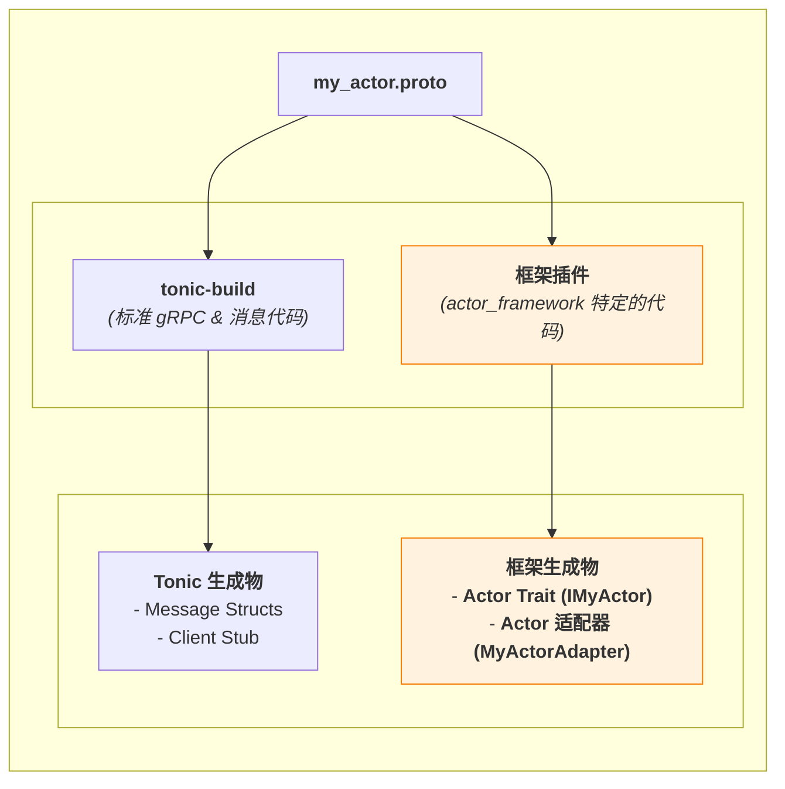
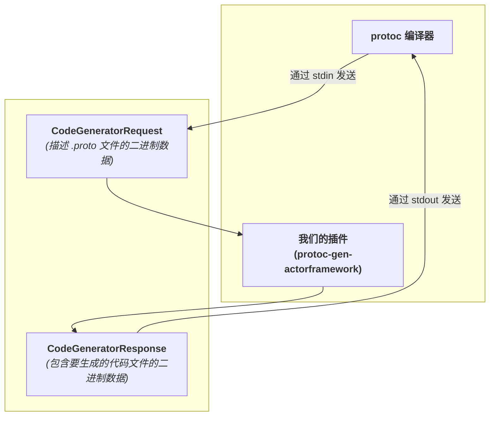

# **专题解析：代码生成器的蓝图 — 从 `.proto` 到类型安全的 Actor**

框架一个值得关注的机制是 `.attach(actor)` 这一行代码。它能将一个普通的业务 `struct` 接入异步运行时，并使其能够响应网络请求。这种机制并非源于运行时的动态反射，而是通过一个编译时代码生成过程来实现。

这个过程的核心就是我们框架的 Protobuf 编译器插件：`protoc-gen-actorframework`。

本篇文章将深入这一过程，揭示 `.proto` 文件是如何通过这个插件，最终转化为开发者可以直接使用的、类型安全的 Rust `trait` 和框架内部使用的**适配器 (Adapter)** 的。

### **1. 两个“引擎”：`tonic-build` 与框架插件的协同工作**

当你在 `build.rs` 中配置代码生成时，实际上是启动了两个协同工作的“引擎”。理解它们各自的职责是理解整个流程的第一步。


*图 1: 两个代码生成引擎及其产物*

1.  **`tonic-build` (基础引擎)**: 它负责处理所有 Protobuf 的“标准”部分。它的产物包括：
    *   `message` 定义对应的 Rust `struct` (如 `EchoRequest`)。
    *   客户端存根 (`*Client`)，用于调用远程服务。
    *   *我们不会直接使用*它生成的服务端 `trait` 和 `Server` `struct`。

2.  **`protoc-gen-actorframework` (框架插件)**: 这是框架的核心组件之一。它专注于生成与我们 `ActorSystem` 紧密集成的、高度定制化的代码。它的产物是开发者体验和框架内部机制的核心：
    *   **用户友好的 `Actor Trait`**: 一个专门为 `Actor` 实现而设计的 `trait` (如 `IEchoService`)。
    *   **内部 `Actor 适配器`**: 一个包含了所有“胶水代码”的 `struct` (如 `EchoServiceAdapter`)。

### **2. 插件的核心产物**

让我们深入看看框架插件生成的两份关键代码。

#### **产物一：用户友好的 `Actor Trait` (`IEchoService`)**

为什么我们不直接使用 `tonic-build` 生成的 `trait`？因为我们需要一个更符合 `Actor` 模型的接口。

*   **注入 `Context`**: 我们生成的 `trait` 方法签名中，总是包含 `Arc<Context>`，这是 `Actor` 与系统交互的唯一句柄。
*   **简洁性**: 它只包含业务逻辑，隐藏了所有与 `tonic` 传输层相关的细节。

```rust
// 插件生成的 trait (伪代码)
#[async_trait]
pub trait IEchoService: Send + Sync + 'static {
    async fn send_echo(
        &self,
        request: EchoRequest,
        context: Arc<Context>, // <-- 关键区别
    ) -> Result<EchoResponse, Status>;
}
```

#### **产物二：内部 `Actor 适配器` (`EchoServiceAdapter`)**

这是实现 `.attach()` 功能的核心组件。它是一个自动生成的 `struct`，其职责是**将实现了 `IEchoService` trait 的任意 `struct`，“适配”成 `ActorSystem` 内部可以理解和调度的标准格式**。

它的核心是实现了一个框架内部的 `ActorAdapter` trait，并提供了 `get_routes` 方法。

### **3. 深度解析：`get_routes` 方法的内部构造**

`get_routes` 方法是插件技术含量的集中体现。它在编译时，为 `.proto` 文件中的每一个 `rpc` 方法，都生成了一个自包含的**路由条目 (`Route`)**。

```rust
// ActorAdapter 的 get_routes 实现 (伪代码)
// 这是由插件在编译时为 echo.proto 自动生成的
impl ActorAdapter<dyn IEchoService> for EchoServiceAdapter {
    fn get_routes(actor: Arc<dyn IEchoService>) -> Vec<Route> {
        vec![
            // --- 为 SendEcho 方法生成的路由条目 ---
            Route {
                // 1. Key: 方法的全名，用于路由查找
                method_name: "echo.EchoService/SendEcho".to_string(),

                // 2. Value: 一个包含了完整处理逻辑的异步闭包
                handler: Box::new(move |ctx: Arc<Context>, req_bytes: Vec<u8>| {
                    // 捕获 actor 的 Arc 引用
                    let actor = actor.clone();
                    
                    // Box::pin 返回一个 Future，供调度器 await
                    Box::pin(async move {
                        // a. 反序列化请求
                        let request = EchoRequest::decode(&*req_bytes)?;

                        // b. 调用用户实现的 trait 方法
                        let response = actor.send_echo(request, ctx).await?;

                        // c. 序列化响应
                        Ok(response.encode_to_vec())
                    })
                }),
            },
            // ... 如果 service 中有更多方法，这里会有更多 Route ...
        ]
    }
}
```

这段自动生成的代码是整个机制的核心。它做了几件至关重要的事：
1.  **类型擦除**: 它接收一个 `Arc<dyn IEchoService>`，将一个具体的 Actor 类型（如 `MyEchoActor`）转换为框架可以统一处理的动态类型。
2.  **路由信息**: 它硬编码了方法的全名 `"echo.EchoService/SendEcho"`，这是 `ActorSystem` 内部路由表的 `key`。
3.  **逻辑封装**: 它创建了一个异步闭包，这个闭包**捕获**了 `actor` 实例。它像一个微型的、自包含的处理器，知道如何为 `SendEcho` 这一个方法完成从网络字节到业务逻辑调用再回到网络字节的全过程。

### **4. 插件的内部工作原理**

`protoc` 插件遵循一个简单的、基于标准输入输出的协议。


*图 2: protoc 与插件的交互协议*

#### **插件主函数伪代码**

```rust
// protoc-gen-actorframework 的 main 函数 (伪代码)
fn main() -> Result<(), Box<dyn std::error::Error>> {
    // 1. 从标准输入读取 `CodeGeneratorRequest`
    let mut stdin = std::io::stdin();
    let mut buf = Vec::new();
    stdin.read_to_end(&mut buf)?;
    let request = CodeGeneratorRequest::decode(&*buf)?;

    // 2. 遍历请求中的所有 proto 文件和 service 定义
    let mut response = CodeGeneratorResponse::new();
    for proto_file in &request.proto_file {
        for service in &proto_file.service {
            // 3. 为每个 service 生成代码内容
            //    (使用模板引擎如 Tera，或手动拼接字符串)
            let trait_code = generate_trait_code(service);
            let adapter_code = generate_adapter_code(service);

            // 4. 将生成的代码打包成 File 对象
            response.file.push(File {
                name: format("{}_actor.rs", service.name()),
                content: format!("{}\n\n{}", trait_code, adapter_code),
                ..Default::default()
            });
        }
    }

    // 5. 将 `CodeGeneratorResponse` 序列化后写入标准输出
    let mut out_buf = Vec::new();
    response.encode(&mut out_buf)?;
    std::io::stdout().write_all(&out_buf)?;

    Ok(())
}
```

### **5. 与 `build.rs` 的集成**

最后，我们需要告诉 `tonic-build` 去调用我们的插件。

```rust
// build.rs
tonic_build::configure()
    // 这行命令告诉 protoc:
    // "除了你自己的工作，还要启动一个名为 `protoc-gen-actorframework` 的进程作为插件"
    .protoc_arg("--plugin=protoc-gen-actorframework")
    
    // 这行是一个自定义参数，我们自己约定好的。
    // 我们的插件在解析命令行参数时会读取它，
    // 以便知道要把生成的 `*_actor.rs` 文件放在哪里。
    .protoc_arg(format!("--actorframework_out={}", std::env::var("OUT_DIR").unwrap()))
    
    .compile(...)
```

### **6. 总结**

代码生成插件是框架化繁为简、提升开发者体验的核心。它扮演了一个**编译时代码工程师**的角色，自动编写了所有连接业务逻辑与框架运行时的、繁琐且易错的“胶水代码”。

通过深入理解这一过程，我们能更好地欣赏 `.attach()` 的简洁性，因为它背后是 Protobuf 的定义能力、`protoc` 的插件化架构以及框架适配器模式共同作用的结果。
