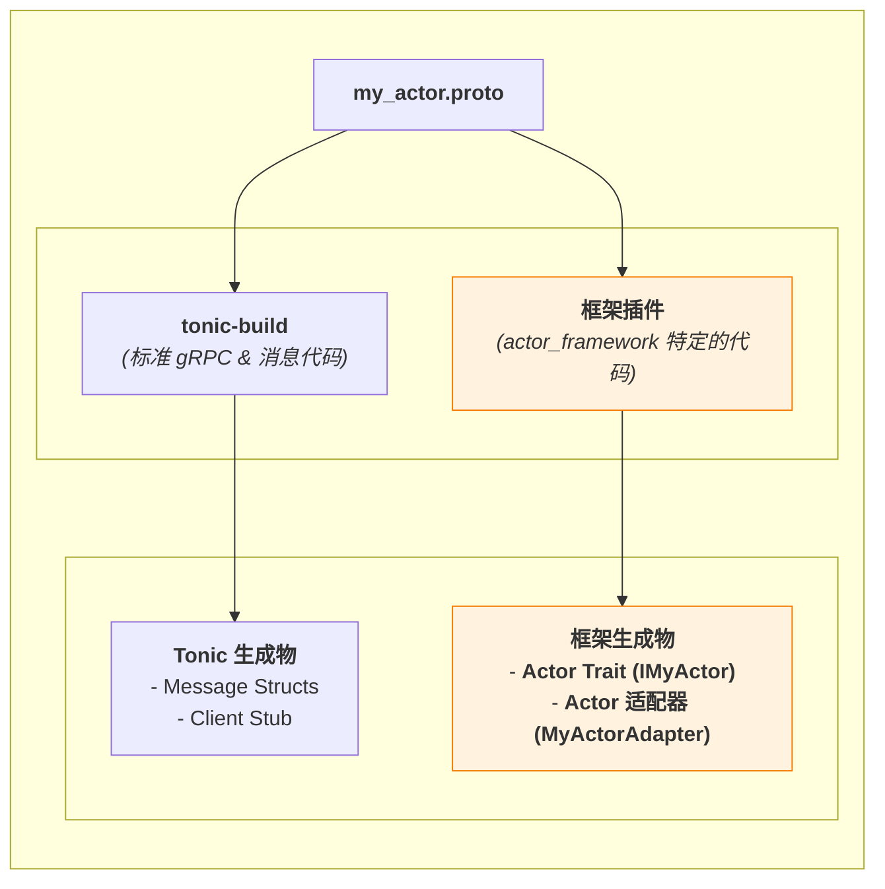
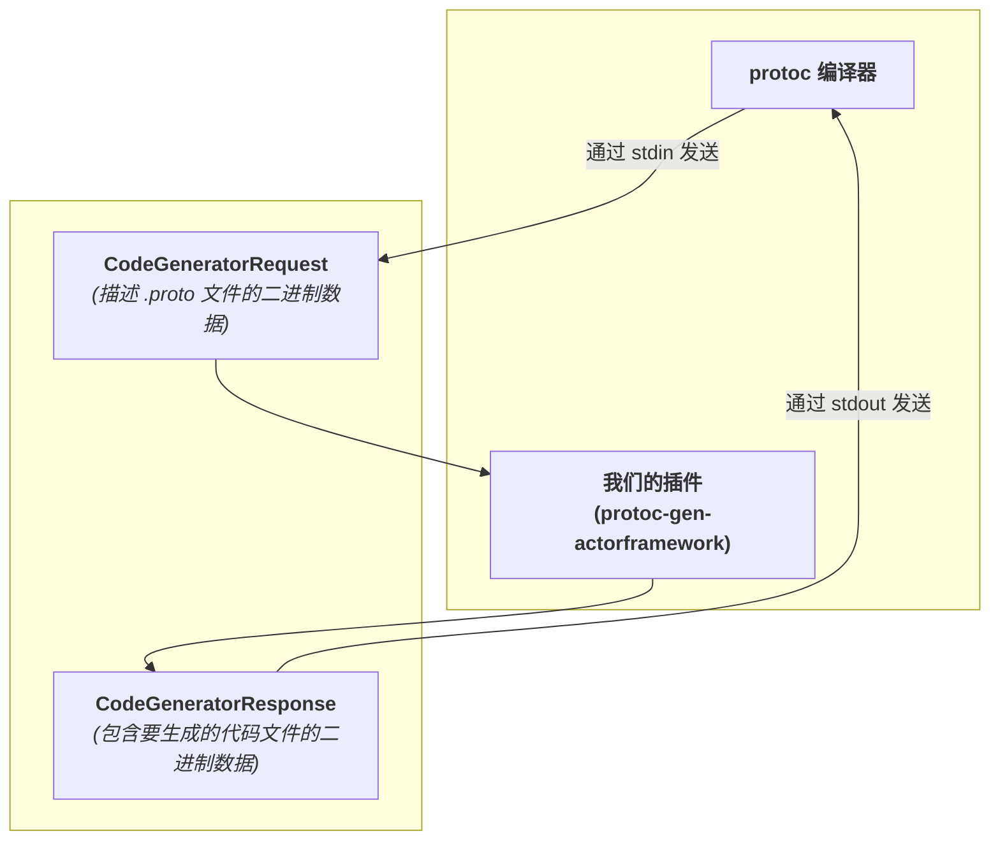

# **专题解析：从.proto到运行时：代码生成与附加(attach)机制的内幕**

在使用本框架时，开发者体验的核心凝聚于一行看似简单的代码：

```rust
// main.rs
let actor = Arc::new(MyBusinessActor::default());

ActorSystem::new()
    .with_signaling(...) 
    .attach(actor) // <-- 魔法发生于此
    .start()
    .await?;
```

开发者只需提供一个实现了业务逻辑的普通 Rust `struct`，`.attach(actor)` 方法似乎就神奇地将其"激活"，变成了一个功能完备、可处理网络请求的服务。本篇文章将彻底揭开这层"魔法"的面纱。

其核心答案在于：**这一切并非运行时的动态魔法，而是编译时的代码生成、关联类型推断与静态分发机制的精妙协作。**

---

## 1. 核心机制：编译时代码生成

魔法的第一个关键角色，是我们框架的 Protobuf 编译器插件 (`protoc-gen-actorframework`)。它在编译时，将 `.proto` 契约转化为框架可直接使用的代码。

### 1.1. 两个“引擎”：`tonic-build` 与框架插件的协同工作

当你在 `build.rs` 中配置代码生成时，实际上是启动了两个协同工作的“引擎”。


*图 1: 两个代码生成引擎及其产物*

1.  **`tonic-build` (基础引擎)**: 它负责处理所有 Protobuf 的“标准”部分，如 `message` 对应的 Rust `struct` 和客户端存根。
2.  **`protoc-gen-actorframework` (框架插件)**: 这是框架的核心组件之一。它专注于生成与我们 `ActorSystem` 紧密集成的、高度定制化的代码。

### 1.2. 插件的核心产物

框架插件生成两份关键代码：

1.  **用户友好的 `Actor Trait` (`IEchoService`)**:
    我们不直接使用 `tonic-build` 生成的 `trait`，因为我们需要一个更符合 `Actor` 模型的接口，其最核心的区别是向方法注入了 `Arc<Context>`。
    ```rust
    // 插件生成的 trait (伪代码)
    #[async_trait]
    pub trait IEchoService: LocalActor {
        async fn send_echo(
            &self,
            request: EchoRequest,
            context: Arc<Context>, // <-- 关键区别
        ) -> Result<EchoResponse, ActorError>;
    }
    ```

2.  **内部 `Actor 适配器` (Actor Adapter)**:
    这是实现 `.attach(actor)` 功能的核心组件。它是一个自动生成的 `struct`，我们将其概念性地统称为"Actor 适配器"。

    它的核心职责是充当**你的业务 Actor** 和 **`ActorSystem` 运行时**之间的"翻译官"和"桥梁"。具体来说，一个为特定服务（如 `EchoService`）生成的适配器（如 `EchoServiceAdapter`），会实现框架定义的 `RouteProvider` trait，将你的业务 `struct` "适配"成 `ActorSystem` 内部可以理解和调度的标准格式。

3.  **关联类型机制 (`AttachableActor` trait)**:
    框架通过 `AttachableActor` trait 实现类型安全的自动适配器推断，使用关联类型模式让编译器自动找到正确的适配器：
    ```rust
    // 框架定义的核心 trait
    pub trait AttachableActor {
        type Adapter; // 关联的适配器类型
    }
    
    // 用户 Actor 的实现
    impl AttachableActor for MyEchoActor {
        type Adapter = EchoServiceAdapter; // 指定适配器类型
    }
    ```

### 1.3. RouteProvider trait：连接业务逻辑与运行时的桥梁

`RouteProvider` 是整个 attach 机制的核心抽象。它定义了如何将一个 Actor 实例转换为 ActorSystem 可以理解的路由规则集合：

```rust
// 框架定义的核心 trait
pub trait RouteProvider<T> {
    fn get_routes(actor: std::sync::Arc<T>) -> Vec<Route>;
}
```

这个 trait 的设计哲学体现了框架的核心理念：
- **编译时确定性**：所有路由规则在编译时就已确定，无需运行时反射
- **类型安全**：通过泛型参数 `T` 确保 Adapter 只能为特定的 Actor 类型工作
- **零成本抽象**：生成的代码在运行时性能与手写代码相同

代码生成器为每个 `.proto` 服务自动生成对应的 `RouteProvider` 实现：

```rust
// 自动生成的适配器实现 (简化版)
pub struct EchoServiceAdapter;

impl RouteProvider<dyn IEchoService> for EchoServiceAdapter {
    fn get_routes(actor: Arc<dyn IEchoService>) -> Vec<Route> {
        vec![
            Route {
                method_name: "echo.EchoService/SendEcho".to_string(),
                handler: /* 包装 actor.send_echo 方法的闭包 */,
            },
            // ... 其他方法的路由
        ]
    }
}
```

这样，当你调用 `.attach(actor)` 时，框架通过关联类型 `T::Adapter` 在编译时自动找到正确的适配器，并获取完整的路由表。

---

## 2. 深度解析：从 Adapter 到 ActorSystem

`Actor 适配器` 的真正威力，在于它实现了一个核心方法：`get_routes`。

### 2.1. “路由规则 (Route)” 的结构

`get_routes` 的职责是在编译时，**为你的 Actor 所实现的 trait 中的每一个方法，生成一个详细的“路由规则 (`Route`)”**。我们可以先看一下为 `SendEcho` 方法生成的路由规则的最终结构：

```rust
// 插件为 SendEcho 方法生成的路由规则 (伪代码)
Route {
    // 路由键: 方法的全名，用于路由查找
    method_name: "echo.EchoService/SendEcho".to_string(),
    
    // 处理器: 一个包含了完整处理逻辑的异步闭包
    handler: Box::new(move |ctx, req_bytes| {
        let actor = actor.clone();
        Box::pin(async move {
            let request = EchoRequest::decode(&*req_bytes)?;
            let response = actor.send_echo(request, ctx).await?;
            Ok(response.encode_to_vec())
        })
    }),
}
```
每一条规则都包含两部分：
1.  **路由键 (`method_name`)**: 一个唯一的字符串，用于 `ActorSystem` 在收到请求时进行快速查找。
2.  **处理器 (`handler`)**: 一个异步闭包，它封装了该方法完整的“**反序列化 -> 调用业务逻辑 -> 序列化**”的全过程。

### 2.2. `get_routes` 方法的实现

了解了单条路由规则的结构后，我们再来看 `Actor 适配器` 是如何实现 `get_routes` 方法来批量生成这些规则的。

```rust
// Actor 适配器 的 get_routes 实现 (伪代码)
// 这是由插件在编译时为 echo.proto 自动生成的
impl RouteProvider<dyn IEchoService> for EchoServiceAdapter {
    fn get_routes(actor: Arc<dyn IEchoService>) -> Vec<Route> {
        vec![
            // --- 为 SendEcho 方法生成的路由条目 ---
            Route {
                // 1. Key: 方法的全名，用于路由查找
                method_name: "echo.EchoService/SendEcho".to_string(),

                // 2. Value: 一个包含了完整处理逻辑的异步闭包
                handler: Box::new(move |ctx: Arc<Context>, req_bytes: Vec<u8>| {
                    // 捕获 actor 的 Arc 引用
                    let actor = actor.clone();
                    
                    // Box::pin 返回一个 Future，供调度器 await
                    Box::pin(async move {
                        // a. 反序列化请求
                        let request = EchoRequest::decode(&*req_bytes)?;

                        // b. 调用用户实现的 trait 方法
                        let response = actor.send_echo(request, ctx).await?;

                        // c. 序列化响应
                        Ok(response.encode_to_vec())
                    })
                }),
            },
            // ... 如果 service 中有更多方法，这里会有更多 Route ...
        ]
    }
}
```
这段自动生成的代码是整个机制的核心。它将一个具体的 Actor 类型（如 `MyEchoActor`）转换为框架可以统一处理的动态类型，并为每个方法创建了一个微型的、自包含的处理器。

### 2.3. `ActorSystem::attach` 的实现

现在，`.attach()` 方法的实现就变得非常清晰了。它利用了 Rust 强大的关联类型和 trait 约束系统。

```rust
// ActorSystem::attach 方法的简化实现
impl ActorSystem<Unattached> {
    // 简化的 attach 方法 - 自动推断适配器类型
    pub fn attach<T>(self, actor: T) -> ActorSystemWithActor<T>
    where
        T: AttachableActor + Send + Sync + 'static,
        T::Adapter: RouteProvider<T> + 'static,
    {
        // 自动使用关联类型 T::Adapter
        self.attach_with_adapter::<T::Adapter, T>(Arc::new(actor))
    }
    
    // 底层实现方法（兼容性保留）
    fn attach_with_adapter<A, T>(self, actor: Arc<T>) -> ActorSystemWithActor<T>
    where
        A: RouteProvider<T> + 'static,
        T: ?Sized + Send + Sync + 'static,
    {
        // 1. 调用适配器 A 的 get_routes 方法，传入 actor 实例
        let actor_routes = A::get_routes(actor.clone());

        // 2. 将生成的路由规则，批量添加到系统路由表中
        for route in actor_routes {
            self.routes.insert(route.method_name, route.handler);
        }
        // ... 返回 Attached 状态的 System
    }
}
```
当你调用 `.attach(actor)` 时，编译器通过 `AttachableActor` trait 的关联类型 `T::Adapter` 自动找到对应的适配器，调用其 `get_routes` 方法，然后将返回的、包含了业务逻辑的路由表填充到 `ActorSystem` 中。

---

## 3. 上层保证：类型安全的“单 Actor”模式

`.attach(actor)` 的魔法除了代码生成和关联类型推断，还有第二层保障：**利用类型系统在编译时强制"每个进程只能附加一个 Actor"的核心原则**。

这是通过在 `ActorSystem` 的定义中使用“状态机类型模式”实现的。

### 3.1. 设计原理

```rust
// 状态标记类型
pub struct Unattached;
pub struct Attached;

// ActorSystem 的泛型参数代表其状态
pub struct ActorSystem<State> { ... }
```

*   `ActorSystem::new()` 返回的是 `ActorSystem<Unattached>`。
*   `.attach()` 方法只为 `ActorSystem<Unattached>` 实现，并且它消耗掉 `self`，返回一个 `ActorSystem<Attached>`。
*   `.start()` 方法则只为 `ActorSystem<Attached>` 实现。

### 3.2. 编译时保证

这种设计让任何不合规的调用顺序都会导致编译失败：

```rust
// ❌ 编译错误：重复 attach
let system = ActorSystem::new(actor_id)
    .attach(actor1)    // 返回 ActorSystemWithActor<T>
    .attach(actor2);   // 错误：ActorSystemWithActor<T> 没有 attach 方法

// ❌ 编译错误：未 attach 就启动
let system = ActorSystem::new(actor_id);
system.start().await;  // 错误：ActorSystem<Unattached> 没有 start 方法
```

---

## 4. 插件内幕：`protoc` 的工作流

`protoc` 插件遵循一个简单的、基于标准输入输出的协议。

### 4.1. 交互协议


*图 2: protoc 与插件的交互协议*

### 4.2. 插件主函数伪代码

```rust
// protoc-gen-actorframework 的 main 函数 (伪代码)
fn main() -> Result<(), Box<dyn std::error::Error>> {
    // 1. 从标准输入读取 `CodeGeneratorRequest`
    let mut stdin = std::io::stdin();
    let mut buf = Vec::new();
    stdin.read_to_end(&mut buf)?;
    let request = CodeGeneratorRequest::decode(&*buf)?;

    // 2. 遍历请求中的所有 proto 文件和 service 定义
    let mut response = CodeGeneratorResponse::new();
    for proto_file in &request.proto_file {
        for service in &proto_file.service {
            // 3. 为每个 service 生成代码内容
            //    (使用模板引擎如 Tera，或手动拼接字符串)
            let trait_code = generate_trait_code(service);
            let adapter_code = generate_adapter_code(service);

            // 4. 将生成的代码打包成 File 对象
            response.file.push(File {
                name: format!("{}_actor.rs", service.name().to_snake_case()),
                content: format!("{}\n\n{}", trait_code, adapter_code),
                ..Default::default()
            });
        }
    }

    // 5. 将 `CodeGeneratorResponse` 序列化后写入标准输出
    let mut out_buf = Vec::new();
    response.encode(&mut out_buf)?;
    std::io::stdout().write_all(&out_buf)?;

    Ok(())
}
```

### 4.3. 与 `build.rs` 的集成

最后，我们需要告诉 `tonic-build` 去调用我们的插件。

```rust
// build.rs
tonic_build::configure()
    // 告诉 protoc 启动我们的插件
    .protoc_arg("--plugin=protoc-gen-actorframework")
    // 传递一个自定义参数，告知插件输出目录
    .protoc_arg(format!("--actorframework_out={}", std::env::var("OUT_DIR").unwrap()))
    .compile(...)
```

---

## 5. 总结

`.attach(actor)` 的简洁性，是三层机制共同作用的结果：
1.  **编译时代码生成**：通过 `protoc` 插件和 `Actor 适配器` 模式，自动编写了所有连接业务逻辑和框架运行时的、繁琐且易错的"胶水代码"。它扮演了一个**编译时代码工程师**的角色。
2.  **关联类型推断**：通过 `AttachableActor` trait 的关联类型机制，实现自动适配器类型推断，让 `.attach(actor)` API 提供零成本的类型安全。
3.  **编译时类型安全**：通过在类型系统中编码状态（`Unattached`/`Attached`），在零运行时开销的情况下，强制了正确的使用流程。

理解这三层机制，是理解框架如何实现"约定优于配置"的关键。

---

## 6. 实际使用示例

下面是一个完整的使用示例，展示简化的 attach API 的实际应用：

```rust
// 1. 用户实现业务 Actor
pub struct MyEchoActor {
    actor_id: ActorId,
}

// 2. 实现生成的服务 trait
#[async_trait]
impl IEchoService for MyEchoActor {
    async fn send_echo(
        &self,
        request: EchoRequest,
        _context: Arc<Context>,
    ) -> Result<EchoResponse, ActorError> {
        Ok(EchoResponse {
            reply: format!("Echo: {}", request.message),
            timestamp: SystemTime::now()
                .duration_since(UNIX_EPOCH)
                .unwrap()
                .as_millis() as u64,
        })
    }
}

// 3. 实现 AttachableActor trait（启用简化 API）
impl AttachableActor for MyEchoActor {
    type Adapter = EchoServiceAdapter; // 指定生成的适配器
}

// 4. 实现生命周期 trait
#[async_trait]
impl ILifecycle for MyEchoActor {
    async fn on_start(&self, ctx: Arc<Context>) {
        ctx.log_info("Echo Actor started");
    }
    // ...
}

// 5. 使用简化的 attach API
#[tokio::main]
async fn main() -> Result<(), Box<dyn std::error::Error>> {
    let actor = MyEchoActor::new(actor_id);
    
    let system = ActorSystem::new(actor_id)
        .with_signaling(Box::new(signaling))
        .attach(actor)  // 🎉 无需类型参数！
        .start()
        .await?;
        
    Ok(())
}
```

这个例子展示了 `.attach(actor)` API 的实际应用，通过关联类型自动推断适配器类型。
