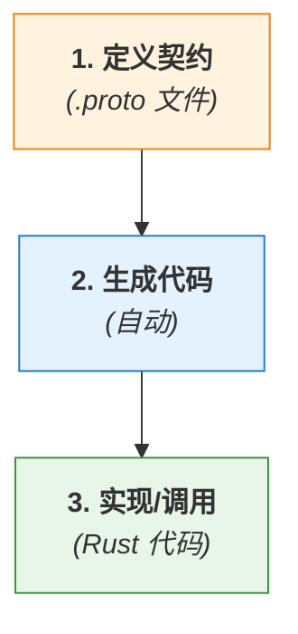
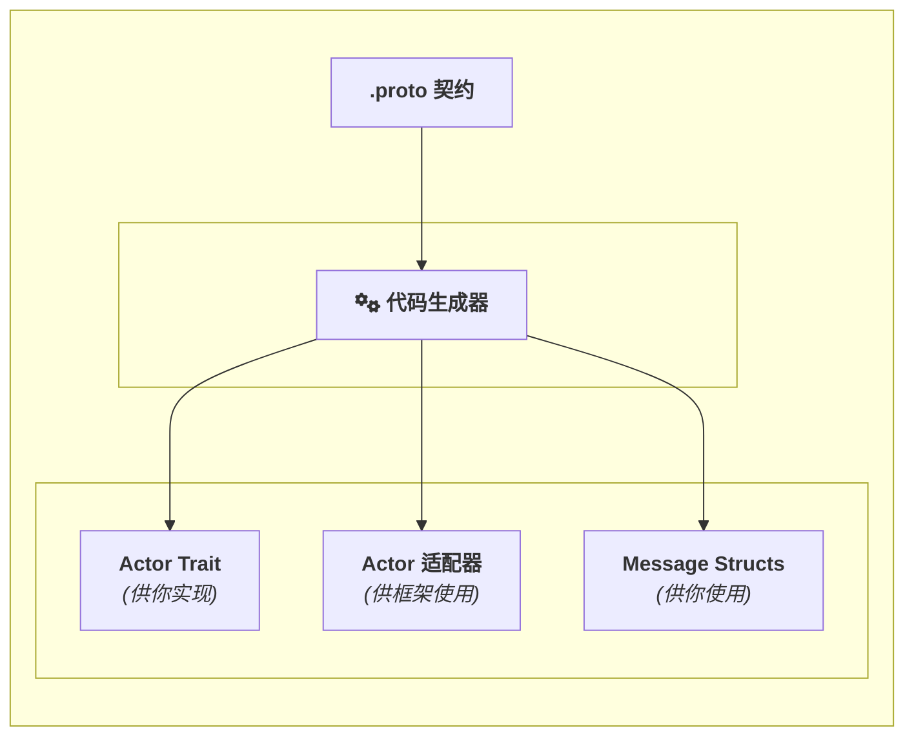

# 专题解析：应用 Protobuf 契约 (Application Proto Contract)

> [!NOTE]
> 本文档讲解了如何为 **您的应用业务** 定义 `service` 和 `message`，这是使用本框架进行开发的第一步。
>
> 如果您想了解 **框架自身** 使用的底层协议（如信令、身份定义），请参阅《[1.2 框架内部协议](./1.2-Framework-Internal-Protocols.zh.md)》。

在开始使用本框架编写任何一行 Rust 代码之前，你的旅程始于一个看似普通但至关重要的文件：`.proto` 文件。

**在我们的架构中，`.proto` 文件不是一个可选项，也不是一个事后生成的文档——它是整个系统的基石、是万物的源头、是服务器与客户端之间神圣不可侵犯的“契约 (Contract)”。**

本篇文章将阐述“契约优先”的设计哲学，以及这份契约是如何驱动整个开发流程，并成为框架实现类型安全和优雅 API 的保障。

### **1. 什么是“契约优先”？**

“契约优先”(Contract-First)是一种软件设计方法，它要求我们在编写任何具体实现代码之前，首先使用一种独立于任何编程语言的**接口定义语言 (IDL)** 来精确地定义数据结构和服务的行为。

在本框架中，我们选择 Google 的 **Protocol Buffers (Protobuf)** 作为我们的 IDL。

这意味着，你的开发流程将永远遵循以下顺序：


*图 1: 契约优先的开发流程*

这种方法的巨大优势在于：
*   **清晰的边界**: `.proto` 文件成为了前端、后端、甚至不同后端服务之间唯一的“真相来源 (Single Source of Truth)”。
*   **并行开发**: 一旦契约确定，不同团队就可以基于生成的代码并行开发，因为他们交互的接口已经被精确地固定下来了。
*   **语言无关**: 你的 `Actor` 可以用 Rust 实现，而调用它的客户端可以是 Web (JavaScript)、移动端 (Kotlin/Swift) 或另一个后端服务 (Go/Python)，它们都共享同一份 `.proto` 契约。

### **2. 契约的两个核心要素**

在 `.proto` 文件中，你只关心两件事：**数据 (`message`)** 和 **能力 (`service`)**。

#### **要素一：`message` — 定义数据**

`message` 用于定义你的应用中所有需要交换的数据的结构。它就像 Rust 中的 `struct`，但拥有跨语言的能力。

```protobuf
// proto/user_service.proto

// 定义一个用户的核心数据结构
message UserProfile {
  string user_id = 1;
  string display_name = 2;
  string avatar_url = 3;
}

// 定义获取用户信息的请求
message GetUserProfileRequest {
  string user_id = 1;
}
```
Protobuf 提供了丰富的数据类型（`string`, `int32`, `bool`, `bytes`, `repeated`, `map` 等），足以描述任何复杂的数据结构。

#### **要素二：`service` — 定义能力**

`service` 用于定义你的 `Actor` 能够执行的操作。它就像 Rust 中的 `trait`，声明了一系列可被远程调用的方法。

```protobuf
// proto/user_service.proto (续)

import "google/protobuf/empty.proto";

// 定义一个名为 UserService 的服务
service UserService {
  // 定义一个 Call (请求-响应) 方法
  // 它接收 GetUserProfileRequest，返回 UserProfile
  rpc GetUserProfile(GetUserProfileRequest) returns (UserProfile);

  // 定义一个 Tell (单向) 方法
  // 它接收 UserProfile，不返回任何有意义的数据
  rpc UpdateUserProfile(UserProfile) returns (google.protobuf.Empty);
}
```
`service` 中的每一个 `rpc` 方法都精确地定义了其**方法名**、**输入参数 (`message`)** 和**输出 (`message`)**。这种精确性是框架实现类型安全自动化的基础。

### **3. 从契约到代码：代码生成的力量**

`.proto` 契约本身只是一份文本文件。要让它在 Rust 代码中变得“鲜活”，就需要**代码生成**这一关键步骤。

当你运行 `cargo build` 时，框架的插件 (`protoc-gen-actorframework`) 会将这份契约转化为具体的、类型安全的 Rust 代码。


*图 2: 代码生成器将契约转化为可用的 Rust 代码*

*   **`Message Structs`**: 你的 `message UserProfile` 会变成一个你可以直接使用的 Rust `struct UserProfile`，它自动拥有了高效的序列化和反序列化能力。
*   **`Actor Trait`**: 你的 `service UserService` 会变成一个 Rust `trait IUserService`。这是**你唯一需要关心和实现的部分**。
*   **`Actor 适配器`**: 插件还会生成一个内部使用的 `UserServiceAdapter`。它是一个“胶水”模块，负责将底层的网络请求翻译成对你实现的 `trait` 方法的调用。**你永远不需要直接接触它**。

### **4. 为什么这份契约如此重要？**

*   **它是你思考的起点**: 在设计一个新功能时，首先要问的不是“我该写什么代码？”，而是“我该如何用 `message` 和 `service` 来描述这个功能的接口？”。
*   **它是你沟通的语言**: 当你需要与其他开发者协作时，这份 `.proto` 文件就是你们之间最清晰、最无歧-义的沟通工具。
*   **它是你系统演进的基石**: 当需要为服务增加新功能或修改现有功能时，对 `.proto` 契约的变更（并遵循 Protobuf 的向后兼容性规则）是你进行系统升级的第一步，也是最安全的一步。

### **5. 总结**

在本框架中，Protobuf 契约扮演了架构师、设计师和外交官的角色。它是驱动一切开发活动的“第一推动力”。通过强制开发者首先在 `.proto` 文件中进行清晰、严谨的思考和定义，框架得以在后续的流程中自动处理掉所有繁琐的细节，最终为你呈现一个简单、安全、高效的开发体验。

**记住：你的下一个伟大功能，始于 `message` 和 `service`。**