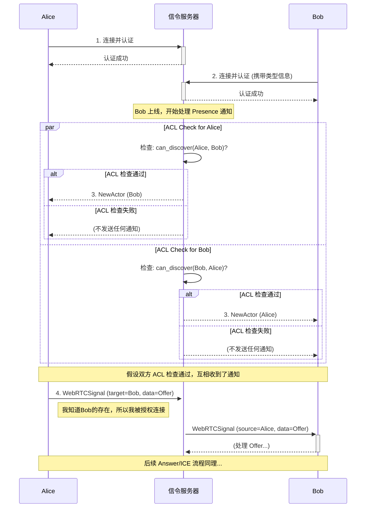

# 专题解析：信令机制 (Signaling)

WebRTC 技术本身只负责建立点对点 (Peer-to-Peer) 的直接连接，但它无法解决一个初始问题：“我应该如何发现并连接到另一个对等端？” 这个“发现与协商”的过程，就是**信令 (Signaling)**。

本框架不提供内置的信令服务器，而是定义了一套清晰的信令协议。开发者需要提供一个实现了该协议的信令服务器，以“引导”框架完成连接。

## 1. 框架对信令服务器的核心期望

框架期望信令服务器扮演一个“智能路由与授权中心”的角色。其核心职责是：

1.  **管理连接**: 接受并管理来自各个 Actor (客户端) 的 WebSocket 连接。
2.  **身份与路由**: 维护一个 `ActorId` 到 WebSocket 连接的映射表，以便能根据 `ActorId` 将消息路由到正确的客户端。
3.  **ACL 感知的 Presence 管理**: 这是信令服务器最关键的职责之一。在广播一个新 Peer 上线时，必须为每个已在线的接收方，根据 ACL 规则检查其是否有权限“发现”这个新 Peer。**只将允许被发现的 Peer 信息通知给对方**。
4.  **消息转发**: 可靠地转发遵循框架[信令层契约](./1.2-Framework-Internal-Protocols.zh.md#2-信令层契约-signalingproto)的消息。

> [!IMPORTANT]
> 框架的信令协议定义在 `signaling.proto` 中。任何自定义的信令服务器都必须能正确地处理该文件中定义的 `SignalingMessage`。
> 详情请参阅《[1.2 框架内部协议](./1.2-Framework-Internal-Protocols.zh.md)》。

## 2. 核心信令交互流程 (含 ACL)

“发现即授权”是本框架信令交互的核心安全原则。客户端收到的 `NewActor` 消息，本身就意味着它已被授权可以与该 Peer 发起连接。



**流程解析**:
1.  **连接与认证**: Alice 和 Bob 各自连接到信令服务器。
2.  **ACL 感知发现**: 当 Bob 上线时，信令服务器**不会**立即广播。而是：
    *   检查 Alice 是否有权限发现 Bob。如果有，向 Alice 发送 `NewActor` 通知。
    *   检查 Bob 是否有权限发现 Alice。如果有，向 Bob 发送 `NewActor` 通知。
3.  **发起连接**: Alice 因为收到了关于 Bob 的 `NewActor` 通知，所以它知道自己有权连接 Bob。它本地的 `ActorSystem` 创建一个 `Offer` 并发送。
4.  **隐式授权转发**: 信令服务器收到 `WebRTCSignal` 后，**原则上可以不再重复检查 ACL**（因为发现阶段已经保证了可连接性），直接将其转发给目标。这简化了服务器逻辑。
5.  后续的 `Answer` 和 `ICE` 交换流程不变。

## 3. 实现自定义信令服务器的简要指南

(本节内容不变，仅作展示)

实现一个满足框架要求的信令服务器并不复杂。以下是一个基于 Node.js 和 `ws` 库的最小化实现思路：

```javascript
// ... (伪代码与之前相同)
```
