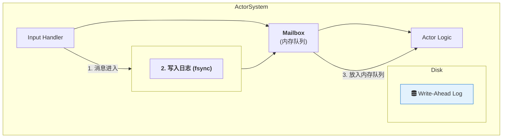
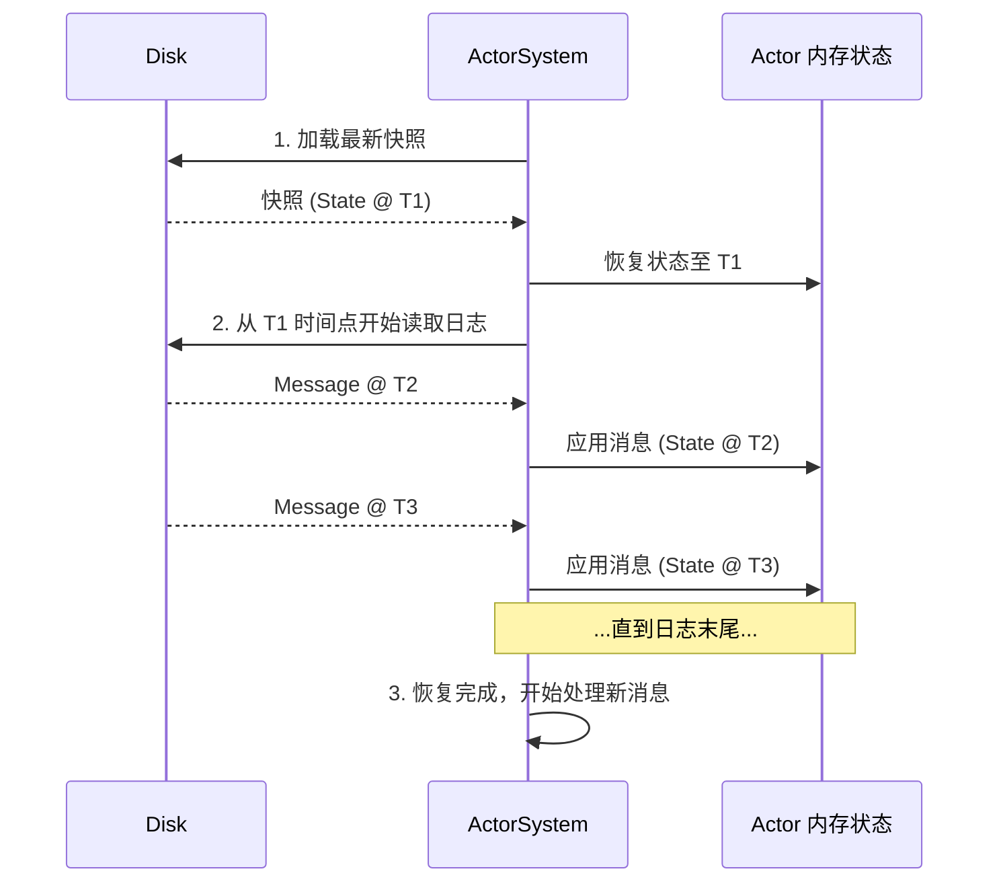

# 专题解析：Mailbox 的持久化层 — 事务日志与恢复

如“理念与架构”篇所述，Mailbox 是一个逻辑概念。本篇文档将深入其物理实现的核心——**持久化层**。

在本框架的设计中，Mailbox 的持久化能力并非一个简单的功能，它是一个基于“日志即数据库” (Log as a Database) 思想构建的、支持持久化的**事务日志 (Transaction Log)**。这个设计是框架实现极高可靠性、支持故障后状态精确恢复的基石。

## 1. 设计哲学：“日志即数据库”

我们不将 Actor 的状态视为一堆可变的数据，而是将其视为**一系列事件 (Events) 作用下的最终结果**。每一个进入“状态路径”的消息，就是一个事件。

Mailbox 的核心职责，就是将这些事件以**仅追加 (Append-Only)** 的方式，可靠地记录到磁盘上的一个日志文件（通常被称为 Write-Ahead Log, WAL）中。

*图 1: 消息处理流程*

1.  当一个状态类消息到达时，它**首先**被序列化并追加到磁盘上的 WAL 文件末尾，并确保刷入（`fsync`）到物理存储。
2.  **只有当消息成功写入日志后**，它才会被放入内存中的 Mailbox 队列，等待 Actor 处理。
3.  Actor 逻辑从内存队列中获取消息并更新自己的内存状态。

## 2. 保证：从“最多一次”到“恰好一次”

这种设计将消息投递的保证从网络传输的“最多一次”提升到了业务逻辑处理的“**恰好一次 (Exactly-Once)**”。

*   **如果进程在将消息写入日志后、但在业务逻辑处理完成前崩溃**：没关系，消息已经安全地保存在磁盘上。
*   **如果消息的业务逻辑被重复执行**：这需要 Actor 的状态处理逻辑是**幂等 (Idempotent)** 的，或者通过事务 ID 来去重。框架通过记录已处理消息的偏移量 (offset) 来辅助实现这一点。

## 3. 故障恢复：状态快照 + 日志重放

持久化邮箱使得 Actor 的状态可以从故障中精确恢复。恢复过程分为两步：

1.  **加载最新快照 (Snapshot)**: `ActorSystem` 在启动时，首先会从磁盘加载该 Actor 最近一次保存的状态快照。快照是 Actor 在某个时间点完整的内存状态镜像，框架会定期（例如，每处理 1000 条消息）自动创建。
2.  **重放日志 (Log Replay)**: 加载快照后，`ActorSystem` 会从快照记录的日志点（offset）开始，依次读取 WAL 中后续的所有消息，并将它们**依次、快速地**应用到 Actor 的状态上（这个过程只执行状态变更，不执行 I/O 等副作用）。

通过“加载快照 + 重放日志”，Actor 的状态可以恢复到崩溃前的最后一个“已知良好”状态，然后继续处理新消息。

## 4. 性能与配置

持久化邮箱的可靠性并非没有代价。每次状态变更都需要一次磁盘写入，这会带来一定的延迟。

*   **性能考量**: 框架通过批量提交 (Batch Commit) 和其他优化来尽可能降低磁盘 I/O 的影响。但对于延迟极其敏感的应用，开发者需要权衡可靠性与性能。
*   **配置选项**: 开发者通常可以配置：
    *   `log_path`: WAL 日志文件的存储路径。
    *   `snapshot_interval`: 创建快照的频率（按消息数量或时间间隔）。
    *   `persistence_enabled`: 是否开启持久化。对于某些不需要高可靠性的 Actor，可以禁用此功能以换取极致的性能。

## 5. 总结

持久化邮箱是本框架实现“宏观 Actor”高可靠性的核心机制。它将 Actor 的状态变更过程转化为一个可审计、可恢复的事务日志，从而在单体服务中实现了类似分布式数据库的可靠性保证。理解这一机制，是设计和开发健壮、可信的 Actor 应用的关键。
