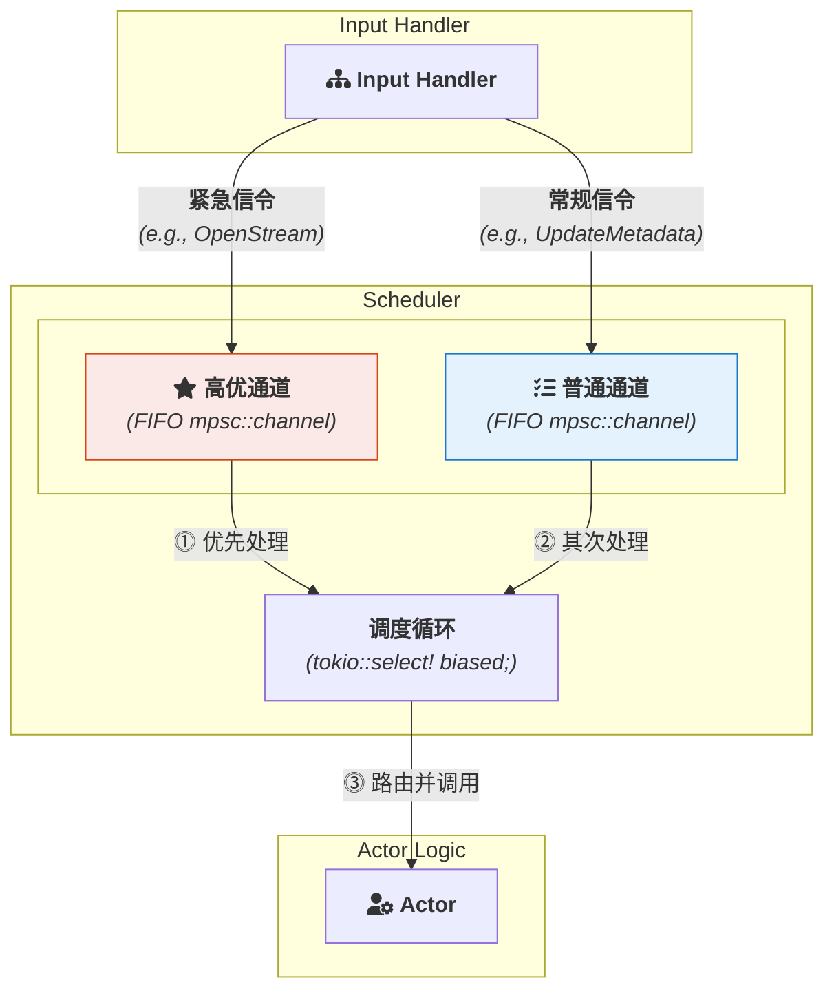

# **专题解析：状态路径调度 — 优先级与顺序**

在任何复杂的实时系统中，都存在两种截然不同的处理需求：
1.  **紧急任务**：如一个管理员的“强制断开连接”信令，或者一个流建立的 `Offer/Answer` 交换，它们必须被立即处理，不能被排在成百上千个普通消息之后。
2.  **常规任务**：如更新用户元数据、发送聊天消息等，它们可以按到达顺序处理。

`Scheduler` (调度器) 正是框架中负责解决这个核心问题的“心脏”。它并非一个简单的消息队列，而是一个内置了**优先级调度**和**串行执行保障**的精密引擎。

### **1. 优先级调度：为紧急信令开辟“急诊通道”**

`Scheduler` 的核心设计理念是，使用两个独立的、有界的FIFO `mpsc` channel：高优通道用于系统关键操作，普通通道用于一般业务逻辑。


*图 1: 双通道优先级调度模型*

`Input Handler` 在分诊时，会根据 `.proto` 文件中为 `rpc` 方法定义的元数据（或根据其他约定），决定将消息发送到高优通道还是普通通道。

`Scheduler` 内部的事件循环则通过 `tokio::select!` 宏的 `biased` 属性，实现了对高优先级通道的“偏向性”轮询。

#### **调度循环伪代码**

```rust
// Scheduler 的主事件循环 (伪代码)
async fn scheduler_loop(
    mut high_priority_rx: mpsc::Receiver<ControlMessage>,
    mut low_priority_rx: mpsc::Receiver<ControlMessage>,
    routes: Arc<MethodRoutes>,
    // ...
) {
    loop {
        tokio::select! {
            biased;

            Some(high_prio_msg) = high_priority_rx.recv() => {
                dispatch(high_prio_msg, &routes).await;
            },

            Some(low_prio_msg) = low_priority_rx.recv() => {
                dispatch(low_prio_msg, &routes).await;
            },

            _ = shutdown_signal.recv() => {
                break;
            },

            else => break,
        }
    }
}
```

通过这种简单而高效的设计，框架确保了关键的生命周期和控制信令能够绕过潜在的消息积压，获得最低的处理延迟。

### **2. 串行执行的保障**

`Scheduler` 的核心职责之一，是保证所有状态路径消息的**处理入口是串行的**。

如“优先级调度”一节所述，调度循环每次只从邮箱中取出一个消息，并 `await` 它的处理过程。在 `async/await` 模型下，这意味着在 `dispatch()` 调用完成之前，调度循环不会去处理下一个消息。

**这个机制是框架提供给开发者的核心保障**：它确保了框架不会**同时**调用两个 `Actor` 的方法，为您提供了一个可以安全修改状态的“时机”。

然而，这种保障是有边界的。它**不等于**为您的 `Actor` 提供了内置的、全局的异步锁。关于框架并发模型和开发者责任的完整、权威的论述，请务必参考核心文档：

> **核心参考：[《1.1 并发模型与状态管理》](./1.1-ActorSystem-and-Actor.zh.md#并发模型与状态管理)**

### **3. 总结**

`Scheduler` 是框架稳定运行的基石。它通过**双通道偏向性调度**，在无需复杂优先级队列算法的情况下，优雅地解决了信令的实时性问题。同时，通过**串行化地派发消息**，它为开发者提供了一个可预测的、无入口竞争的执行环境。

理解调度器的这两个核心行为（优先级处理和串行派发），是开发者设计出能够充分利用框架优势、同时又能保证状态安全的健壮应用的前提。
