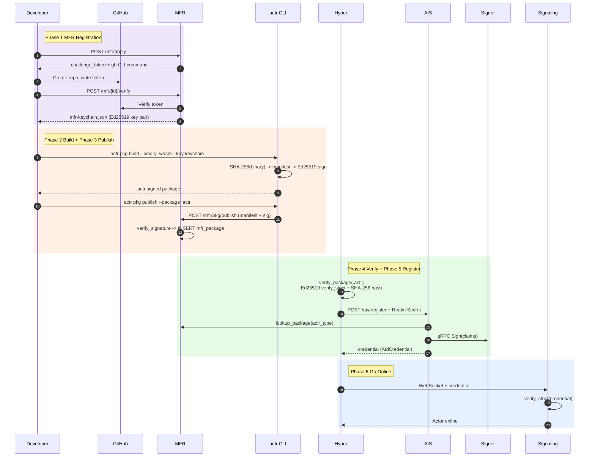
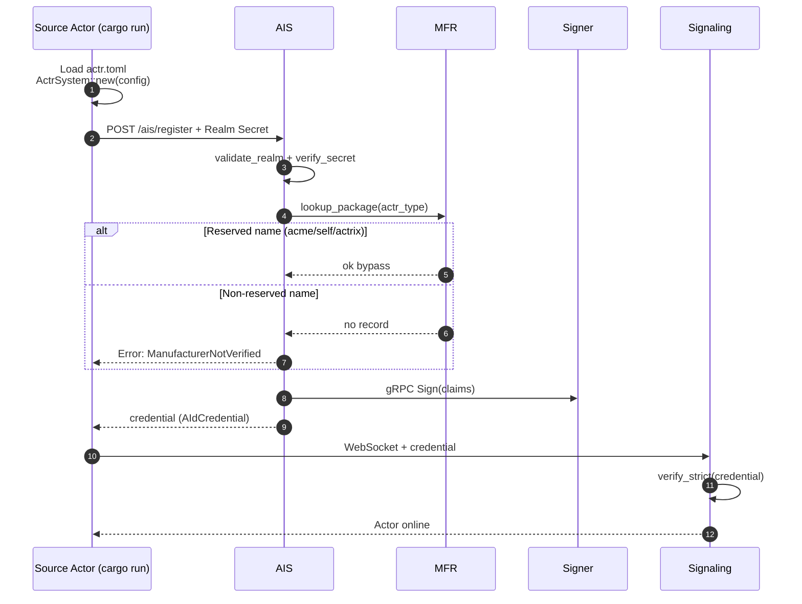
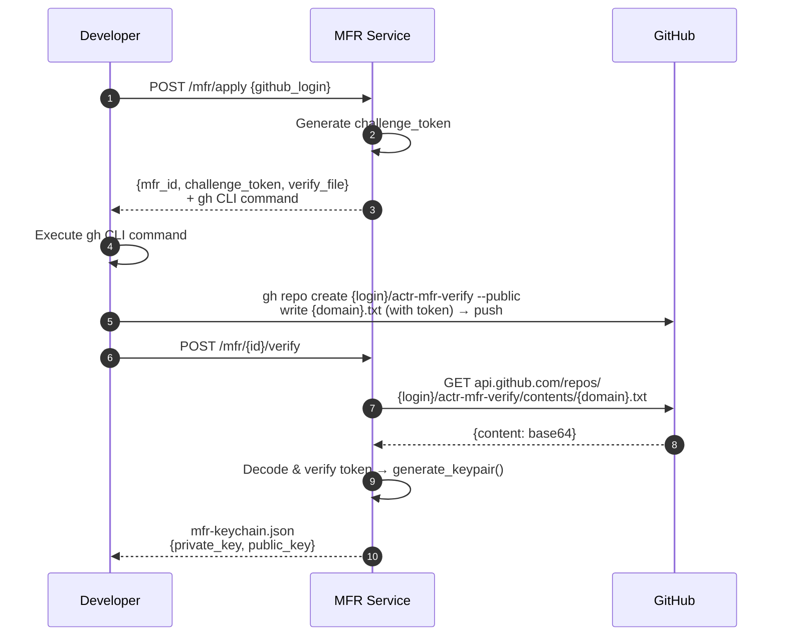
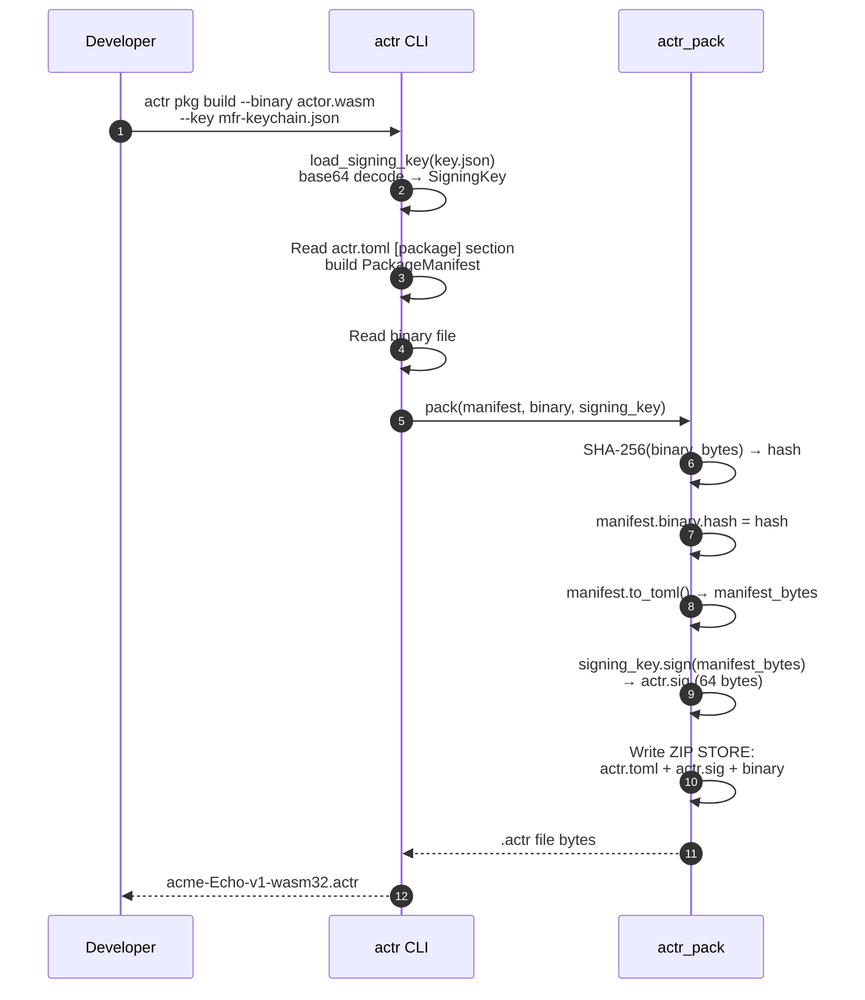
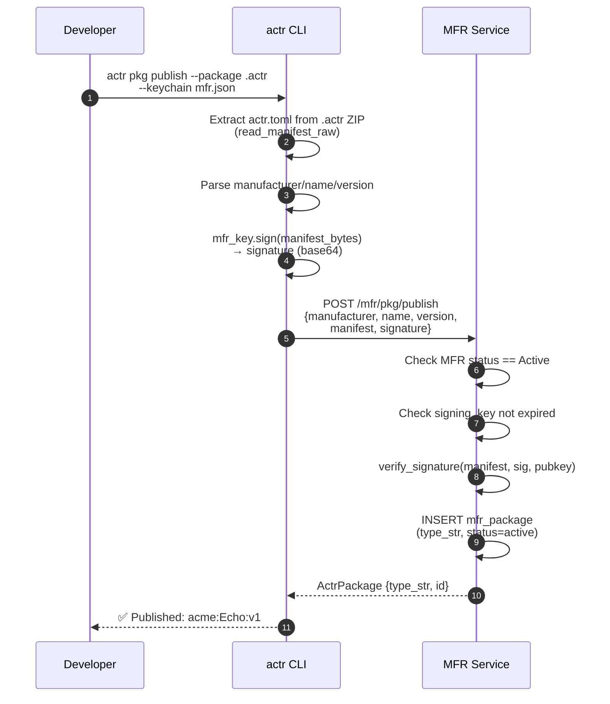
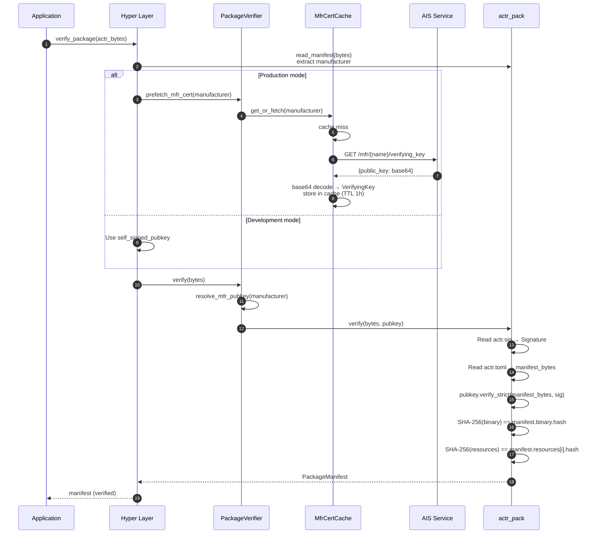
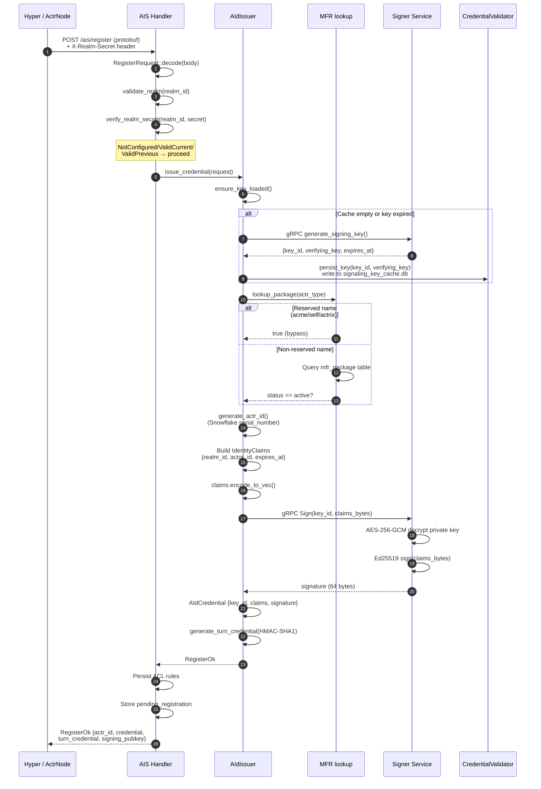
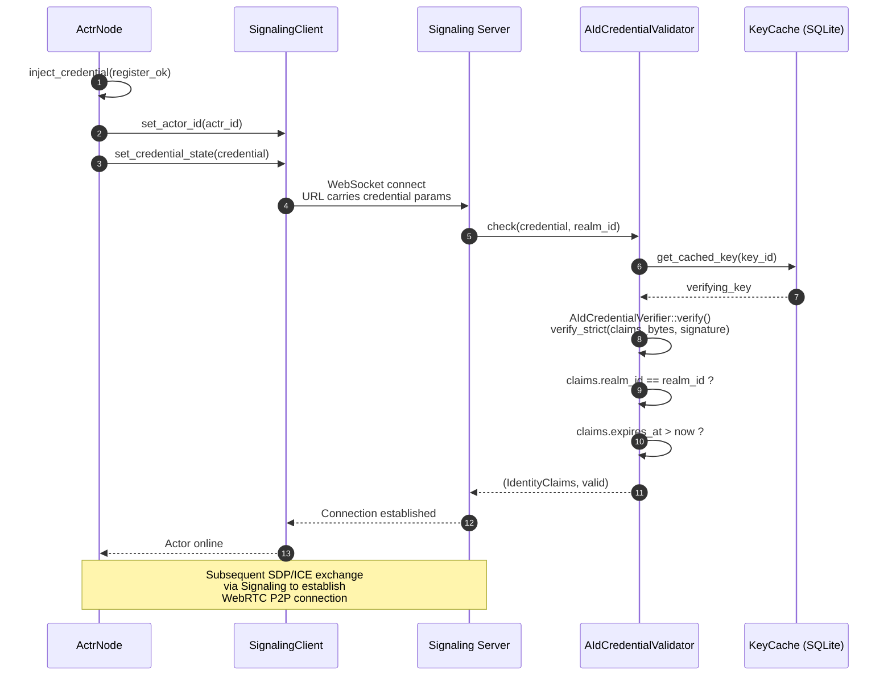
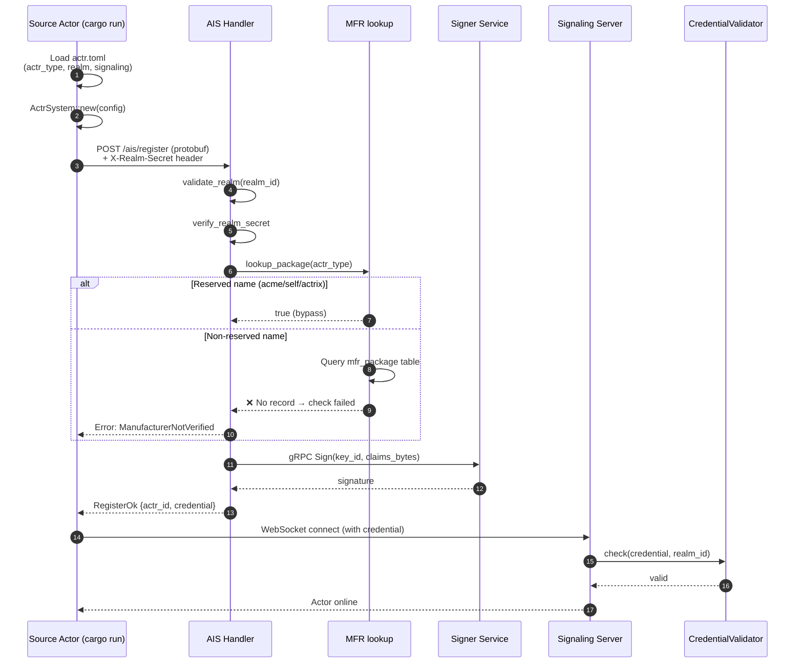

# Actr Sign & Auth Full Pipeline Sequence Diagrams

## Overview

### Wasm / Dynclib Mode

---

### Native Mode

---

Detailed sequence diagrams for each phase below.

---

## Wasm / Dynclib Mode

### Phase 1: MFR Manufacturer Registration

> One-time operation. Developer verifies GitHub identity to obtain MFR signing keys.

**Code**: [handlers.rs](file:///Users/zhj/RustProject/Actrium/actrix/crates/services/mfr/src/handlers.rs), [crypto.rs](file:///Users/zhj/RustProject/Actrium/actrix/crates/services/mfr/src/crypto.rs)

---

### Phase 2: Package Signing

> Developer signs the Actor binary into an `.actr` package using the MFR key.

**Code**: [pkg.rs execute_build](file:///Users/zhj/RustProject/Actrium/actr/cli/src/commands/pkg.rs#L170-L273), [pack.rs](file:///Users/zhj/RustProject/Actrium/actr/core/pack/src/pack.rs#L26-L92)

---

### Phase 3: Publish to Registry

> Register package metadata to MFR so AIS can verify the actr_type exists.

**Code**: [pkg.rs execute_publish](file:///Users/zhj/RustProject/Actrium/actr/cli/src/commands/pkg.rs#L380-L472), [manager.rs publish_package](file:///Users/zhj/RustProject/Actrium/actrix/crates/services/mfr/src/manager.rs#L196-L237)

---

### Phase 4: Runtime Verification

> Hyper layer loads the `.actr` file, fetches the public key, and verifies signature + hash.

**Code**: [verify/mod.rs](file:///Users/zhj/RustProject/Actrium/actr/core/hyper/src/verify/mod.rs#L63-L116), [cert_cache.rs](file:///Users/zhj/RustProject/Actrium/actr/core/hyper/src/verify/cert_cache.rs#L64-L149), [verify.rs](file:///Users/zhj/RustProject/Actrium/actr/core/pack/src/verify.rs#L19-L93)

---

### Phase 5: AIS Credential Issuance

> Actor registers with AIS to obtain an identity credential for Signaling connection.

**Code**: [handlers.rs](file:///Users/zhj/RustProject/Actrium/actrix/crates/services/ais/src/handlers.rs#L54-L244), [issuer.rs](file:///Users/zhj/RustProject/Actrium/actrix/crates/services/ais/src/issuer.rs#L532-L602), [manager.rs lookup_package](file:///Users/zhj/RustProject/Actrium/actrix/crates/services/mfr/src/manager.rs#L317-L327)

---

### Phase 6: Signaling Connection Auth

> Use the AIS-issued credential to connect to Signaling, verified by the Validator.

**Code**: [actr_node.rs](file:///Users/zhj/RustProject/Actrium/actr/core/hyper/src/lifecycle/actr_node.rs), [validator.rs](file:///Users/zhj/RustProject/Actrium/actrix/crates/platform/src/aid/credential/validator.rs)

---

## Native Mode

> Source mode skips Phases 1–4 (no packaging, no publishing, no verification), going directly to AIS registration.
> Currently only reserved names (acme/self/actrix) can pass the `lookup_package` check.

> ⚠️ **Known issue**: Source mode actors using non-reserved manufacturer names will always fail `verify_actr_type()` because there is no `mfr_package` record. A separate registration channel for source mode is needed.
