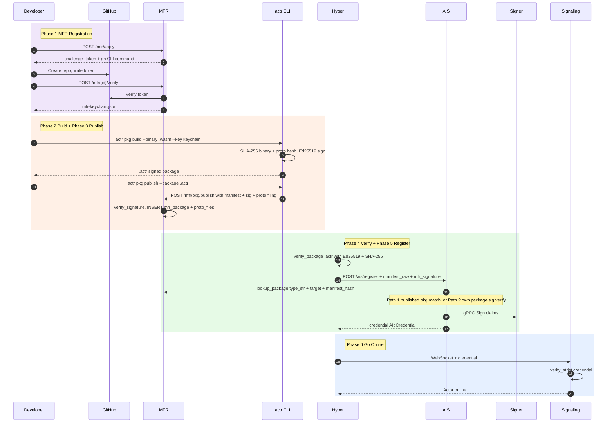
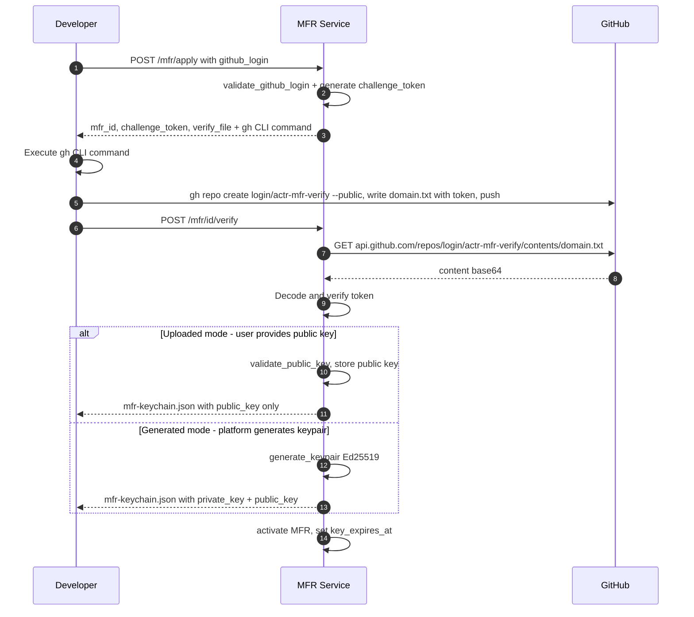
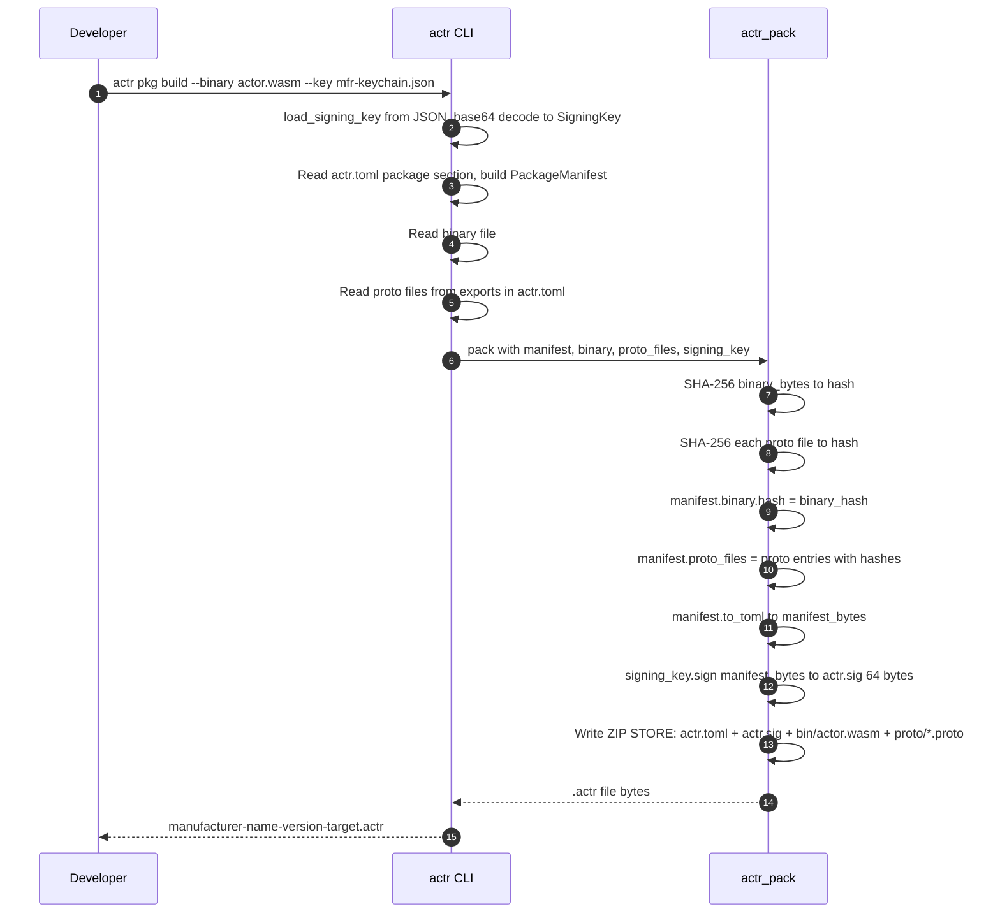
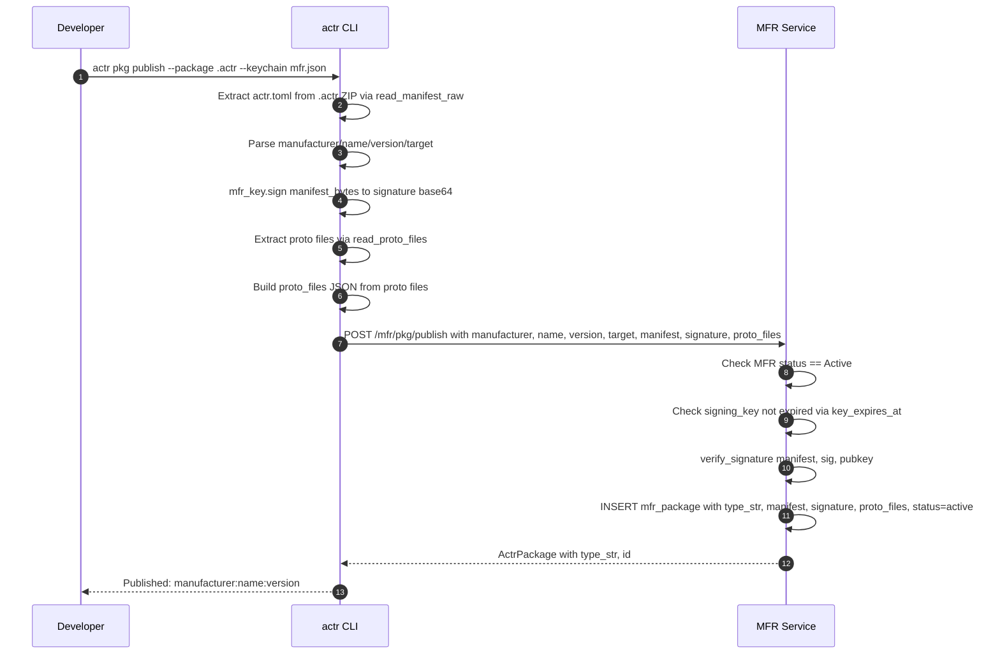
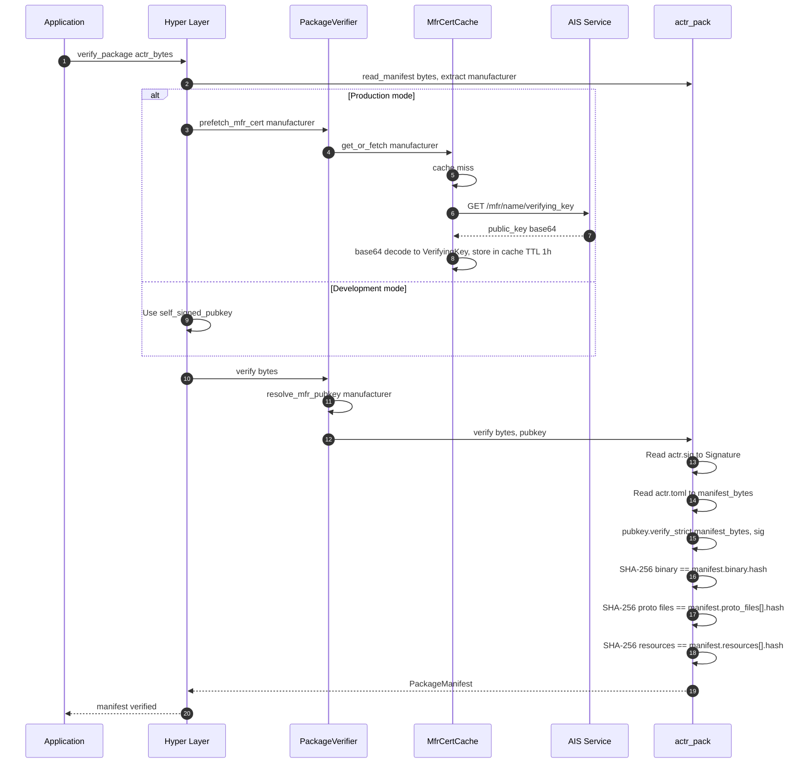
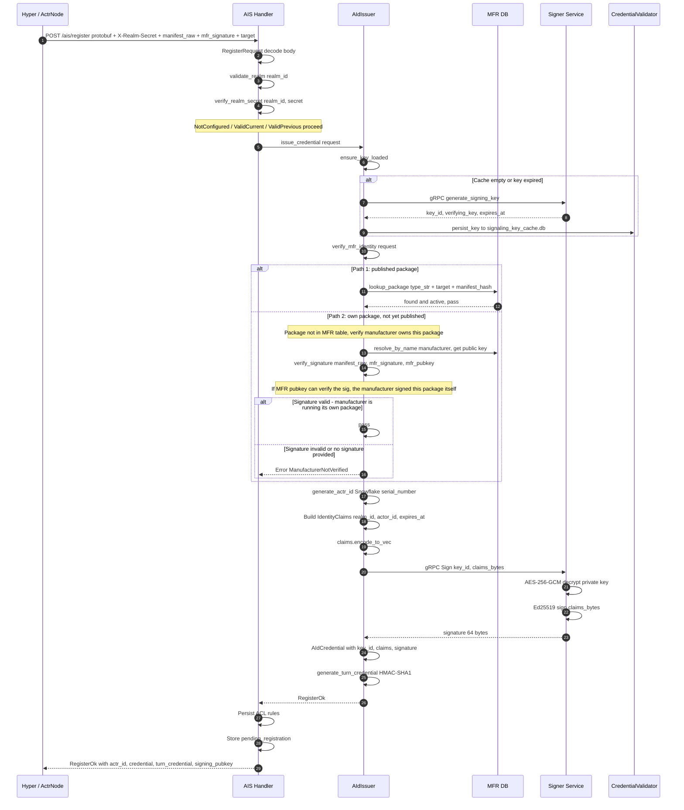
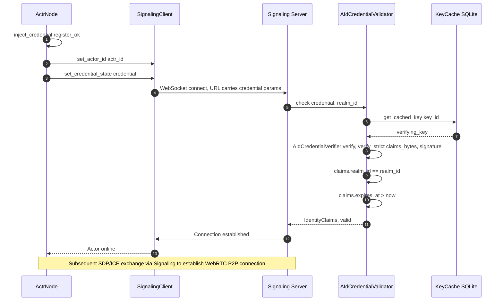

# Actr Sign & Auth Full Pipeline Sequence Diagrams

> **Core signing logic: developers sign packages with their private key and publish to the platform, which hosts the public key; users download the package and verify the signature with the public key — confirming the package was published by that developer and has not been tampered with.**

## Overview



---

Detailed sequence diagrams for each phase below.

---

## Phase 1: MFR Manufacturer Registration

> One-time operation. Developer verifies GitHub identity to obtain MFR signing keys.
> Supports two key modes: developer uploads own public key (recommended), or platform generates keypair.



**Key source**: `KeySource::Uploaded` (recommended) or `KeySource::Generated`

**Code**: [handlers.rs](file:///Users/zhj/RustProject/Actrium/actrix/crates/services/mfr/src/handlers.rs), [manager.rs verify_github](file:///Users/zhj/RustProject/Actrium/actrix/crates/services/mfr/src/manager.rs), [crypto.rs](file:///Users/zhj/RustProject/Actrium/actrix/crates/services/mfr/src/crypto.rs)

---

## Phase 2: Package Signing (Build)

> Developer signs the Actor binary + proto files into an `.actr` package using the MFR key.



### .actr Package Structure

```text
{mfr}-{name}-{version}-{target}.actr (ZIP STORE)
+-- actr.toml             # manifest (TOML, binary hash + proto hashes)
+-- actr.sig              # Ed25519 signature over actr.toml (64 bytes raw)
+-- bin/actor.wasm        # binary (STORE mode)
+-- proto/echo.proto      # proto file 1 (optional)
+-- proto/common.proto    # proto file 2 (optional)
```

### Signing Chain

```text
binary bytes  --> SHA-256 --> actr.toml[binary.hash]
proto bytes   --> SHA-256 --> actr.toml[proto_files[].hash]
                                   |
                           actr.toml bytes --> Ed25519 sign --> actr.sig
```

**Code**: [pkg.rs execute_build](file:///Users/zhj/RustProject/Actrium/actr/cli/src/commands/pkg.rs), [pack.rs](file:///Users/zhj/RustProject/Actrium/actr/core/pack/src/pack.rs), [fingerprint.rs](file:///Users/zhj/RustProject/Actrium/actr/core/service-compat/src/fingerprint.rs)

---

## Phase 3: Publish to Registry

> Register package metadata + proto filing to MFR so AIS can verify during registration.



**Code**: [pkg.rs execute_publish](file:///Users/zhj/RustProject/Actrium/actr/cli/src/commands/pkg.rs), [manager.rs publish_package](file:///Users/zhj/RustProject/Actrium/actrix/crates/services/mfr/src/manager.rs)

---

## Phase 4: Runtime Verification

> Hyper layer loads the `.actr` file, fetches the MFR public key, and verifies signature + all hashes (binary + proto + resources).



**Code**: [verify/mod.rs](file:///Users/zhj/RustProject/Actrium/actr/core/hyper/src/verify/mod.rs), [cert_cache.rs](file:///Users/zhj/RustProject/Actrium/actr/core/hyper/src/verify/cert_cache.rs), [verify.rs](file:///Users/zhj/RustProject/Actrium/actr/core/pack/src/verify.rs)

---

## Phase 5: AIS Credential Issuance

> Actor registers with AIS to obtain an identity credential.
> AIS uses a **dual-path** verification:
> - **Path 1**: Published package — lookup in mfr_package table by type_str + target + manifest_hash.
> - **Path 2**: Unpublished package (own package) — if lookup fails, AIS retrieves the manufacturer's public key and verifies the MFR signature on the manifest. If the signature is valid, it proves the manufacturer is running its own package (signed with its own private key), allowing registration without prior publishing.



**Code**: [handlers.rs](file:///Users/zhj/RustProject/Actrium/actrix/crates/services/ais/src/handlers.rs), [issuer.rs verify_mfr_identity](file:///Users/zhj/RustProject/Actrium/actrix/crates/services/ais/src/issuer.rs), [manager.rs lookup_package](file:///Users/zhj/RustProject/Actrium/actrix/crates/services/mfr/src/manager.rs)

---

## Phase 6: Signaling Connection Auth

> Use the AIS-issued credential to connect to Signaling, verified by the Validator.



**Code**: [actr_node.rs](file:///Users/zhj/RustProject/Actrium/actr/core/hyper/src/lifecycle/actr_node.rs), [validator.rs](file:///Users/zhj/RustProject/Actrium/actrix/crates/platform/src/aid/credential/validator.rs)


---

## Known Issues

### 1. PSK renewal not implemented (not yet supported)

AIS always returns `psk: None` when issuing credentials. Every registration goes through the full flow with no lightweight renewal.

**Solution**: Generate an HMAC-SHA256 PSK in `issue_credential` (using `actr_id + actr_type + realm_id + expires_at` as input) and return it with `RegisterOk`. Hyper client uses the PSK to call `/ais/renew` before credential expiry.

### 2. Package distribution logic missing (not yet supported)

`actr pkg publish` only registers metadata (manifest text + signature + proto filing) to MFR — it does not upload the `.actr` file. MFR has no package storage or download capabilities.

**Solution**: Upload the full `.actr` package during publish. MFR verifies the package server-side via `actr_pack::verify()`, then stores it in object storage (S3/MinIO). Add `actr pkg pull <actr_type>` for downloading.
