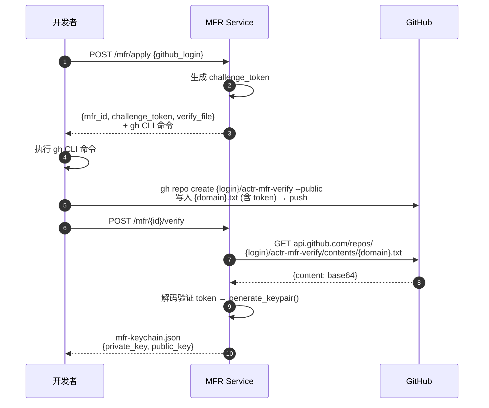
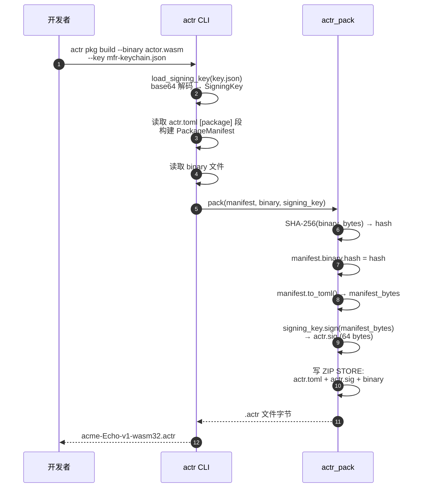
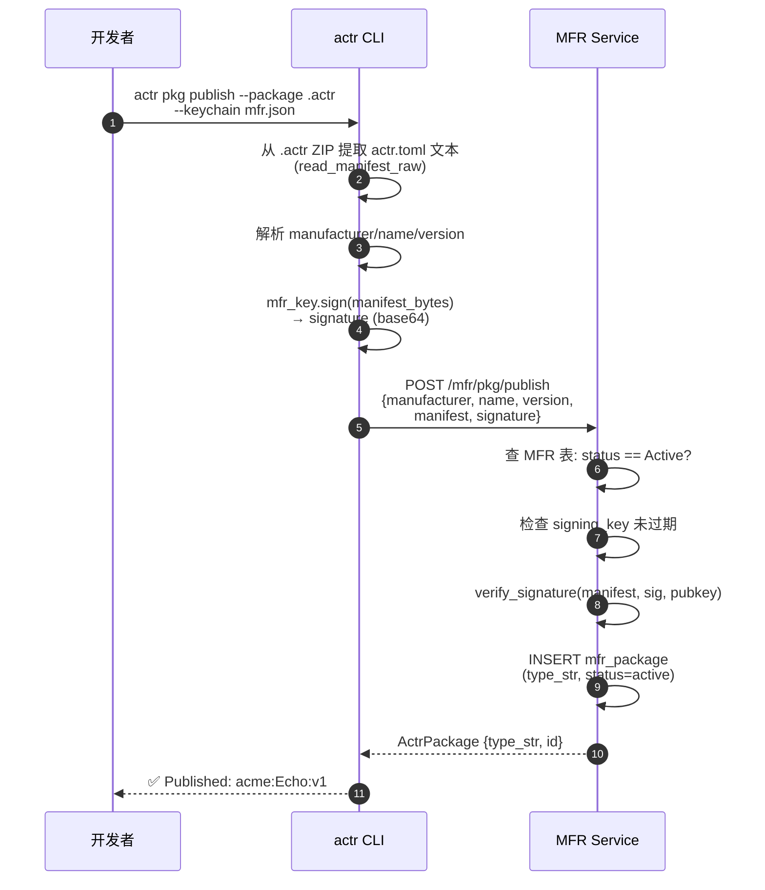
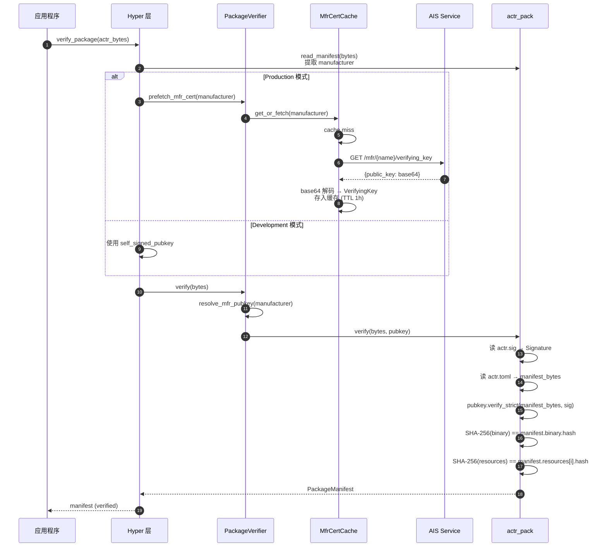
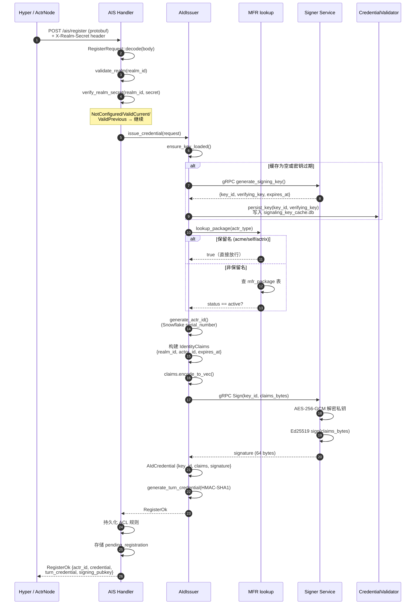
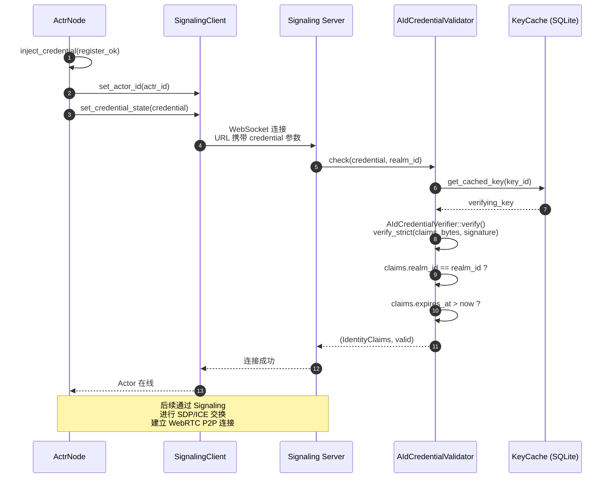
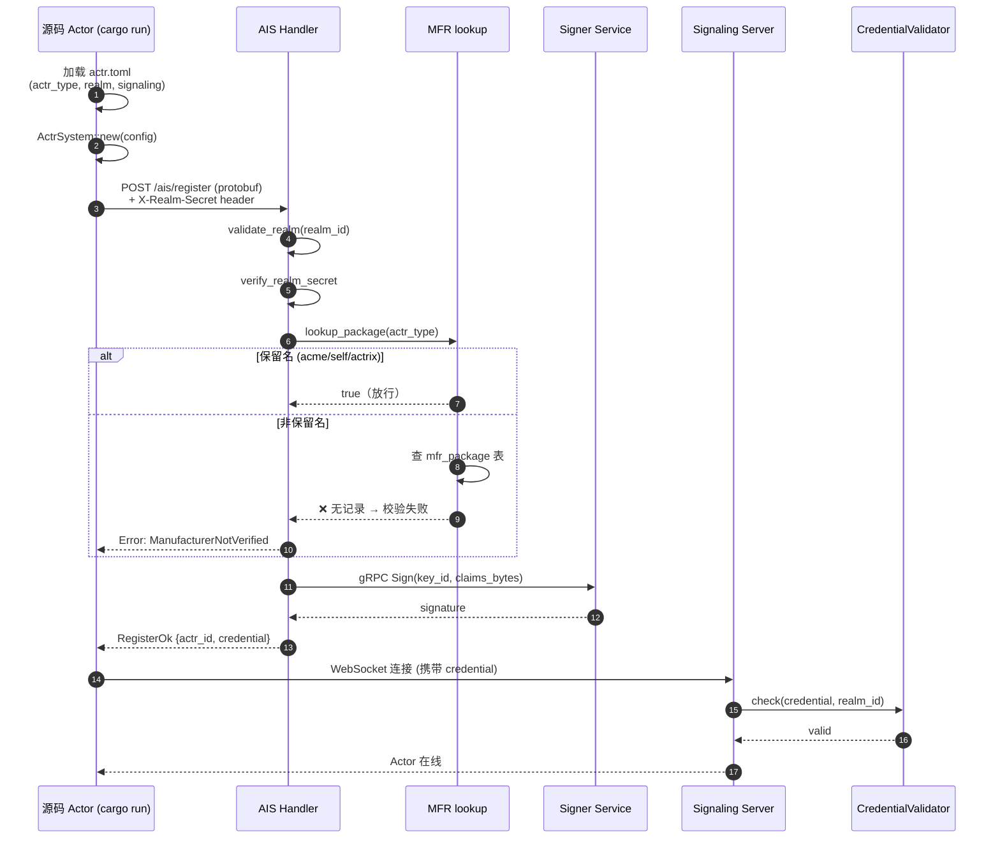

# Actr 签名认证全链路时序图

## 阶段一：MFR 制造商注册

> 一次性操作。开发者通过 GitHub 身份验证获得 MFR 签名密钥。

**代码位置**: [handlers.rs](file:///Users/zhj/RustProject/Actrium/actrix/crates/services/mfr/src/handlers.rs), [crypto.rs](file:///Users/zhj/RustProject/Actrium/actrix/crates/services/mfr/src/crypto.rs)

---

## 阶段二：打包签名

> 开发者使用密钥将 Actor 二进制打包为 `.actr` 文件。

**代码位置**: [pkg.rs execute_build](file:///Users/zhj/RustProject/Actrium/actr/cli/src/commands/pkg.rs#L170-L273), [pack.rs](file:///Users/zhj/RustProject/Actrium/actr/core/pack/src/pack.rs#L26-L92)

---

## 阶段三：发布注册

> 将包元数据注册到 MFR，让 AIS 能查到该 actr_type。

**代码位置**: [pkg.rs execute_publish](file:///Users/zhj/RustProject/Actrium/actr/cli/src/commands/pkg.rs#L380-L472), [manager.rs publish_package](file:///Users/zhj/RustProject/Actrium/actrix/crates/services/mfr/src/manager.rs#L196-L237)

---

## 阶段四：运行时验签

> Hyper 层加载 `.actr` 文件，获取公钥并验证签名和 hash。

**代码位置**: [verify/mod.rs](file:///Users/zhj/RustProject/Actrium/actr/core/hyper/src/verify/mod.rs#L63-L116), [cert_cache.rs](file:///Users/zhj/RustProject/Actrium/actr/core/hyper/src/verify/cert_cache.rs#L64-L149), [verify.rs](file:///Users/zhj/RustProject/Actrium/actr/core/pack/src/verify.rs#L19-L93)

---

## 阶段五：AIS 注册签发 Credential

> Actor 向 AIS 注册，获取身份凭证用于连接 Signaling。

**代码位置**: [handlers.rs](file:///Users/zhj/RustProject/Actrium/actrix/crates/services/ais/src/handlers.rs#L54-L244), [issuer.rs](file:///Users/zhj/RustProject/Actrium/actrix/crates/services/ais/src/issuer.rs#L532-L602), [manager.rs lookup_package](file:///Users/zhj/RustProject/Actrium/actrix/crates/services/mfr/src/manager.rs#L317-L327)

---

## 阶段六：Signaling 连接认证

> 使用 AIS 签发的 Credential 连接 Signaling，经 Validator 验证后上线。

**代码位置**: [actr_node.rs](file:///Users/zhj/RustProject/Actrium/actr/core/hyper/src/lifecycle/actr_node.rs), [validator.rs](file:///Users/zhj/RustProject/Actrium/actrix/crates/platform/src/aid/credential/validator.rs)

---

## 源码模式（Source/Native）

> 源码模式不经过阶段一~四（无打包、无发布、无验签），直接从 AIS 注册开始。
> 当前仅保留名（acme/self/actrix）可通过 `lookup_package` 校验。

> ⚠️ **已知问题**: 源码模式使用非保留名时，因 `mfr_package` 表无记录，`verify_actr_type()` 校验必定失败，需要为源码模式提供注册通道。
