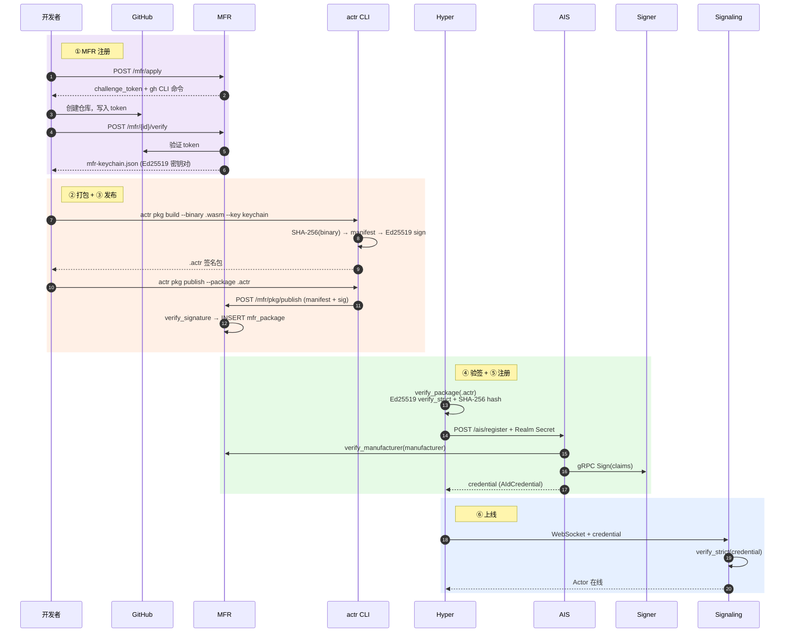
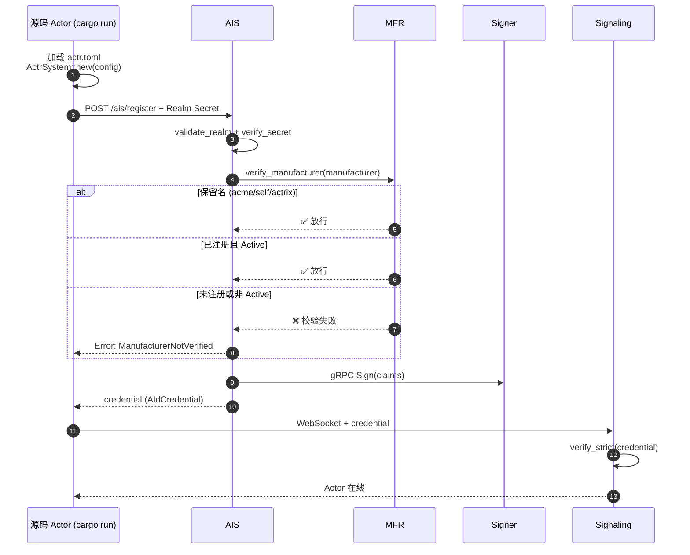
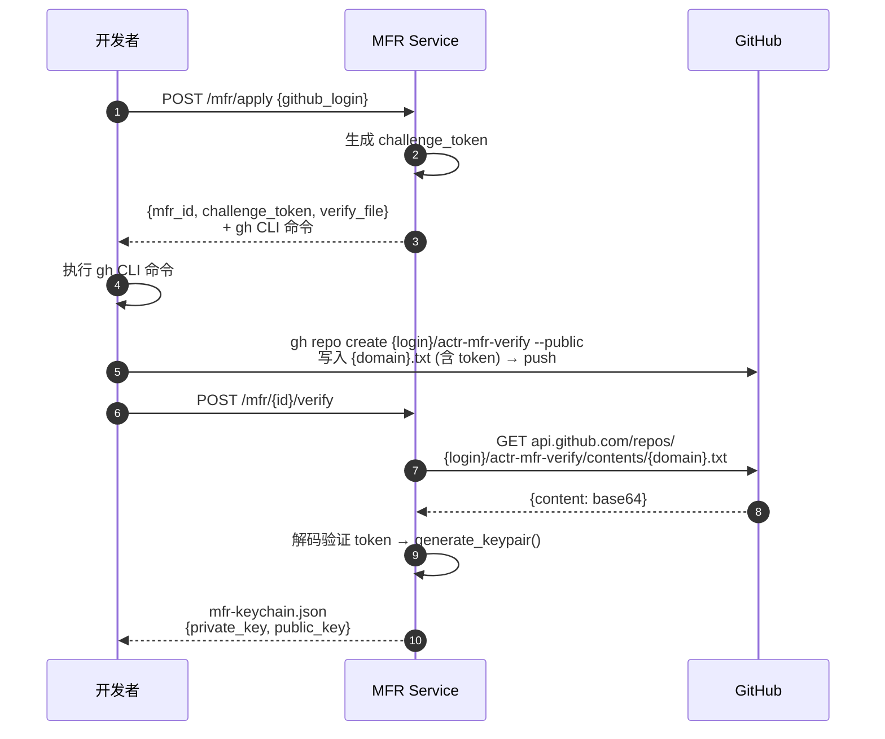
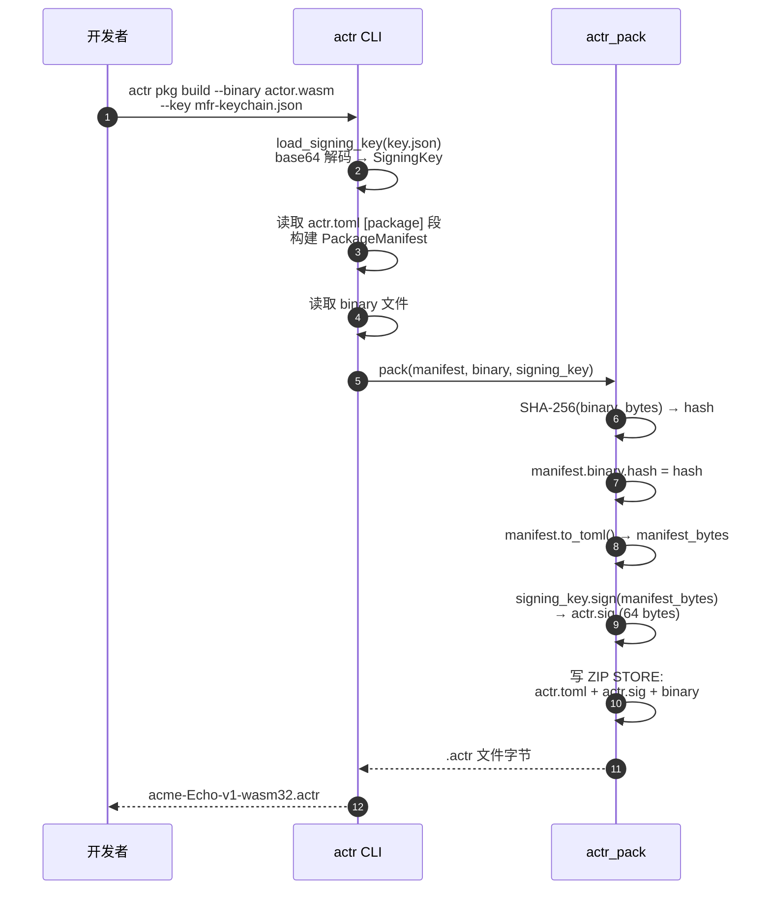
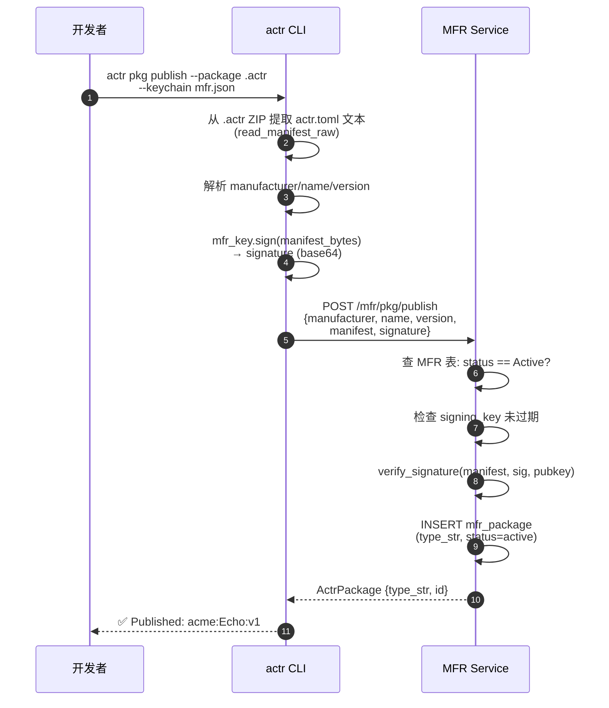
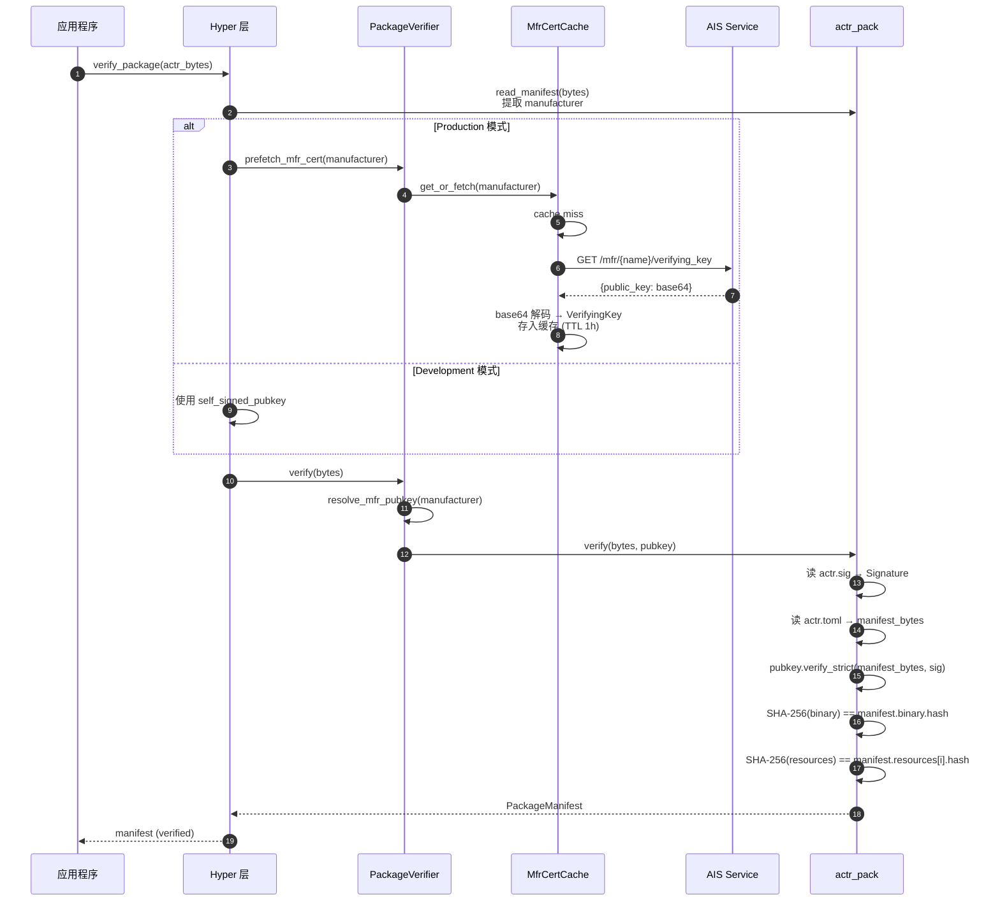
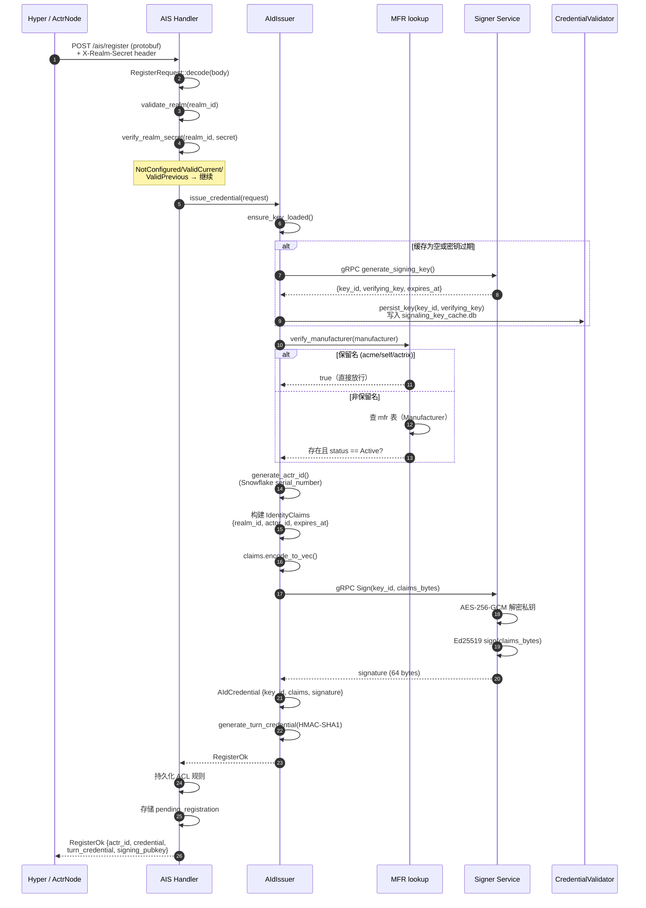
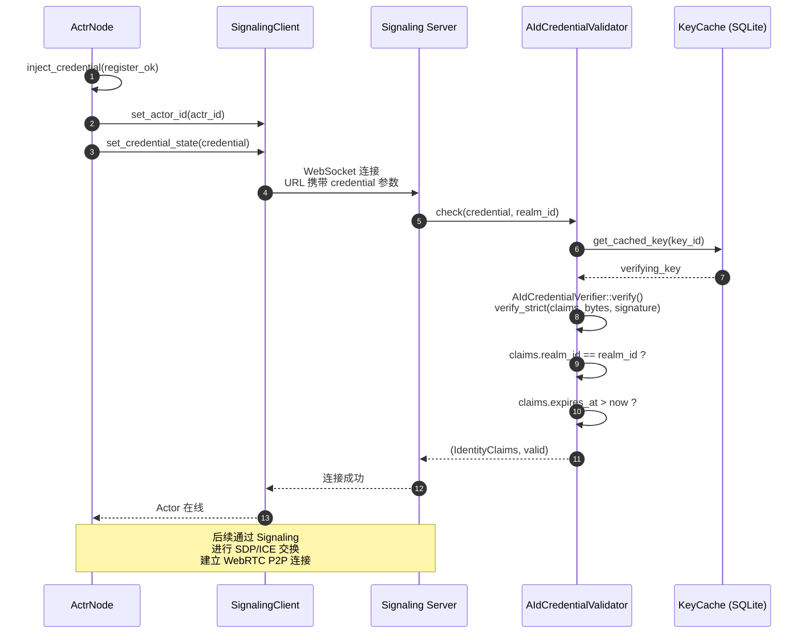
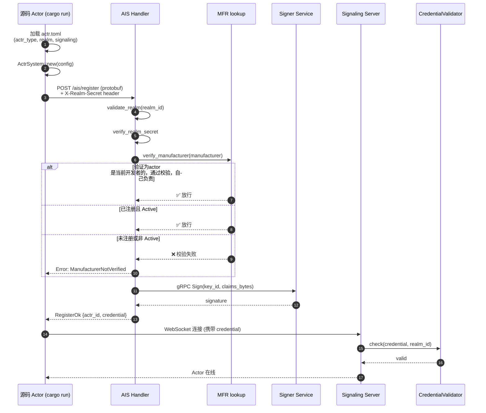

# Actr 签名认证全链路时序图

> **签名认证核心逻辑：开发者用私钥对安装包签名并发布到平台，平台托管公钥；用户下载包后，用公钥验签——确认包确实由该开发者发布，且内容未被篡改。（目前公私钥是由平台生成的，需要确认）**

## 概览

### Wasm / Dynclib Mode



---

### Native Mode



---

以下为各阶段详细时序图。

---

## Wasm / Dynclib Mode

### 阶段一：MFR 制造商注册

> 一次性操作。开发者通过 GitHub 身份验证获得 MFR 签名密钥。



**代码位置**: [handlers.rs](file:///Users/zhj/RustProject/Actrium/actrix/crates/services/mfr/src/handlers.rs), [crypto.rs](file:///Users/zhj/RustProject/Actrium/actrix/crates/services/mfr/src/crypto.rs)

---

### 阶段二：打包签名

> 开发者使用密钥将 Actor 二进制打包为 `.actr` 文件。



**代码位置**: [pkg.rs execute_build](file:///Users/zhj/RustProject/Actrium/actr/cli/src/commands/pkg.rs#L170-L273), [pack.rs](file:///Users/zhj/RustProject/Actrium/actr/core/pack/src/pack.rs#L26-L92)

---

### 阶段三：发布注册

> 将包元数据注册到 MFR，让 AIS 能查到该 actr_type。



**代码位置**: [pkg.rs execute_publish](file:///Users/zhj/RustProject/Actrium/actr/cli/src/commands/pkg.rs#L380-L472), [manager.rs publish_package](file:///Users/zhj/RustProject/Actrium/actrix/crates/services/mfr/src/manager.rs#L196-L237)

---

### 阶段四：运行时验签

> Hyper 层加载 `.actr` 文件，获取公钥并验证签名和 hash。



**代码位置**: [verify/mod.rs](file:///Users/zhj/RustProject/Actrium/actr/core/hyper/src/verify/mod.rs#L63-L116), [cert_cache.rs](file:///Users/zhj/RustProject/Actrium/actr/core/hyper/src/verify/cert_cache.rs#L64-L149), [verify.rs](file:///Users/zhj/RustProject/Actrium/actr/core/pack/src/verify.rs#L19-L93)

---

### 阶段五：AIS 注册签发 Credential

> Actor 向 AIS 注册，获取身份凭证用于连接 Signaling。



**代码位置**: [handlers.rs](file:///Users/zhj/RustProject/Actrium/actrix/crates/services/ais/src/handlers.rs#L54-L244), [issuer.rs](file:///Users/zhj/RustProject/Actrium/actrix/crates/services/ais/src/issuer.rs#L532-L602), [manager.rs lookup_package](file:///Users/zhj/RustProject/Actrium/actrix/crates/services/mfr/src/manager.rs#L317-L327)

---

### 阶段六：Signaling 连接认证

> 使用 AIS 签发的 Credential 连接 Signaling，经 Validator 验证后上线。



**代码位置**: [actr_node.rs](file:///Users/zhj/RustProject/Actrium/actr/core/hyper/src/lifecycle/actr_node.rs), [validator.rs](file:///Users/zhj/RustProject/Actrium/actrix/crates/platform/src/aid/credential/validator.rs)

---

## Native Mode

> 源码模式不经过阶段一~四（无打包、无发布、无验签），直接从 AIS 注册开始。
> AIS 仅验证 Manufacturer 是否存在且已激活，保留名（acme/self/actrix）直接放行。



---

## 已知问题

### 1. AIS 注册授权应验证 Manufacturer 而非包发布记录

当前 `verify_actr_type()` 检查 `mfr_package` 表中是否存在对应的 `type_str` 记录。这导致 Native Mode 使用非保留名时必定失败（因为没经过 `actr pkg publish`）。实际上，Hyper 层已经完成了包完整性验签（Ed25519 签名 + SHA-256 hash），AIS 不需要重复验证包内容，只需确认 **Manufacturer（制造商）是否存在且处于激活状态**。

**解决方案**: 将 `verify_actr_type()` 中的 `lookup_package(type_str)` 改为查询 `mfr` 表（Manufacturer 表），仅验证 `actr_type.manufacturer` 对应的 MFR 记录是否存在且 `status == Active`。保留名（acme/self/actrix）继续直接放行。`mfr_package` 表保留用于包分发和版本管理，不再作为注册授权的前置条件。

**当前实现** ([issuer.rs](file:///Users/zhj/RustProject/Actrium/actrix/crates/services/ais/src/issuer.rs#L604-L637)):

```rust
async fn verify_actr_type(&self, actr_type: &ActrType) -> Result<(), AidError> {
    let type_str = format!("{}:{}:{}", actr_type.manufacturer, actr_type.name, actr_type.version);

    if actrix_mfr::reserved::is_reserved(&actr_type.manufacturer) {
        return Ok(());  // 保留名直接放行
    }

    // ❌ 查 mfr_package 表 — Native Mode 没有发布过包，必定失败
    let valid = actrix_mfr::manager::lookup_package(&pool, &type_str).await?;
    if !valid {
        return Err(AidError::ManufacturerNotVerified);
    }
    Ok(())
}
```

**修改后**:

```rust
async fn verify_actr_type(&self, actr_type: &ActrType) -> Result<(), AidError> {
    if actrix_mfr::reserved::is_reserved(&actr_type.manufacturer) {
        return Ok(());  // 保留名直接放行
    }

    // ✅ 查 mfr 表 — 只验证 Manufacturer 是否存在且激活
    let mfr = Manufacturer::get_by_name(&pool, &actr_type.manufacturer)
        .await?
        .ok_or(AidError::ManufacturerNotVerified)?;

    if mfr.status != MfrStatus::Active {
        return Err(AidError::ManufacturerNotVerified);
    }
    Ok(())
}
```

### 2. PSK 续期未实现

AIS 签发 credential 时始终返回 `psk: None`，每次注册都走完整流程，无法轻量续期。

**解决方案**: AIS `issue_credential` 时生成 HMAC-SHA256 PSK（使用 `actr_id + actr_type + realm_id + expires_at` 作为输入），随 `RegisterOk` 返回。Hyper 客户端在 credential 过期前使用 PSK 调用 `/ais/renew` 接口续期。

### 3. 包分发逻辑缺失

`actr pkg publish` 只向 MFR 注册元数据（manifest 文本 + signature），不上传 `.actr` 文件。MFR 没有包存储和下载能力，Hyper 节点无法从 MFR 拉取包，`.actr` 文件只能通过文件系统手动传递或本地构建后直接加载。

**解决方案 — 上传整包**:

1. **`publish` 改为上传整个 `.actr` 包**，由于 `build` 已将签名（`actr.sig`）打包进 `.actr` 文件，publish 请求中不再需要独立的 `signature` 字段：
   ```bash
   # 之前: actr pkg publish --package .actr --keychain mfr.json --endpoint URL
   # 之后: actr pkg publish --package .actr --endpoint URL
   ```
   MFR 服务端收到 `.actr` 包后：
   - 从 ZIP 中提取 `actr.toml` → 得到 manufacturer / name / version
   - 从 ZIP 中提取 `actr.sig` → 得到签名
   - 查数据库获取该 manufacturer 的 MFR 公钥
   - 调用 `actr_pack::verify(&package_bytes, &mfr_pubkey)` 完整验证（包括签名 + binary hash）
   - 验证通过 → 存储 `.actr` 包到对象存储（S3/MinIO）→ 记录到 `mfr_package` 表

2. **新增 `actr pkg pull <actr_type>` 命令**，从 MFR 下载 `.actr` 包：
   - MFR 新增 `GET /mfr/pkg/download/{type_str}` 接口
   - Hyper 节点下载后调用 `actr_pack::verify()` 验证

### 4. MFR 服务端生成开发者私钥（设计疑问）

MFR 注册时，Ed25519 密钥对由 Actrix 服务端生成，私钥通过 HTTP 响应返回给开发者（[manager.rs L109](file:///Users/zhj/RustProject/Actrium/actrix/crates/services/mfr/src/manager.rs#L109)）。虽然 Actrix 不存储、不使用该私钥（仅一次性返回），但业界标准做法是开发者本地生成密钥对、仅上传公钥（Apple/npm/SSH 均如此）。这里是故意为之还是存在问题？

**解决方案**: 改为开发者本地 `actr pkg keygen` 生成密钥对，MFR 注册时通过 `/mfr/apply` 上传公钥，服务端不再生成也不接触私钥。
