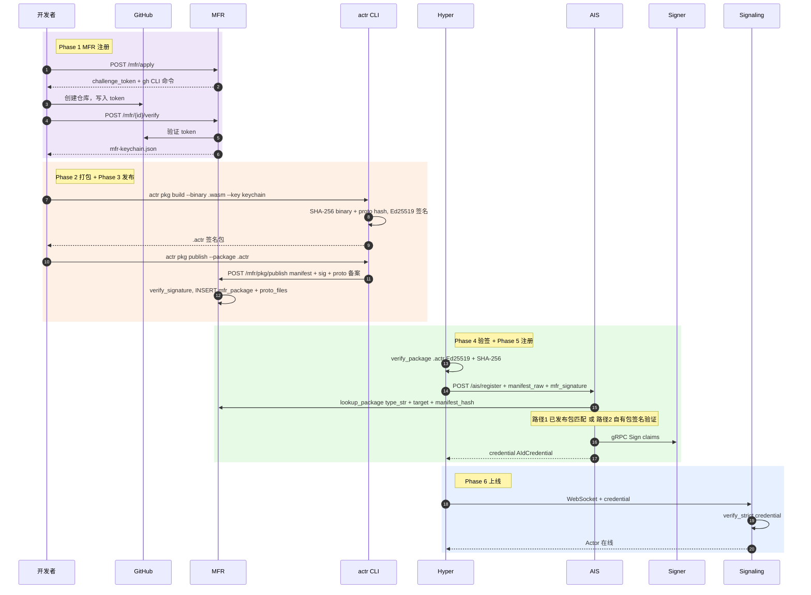
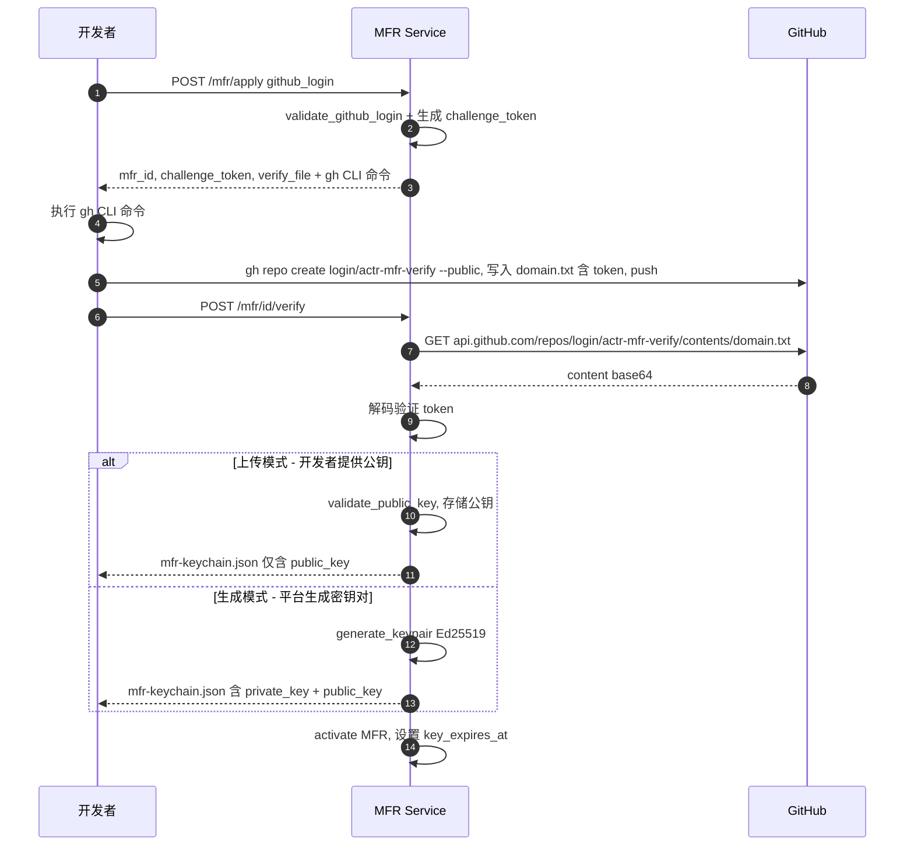
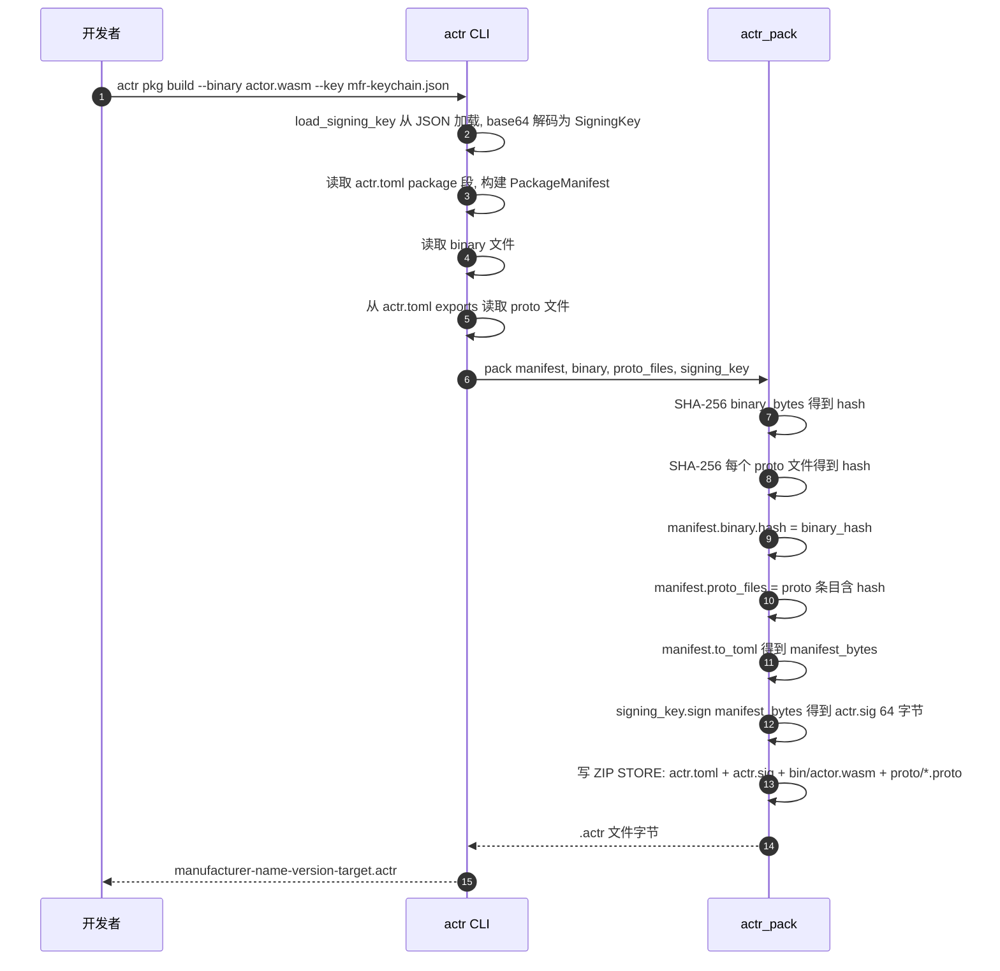
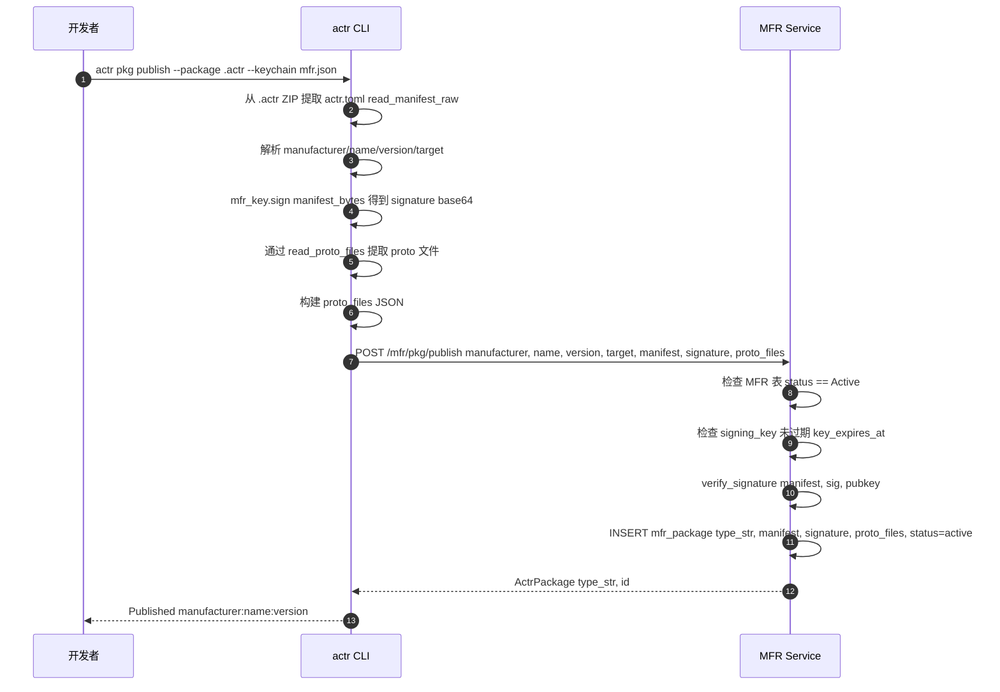
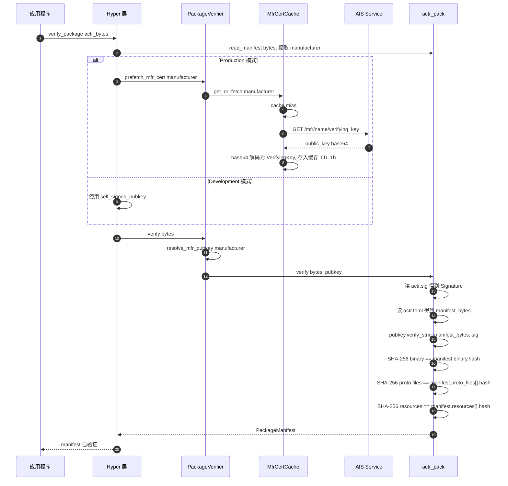
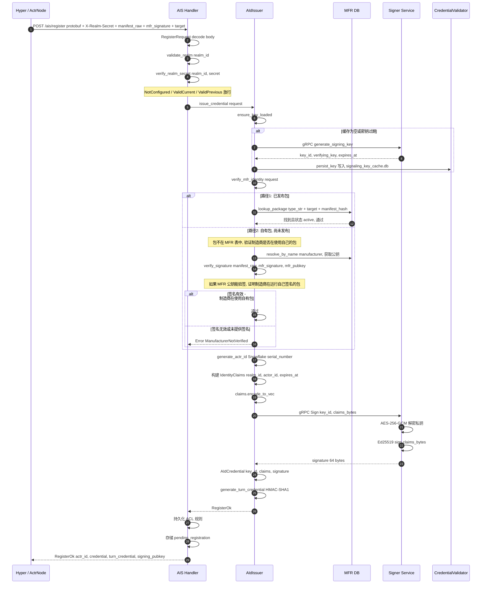
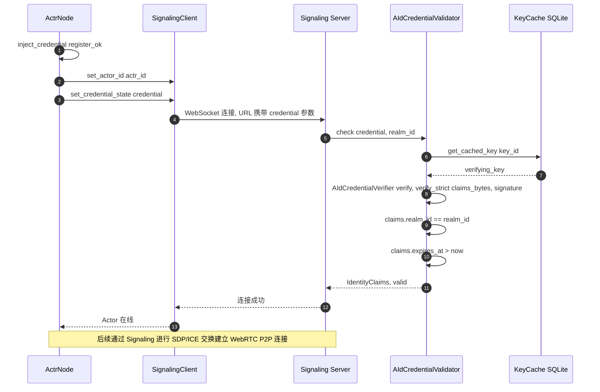

# Actr 签名认证全链路时序图

> **签名认证核心逻辑：开发者用私钥对安装包签名并发布到平台，平台托管公钥；用户下载包后，用公钥验签——确认包确实由该开发者发布，且内容未被篡改。**

## 概览



---

以下为各阶段详细时序图。

---

## 阶段一：MFR 制造商注册

> 一次性操作。开发者通过 GitHub 身份验证获得 MFR 签名密钥。
> 支持两种密钥模式：开发者上传自有公钥或平台生成密钥对。



**密钥来源**: `KeySource::Uploaded`（推荐）或 `KeySource::Generated`

**代码位置**: [handlers.rs](file:///Users/zhj/RustProject/Actrium/actrix/crates/services/mfr/src/handlers.rs), [manager.rs verify_github](file:///Users/zhj/RustProject/Actrium/actrix/crates/services/mfr/src/manager.rs), [crypto.rs](file:///Users/zhj/RustProject/Actrium/actrix/crates/services/mfr/src/crypto.rs)

---

## 阶段二：打包签名（Build）

> 开发者使用 MFR 密钥将 Actor 二进制 + proto 文件打包签名为 `.actr` 文件。



### .actr 包结构

```text
{mfr}-{name}-{version}-{target}.actr (ZIP STORE)
+-- actr.toml             # manifest (TOML, 含 binary hash + proto hash)
+-- actr.sig              # Ed25519 签名，覆盖 actr.toml (64 字节原始格式)
+-- bin/actor.wasm        # 二进制 (STORE 模式)
+-- proto/echo.proto      # proto 文件 1 (可选)
+-- proto/common.proto    # proto 文件 2 (可选)
```

### 签名链

```text
binary 字节  --> SHA-256 --> actr.toml[binary.hash]
proto 字节   --> SHA-256 --> actr.toml[proto_files[].hash]
                                |
                        actr.toml 字节 --> Ed25519 签名 --> actr.sig
```

**代码位置**: [pkg.rs execute_build](file:///Users/zhj/RustProject/Actrium/actr/cli/src/commands/pkg.rs), [pack.rs](file:///Users/zhj/RustProject/Actrium/actr/core/pack/src/pack.rs), [fingerprint.rs](file:///Users/zhj/RustProject/Actrium/actr/core/service-compat/src/fingerprint.rs)

---

## 阶段三：发布注册（Publish）

> 将包元数据 + proto 备案信息注册到 MFR，供 AIS 在注册时验证。



**代码位置**: [pkg.rs execute_publish](file:///Users/zhj/RustProject/Actrium/actr/cli/src/commands/pkg.rs), [manager.rs publish_package](file:///Users/zhj/RustProject/Actrium/actrix/crates/services/mfr/src/manager.rs)

---

## 阶段四：运行时验签

> Hyper 层加载 `.actr` 文件，获取 MFR 公钥并验证签名 + 所有 hash（binary + proto + resources）。



**代码位置**: [verify/mod.rs](file:///Users/zhj/RustProject/Actrium/actr/core/hyper/src/verify/mod.rs), [cert_cache.rs](file:///Users/zhj/RustProject/Actrium/actr/core/hyper/src/verify/cert_cache.rs), [verify.rs](file:///Users/zhj/RustProject/Actrium/actr/core/pack/src/verify.rs)

---

## 阶段五：AIS 注册签发 Credential

> Actor 向 AIS 注册，获取身份凭证用于连接 Signaling。
> AIS 采用**双路径验证**：
> - **路径 1**：已发布包 — 在 mfr_package 表中按 type_str + target + manifest_hash 查找匹配。
> - **路径 2**：未发布包（自有包）— 查找失败时，AIS 获取制造商公钥并验证 manifest 上的 MFR 签名。签名有效则证明制造商在运行自己签名的包（用自己的私钥签过），允许在未发布的情况下注册。



**代码位置**: [handlers.rs](file:///Users/zhj/RustProject/Actrium/actrix/crates/services/ais/src/handlers.rs), [issuer.rs verify_mfr_identity](file:///Users/zhj/RustProject/Actrium/actrix/crates/services/ais/src/issuer.rs), [manager.rs lookup_package](file:///Users/zhj/RustProject/Actrium/actrix/crates/services/mfr/src/manager.rs)

---

## 阶段六：Signaling 连接认证

> 使用 AIS 签发的 Credential 连接 Signaling，经 Validator 验证后上线。



**代码位置**: [actr_node.rs](file:///Users/zhj/RustProject/Actrium/actr/core/hyper/src/lifecycle/actr_node.rs), [validator.rs](file:///Users/zhj/RustProject/Actrium/actrix/crates/platform/src/aid/credential/validator.rs)

---


## 已知问题

### 1. PSK 续期（暂不支持）

AIS 签发 credential 时始终返回 `psk: None`，每次注册都走完整流程，无法轻量续期。

**解决方案**: AIS `issue_credential` 时生成 HMAC-SHA256 PSK（使用 `actr_id + actr_type + realm_id + expires_at` 作为输入），随 `RegisterOk` 返回。Hyper 客户端在 credential 过期前使用 PSK 调用 `/ais/renew` 接口续期。

### 2. 包分发逻辑（暂不支持）

`actr pkg publish` 只向 MFR 注册元数据（manifest 文本 + signature + proto 备案），不上传 `.actr` 文件。MFR 没有包存储和下载能力。

**解决方案**: `publish` 改为上传整个 `.actr` 包。MFR 服务端通过 `actr_pack::verify()` 完整验证后存储到对象存储（S3/MinIO）。新增 `actr pkg pull <actr_type>` 命令用于下载。
