# RFC-0400: Event-driven connection lifecycle and recovery

- Status: Proposed
- Date: 2026-07-18
- RFC PR: [#401](https://github.com/Actrium/actr/pull/401)
- Tracking issue: [#400](https://github.com/Actrium/actr/issues/400)
- Superseded by: None
- Related: [Implementation draft #399](https://github.com/Actrium/actr/pull/399),
  [YASM](https://github.com/kookyleo/yasm)

## Summary

One responsive `RecoverySupervisor` owns connection-recovery policy. Small,
orthogonal state machines describe what is true and what work is pending; one
pure translation function is the only place where an accepted input becomes
machine inputs, revisions, and retry, escalation, park, or abandon
verdicts;
generation-checked effect tasks perform asynchronous I/O without blocking the
supervisor and report typed diagnoses rather than classifying their own
failures. Successful transitions advance when their event arrives, not after
a fixed sleep or polling tick. Time remains only when it has an explicit
product, protocol, retention, failure, backoff, or compatibility meaning. The
design also defines a constructor-time lifecycle profile, escalation-based
retry policy with sustained capped backoff, bounded cleanup completion,
cancellation-safe single-flight ownership, and compare-and-commit rules for
signaling, WebRTC, destination transports, wire pools, mailboxes, and runtime
quotas.

## Motivation

Connection recovery crosses several independently changing layers in
`core/hyper`:

- `core/hyper/src/lifecycle/network_event.rs` receives app and network facts;
- `core/hyper/src/lifecycle/node.rs` owns the runtime lifecycle;
- `core/hyper/src/wire/webrtc/signaling.rs` owns the signaling socket and
  automatic reconnect work;
- `core/hyper/src/wire/webrtc/coordinator.rs` owns WebRTC peer recovery;
- `core/hyper/src/transport/peer_transport.rs` and
  `core/hyper/src/transport/wire_pool.rs` publish destination transports;
- mailbox and WASM runtime code wait for work or capacity.

Historically, these paths combined independent facts in booleans and
order-sensitive fields. Some paths used fixed debounce windows or periodic
polling to discover that another task had already changed state. This creates
three classes of failure:

1. **Lost intent.** Recreating or partially resetting recovery state can forget
   work that should survive an event batch, an offline interval, or a
   foreground/background transition.
2. **Stale completion.** An old asynchronous attempt can complete after a newer
   attempt and publish, remove, or resurrect the wrong connection.
3. **Artificial latency.** A state change that is already observable can still
   wait for the next 10, 100, or 500 millisecond polling tick.

The problem is not solved by putting every field into one global FSM. App
lifecycle, path reachability, desired recovery work, effect execution,
signaling sessions, and multiple peer sessions are orthogonal dimensions.
Flattening them creates a large Cartesian product and encourages invalid
cross-layer transitions.

The expected outcome is deterministic recovery policy, a supervisor that stays
responsive while effects execute, immediate successful transitions, explicit
ownership of destructive delays, and concurrency invariants that can be tested
without depending on scheduler timing.

This RFC does not change the wire format or peer protocol. It defines internal
runtime concurrency and timing semantics that implementations and language
bindings can rely on.

## Detailed design

### Goals

The design MUST:

- keep independent state dimensions independent;
- keep the lifecycle supervisor responsive while an asynchronous effect runs;
- make the owner of every state transition explicit;
- route every policy decision through one pure translation function;
- retain each pending obligation until one of its domain's enumerated
  extinguishment paths applies; a successful effect acknowledges an obligation
  only when the obligation's work revision and required impact are covered by
  that effect;
- prevent stale or cancelled work from committing;
- make built-in production paths event-driven on successful transitions;
- classify and justify every production timer;
- preserve the stronger compile-time guarantees already provided by Rust
  typestate;
- expose enough structured context to diagnose transitions and discarded work.

The design MUST NOT:

- create one global FSM containing all peers and transport layers;
- hold a policy-state lock across signaling, transport, or peer I/O;
- let an effect task classify its own failure or choose its own successor
  action;
- use elapsed time as evidence that a state change probably happened;
- delay a successful event merely to coalesce work in the built-in policy;
- let a timeout, cancellation, or dropped future poison single-flight
  ownership;
- let a public observer callback become the authoritative state store.

### Terms

| Term | Meaning in this RFC |
|---|---|
| Fact | An observed condition, such as app phase or network path. |
| Obligation | Pending work that may end only through its domain's enumerated extinguishment paths. |
| Intent | The recovery obligation held by `RecoveryIntent`. |
| Effect | Asynchronous I/O started by policy, such as probe, reconnect, or cleanup. |
| Diagnosis | A typed, identity-validated observation reported by an effect; never a verdict. |
| Verdict | The translation layer's ruling on one `(effect kind, diagnosis, context)`: retry, escalate, park, or abandon. |
| Escalation threshold | The consecutive-failure count at which a weaker recovery action is promoted to a stronger one. |
| Release mask | The non-empty set of park-cause entries recorded while a record is parked; each entry lists the trigger classes that clear it, and the record is freed only when the set empties. |
| Lifecycle profile | The constructor-time choice of whether app phase gates recovery: `Gated` or `Ungated`. |
| Owner | The only component allowed to mutate a state domain. |
| Revision | A monotonic version assigned to material non-completion policy inputs. |
| Generation / session | The identity of one resource-creation attempt or resource lifetime. |
| Commit | Publish a produced resource as current after validating its identity. |
| Single-flight | At most one effect or creation attempt owns a scoped execution slot. |
| Hysteresis | A deliberate, bounded delay before a destructive policy decision. |
| Structural duplicate | An input whose meaningful policy fields equal the last accepted value. |
| Linearize | Make concurrent operations appear in one order at an explicit owner boundary. |

### Identity inventory

Every monotonic or identity value in this RFC has one allocator, one scope,
and one comparison target:

| Identity | Allocator | Scope and comparison | Crosses public API |
|---|---|---|---|
| `event_id` | supervisor, on dequeue | total order of accepted inputs; diagnostics only | reported to callbacks |
| `policy_revision` | supervisor, on material change | causality of desired policy; compared by `<=` in acknowledgement and supersession | reported on the status stream |
| work revision | not an allocator: the `policy_revision` a pending record stored when last required | per pending record; compared against effect-captured revision and supersession cutoffs | no |
| `retry_id` | supervisor, per armed deadline | one armed backoff deadline; expiry must match exactly | no |
| `action_id` | supervisor, per started effect | one effect execution; completion must match exactly | added to the status stream when work starts |
| `candidate_id` | supervisor, each time the path enters `OfflineCandidate` from a different state; an `ObserveOffline` self-loop does not refresh it | one offline candidacy; `OfflineGraceExpired` must match the current candidate | no |
| `source_epoch` + sequence | epoch by supervisor on monitor attach/restart; sequence by the monitor within its epoch | snapshot freshness, `(epoch, sequence)` lexicographic | attached by binding adapters |
| `session_generation` | the session-establishment (login) path's resource owner | account-session family; compared as monotonic newer-than in `SessionActivated` acceptance and the `LoggedOut -> Active` commit gate | no |
| `connection_generation`, `session_id`, ICE generation | resource owners | resource-family commit gates | no |
| wire-pool slot generation | pool owner | per-slot commit and close linearization | no |

### State decomposition

One persistent `RecoverySupervisor` actor is the sole writer of lifecycle
recovery policy. It continues receiving facts and completions while an effect
runs. Its state has three layers.

#### Facts and gates

These machines describe current conditions. They do not describe work or I/O:

```text
RecoveryMode
  Active | LoggedOut | Terminating

AppPhase
  Unknown | Foreground | Background

NetworkPath
  Unknown | Online | OfflineCandidate | Offline
```

`NetworkPath` is the supervisor's policy view of accepted path observations,
not a mirror of every platform field. `OfflineCandidate` and `Offline` mean
that policy has respectively delayed or committed the offline decision.
The latest raw snapshot remains extended context.

The supervisor is constructed with a **lifecycle profile**:

```text
LifecycleProfile
  Ungated | Gated
```

`Ungated` is the default for the Rust core and headless deployments:
phase eligibility never consults `AppPhase`, and an environment that never
receives a lifecycle callback recovers normally. Mobile bindings (Swift,
Kotlin) MUST construct the supervisor as `Gated` and accept the injection
duty below. Under `Gated`, only `Foreground` grants phase eligibility;
`Unknown` and `Background` do not. `Unknown` MUST NOT be treated as
`Foreground`: a background-launched process must not start active recovery
before its first authoritative phase arrives.

A `Gated` binding delivers lifecycle facts through one ordered fact source:
it registers the platform observer, then performs one authoritative read and
injects the initial phase through the same ordered source. Either the
lifecycle source reuses the epoch/sequence discipline defined for network
snapshots, or the binding MUST discard the initial read when any observer
event has already been accepted; a stale initial value never overwrites a
newer accepted fact. A bootstrap failure deadline (a `Failure deadline` timer
in the audited inventory) reports an ERROR diagnostic and a status record if
no authoritative phase arrives in time; expiry keeps the profile gated and
MUST NOT silently grant eligibility.

#### Pending work

These machines describe desired work. Each domain can remain pending
independently:

```text
RecoveryIntent
  Idle | ProbePending | RestorePending | ReconnectPending

CleanupWork
  Idle | CleanupPending

OfflineWork
  Idle | DisconnectPending
```

Every non-idle pending-work record is qualified by its own retry gate:

```text
RetryGate
  Ready | BackingOff | Parked
```

`RetryGate` separates "work is still required" from "work may start now".
`Ready` is eligible, `BackingOff` owns one exact retry deadline, and `Parked`
waits for a trigger matching its recorded release mask after a
precondition-family verdict or an explicit pause. Automatic retries never
park: an inconclusive failure backs off toward one capped, jittered deadline
or is escalated to a stronger action. Dropping or superseding the pending
work also drops its gate. Duplicate facts never reset an attempt count or
deadline.

The retry gate also owns extended context:

```text
{ attempt, retry_id, deadline, release_mask }
```

`attempt` counts consecutive failures of the current work. `retry_id`
identifies the one armed deadline; it changes whenever that deadline is
replaced. It is a runtime instance identity, distinct from the timer
inventory's stable source ID. `release_mask` is present exactly while the
gate is `Parked` and is never empty: it holds one entry per recorded park
cause, each listing the trigger classes that clear it. A material fact that
changes the failed attempt's assumptions, or an applicable explicit command,
sends `NewMaterialTrigger`, cancels the old deadline, and makes the work
`Ready`; for a `Parked` record the trigger clears every mask entry it
matches — satisfaction is sticky — and the record becomes `Ready` only when
the mask empties. A structural duplicate does none of these. Error
classification, escalation thresholds, and backoff calculation are
centralized policy by `(effect kind, diagnosis, context)` in the policy
translation layer rather than decisions made at call sites or inside effect
tasks.

Each effect kind defines one reviewed classification table with escalation
thresholds, a backoff curve, and a maximum delay. There is no retry budget
that parks work: a weaker recovery action that keeps failing is escalated to
a stronger one, and the strongest action sustains capped backoff
indefinitely. Backoff deadlines for failures that can affect many clients at
once MUST use bounded jitter to avoid a reconnect herd; the random source is
injected for deterministic tests. Authentication, configuration, and
invariant errors — the precondition family, which cannot improve by
repeating the same operation — are the only failures that park under the
current facts. A backoff deadline is computed once and never extended by a
duplicate event.

A pending record's gate stays `Ready` while its effect runs; no input moves
the gate during execution, and a supervisor-requested cancellation does not
change it. Failure inputs are therefore dispatched only to `Ready` gates:
`BackingOff` or `Parked` receiving `RetryableFailure` or `TerminalFailure`
is unreachable by construction, and reaching it is an implementation defect.

`RecoveryMode` answers whether automatic recovery may start at all.
`AppPhase` answers whether active recovery is currently foreground-eligible.
They remain separate because backgrounding is reversible and preserves
recovery intent, while logout and termination inhibit recovery until an
explicit session activation.

The `OfflineCandidate` deadline and identity, the latest network snapshot, and
the revision attached to each pending work domain are extended state owned by
the supervisor. They do not expand the discrete state graph.

#### Effect execution

Asynchronous I/O is represented by a separate single-flight state machine:

```text
Execution
  Idle
  | Disconnecting
  | Probing
  | Restoring
  | Reconnecting
  | Cleaning
```

Every non-idle execution carries:

```text
EffectContext
  { action_id, kind, policy_revision, cancellation, cancel_reason, started_at }
```

Conceptually, the supervisor's extended work state is:

```text
policy_revision: u64
recovery: Option<{ kind, revision, retry: RetryGateContext }>
cleanup: Option<{ reason, revision, retry: RetryGateContext }>
offline_disconnect: Option<{ candidate_id, revision, retry: RetryGateContext }>
effect: Option<EffectContext>
```

The policy states answer what is true and what work is desired. `Execution`
answers which side effect currently owns the single-flight execution slot.
`EffectContext` is present exactly when `Execution` is not `Idle`. The effect
runs in a separate task and reports a message back to the supervisor; the
supervisor never awaits effect I/O in an actor turn or carries a resource lock
across it.

This slot serializes lifecycle-wide policy effects, not every network
operation. One effect executes its dependency graph in the minimum required
order and runs independent child operations concurrently under one overall
deadline. Destination-scoped peer recovery keeps its own single-flight slot and
may run concurrently when it cannot conflict with the lifecycle effect's
generation or teardown scope. This avoids both unsafe overlap and unnecessary
global serialization.

`Online`, `Ready`, and `Failed` are not execution states. A failure is an effect
result with diagnostic data; the policy layer decides whether intent remains
pending and whether a later retry is allowed.

YASM is used for deterministic synchronous transitions where its transition
table and invalid-transition checks improve reviewability. Numeric sequence
values, deadlines, connection handles, cancellation tokens, and error details
remain extended context rather than being expanded into states.

Rust compile-time typestate such as
`Node<Init> -> Node<Attached> -> Node<Registered> -> Node<Running>` remains
compile-time state. Replacing it with a runtime FSM would weaken the API.

### Executable state-machine reference

The following diagrams and tables are the normative target. Phase 1 implements
them with YASM and provides one checked generator using:

```rust
StateMachineDoc::<Machine>::generate_mermaid();
StateMachineDoc::<Machine>::generate_transition_table();
```

The generator replaces marked regions in this RFC and has a CI `--check` mode.
It strips YASM's document-level table heading and sorts transition tuples by
`(current_state, input, next_state)`. Mermaid output groups equal
`(current_state, next_state)` pairs and sorts their input labels. This is
required because YASM 0.6.0 builds Mermaid groups with hash maps and does not
promise raw output order. Phase 1 MUST either apply that canonicalization or pin
a later YASM release with an equivalent stable order; checking nondeterministic
raw bytes is invalid. Transition tuples are normative, while their current
presentation order is not.

The generated machines cover local transitions. The composite decision table
and the derived send projection are generated separately by the Phase 1 pure
reference reducer inside their own marked regions; the translation,
classification, preemption, retry, and revision rules later in this RFC are
equally normative.

Implementation draft #399 does not yet implement every target machine in this
revision. Until it does, this RFC is the design authority. RFC-0400 cannot be
accepted until its marked regions have been regenerated canonically and the
checked generator produces no diff.

<details>
<summary>Expand state diagrams and transition tables</summary>

#### Recovery mode

The recovery-mode machine has these normative transitions:

<!-- BEGIN GENERATED: recovery-mode-mermaid -->

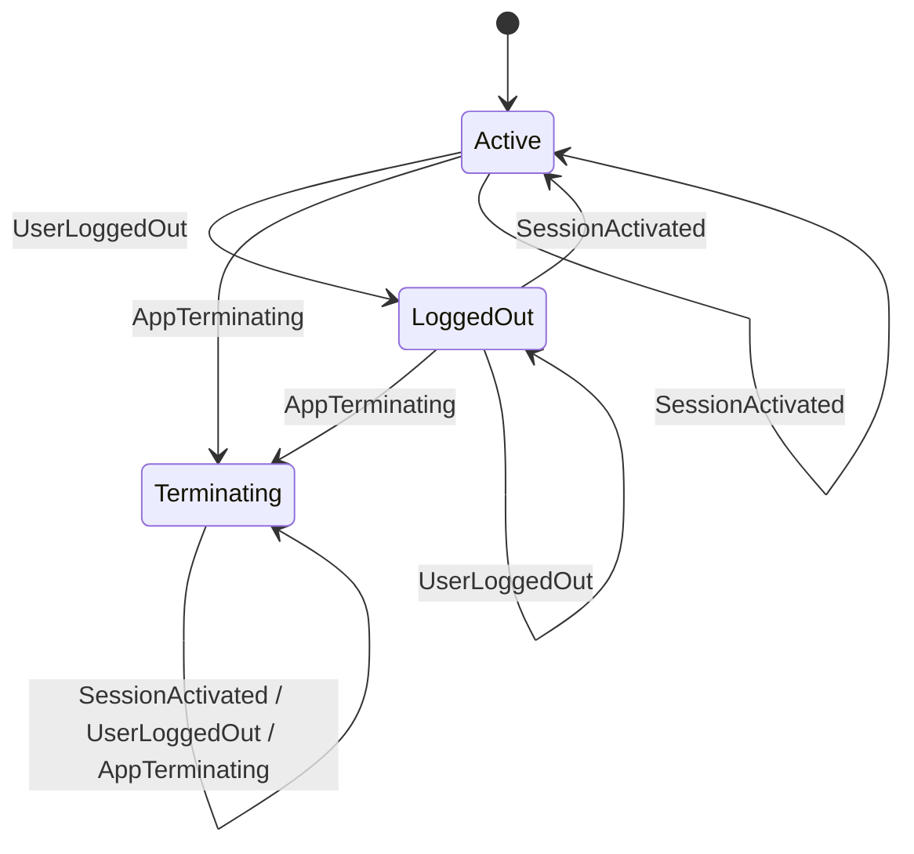

<!-- END GENERATED: recovery-mode-mermaid -->

<!-- BEGIN GENERATED: recovery-mode-table -->

| Current State | Input | Next State |
|---|---|---|
| Active | SessionActivated | Active |
| Active | UserLoggedOut | LoggedOut |
| Active | AppTerminating | Terminating |
| LoggedOut | SessionActivated | Active |
| LoggedOut | UserLoggedOut | LoggedOut |
| LoggedOut | AppTerminating | Terminating |
| Terminating | SessionActivated | Terminating |
| Terminating | UserLoggedOut | Terminating |
| Terminating | AppTerminating | Terminating |

<!-- END GENERATED: recovery-mode-table -->

`Terminating` is terminal for one supervisor lifetime. Cleanup reasons and
recovery-mode inputs are separate namespaces with an explicit mapping:
`CleanupRequested { reason: UserLogout }` drives the machine input
`UserLoggedOut`, and `reason: AppTerminating` (or `ShutdownRequested`)
drives `AppTerminating`. The `ManualReset` and `StaleConnectionSuspected`
reasons request cleanup without changing recovery mode. A later network fact
cannot reactivate recovery after logout. Only a successfully committed new
session emits `SessionActivated`.

#### App phase

<!-- BEGIN GENERATED: app-phase-mermaid -->

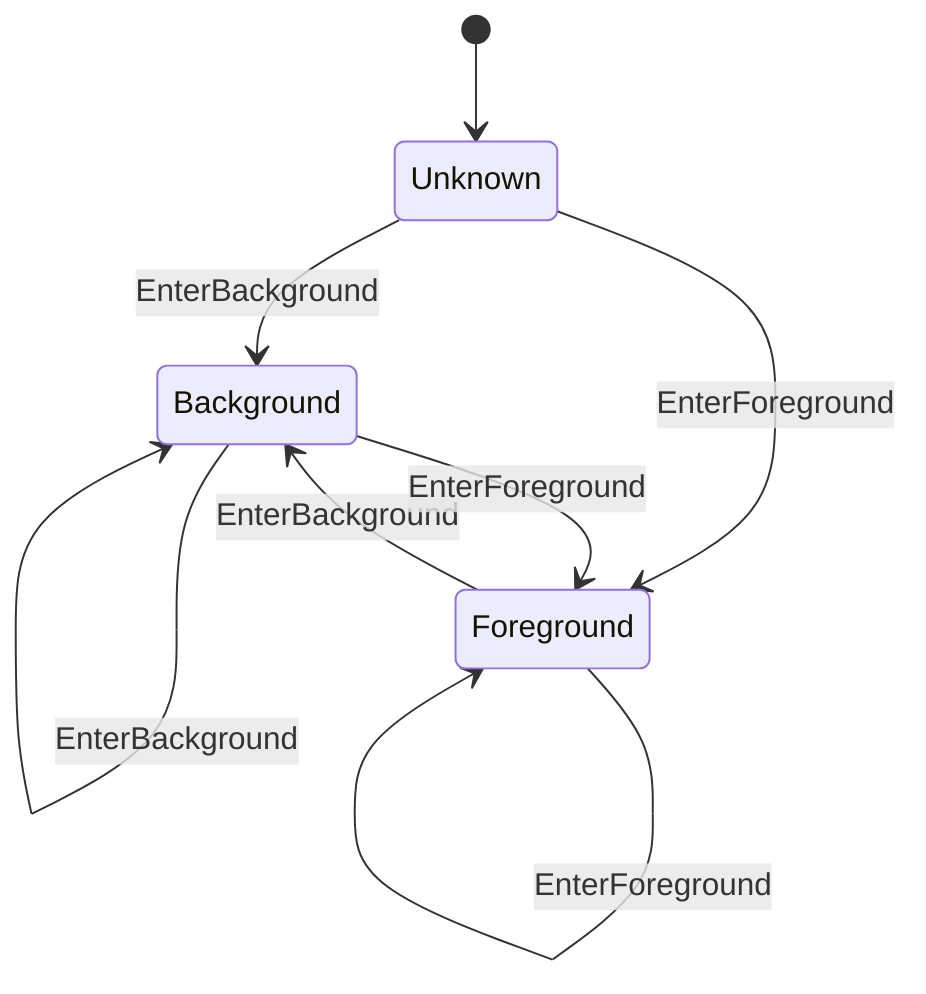

<!-- END GENERATED: app-phase-mermaid -->

<details>
<summary>YASM-generated app-phase transition table</summary>

<!-- BEGIN GENERATED: app-phase-table -->

| Current State | Input | Next State |
|---------------|-------|------------|
| Unknown | EnterForeground | Foreground |
| Unknown | EnterBackground | Background |
| Foreground | EnterForeground | Foreground |
| Foreground | EnterBackground | Background |
| Background | EnterForeground | Foreground |
| Background | EnterBackground | Background |

<!-- END GENERATED: app-phase-table -->

</details>

#### Network path

<!-- BEGIN GENERATED: network-path-mermaid -->

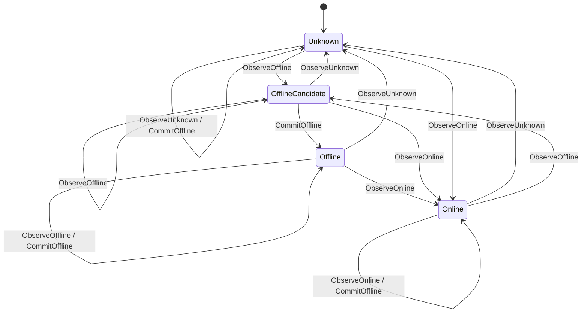

<!-- END GENERATED: network-path-mermaid -->

<details>
<summary>YASM-generated network-path transition table</summary>

<!-- BEGIN GENERATED: network-path-table -->

| Current State | Input | Next State |
|---------------|-------|------------|
| Unknown | ObserveUnknown | Unknown |
| Unknown | ObserveOnline | Online |
| Unknown | ObserveOffline | OfflineCandidate |
| Unknown | CommitOffline | Unknown |
| Online | ObserveUnknown | Unknown |
| Online | ObserveOnline | Online |
| Online | ObserveOffline | OfflineCandidate |
| Online | CommitOffline | Online |
| OfflineCandidate | ObserveUnknown | Unknown |
| OfflineCandidate | ObserveOnline | Online |
| OfflineCandidate | ObserveOffline | OfflineCandidate |
| OfflineCandidate | CommitOffline | Offline |
| Offline | ObserveUnknown | Unknown |
| Offline | ObserveOnline | Online |
| Offline | ObserveOffline | Offline |
| Offline | CommitOffline | Offline |

<!-- END GENERATED: network-path-table -->

</details>

#### Recovery intent

<!-- BEGIN GENERATED: recovery-intent-mermaid -->

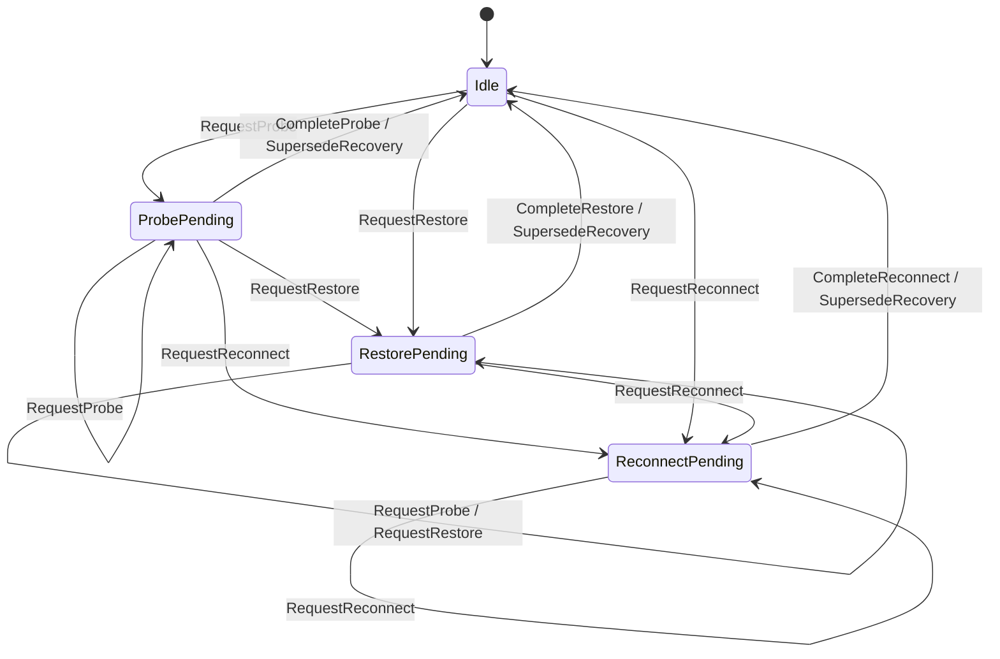

<!-- END GENERATED: recovery-intent-mermaid -->

<details>
<summary>Target YASM recovery-intent transition table</summary>

<!-- BEGIN GENERATED: recovery-intent-table -->

| Current State | Input | Next State |
|---------------|-------|------------|
| Idle | RequestProbe | ProbePending |
| Idle | RequestRestore | RestorePending |
| Idle | RequestReconnect | ReconnectPending |
| ProbePending | RequestProbe | ProbePending |
| ProbePending | RequestRestore | RestorePending |
| ProbePending | RequestReconnect | ReconnectPending |
| ProbePending | CompleteProbe | Idle |
| ProbePending | SupersedeRecovery | Idle |
| RestorePending | RequestProbe | RestorePending |
| RestorePending | RequestRestore | RestorePending |
| RestorePending | RequestReconnect | ReconnectPending |
| RestorePending | CompleteRestore | Idle |
| RestorePending | SupersedeRecovery | Idle |
| ReconnectPending | RequestProbe | ReconnectPending |
| ReconnectPending | RequestRestore | ReconnectPending |
| ReconnectPending | RequestReconnect | ReconnectPending |
| ReconnectPending | CompleteReconnect | Idle |
| ReconnectPending | SupersedeRecovery | Idle |

<!-- END GENERATED: recovery-intent-table -->

The supervisor validates the cutoff revision of a cleanup or session command
before dispatching `SupersedeRecovery`; the machine input itself is
unconditional. Stale completions are handled uniformly by the
completion-dispatch guard in the completion procedure; pending machines do
not carry defensive completion self-loops.

</details>

#### Cleanup work

<!-- BEGIN GENERATED: cleanup-work-mermaid -->

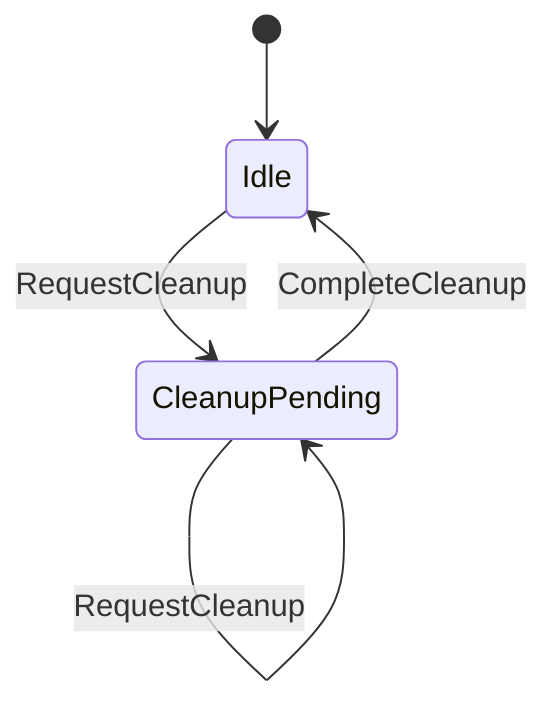

<!-- END GENERATED: cleanup-work-mermaid -->

<details>
<summary>Target YASM cleanup-work transition table</summary>

<!-- BEGIN GENERATED: cleanup-work-table -->

| Current State | Input | Next State |
|---------------|-------|------------|
| Idle | RequestCleanup | CleanupPending |
| CleanupPending | RequestCleanup | CleanupPending |
| CleanupPending | CompleteCleanup | Idle |

<!-- END GENERATED: cleanup-work-table -->

</details>

#### Retry gate

<!-- BEGIN GENERATED: retry-gate-mermaid -->

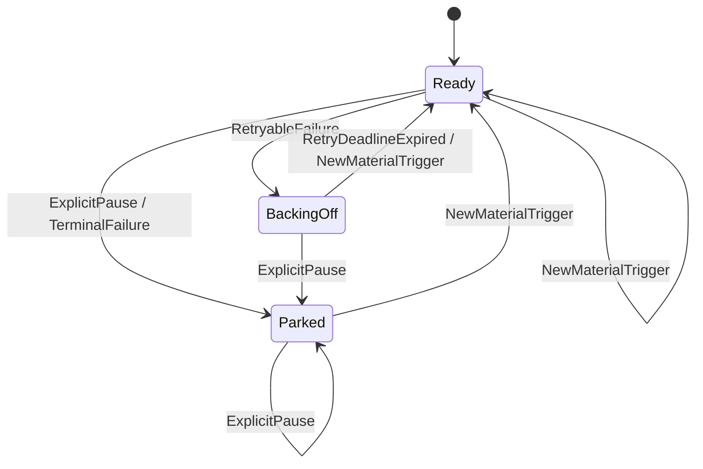

<!-- END GENERATED: retry-gate-mermaid -->

<details>
<summary>Retry-gate transition table</summary>

<!-- BEGIN GENERATED: retry-gate-table -->

| Current State | Input | Next State |
|---------------|-------|------------|
| Ready | RetryableFailure | BackingOff |
| Ready | TerminalFailure | Parked |
| Ready | ExplicitPause | Parked |
| Ready | NewMaterialTrigger | Ready |
| BackingOff | RetryDeadlineExpired | Ready |
| BackingOff | NewMaterialTrigger | Ready |
| BackingOff | ExplicitPause | Parked |
| Parked | NewMaterialTrigger | Ready |
| Parked | ExplicitPause | Parked |

<!-- END GENERATED: retry-gate-table -->

`Parked` is entered only through `TerminalFailure` (a precondition-family
verdict) or `ExplicitPause` (an explicit policy pause, which cancels any
armed deadline; its mask entry is cleared by the matching explicit resume).
Pausing an already parked record adds a resume entry to its release mask. A
trigger clears every entry it matches and the gate leaves `Parked` only
when the mask empties, so a resume alone cannot free a record whose
precondition entry remains. Failure inputs reach only `Ready` gates, as
specified under pending work.

</details>

#### Offline work

<!-- BEGIN GENERATED: offline-work-mermaid -->

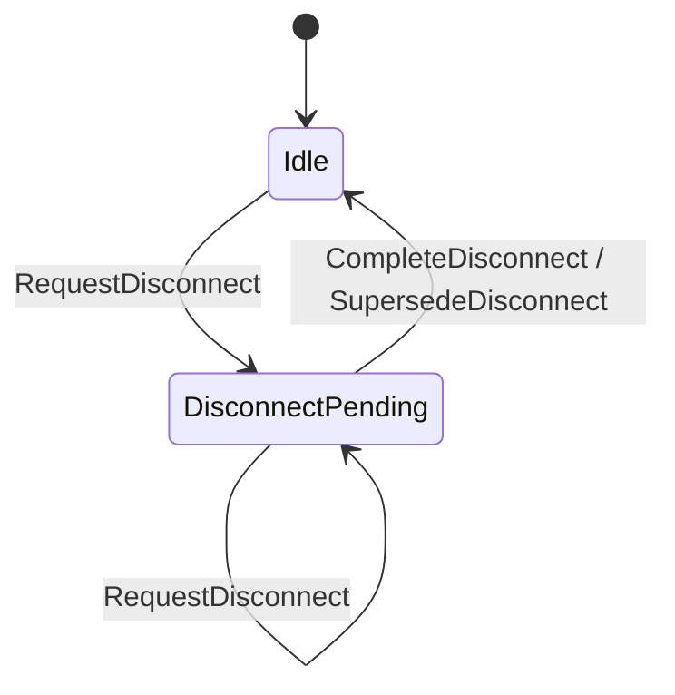

<!-- END GENERATED: offline-work-mermaid -->

<details>
<summary>YASM-generated offline-work transition table</summary>

<!-- BEGIN GENERATED: offline-work-table -->

| Current State | Input | Next State |
|---------------|-------|------------|
| Idle | RequestDisconnect | DisconnectPending |
| DisconnectPending | RequestDisconnect | DisconnectPending |
| DisconnectPending | CompleteDisconnect | Idle |
| DisconnectPending | SupersedeDisconnect | Idle |

<!-- END GENERATED: offline-work-table -->

Like the other pending machines, `OfflineWork` carries no defensive
completion self-loops: the supervisor's completion-dispatch guard and the
translation table's `if pending` conditions keep stale inputs away from the
machine.

</details>

#### Recovery execution

<!-- BEGIN GENERATED: recovery-execution-mermaid -->

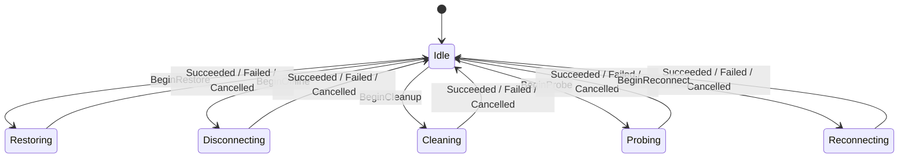

<!-- END GENERATED: recovery-execution-mermaid -->

<details>
<summary>Target YASM recovery-execution transition table</summary>

<!-- BEGIN GENERATED: recovery-execution-table -->

| Current State | Input | Next State |
|---------------|-------|------------|
| Idle | BeginOffline | Disconnecting |
| Idle | BeginProbe | Probing |
| Idle | BeginRestore | Restoring |
| Idle | BeginReconnect | Reconnecting |
| Idle | BeginCleanup | Cleaning |
| Disconnecting | Succeeded | Idle |
| Disconnecting | Failed | Idle |
| Disconnecting | Cancelled | Idle |
| Probing | Succeeded | Idle |
| Probing | Failed | Idle |
| Probing | Cancelled | Idle |
| Restoring | Succeeded | Idle |
| Restoring | Failed | Idle |
| Restoring | Cancelled | Idle |
| Reconnecting | Succeeded | Idle |
| Reconnecting | Failed | Idle |
| Reconnecting | Cancelled | Idle |
| Cleaning | Succeeded | Idle |
| Cleaning | Failed | Idle |
| Cleaning | Cancelled | Idle |

<!-- END GENERATED: recovery-execution-table -->

</details>

</details>

### Event model and ordering

Supervisor inputs are facts, commands, internal deadlines, or effect
completions. They request policy evaluation rather than assigning arbitrary
state:

```text
AppEnteredForeground
AppEnteredBackground
SessionActivated { session_generation }
NetworkSnapshot { source_epoch, sequence, observed_at, semantic_path }
RecoveryRequested { minimum: Probe | Restore | Reconnect, reason }
RecoveryPauseRequested { scope }
RecoveryResumeRequested { scope }
CleanupRequested { reason: UserLogout | AppTerminating | ManualReset
                         | StaleConnectionSuspected }
ConfigurationChanged { scope }
OfflineGraceExpired { candidate_id }
RetryDeadlineExpired { domain, work_revision, retry_id }
BootstrapPhaseDeadlineExpired
ShutdownDeadlineExpired { deadline_id }
TeardownDeadlineExpired { domain, deadline_id }
SignalingGenerationCommitted { generation, origin }
SignalingGenerationLost { generation, cause }
EffectCompleted {
  action_id,
  kind,
  policy_revision,
  outcome:
    Succeeded
    | CompletedWithResiduals { residuals }
    | Abandoned { residuals }
    | Failed { diagnosis: EffectDiagnosis }
    | Cancelled
    | Aborted { cause }
}
ShutdownRequested
```

`CleanupRequested.reason` is a closed enumeration; its values are a separate
namespace from machine inputs, with the mapping declared under recovery mode.
`CleanupRequested { reason: UserLogout }` drives both `CleanupWork` and the
`UserLoggedOut` input of `RecoveryMode` in one supervisor turn.
`ShutdownRequested` similarly enters `Terminating` and requests cleanup.
The public forced-reconnect command (`ReconnectReason` in the current API,
including its `StaleConnectionSuspected` value) is normalized to
`RecoveryRequested { minimum: Reconnect }`; the Reconnect contract already
includes old-generation teardown, so it creates no separate `CleanupWork`.
`RecoveryPauseRequested` sends `ExplicitPause` to the recovery-domain gates
in scope; `RecoveryResumeRequested` and `ConfigurationChanged` are release
triggers matched against recorded release masks.
`CompletedWithResiduals` and `Abandoned` are valid only for teardown kinds
(cleanup and confirmed offline disconnect) and are success-class outcomes:
both extinguish the obligation while reporting residual diagnostics. Every
derivation from an accepted input to machine inputs is defined exclusively
by the normative policy translation section below.

Resource owners receive a separate class of identity-bearing events:

```text
SignalingGenerationChanged { generation, state }
PeerStateChanged { peer, session_id, state }
WireSlotChanged { slot, generation, state }
```

These resource events do not mutate supervisor policy directly. Their owner
first validates generation or session identity, commits its retained state, and
then emits a normalized supervisor fact when policy must change. The
normalized signaling facts are `SignalingGenerationCommitted` and
`SignalingGenerationLost`; they enter the same supervisor queue and receive
an `event_id` like every other input. A normalized fact produced by a
running lifecycle effect carries that effect's `action_id` and captured
revision as `origin`, so translation recognizes it as the current effect's
covered output rather than external news. After a disconnect or cleanup
effect crosses its teardown commit boundary, delivery of the matching
`SignalingGenerationLost` is mandatory.

The supervisor processes one input at a time and assigns every dequeued input a
monotonic `event_id`. This order, not receive batching or task scheduling, is
the policy order.

`policy_revision` is the causality version of desired policy. A non-completion
input allocates the next revision only when it materially changes a fact, gate,
or pending-work domain. Structural duplicates allocate an `event_id` for
diagnostics but do not advance `policy_revision`. `EffectCompleted` never
creates a new revision; it can only acknowledge work covered by the revision
captured when that effect started.

`RetryDeadlineExpired` is accepted only when its domain, work revision, and
`retry_id` still match a `BackingOff` pending record. Acceptance advances the
policy revision, moves that record to `Ready`, updates its work revision, and
retains its consecutive-failure count before reconciling immediately. A stale
expiry is only logged. When eligibility is
temporarily lost, an implementation may stop the timer task but retains the
absolute deadline. On restored eligibility, an elapsed deadline is delivered
immediately; a future deadline is rearmed for only its remaining duration.

An external fact or command is a `NewMaterialTrigger` only when the policy for
that pending domain says it can change the failed attempt's outcome. Examples
include a new route, a committed session generation, foreground re-entry after
background made the failed work ineligible, or an explicit retry/reconnect
command. Acceptance
advances the policy revision, resets the consecutive failure count, updates
the work revision, and makes the work `Ready` — for a `Parked` record, only
when the trigger empties its release mask; otherwise it clears the matching
entries and the record stays `Parked`. A same-or-weaker command received
while matching work is already ready or running is coalesced; the same command
received while that work is backing off or parked is a deliberate retry and is
material. Repeating the same observed fact is never a material trigger.

Every network snapshot carries a source epoch and a sequence that is monotonic
within that epoch. The supervisor allocates a monotonically increasing
`source_epoch` when a platform path monitor is attached or restarted; the
monitor MUST NOT reset the sequence inside an existing epoch. Acceptance is
decided by `(epoch, sequence)` lexicographic comparison:

```text
epoch < current  -> stale, discarded
epoch = current  -> accepted only when sequence > the last accepted
                    sequence for the current epoch
epoch > current  -> accepted as the new incarnation; the last accepted
                    sequence resets
```

This prevents both stale replay and the "sequence reset makes every future
snapshot stale" failure. At any moment exactly one authoritative
path-monitor incarnation holds the current epoch. A binding whose monitor
silently restarts, keeps the old epoch, and resets its sequence violates
this contract; that is a binding defect, not a supervisor state gap.

Consecutive snapshots that are semantically equivalent are structurally
deduplicated. A structural duplicate does not advance policy revision or reset
a deadline.

Semantic equality concerns routing behavior, not object identity or incidental
metadata. A material route change while online is immediately visible to the
recovery policy and advances `policy_revision`.

`observed_at` is stamped in the supervisor's monotonic clock domain. A platform
timestamp may be converted only when the binding can prove a stable mapping to
that domain; otherwise supervisor enqueue time is used. The first accepted offline
observation sets `deadline = observed_at + offline_grace`; an already elapsed
deadline is immediately eligible. `observed_at` never reorders accepted inputs
and is never treated as evidence that an asynchronous operation completed.

### Policy translation

Reconciliation stage 1 is normative, not illustrative. One pure translation
function is the only place in the supervisor that decides:

- machine inputs and their application order;
- revision allocation and work-revision updates;
- retry, escalation, park, and abandon verdicts;
- cancellation and preemption requests;
- deadline arm and cancel instructions;
- pending-work derivation ahead of action selection.

```text
translate(view, input, now, config, entropy) -> Decision
```

`view` is the supervisor's complete policy snapshot: the discrete state of
every machine in this RFC plus the extended context those machines own —
pending records with their revisions, retry gates, and release masks, the
current `EffectContext`, the last accepted network snapshot and its
`(source_epoch, sequence)`, the offline-candidate identity and deadline, the
teardown obligation deadlines, the background-entry instant, the committed
session generation, and the live signaling generation. `now` is the
supervisor's monotonic dequeue instant.
`entropy` is the injected deterministic random state used only for jitter.
`Decision` is an ordered list of machine inputs together with their
revision, trigger, cancellation, and timer-inventory consequences.

The surrounding actor shell dequeues one input at a time, stamps `now`,
applies the returned machine inputs in order, executes the timer and
cancellation instructions through the audited facade, and starts the action
selected by stage 2. The shell adds no policy. Effects and resource owners
only report identity-validated observations and diagnoses; they never choose
`Retry`, `Restore`, `Reconnect`, or `Park`.

#### Typed effect diagnosis

An effect reports what it observed. `EffectCompleted.outcome` carries a
typed diagnosis, never a verdict:

```text
EffectDiagnosis
  PathUnreachable { stage }       no endpoint answered; nothing is known about the remote session
  Timeout { stage }               a bounded sub-operation exceeded its failure deadline
  Overloaded { retry_after }      the remote explicitly deferred the request
  ResourceExhausted { resource }  local sockets, memory, or quota were unavailable
  TransportImpaired { scopes }    the session generation is alive; the listed channels are not
  GenerationDead { generation }   the remote authoritatively no longer knows this generation
  AuthRejected { kind }           credentials expired, invalid, or revoked
  ConfigRejected { detail }       protocol, version, or capability mismatch
  InvariantViolation { detail }   an internal contract was broken
```

Diagnoses form three families:

- the **availability family** (`PathUnreachable`, `Timeout`, `Overloaded`,
  `ResourceExhausted`) is inconclusive: the same operation may succeed later
  without any policy change;
- the **conclusive family** (`TransportImpaired`, `GenerationDead`) is a
  verified statement about the current generation or its channels;
- the **precondition family** (`AuthRejected`, `ConfigRejected`,
  `InvariantViolation`) cannot improve by repeating the same operation.

A diagnosis that an effect kind cannot produce is an effect-contract
violation: it is recorded as an ERROR with the offending kind and diagnosis
and handled as that kind's `InvariantViolation` cell in the classification
table. It is never silently executed under a family default.

Probe reports its verdict through this vocabulary rather than a bespoke
result type: an intact path is `Succeeded`; a live generation with dead
channels is `Failed { TransportImpaired }`; an authoritative "generation
unknown" answer is `Failed { GenerationDead }`; no answer at all is
`Failed { PathUnreachable }`.

#### Failure classification and escalation

Classification maps `(effect kind, diagnosis, context)` to exactly one
verdict:

```text
Verdict
  Retry                  RetryableFailure to this record's gate; one capped, jittered deadline
  Escalate { to }        promote the pending intent to `to` via its normative transition
  Park { release_mask }  TerminalFailure; the mask records park-cause entries and their clearing triggers
  Abandon                teardown kinds only: extinguish the obligation now with `Abandoned` residuals
```

`Abandon` takes the same enumerated completion path as a bounded `Abandoned`
outcome: the teardown obligation is extinguished at once with recorded
residual diagnostics. Under `Terminating` the supervisor then ends when no
work remains or at the shutdown overall deadline, whichever comes first.

Escalation semantics are fixed:

- only the current pending record can be escalated; if the record was
  already superseded by cleanup or newer facts, the old completion releases
  the execution slot and nothing else;
- `EffectCompleted` never allocates a revision, so the promoted record
  **retains the work revision of the record it replaces**: escalation is a
  strength increase of the same causal obligation, not a new external
  command. An explicit cleanup issued after the original intent therefore
  still supersedes the escalated intent under revision ordering. An external
  `RecoveryRequested` is the only path that allocates a new revision for
  stronger work;
- promotion creates a fresh `Ready` gate with zero failures, and the
  completion input of the replaced kind is not dispatched, both as already
  specified under reconciliation.

The classification table is normative default policy, keyed by kind,
diagnosis, and context. Within each effect-kind group, rows are evaluated
top to bottom and the first matching row applies; the final row of each
group is its catch-all, so every reachable `(diagnosis, context)` cell is
covered. Family membership sets the default shape, but it is not the whole
rule: an availability-family diagnosis may escalate when context makes
stronger work the plausible remedy. A deployment may tighten a `Retry` cell
but MUST NOT reclassify a precondition-family diagnosis as `Retry`:

<!-- BEGIN GENERATED: classification-table -->

| Effect kind | Diagnosis | Context / threshold | Verdict |
|---|---|---|---|
| Probe | `TransportImpaired` | — | Escalate { Restore } |
| Probe | `GenerationDead` | — | Escalate { Reconnect } |
| Probe | `Timeout` | at or above `escalate_after(Probe)` while path stays `Online` | Escalate { Reconnect } |
| Probe | precondition family | — | Park, per-diagnosis mask |
| Probe | availability family | — | Retry |
| Restore | `GenerationDead` | — | Escalate { Reconnect } |
| Restore | `TransportImpaired` | at or above `escalate_after = 2` | Escalate { Reconnect } |
| Restore | `Timeout` | at or above `escalate_after(Restore)` while path stays `Online` | Escalate { Reconnect } |
| Restore | precondition family | — | Park, per-diagnosis mask |
| Restore | `TransportImpaired` or availability family | — | Retry |
| Reconnect | precondition family | — | Park, per-diagnosis mask |
| Reconnect | availability and conclusive families | — | Retry, sustained capped backoff |
| Disconnect, Cleanup | `InvariantViolation` | mode `Terminating` | Abandon |
| Disconnect, Cleanup | `InvariantViolation` | otherwise | Park { ExplicitCommand } (deliberate fail-closed) |
| Disconnect, Cleanup | availability family | at or after the obligation's overall teardown deadline | Abandon |
| Disconnect, Cleanup | availability family | otherwise (inside the obligation's overall teardown deadline) | Retry, short backoff |

<!-- END GENERATED: classification-table -->

Each effect kind produces a declared diagnosis set; anything outside it is
an effect-contract violation handled as that kind's `InvariantViolation`
cell:

| Effect kind | Producible diagnoses |
|---|---|
| Probe, Restore, Reconnect | all nine |
| Confirmed offline disconnect, Cleanup | availability family; `InvariantViolation` |

The overall teardown deadline is obligation-level: it is armed once when the
teardown obligation is created, `Retry` never resets it, and a running
teardown effect inherits its remaining budget. In-effect expiry completes
the effect with a success-class residual outcome as specified under cleanup
bounded completion; expiry while the record is backing off is delivered as
`TeardownDeadlineExpired` and extinguishes the obligation with `Abandoned`
residuals. A teardown failure whose completion is processed at or after the
deadline is ruled by the at-or-after classification row, so an expiry
logged while the effect was still running needs no redelivery. Reaching the
deadline is therefore never a diagnosis and yields no verdict of its own.

The escalation rationale is uniform. A conclusive diagnosis escalates
immediately when it proves the current strength targets the wrong layer:
Probe repairs nothing, so any conclusive defect exceeds it; Restore cannot
replace a dead generation, so `GenerationDead` exceeds it. A diagnosis
retries at the same strength, with a threshold, when the current strength
should have worked. An availability diagnosis escalates only where context
justifies it — repeated probe or restore timeouts on a path that stays
`Online` suggest the generation itself is gone, and Reconnect can fix that;
`PathUnreachable` never escalates because no stronger action reaches a path
that answers nothing.

Reconnect is the escalation chain's endpoint and has no exhaustion: for
availability- and conclusive-family failures it MUST remain in sustained
capped backoff, never `Parked`.

Per park cause, the mask entry and its clearing triggers are:

| Park-cause entry | Clearing triggers |
|---|---|
| `AuthRejected` | { `SessionActivated`, explicit command } |
| `ConfigRejected` | { `ConfigurationChanged`, explicit command } |
| `InvariantViolation` | { explicit command } |
| `ExplicitPause` | { matching explicit resume } |

A `NewMaterialTrigger` clears every mask entry it matches; the record is
freed only when no entries remain. A new route or
`SignalingGenerationCommitted` never clears a precondition-family entry.

#### Backoff arithmetic

A `Retry` verdict computes one absolute deadline:

```text
attempt  = consecutive failures of this record, starting at 1
exponent = min(attempt - 1, exponent_cap(kind))       saturating
delay    = min(base_delay(kind) * 2^exponent, max_delay(kind))
jitter   = sample in [1 - jitter_fraction(kind), 1]
deadline = now + max(delay * jitter, retry_after)     retry_after = 0 unless
                                                      Overloaded applies
```

The `retry_after` floor is applied after jitter so that jitter can never
move a deadline below it.

`retry_after` is a floor the client MUST NOT cross early; it is honored even
when it exceeds `max_delay(kind)`. Once `delay` reaches `max_delay`,
sustained kinds continue retrying at `max_delay` indefinitely. The jitter
factor MUST be sampled exactly once per newly armed deadline from the
injected deterministic entropy, whose stream is part of supervisor state and
is seeded per supervisor instance so that clients and sessions de-correlate.
A duplicate or stale input consumes no entropy and MUST NOT resample,
extend the deadline, or reset the attempt count. Backoff deadlines are
`Failure backoff` entries in the audited timer inventory.

#### Translation table

The following table is normative and exhaustive for supervisor inputs. Rows
are grouped by input; within a group they are evaluated top to bottom and
the first matching row applies. A row marked *additive* applies in addition
to the matched row of its group. Unlisted combinations emit nothing beyond
an `event_id` and a log record. "Advances" means the input allocates the
next `policy_revision` under the existing material-change rule.

<!-- BEGIN GENERATED: translation-table -->

| Input | Preconditions | Fact and gate inputs | Pending-work derivation | Trigger | Revision |
|---|---|---|---|---|---|
| `AppEnteredForeground` | mode `LoggedOut`/`Terminating` | `AppPhase: EnterForeground` | none | No | Advances |
| `AppEnteredForeground` | phase `Background`; `d = now - background_entered_at` | `AppPhase: EnterForeground` | `RecoveryIntent: RequestProbe` when `d < background_reconnect_after`, else `RequestReconnect` | Yes: wakes records backing off after a phase-ineligible failure; parks are released only by their masks | Advances |
| `AppEnteredForeground` | phase `Unknown` (first authoritative phase) | `AppPhase: EnterForeground` | none: no background interval exists | Yes: wakes records backing off solely by phase ineligibility | Advances |
| `AppEnteredForeground` | phase already `Foreground` | self-loop | none | No | None |
| `AppEnteredBackground` | phase not `Background` | `AppPhase: EnterBackground`; record `background_entered_at = now` | none; a platform capability policy may request effect cancellation with a recorded reason | No | Advances |
| `AppEnteredBackground` | phase already `Background` | self-loop | none | No | None |
| `SessionActivated { g }` | `g` newer than the committed generation; this input allocates revision `r` | `RecoveryMode: SessionActivated`; `SupersedeRecovery` for old-session intent with revision `< r` (recorded as session supersession) | then `RecoveryIntent: RequestRestore` at `r` when no live signaling generation exists outside a pending or running teardown scope — a generation circled by pending teardown does not count as live, so the new session's obligation is derived even while an older cleanup runs and survives it | Yes: clears `SessionActivated` mask entries; material for recovery domains | Advances |
| `SessionActivated { g }` | `g` not newer | none | none | No | None |
| `NetworkSnapshot` -> `Online` | accepted; prior path not `Online` | `NetworkPath: ObserveOnline`; cancel candidate deadline | `OfflineWork: SupersedeDisconnect` if pending; cancel a running disconnect; when mode `Active` and intent `Idle`: `RequestProbe` if a live signaling generation exists, else `RequestRestore` | Yes: recovery domains (new route) | Advances |
| `NetworkSnapshot` `Online` -> `Online` | accepted; material route change | self-loop | none | Yes: recovery domains | Advances |
| `NetworkSnapshot` -> offline | accepted; prior path `Unknown` or `Online` | `NetworkPath: ObserveOffline`; arm the candidate deadline | none | No | Advances |
| `NetworkSnapshot` -> unknown | accepted; any prior path | `NetworkPath: ObserveUnknown`; invalidate candidate | `OfflineWork: SupersedeDisconnect` if pending; cancel a running disconnect | No | Advances |
| `NetworkSnapshot` | stale `(epoch, sequence)` or structural duplicate | none (discarded) | none | No | None |
| `OfflineGraceExpired { candidate_id }` | candidate current | `NetworkPath: CommitOffline` | `OfflineWork: RequestDisconnect` | No | Advances |
| `OfflineGraceExpired` | candidate stale | none (logged) | none | No | None |
| `RetryDeadlineExpired` | domain, work revision, `retry_id` match a `BackingOff` record | gate -> `Ready`; attempt count retained | none | n/a | Advances (existing rule) |
| `RetryDeadlineExpired` | mismatch | none (logged) | none | No | None |
| `RecoveryRequested { minimum: m }` | mode `LoggedOut`/`Terminating` | none | none; structured `Rejected { mode, reason }` on the status stream | No | None |
| `RecoveryRequested { m }` | intent `Idle` or pending weaker than `m` | none | `RecoveryIntent: Request{m}`; fresh `Ready` gate | n/a | Advances |
| `RecoveryRequested { m }` | pending `>= m`, gate `Ready` or effect running | none (coalesced) | none | No | None |
| `RecoveryRequested { m }` | pending `>= m`, gate `BackingOff` | none | none | Yes: deliberate retry of the stronger work; gate -> `Ready`, failure count reset | Advances |
| `RecoveryRequested { m }` | pending `>= m`, gate `Parked`, command clears at least one remaining mask entry | none | none | Yes: clears matching entries; when the mask empties, gate -> `Ready` with failure count reset | Advances |
| `RecoveryRequested { m }` | pending `>= m`, gate `Parked`, command clears no remaining entry | none | none; typed rejection on the status stream | No | None |
| `RecoveryPauseRequested { scope }` | a scoped record's effect is in flight | request cancellation (reason: pause); `ExplicitPause` is applied when the terminal completion is processed, so no input moves the gate while the effect runs | none | No | Advances |
| `RecoveryPauseRequested { scope }` | scoped recovery records exist, none executing | `ExplicitPause` to each scoped gate; cancel armed deadlines | none | No | Advances |
| `RecoveryResumeRequested { scope }` | paused records in scope | none | none | Yes: clears `ExplicitPause` mask entries; gates whose masks empty -> `Ready` | Advances |
| `ConfigurationChanged { scope }` | any | none | none | Yes: clears `ConfigurationChanged` mask entries; material for recovery domains | Advances |
| `CleanupRequested { UserLogout }` | any | `RecoveryMode: UserLoggedOut`; `CleanupWork: RequestCleanup` at revision `r` | `SupersedeRecovery` for intent with revision `<= r`; supersede `OfflineWork` `<= r`; preempt a running non-cleanup effect | No | Advances |
| `CleanupRequested { AppTerminating }` and `ShutdownRequested` | any | `RecoveryMode: AppTerminating`; `RequestCleanup` at `r`; arm the shutdown overall deadline | same supersession and preemption | No | Advances |
| `CleanupRequested { ManualReset }` | any | `RequestCleanup` at `r`; mode unchanged | same supersession and preemption; no rebuild is derived | No | Advances |
| `CleanupRequested { StaleConnectionSuspected }` | any | `RequestCleanup` at `r`; mode unchanged | same supersession and preemption; cleanup-only, no rebuild is derived | No | Advances |
| any `CleanupRequested` | *additive*: path `OfflineCandidate` | invalidate the candidate deadline; commit the path for policy purposes | `CleanupWork` owns teardown; no duplicate `OfflineWork` | — | — |
| `BootstrapPhaseDeadlineExpired` | profile `Gated`, phase still `Unknown` | none | none; ERROR diagnostic and status record; eligibility stays gated | No | None |
| `ShutdownDeadlineExpired { deadline_id }` | mode `Terminating`; `deadline_id` matches the armed shutdown deadline | abort or detach all remaining work; record `Abandoned` residuals | none: the supervisor ends unconditionally | No | None |
| `ShutdownDeadlineExpired` | stale `deadline_id` | none (logged) | none | No | None |
| `TeardownDeadlineExpired { domain, deadline_id }` | matching teardown obligation exists with gate `BackingOff` | none | extinguish the obligation with `Abandoned` residuals via its enumerated completion path | No | Advances |
| `TeardownDeadlineExpired` | stale, or the teardown effect is running (in-effect expiry applies instead) | none (logged) | none | No | None |
| `SignalingGenerationLost { g, cause }` | `g` stale | none (logged) | none | No | None |
| `SignalingGenerationLost { g, cause }` | `g` live; mode `Active`; `CleanupWork` `Idle` and no cleanup effect running | record signaling as not live | `RecoveryIntent: RequestRestore` | Yes: material for recovery domains | Advances |
| `SignalingGenerationLost { g, cause }` | `g` live; otherwise (cleanup pending or running, or mode not `Active`) | record signaling as not live; any teardown is absorbed by cleanup | none | No | Advances |
| `SignalingGenerationCommitted { g, origin }` | `origin` matches the current `EffectContext` | record live generation | none: this is the current effect's covered output; it does not update any pending record's work revision | No | Advances |
| `SignalingGenerationCommitted { g, origin }` | external; `g` newer than the recorded live generation | record live generation | none | Yes: material for recovery domains | Advances |
| `EffectCompleted` | `action_id`, `kind`, `policy_revision` match | completion procedure; failures ruled by the classification table | per verdict | park releases by mask only | Never allocates |
| `EffectCompleted` | stale or mismatched | none (logged, discarded) | none | No | None |

<!-- END GENERATED: translation-table -->

`background_reconnect_after` is configuration with a documented default of
60 seconds; like the offline grace interval, it is product policy measured
by telemetry, not part of the state model. Rows never bypass the composite
decision table: derivation records obligations, and eligibility, ordering,
and single-flight admission remain stage 2 concerns.

The `RecoveryRequested` rejection row is deliberate: retaining a recovery
command across `LoggedOut` would let a pre-logout command start I/O after an
unrelated later login. A command that must survive a session change is
re-issued after `SessionActivated` — and the `SessionActivated` row itself
derives restoration at a post-cleanup revision, so replacing a session while
an old cleanup is pending cannot lose the new session's recovery obligation:
the cleanup merely shadows it until teardown completes.

`minimum` means the caller accepts stronger work than it named; it never
bypasses a precondition-family release policy.

#### Determinism and verification

`translate` is a pure function of `(view, input, now, config, entropy)`. It
performs no I/O, reads no ambient clock, and draws no ambient randomness;
identical arguments produce an identical, byte-comparable `Decision`. The
reference reducer of verification level 2 MUST exercise every row of the
translation table and every cell of the classification table, including
threshold escalation, the sustained-backoff cap, park-release masking, and
the order-independence of `SignalingGenerationLost` and disconnect
completion.

### Reconciliation and action priority

Handling an input has three stages:

1. translate the input through the normative policy translation above and
   apply the resulting machine inputs in order;
2. derive at most one executable action from the combined policy snapshot;
3. if `Execution` is `Idle`, start that action in a separate task and record its
   `EffectContext`.

Action names have these contracts:

| Action | Contract on success |
|---|---|
| Probe | Verify the current signaling and transport path without replacing a healthy generation. |
| Restore | Establish required missing connectivity while retaining healthy current resources; success includes the Probe guarantee. |
| Reconnect | Invalidate the relevant old generation, tear it down, and restore a new one; success includes the Restore and Probe guarantees. |
| Confirmed offline disconnect | Stop path-dependent activity after offline policy commits, bounded by one overall teardown deadline; it does not erase future recovery intent. |
| Cleanup | Tear down scoped connection resources without restoring them, bounded by one overall teardown deadline; its reason may change recovery mode. |

Teardown actions carry the generation scope they tear down. A teardown
scope MUST NOT include a generation committed after the teardown began: an
old cleanup or disconnect can never destroy a newly committed signaling or
session generation.

Action selection uses this priority:

```text
Cleanup > confirmed offline disconnect > reconnect > restore > probe
```

Recovery intents have one ordered strength:

```text
Probe < Restore < Reconnect
```

A stronger recovery request replaces a weaker pending request because the
stronger effect semantically covers it. A weaker request cannot downgrade a
stronger pending request. This does not lose intent because every stronger
action includes the success guarantee of the weaker one. Promotion happens
on an external stronger request, which allocates a new revision, or on a
classification `Escalate` verdict, which retains the causal work revision as
specified under policy translation. Either way, promotion creates a new
`Ready` retry gate with zero failures; a completion from the replaced
attempt cannot mutate it.

Cleanup is deliberately not in this order: cleanup-only does not satisfy a
request to restore connectivity. Cleanup is held in `CleanupWork`, and
confirmed path disconnect is held in `OfflineWork`, because teardown and future
recovery intent may coexist.

Each pending-work domain stores the revision that most recently required it.
There is exactly one acknowledgement predicate: a successful effect
acknowledges an obligation only when the obligation's work revision is not
newer than the effect's captured `policy_revision` and the obligation's
required impact is covered by the completed effect's kind. Work from a newer
revision is never covered.

A cleanup-only command explicitly supersedes recovery intent whose revision is
not newer than the cleanup command; it does not semantically "cover" that
intent. Later facts receive newer revisions and remain pending. This revision
ordering replaces correctness based on receive-batch timing: batching may be
used for throughput, but it is not a policy boundary.

On `CleanupRequested { reason }`, the supervisor atomically allocates revision
`r`, records `CleanupWork::CleanupPending(r)`, validates the cutoff, and
dispatches `SupersedeRecovery` to recovery intent with revision `<= r` and
`SupersedeDisconnect` to offline work with revision `<= r`. `UserLogout`
additionally enters `LoggedOut`; `AppTerminating` enters `Terminating`; other
cleanup reasons leave `RecoveryMode` unchanged. A later fact has revision
`> r` and therefore cannot be cleared by completion of that cleanup.

#### Obligation extinguishment

Each pending-work domain ends only through its enumerated extinguishment
paths, and every extinguishment records the path taken and the revision:

- `RecoveryIntent` (intent-bearing): success acknowledgement by a covering
  effect; subsumption by a stronger recovery obligation (promotion or
  escalation); explicit revision-ordered cleanup or session supersession
  via `SupersedeRecovery`; supervisor lifetime end.
- `OfflineWork` (fact-derived): coverage by a completed disconnect or
  cleanup, including residual and deadline-driven `Abandoned` outcomes;
  reversal of the defining `Offline` fact via `SupersedeDisconnect`;
  supervisor lifetime end.
- `CleanupWork` (intent-bearing): logical cleanup completion, including
  `CompletedWithResiduals` and bounded `Abandoned`; supervisor lifetime end.

A fact reversal extinguishes only the fact-derived domain it defines. Facts
never directly extinguish intent-bearing obligations: an `Online`
observation cannot prove that recovery is no longer required.

`Background` gates active probe, restore, and reconnect work. It does not turn
a healthy connection into a disconnected one, erase pending intent, or block
explicit cleanup. Only a real `Background -> Foreground` transition may derive
foreground recovery work. A duplicate `Foreground` observation is a self-loop
and cannot create a second connection attempt. The supervisor records
background entry in its own monotonic clock domain; the real foreground
transition selects Probe or Reconnect from that duration and configured policy
rather than trusting a repeated caller-supplied duration.

Entering `Background` does not by itself cancel an effect already in flight.
If a platform capability policy requires cancellation because execution cannot
continue in the background, that policy records the cancellation reason and
preserves the pending work. Foreground re-entry then makes the work eligible
without inventing a new settle delay.

`LoggedOut` and `Terminating` gate every automatic probe, restore, and reconnect
regardless of app phase. Required cleanup remains eligible. `SessionActivated`
returns `LoggedOut` to `Active` only after the new session generation is
authoritatively committed.

#### Composite action decision

The following table is evaluated top to bottom when `Execution` is `Idle`.
`Eligible` means recovery mode is `Active` and the lifecycle profile grants
phase eligibility: always under `Ungated`; only `Foreground` under `Gated`.
`Ready` means the selected pending record's `RetryGate` is `Ready`. A higher
priority pending domain shadows every lower domain even while backing off or
parked; for example, failed cleanup cannot be bypassed by starting reconnect.
The shadow is bounded with one deliberate exception: cleanup and disconnect
complete within their overall teardown deadline, so an availability-class
teardown failure cannot shadow recovery indefinitely; only the fail-closed
`InvariantViolation` park outside `Terminating` shadows until its explicit
command releases it.

<!-- BEGIN GENERATED: composite-decision-table -->

| Recovery mode / app phase | Path | Pending work | Selected action |
|---|---|---|---|
| Any | Any | `CleanupPending`, not Ready | None |
| Any | Any | `CleanupPending`, Ready | Cleanup |
| Any | `Offline` | `DisconnectPending`, not Ready | None |
| Any | `Offline` | `DisconnectPending`, Ready | Confirmed offline disconnect |
| `LoggedOut` or `Terminating` | Any | Any recovery intent | None |
| `Active`, phase not eligible under the profile | Any | Probe, restore, or reconnect | None |
| Eligible | `OfflineCandidate` or `Offline` | Probe, restore, or reconnect | None |
| Eligible | `Unknown` or `Online` | Recovery intent, not Ready | None |
| Eligible | `Unknown` or `Online` | `ReconnectPending`, Ready | Reconnect |
| Eligible | `Unknown` or `Online` | `RestorePending`, Ready | Restore |
| Eligible | `Unknown` or `Online` | `ProbePending`, Ready | Probe |
| Any | Any | No pending work | None |
| Any | Any | any other combination | None; logged as an invariant violation |

<!-- END GENERATED: composite-decision-table -->

The defensive final row exists so that a fall-through is observable instead
of silent. One such guarded combination is normative:
`DisconnectPending` implies `NetworkPath == Offline` at reconciliation
entry — any input that moves the path off `Offline` dispatches
`SupersedeDisconnect` in the same supervisor turn.

Explicit cleanup does not wait for offline hysteresis. A terminating or logout
cleanup is still eligible because it reduces resources rather than restoring
them.

#### Derived send policy

Outbound path admission is a read-only projection of authoritative policy, not
another independently mutable flag. The projection is computed from three
authoritative fields — `RecoveryMode`, `NetworkPath`, and the teardown
domains (`CleanupWork`, `OfflineWork`, and a running teardown effect) — by
evaluating these rows top to bottom; the first match applies, so the rows
are mutually exclusive and the strictest wins:

<!-- BEGIN GENERATED: send-projection-table -->

| Projection | Condition | Behavior |
|---|---|---|
| `Blocked` | Recovery mode is not `Active`, or cleanup or offline teardown is pending or running, or path is `Offline` | New outbound work fails fast or waits through an explicit caller deadline; it never waits on the 400 ms candidate timer by accident. |
| `ExistingOnly` | Mode `Active`, path `OfflineCandidate`, no teardown work | Existing committed sessions may send; new negotiation does not start. |
| `Normal` | Mode `Active`, path `Unknown` or `Online`, no teardown work | Existing sends and new connection creation may proceed. |

<!-- END GENERATED: send-projection-table -->

A logged-out or terminating supervisor therefore always projects `Blocked`;
it can never fall into `Normal` or `ExistingOnly` through a path condition.
Reconnect and peer-recovery effects may impose their own destination-scoped
gate, but broadcasts are never the authoritative source of this projection.

#### Effect preemption

The supervisor remains responsive while an effect task runs. Same or weaker
work is coalesced. A stronger requirement or policy reversal requests
cancellation according to this table:

| New policy condition | Running work it preempts |
|---|---|
| Cleanup | Disconnect, probe, restore, reconnect |
| Path returns to `Unknown` or `Online` | Confirmed offline disconnect |
| Confirmed offline disconnect | Probe, restore, reconnect |
| Reconnect | Probe, restore |
| Restore | Probe |
| Probe or same/weaker work | None |

Preemption cancels the running task but does not directly mutate its execution
state. Before requesting cancellation, the authoritative resource owner
invalidates any commit right that the old effect must no longer exercise. The
task, its owner guard, or a join monitor then reports a terminal
`EffectCompleted` outcome. A stronger effect starts after the single-flight
slot returns to `Idle`; immediate generation invalidation, not cooperative
cancellation speed, is the correctness boundary.

A path reversal sends `SupersedeDisconnect` to `OfflineWork` and requests
cancellation of a running disconnect. The disconnect effect checks cancellation
before each destructive commit boundary. If teardown already crossed such a
boundary, the recovered path derives Restore immediately after the old slot is
released; it does not wait for a polling tick or another path event. Explicit
Cleanup is not reversed by a path observation.

#### Completion and acknowledgement

An effect completion is accepted only when `action_id`, `kind`, and captured
`policy_revision` all match the current `EffectContext`. A stale or malformed
completion is logged and discarded without mutating policy state. For the
current action:

1. return `Execution` to `Idle`;
2. locate the pending domain and revision that the effect attempted;
3. on a success-class outcome (`Succeeded`, `CompletedWithResiduals`, or a
   bounded `Abandoned`), acknowledge only work whose revision is no newer
   than the effect's captured `policy_revision` and whose required impact is
   covered by the completed effect — for a peer-scoped recovery effect,
   impact coverage is defined by the per-peer coverage contract below;
   residuals are recorded as diagnostics, and a teardown completion
   additionally clears the live-signaling record for every generation in
   its teardown scope;
4. on `Failed { diagnosis }` of still-current work, apply the classification
   verdict for `(kind, diagnosis, context)`: `Retry` increments the attempt
   and enters `BackingOff` with one capped, jittered absolute deadline;
   `Escalate` promotes the intent, retaining its work revision, with a fresh
   `Ready` gate; `Park` enters `Parked` and records the release mask;
   `Abandon` extinguishes the teardown obligation at once with `Abandoned`
   residuals, per the verdict definition;
5. on supervisor-requested cancellation, retain work without incrementing its
   attempt; when the recorded cancel reason is a pause, apply the deferred
   `ExplicitPause` to the retained record in the same turn, before
   reconciliation; for other reasons the gate is unchanged, and changed
   facts or stronger pending work make the cancelled action ineligible, so
   it cannot immediately restart unchanged;
6. on `Aborted { cause }`, rule by cause rather than a blanket class:
   a recorded supervisor cancellation is handled as step 5; a panic or
   effect-contract violation is classified as `InvariantViolation` and takes
   that diagnosis's fail-safe verdict immediately; a runtime shutdown takes
   the `Terminating` bounded-teardown path; an unclassified abort is an
   implementation failure, recorded as an ERROR and handled as that kind's
   `InvariantViolation` cell;
7. preserve newer or stronger pending work, then reconcile immediately.

A recorded pause cancel reason is honored on every terminal outcome that
retains or promotes the record: the deferred `ExplicitPause` is applied to
the surviving record after the applicable step — after the step 4 verdict
for `Failed`, in step 5 for `Cancelled`, per cause for `Aborted` — and
before reconciliation.

A consecutive-abort circuit breaker MAY additionally park a record whose
aborts repeat, but it never masks a cause that is already classifiable as a
panic or invariant failure.

Immediate reconciliation may start other eligible work. It cannot restart the
same failed work because that record is no longer `Ready`. A completion for
work that has already been superseded releases only the execution slot; it
does not create a retry gate or alter the replacement's attempt count.

`Cancelled` is valid only when `EffectContext.cancel_reason` records a
supervisor cancellation request. A task that ends as cancelled without that
record is normalized to `Aborted`; this prevents an unexplained cancellation
from bypassing failure policy.

The outcome-to-machine mapping is one table rather than rules scattered at
call sites:

| Outcome | Execution input | Gate / policy handling |
|---|---|---|
| `Succeeded` | `Succeeded` | acknowledge covered obligations (step 3) |
| `CompletedWithResiduals` | `Succeeded` | acknowledge; record residual diagnostics |
| `Abandoned` (bounded teardown) | `Succeeded` | acknowledge; record residual diagnostics |
| `Failed { diagnosis }` | `Failed` | classification verdict (step 4) |
| `Cancelled` with recorded reason | `Cancelled` | retain work; gate unchanged, except a recorded pause reason applies its deferred `ExplicitPause` in the same turn (step 5) |
| `Aborted { cause }` | `Cancelled` | ruled by cause (step 6) |

Acknowledgement domains are explicit:

- Probe, Restore, and Reconnect acknowledge only `RecoveryIntent`, according to
  `Probe < Restore < Reconnect`;
- confirmed offline disconnect acknowledges only `OfflineWork`;
- Cleanup acknowledges matching `CleanupWork` and may supersede older
  `OfflineWork` because the physical teardown covers it;
- Cleanup never acknowledges a later recovery intent.

When Restore or Reconnect is peer-scoped, acknowledging `RecoveryIntent`
additionally requires the per-peer coverage contract defined below.

The supervisor dispatches a YASM completion input only when the corresponding
pending domain and covered revision still match. For example, `CompleteProbe`
is not sent to a `ReconnectPending` recovery machine after intent promotion.
The completion still releases its matching execution slot, but it cannot cause
an invalid policy transition.

For example, if Cleanup is requested while Probe runs, Probe completion may
release the Probe execution slot but cannot clear Cleanup. If a material route
fact arrives while Reconnect runs, completion of that older Reconnect cannot
acknowledge work derived from the newer route fact.

Every termination path of an effect task — normal return, panic, abort,
drop, and cancellation — is reported by its wrapper or join monitor as
exactly one terminal `EffectCompleted`. The RAII guard's synchronous duty is
limited to releasing resources and flight ownership; it MUST NOT mutate
`Execution`. Only the supervisor, on accepting a terminal completion, moves
`Execution` back to `Idle`: the supervisor is the sole writer of the
execution machine, and no effect can leave it permanently non-idle. The
completion delivery path MUST NOT drop terminal completions: the supervisor
reserves mailbox capacity for one terminal completion per in-flight effect,
and the join monitor redelivers if the task ends without reporting. The
supervisor normalizes `Aborted` to the execution machine's `Cancelled` input
to release the slot, while policy rules on its cause as described above.

Platform event submission and effect completion are separate observations. A
platform callback receives `event_id` and `policy_revision` once the fact is
normalized and authoritatively owned by the supervisor; it does not
synchronously wait for teardown or reconnection. Callers that need the final
outcome observe a revision/action status stream; an `action_id` is added when
pending work actually starts. A local result timeout does not cancel an already
accepted effect.

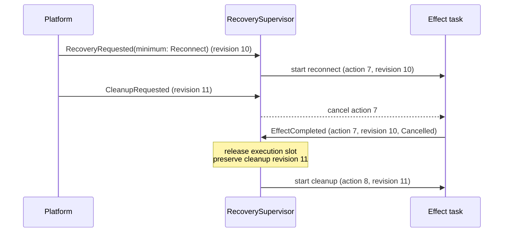

#### Per-peer coverage for peer-scoped recovery

A peer-scoped Restore or Reconnect effect may fan out into independent
per-peer recovery tasks, such as one ICE restart per impaired peer. Peer
concurrency stays resource-scoped: per-peer tasks run concurrently under
the effect's overall deadline, and peers do not enter the supervisor's
machines — there is no global peer FSM. Coverage of the target set, not
dispatch, is what completes the effect:

1. at dispatch, the effect captures its target set in `EffectContext`:
   one identity tuple — peer identity, `session_id`, and ICE generation —
   per target peer, frozen together with the captured `policy_revision`;
2. dispatching per-peer tasks MUST NOT by itself produce a success-class
   outcome;
3. each target peer reports one terminal per-peer fact carrying its
   identity tuple; a fact whose tuple does not match a captured target
   entry, or whose ICE generation has been superseded, is logged and
   discarded and covers nothing — the per-peer analogue of the
   effect-level `action_id` and `policy_revision` guard;
4. the effect's single terminal `EffectCompleted` is synthesized from
   per-peer terminal facts only:
   - `Succeeded` requires every target to be covered by a valid success
     fact;
   - an uncovered target whose failure the classification table can
     retry yields `Failed { diagnosis }` carrying the most severe
     representative diagnosis, with per-peer detail attached as
     diagnostics; the standard classification verdict applies and the
     obligation is retained, and a retry derives its target set afresh
     from current facts, so peers that recovered in the meantime drop
     out;
   - an uncovered target that is conclusively out of scope — the peer
     left the session or the session ended — yields
     `CompletedWithResiduals` with one residual per uncovered peer,
     naming its identity tuple and reason;
   - an `Abandon` verdict keeps its existing bounded-teardown semantics;
5. `RecoveryIntent` is discharged only by full coverage or by an explicit
   residual or abandon record, both auditable; there is no silent
   partial success.

For example, if Reconnect fans out to three peers and one terminal fact
arrives bearing a superseded ICE generation, that fact is discarded: two
targets are covered, one is not, and the effect MUST NOT report
`Succeeded`. It fails with the uncovered peer's representative diagnosis
or, if that peer has left the session, completes with one named residual.

### Cleanup bounded completion

Teardown must terminate. Cleanup and confirmed offline disconnect follow six
rules:

1. before any physical step, the effect synchronously invalidates the scoped
   generations, commit rights, and new-work admission, so no later commit
   can race the teardown;
2. local close and drop steps are idempotent and best-effort, bounded by the
   obligation's overall teardown deadline (a `Failure deadline` inventory
   entry) — armed once when the obligation is created, never reset by a
   retry; a running effect inherits its remaining budget, and expiry while
   the record backs off is delivered as `TeardownDeadlineExpired`;
3. a remote-notification failure never blocks local policy completion;
4. when the overall deadline is reached, remaining physical steps are
   aborted or detached and the effect completes with a structured residual
   outcome: `CompletedWithResiduals` when the logical teardown goal was
   reached but some physical steps left residuals, `Abandoned` when the
   deadline aborted remaining steps before the goal; both carry residual
   diagnostics;
5. `CleanupWork` never enters long-term `Parked` and never occupies the
   lifecycle slot with sustained retries; its only park is the deliberate
   fail-closed `InvariantViolation` case outside `Terminating`, released by
   an explicit command;
6. under `Terminating`, teardown failures that would otherwise park —
   invariant violations — take the `Abandon` verdict; availability failures
   keep retrying inside the obligation deadline, and the supervisor ends
   unconditionally at the shutdown overall deadline.

Rule 5 is deliberately narrower than "no parked domain may ever shadow a
lower one": failing closed on a broken invariant while the node is active
can be the correct policy. What the rules guarantee is bounded liveness for
cleanup and bounded termination for shutdown, which are the two paths where
an unbounded shadow would otherwise wedge the whole lifecycle.

### Offline hysteresis

An unavailable path first enters `OfflineCandidate` and owns a 400 millisecond
deadline. The purpose is narrowly defined: avoid a destructive disconnect for
a transient path flap.

The deadline is not a global debounce window:

- an online event immediately rolls `OfflineCandidate` back to `Online`;
- material online route changes are not delayed;
- cleanup bypasses the grace period;
- probe, restore, and reconnect do not acquire their own 400 millisecond timer;
  their eligibility is controlled by path state;
- expiry is accepted only for the current candidate identity;
- repeated equivalent unavailable facts do not extend the deadline.

Entering `OfflineCandidate` MUST NOT acquire a destructive cleanup barrier or
implicitly block every outbound send. The confirmed offline-disconnect effect
acquires that barrier only after the candidate commits. During the candidate
interval, `ExistingOnly` permits traffic on an existing committed session but
does not start a new negotiation. The 400 milliseconds cannot be hidden inside
an unrelated cleanup guard.

The deadline boundary is deterministic because both path snapshots and
`OfflineGraceExpired` are serialized through the supervisor mailbox. The
deadline owner enqueues the expiry when it becomes ready. A snapshot dequeued
before the matching expiry may roll the candidate back; an expiry dequeued
first commits it. A timestamp never retroactively changes that order, and the
implementation MUST NOT delay expiry to wait for another input or add a second
settle window.

After validating `candidate_id`, `OfflineGraceExpired` sends the path machine's
semantic `CommitOffline` input and creates `OfflineWork`. Cleanup may send the
same path input while deliberately assigning teardown to `CleanupWork`.

A later `ObserveOnline` or `ObserveUnknown` input invalidates the candidate,
supersedes `OfflineWork`, and applies the reversal rule above. This remains true
after the disconnect effect starts; the generation and cancellation checks,
not elapsed time, decide whether an old destructive step may still commit.

An explicit reconnect received during `OfflineCandidate` is retained
immediately. It cannot run until the path becomes eligible, but its intent
timestamp and revision are not shifted by 400 milliseconds. Explicit cleanup
preempts the candidate immediately: it invalidates the candidate timer, commits
the path to `Offline` for policy purposes, and lets `CleanupWork` own the
teardown instead of creating duplicate `OfflineWork`. A later authoritative
path fact may move the path back to `Online`.

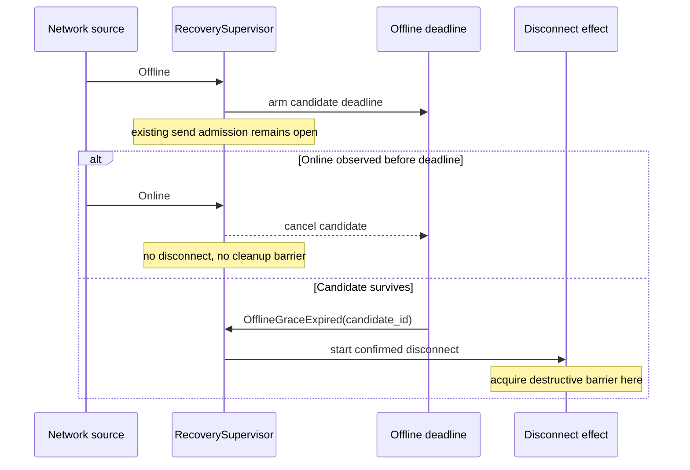

This is business hysteresis because the product intentionally prefers retaining
a possibly healthy session for a short interval over performing an expensive
disconnect. If product evidence later supports a different interval, the
constant may change without changing the state model.

### Generation and session commit gates

Every asynchronous resource family has a monotonic identity:

- signaling connection attempts use `connection_generation`;
- destination connection flights use identity-bearing shared flight objects;
- WebRTC peers use `session_id` and, where required, an ICE generation;
- lifecycle effects use `action_id` and captured `policy_revision`;
- wire-pool slots use a per-slot generation in addition to the pool's closed
  generation.

Starting a replacement invalidates the identity that an older completion would
need to commit. Producing a resource is not sufficient to publish it. The
producer MUST re-enter the authoritative owner and compare its identity with
the current generation or flight under the same synchronization boundary used
by close and replacement.

The commit rule is:

```text
commit(resource, identity) succeeds
  iff identity is still current and the owner is still open
```

On failed commit, the producer closes or drops the resource it created. It MUST
NOT remove the replacement's state.

Disconnect invalidates both explicit and automatic in-flight signaling
attempts. Pausing automatic reconnect is a different operation and MUST NOT
implicitly cancel a valid explicit attempt.

For signaling, generation validation, socket publication, and the transition to
`Connected` occur under one authoritative commit facade shared with disconnect.
It is invalid to check generation, release the synchronization boundary, and
then publish sink, stream, state, hooks, or public events. Observer hooks run
after commit and cannot block the transport owner.

For destination transports, closing state and the current connection flight
belong to one owner or obey one documented lock order. Code MUST NOT await a
closing-state lock while holding a transport-map lock if the close path can
take them in the opposite order. `close_all` first closes admission for the
whole registry, then detaches flights; no new flight can enter between the
drain and per-destination closing marks.

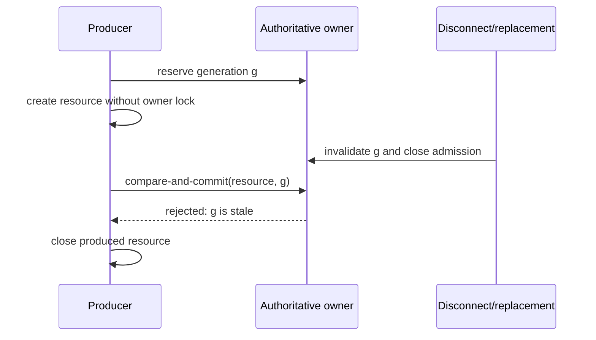

### Cancellation-safe single-flight

Single-flight ownership is represented by an RAII guard or identity-bearing
flight object. If the creator future is aborted, reaches a deadline, is
cancelled by lifecycle, or is dropped by its caller, guard destruction releases
only that exact ownership generation and wakes waiters.

Waiters MUST:

1. register for notification;
2. recheck authoritative state;
3. wait only if the desired transition has not already happened.

This ordering prevents lost wakeups. Notification primitives are hints to
re-read authoritative state; a notification is not itself the state.

Level state observed by multiple waiters, such as DataChannel readiness, ICE
gathering phase, signaling generation, quota availability, or pool readiness,
SHOULD use `watch`, a semaphore, or an equivalent retained-state primitive. A
single transition MUST NOT rely on `notify_one()` when every current waiter
must re-evaluate. If `Notify` is used, the implementation must distinguish
stored single permits from `notify_waiters()` generation semantics and prove
registration ordering with deterministic tests.

Wire-pool close, add, replacement, and successful connection publication are
linearized through one authoritative pool state containing `closed` and slot
generations. `add_connection` rejects a closed pool before publishing
`Connecting`. A late success or failure can mutate a slot only if its generation
is still current. Close cancels and joins, or otherwise observes terminal
completion of, detached connection tasks before reporting quiescence.

### Event-driven observation

If a successful state change is already observable, the implementation MUST use
that event source. The built-in paths use:

- DataChannel open callbacks or notifications;
- buffered-low callbacks for graceful send-buffer drain;
- WebRTC peer-connection state broadcasts for initial readiness;
- ICE gathering callbacks and completion notifications;
- ICE restart generation/state broadcasts;
- mailbox enqueue notifications plus concurrent observation of in-flight
  reply/ack completion;
- permit-release notifications for WASM quota;
- peer-state notifications plus the nearest exact stale deadline;
- cancellation tokens for lifecycle and shutdown.

For every callback-to-wait bridge, the consumer subscribes or registers before
the final authoritative read. Initial WebRTC readiness therefore subscribes
before checking both peer and DataChannel state; ICE gathering registers before
the final gathering-state read; signaling-generation waits install their
receiver before checking the generation. A broadcast-only event is insufficient
unless a retained authoritative snapshot is re-read after subscription.

A DataChannel Open or Closed transition wakes every sender waiting on that level
state. Graceful buffer drain also observes channel closure, so a closed channel
does not wait for the complete drain failure deadline.

The stale-peer reaper reads state and `last_state_change` from one authoritative
snapshot. It cannot combine live peer-connection state with the timestamp of an
older cached state. Quota waits register before retrying authoritative
acquisition, and quota release is resource-specific or semaphore-backed so
multiple releases cannot collapse while capacity remains available.

A receiver observing a closed channel exits immediately. It does not sleep
before checking again.

The mailbox event loop waits concurrently for shutdown, new enqueue work, and
the next in-flight reply/ack completion. Waiting only for enqueue when storage
is empty is invalid because it can starve completions that are already in
flight.

### Timer policy

Every production use of `sleep`, `sleep_until`, `interval`, `timeout`, or an
equivalent primitive MUST belong to one of these categories:

| Category | Allowed purpose | Exit or wake behavior |
|---|---|---|
| Business hysteresis | Confirm an offline candidate before destructive disconnect | An opposing fact rolls back immediately |
| Protocol selection | Prefer a better protocol candidate, such as an ICE candidate class, within a bounded window | The first candidate meeting the configured selection policy wins; the window is not generic synchronization |
| Protocol schedule | Run or rate-limit ping, heartbeat, lease, offer, or runtime-preemption work required by a protocol or safety contract | The schedule initiates or admits protocol work; it does not poll for completion |
| Retention expiry | Expire stale peers, deduplication records, reassembly state, caches, or other retained state at its exact lifetime boundary | A state change cancels or recomputes the nearest deadline; there is no periodic full scan when an exact deadline is available |
| Failure deadline | Bound connect, I/O, RPC, hook, shutdown, ICE, or drain duration | Event or future success wins immediately |
| Failure backoff | Avoid a hot loop after an observed failure | A material trigger wakes work immediately; lost eligibility may suspend the timer but never resets its absolute deadline; herd-prone kinds MUST use bounded jitter per the backoff arithmetic |
| Compatibility polling | Support an external implementation that cannot emit the required event | Explicitly documented and not used by the built-in production backend |
| Compatibility debounce | Preserve an explicitly selected legacy coalescing contract during migration | Only opted-in callers pay the delay; it is deprecated and never used for correctness |

Outside the explicitly deprecated compatibility adapters, timers MUST NOT:

- sequence ordinary successful transitions;
- be used as a substitute for an available callback or notification;
- add a grace period above an existing failure deadline;
- periodically scan state when the next exact deadline and state-change event
  are available;
- reset a deadline because a duplicate state event was received;
- multiply one end-to-end failure budget by awaiting child tasks sequentially
  with a fresh full timeout for each child.

A failure timeout races the actual operation. It does not add latency when the
operation succeeds. Parallel shutdown or close work shares one overall deadline
and joins children concurrently; after that deadline, remaining children are
cancelled or aborted according to their ownership contract.

ICE candidate acceptance waits are protocol selection, not polling.
The implementation draft's host/srflx/prflx/relay defaults of
`0/20/40/100 ms` remain valid policy defaults until interoperability or
production telemetry justifies changing them. This RFC's requirement to remove
unnecessary waits does not mean setting protocol selection windows to zero.

#### Auditable timer inventory

Principles alone are insufficient to prove that every timer is intentional.
Production code MUST create timers through one audited timer facade or macro
that requires a stable timer ID and category. Direct
`tokio::time::{sleep, sleep_until, interval, timeout, timeout_at}` calls are
allowed only inside that facade and test-only code. The enforced scope is
what first-party code can observe: every first-party timer call site, every
configurable duration the SDK passes into a dependency (registered as a
configuration point, such as the ICE candidate-selection durations), and
every external deadline the SDK explicitly adopts. Timers internal to
dependency crates — STUN retransmission, DTLS and SCTP timers, ICE
keepalives — are not claimed to be statically discoverable; the inventory
records the dependency, its version, and its configuration entry points
instead.

The facade generates a source-controlled inventory with one entry for every
production timer ID. Each entry records:

| Field | Meaning |
|---|---|
| Stable ID and source owner | The timer and subsystem that owns it |
| Category | One category from the table above |
| Duration source | Constant, configuration, protocol field, or computed exact deadline |
| Arm condition | The fact or failure that makes the timer eligible |
| Success signal | Future, callback, watch, semaphore, or authoritative state that wins immediately |
| Interrupt source | Lifecycle, shutdown, replacement generation, or none with justification |
| Expiry effect | The exact state transition or failure produced |
| Reset rule | Which material event may replace the deadline; duplicates never do |

CI MUST fail on an unaudited raw timer call, an unregistered external timer, an
unused inventory entry, a duplicate stable ID, or generated state-machine
documentation drift. A timer trace records its stable ID, category, deadline,
owner identity, and elapsed duration.

The initial inventory MUST explicitly include at least:

| Timer family | Category |
|---|---|
| 400 ms offline candidate | Business hysteresis |
| ICE candidate acceptance 0/20/40/100 ms | Protocol selection |
| Heartbeat, ping, lease, ICE offer throttle, Wasmtime epoch tick | Protocol schedule |
| Stale peer, deduplication, activity, reassembly, and cache expiry | Retention expiry |
| Connect, send, RPC, hook, close, drain, ICE and shutdown deadlines | Failure deadline |
| Cleanup and disconnect overall teardown deadlines | Failure deadline |
| Gated-profile bootstrap phase deadline | Failure deadline |
| Signaling, credential, connection and ICE restart retry delays | Failure backoff |
| Third-party mailbox empty-queue interval | Compatibility polling |
| Legacy nonzero network-event debounce | Compatibility debounce |

The built-in SQLite mailbox implements depth/enqueue observation and therefore
does not use empty-queue polling. For compatibility, a third-party mailbox that
does not implement `MailboxDepthObserver` may use the documented fallback
interval. Making observation mandatory is a separate breaking public-API
proposal.

### Authoritative state and public observers

Callbacks, broadcasts, and notifications wake consumers; they are not
authoritative state. A laggable broadcast MUST NOT be the sole source of a
business-critical send gate. Consumers re-read an authoritative snapshot or
watch value before acting.

Public observer delivery is decoupled from the underlying connection state
machine. A slow observer may delay its own notification stream but MUST NOT
block transport progress or become able to publish stale state.

### Verification strategy

Correctness is demonstrated at five levels:

1. YASM transition tests cover every declared transition and reject invalid
   normalized inputs.
2. A pure reference reducer — a Phase 1 deliverable with no runtime
   dependencies — is the single generation source for the composite action
   decision table and the derived send projection, and checks translation,
   classification, revision acknowledgement, retry gating, escalation, and
   send policy over bounded input sequences that include an effect in
   flight. The checked documentation command regenerates and verifies the
   eight local YASM tuple tables, the translation and classification tables,
   the composite decision table, the send projection, and the
   invariant/phase traceability matrix.
3. Deterministic race tests use injected barriers to place disconnect,
   replacement, cancellation, and state notification at each commit boundary.
   They do not rely on wall-clock sleeps to "increase the chance" of a race.
4. Paused-time tests verify exact deadlines, duplicate-event behavior, and the
   absence of successful-path polling latency. They also prove that retry
   expiry fires once, stale expiry cannot wake replacement work, and
   background/foreground suspension never grants a fresh full backoff.
5. Integration tests cover signaling reconnect, ICE restart, mobile
   foreground/background transitions, full disconnect recovery, mailbox
   progress, and graceful shutdown.

Where practical, lock and atomic ownership code SHOULD also run under a
systematic concurrency checker such as Loom. A passing end-to-end test cannot
substitute for a missing deterministic invariant test.

Acceptance is traceable: the RFC maintains one matrix mapping every
normative rule or table to the invariant or test property that verifies it
and the phase that delivers it. The matrix is generated by the checked
documentation command into its own source-controlled file,
`rfcs/0400-traceability.md`, created in Phase 1; it is not inlined here.
Phase gates cite invariant ranges for brevity, but the matrix is the
authoritative coverage record; complete reducer coverage of the translation
and classification tables is part of the Phase 2 gate. Not every table row
needs its own numbered invariant; every normative rule needs a named
verifying property.

Performance validation records enqueue-to-decision and event-to-effect-start
latency at p50, p95, and p99, plus idle wakeups and reconnect-attempt counts.
Successful paths must show no fixed latency floor, and an idle instance has no
wakeup source beyond its documented protocol schedules or exact deadlines.
Benchmarks include concurrent destination flights so global policy ownership
cannot hide accidental resource-level serialization.

### Diagnostics

Recovery logs and tracing spans SHOULD include, when applicable:

- `connection_generation`;
- peer identity and `session_id`;
- `event_id`;
- network `source_epoch` and sequence;
- `policy_revision`, `action_id`, and captured effect revision;
- pending-work domain, retry-gate state, attempt, `retry_id`, the reported
  diagnosis, the classification verdict, and the escalation source;
- the release mask when a record parks, and the matching trigger when it is
  released;
- the extinguishment path and revision when an obligation ends;
- structured rejections (`Rejected { mode, reason }` and release-mask
  mismatches) reported on the status stream;
- old state, input, and new state;
- reason a stale completion or duplicate fact was discarded;
- timer inventory ID, category, and deadline when a timer is armed;
- elapsed operation duration.

Logging MUST use the repository's canonical `ActrId::to_string_repr()` and
`ActrType::to_string_repr()` representations.

### Required invariants

Implementations conforming to this RFC must demonstrate:

1. Duplicate or stale snapshots cannot mutate path state, while a new source
   epoch can begin a fresh monotonic sequence.
2. Fast offline-to-online rollback performs no disconnect. A reversal after
   offline commit supersedes pending disconnect, cancels a running disconnect
   at its next commit boundary, and derives immediate restoration if teardown
   already committed.
3. `OfflineCandidate` allows existing-session traffic, starts no new
   negotiation, and places no destructive cleanup barrier in front of sends.
4. Cleanup cannot acknowledge a later recovery fact.
5. `LoggedOut` and `Terminating` cannot be reactivated by network facts.
6. Duplicate foreground observations do not create recovery work.
7. Background preserves recovery intent and healthy sessions while gating new
   active recovery; it cancels in-flight work only under an explicit platform
   capability policy. Under a `Gated` profile, `Unknown` grants no phase
   eligibility, and bootstrap-deadline expiry never grants it silently.
8. Lifecycle-wide recovery effects are single-flight while the supervisor
   remains responsive; independent resource-scoped flights are not serialized
   unless their generation or teardown scopes conflict.
9. A completion with stale or mismatched action, kind, or revision cannot
   acknowledge work; a weaker effect cannot acknowledge newer or stronger
   intent.
10. Failed work cannot hot-loop: it is in `BackingOff` or `Parked`, a duplicate
    input cannot reset its retry state, and only a matching deadline or material
    trigger can make it `Ready`. An availability-family failure never parks:
    it backs off toward one capped, jittered deadline or is escalated.
    `Parked` is entered only by a precondition-family verdict or an explicit
    pause, always records a non-empty release mask, and is released only by
    a trigger matching that mask.
11. Event acceptance does not wait for effect completion, and a caller timeout
    cannot silently cancel or orphan accepted work.
12. A stale signaling generation cannot publish `Connected` or invoke a
    connected observer.
13. A cancelled creator releases ownership without erasing its replacement.
14. Only the current destination flight may commit transport state.
15. Close and late connection success or failure are linearized.
16. Transport creation racing per-peer or close-all teardown cannot deadlock.
17. Every DataChannel state waiter wakes on an Open or Closed transition.
18. Initial readiness and ICE gathering cannot lose a transition between state
    read and event subscription.
19. Duplicate peer-state events do not extend stale-peer lifetime, and the
    reaper never combines a new state with an old state's timestamp.
20. Empty mailbox storage does not starve in-flight reply/ack completion.
21. Available quota cannot remain idle because several release notifications
    collapsed into one.
22. Ordinary successful transitions do not wait for a fixed polling interval or
    consume a failure deadline after their success event.
23. Parallel shutdown is bounded by one overall deadline rather than the number
    of registered child tasks multiplied by a per-child timeout.
24. Every first-party production timer, every configurable duration passed to
    a dependency, and every explicitly adopted external deadline uses the
    audited facade and has exactly one valid inventory classification.
25. No effect classifies its own failure: `EffectCompleted` carries only a
    typed diagnosis, and every retry, escalation, park, or abandon verdict is
    produced
    by the per-kind classification table in the translation layer.
26. Translation is deterministic: identical policy view, input, instant,
    entropy state, and configuration produce an identical decision, and the
    reference reducer covers every normative translation and classification
    row.
27. Every non-`Idle` `Execution` eventually receives exactly one accepted
    terminal completion, and only the supervisor mutates the execution
    machine.
28. Obligations end only through their domain's enumerated extinguishment
    paths, each recorded with its path and revision; a fact reversal
    extinguishes only the fact-derived domain it defines.
29. `DisconnectPending` implies `NetworkPath == Offline` at reconciliation
    entry, and a composite-table fall-through is logged, never silent.
30. A cleanup or confirmed offline disconnect effect terminates — including
    residual and bounded-abandon outcomes — within its overall teardown
    deadline, and shutdown terminates the supervisor at its overall
    deadline. The only unbounded teardown state is the deliberate
    fail-closed `InvariantViolation` park outside `Terminating`, which
    records its explicit-command release.
31. `SessionActivated` while an older cleanup is pending derives the new
    session's recovery obligation at a post-cleanup revision; completion of
    that cleanup cannot extinguish it.
32. A normalized resource fact produced by the current effect is recognized
    by its origin and cannot make that effect's own completion stale.
33. A peer-scoped recovery effect never reports a success-class outcome for
    dispatch alone: every target peer is either covered by an
    identity-validated terminal fact matching its captured identity tuple
    or named in a recorded residual before `RecoveryIntent` is
    acknowledged.

## Drawbacks

The design introduces more explicit state types and identities than a
flag-based implementation. Engineers must decide which layer owns each new
fact, maintain effect and resource generations, and understand policy state
separately from execution state. The classification and translation tables
are an explicit policy surface: every new effect kind or diagnosis requires
a reviewed table change rather than an ad-hoc call-site decision, which is
deliberate but adds process.

Event-driven code can still contain lost-wakeup bugs if notification
registration and authoritative-state rechecks are ordered incorrectly.
Generation checks and RAII guards also add implementation discipline and test
surface.

The 400 millisecond offline hysteresis intentionally delays a destructive
disconnect. This is not minimum latency for confirmed physical loss, but it
avoids substantially more expensive reconnect churn during transient path
events. It does not delay cleanup or place an implicit 400 millisecond barrier
in front of outbound sends.

Protocol selection windows, including ICE candidate-class acceptance waits, can
intentionally delay selection of a merely usable candidate in order to obtain a
better one. Their values require protocol and production evidence rather than a
blanket zero-latency rule.

Compatibility with mailboxes that cannot emit enqueue/depth events means the
SDK cannot guarantee zero polling for arbitrary third-party implementations
without a future breaking API change.

## Alternatives

### One global connection FSM

A single FSM could enumerate app phase, path, signaling, recovery action, and
every peer state. It gives one transition table but creates a Cartesian product
whose size grows with the number of peers. It also permits transitions that
cross ownership boundaries. Orthogonal state machines with one reconciliation
boundary preserve explicit policy without flattening independent dimensions.

### Flags and procedural conditionals

Keeping booleans such as `connected`, `connecting`, `recovering`, and
`suppressed` minimizes type definitions. It does not define which combinations
are valid or which write wins. Pending work can be cleared accidentally, and a
stale task can commit unless every call site independently remembers the same
rules.

### Global debounce or event batching

A fixed settle window can merge noisy input and reduce action count, but it
adds its full duration to unrelated actions and makes correctness depend on
arrival order within the window. Structural deduplication removes equivalent
facts without delay. The only retained window belongs to the reversible
offline candidate because it protects a destructive action.

### Periodic polling

Polling is simple when a dependency exposes only a getter. Where callbacks,
channels, notifications, watches, or exact deadlines exist, polling adds
latency and wakeups and complicates shutdown. The RFC permits a documented
compatibility-polling path only when the implementation cannot provide an event
source.

### Make mailbox observation mandatory immediately

Requiring `MailboxDepthObserver` would remove the final compatibility-polling
path,
but it would break third-party mailbox implementations in the current public
API. This RFC makes the built-in backend event-driven and leaves the breaking
trait change to a dedicated proposal.

### Actorize every resource owner

This RFC makes the lifecycle `RecoverySupervisor` an actor because it must stay
responsive while effects execute and has one natural policy owner. Converting
every signaling socket, peer, transport, and wire slot into an actor would be a
broader migration with its own overhead and failure model. Resource owners may
instead use typed state behind one synchronization facade, provided generation
checking and close/publication are linearized and no lock-order cycle exists.

### Make no change

The SDK would retain order-sensitive recovery, stale-completion races,
avoidable polling latency, and timers with ambiguous semantics. These failures
become more likely on mobile lifecycle transitions and unstable networks, where
events from several layers arrive concurrently.

## Compatibility and phasing

This RFC changes no peer wire format or signaling protocol message. Internal
state types, synchronization, and observer wiring may change freely within the
0.x compatibility policy.

Platform bindings may preserve their existing network-callback signatures
through an adapter that attaches the supervisor-issued `source_epoch`, a
sequence, and `observed_at`. The supervisor still assigns `event_id` when it
dequeues the input. Existing callbacks that currently wait for teardown or
reconnection must either:

- change their documented result to mean "accepted by the supervisor"; or
- gain a new acceptance API while the old completion-waiting API is deprecated.

The SDK MUST NOT silently keep a five-second callback contract while allowing
the effect to continue after the caller receives a timeout. Final effect status
is observed separately by revision and `action_id`.

`MailboxDepthObserver` remains optional in this RFC, so third-party mailbox
implementations retain the documented compatibility-polling path.

Lifecycle profiles migrate without a silent behavior flip: the Rust core and
headless deployments default to `Ungated` and keep recovering exactly as
before, while the mobile bindings declare `Gated` and take on the
bootstrap-injection duty in the same release that adopts this RFC.

This revision is semantically atomic: translation, diagnosis, escalation,
backoff, park release, and supersession are specified together and MUST NOT
be adopted piecemeal into contradictory intermediate specifications. The
implementation may land in stages behind feature gates, but any stage
declared complete must satisfy that stage's full invariants.

The proposal is phased as follows:

### Phase 1: executable policy documentation

- add `RecoveryMode`, separate `CleanupWork`, reusable `RetryGate` with
  `ExplicitPause`, `SupersedeRecovery`, and the cancellation-aware YASM
  machines;
- deliver the pure reference reducer and use it as the single generation
  source for the composite decision table and send projection; generate
  deterministically sorted diagrams, local transition tables, the
  translation and classification tables, and the traceability matrix
  through one checked documentation command;
- establish a source-controlled timer inventory and CI drift checks.

Acceptance criteria: generated documentation matches the target policy in this
RFC, and every existing production timer has one inventory entry.

### Phase 2: responsive policy and effect execution

- introduce the persistent layered recovery supervisor and execution state;
- implement the pure translation layer, per-kind classification tables,
  escalation, sustained capped backoff, park release masks, and bounded
  cleanup completion;
- run effects outside the supervisor and pass versioned completion messages
  back to it over the reserved-capacity completion path;
- retain pending obligations across receive cycles and lifecycle transitions;
- implement recovery gating, the lifecycle profile and bootstrap discipline,
  foreground self-loop, preemption, revision acknowledgement, retry gating,
  and offline barrier semantics;
- separate event acceptance from effect completion.

Acceptance criteria: invariants 1 through 11 and 25 through 33 pass under
paused-time and deterministic interleaving tests without scheduler sleeps,
including full reducer coverage of the translation and classification
tables.

### Phase 3: generation and cancellation safety

- apply generation/session commit gates to signaling, destination flights,
  peers, and wire-pool publication;
- make creator ownership cancellation-safe;
- linearize close and successful or failed publication;
- remove destination lock-order cycles and close-all admission gaps.

Acceptance criteria: invariants 12 through 16 pass, including generation-check
versus disconnect, aborted creator, close-all versus creation, late completion,
and lock-order interleavings.

### Phase 4: event-driven production paths

- replace successful-path transport, ICE, mailbox, quota, and stale-peer
  polling with notifications, callbacks, watches, broadcasts, or exact
  deadlines;
- use retained level-state observation for multi-waiter readiness;
- replace subsystem-local blind retry sleeps with exact, identity-bearing
  backoff deadlines that material events can interrupt without resetting;
- document compatibility polling and debounce behavior and classify every new
  timer.

Acceptance criteria: invariants 17 through 24 pass. Race tests place transitions
inside the former subscription windows through injected barriers rather than
probabilistic sleeps.

### Phase 5: integration validation

- run formatting, compile checks, strict Clippy, library tests, concurrent
  dispatch, signaling reconnect, ICE restart, mobile recovery, and
  large-message recovery suites;
- run recovery-latency, idle-wakeup, and concurrent-flight benchmarks and
  compare them with the pre-migration baseline;
- validate supported language bindings and the minimum Rust version in CI.

Acceptance criteria: all enabled checks pass; ignored/manual tests remain
explicitly identified. The RFC documentation generator and timer-inventory
checker also pass in CI. Benchmarks show no fixed successful-path latency floor
or undocumented idle wakeup; any throughput or tail-latency regression requires
an explicit review decision.

Draft implementation PR #399 may be used to validate the proposal, but its
existence does not imply RFC acceptance. Maintainers may require the
implementation to change during RFC review.

## Unresolved questions

No design question blocks acceptance. This RFC makes these choices:

- the built-in network-event debounce is zero; the explicit nonzero option is a
  deprecated compatibility path and is classified as compatibility debounce;
- mailbox observation remains optional until a separate breaking API proposal;
- offline hysteresis defaults to 400 milliseconds and is measured by rollback,
  avoided-reconnect, and time-to-recovery telemetry;
- the audited timer facade is normative; its concrete generated-inventory
  format is an implementation detail;
- supervisor enqueue time is the default `observed_at`; a platform timestamp is
  used only after proven conversion into the same monotonic clock domain;
- the lifecycle profile defaults to `Ungated` for the Rust core and headless
  deployments; mobile bindings declare `Gated`;
- `background_reconnect_after` defaults to 60 seconds; escalation thresholds,
  backoff bases, caps, jitter fractions, and the overall teardown and
  shutdown deadlines are per-kind policy constants measured by telemetry,
  not part of the state model;
- an atomic reset-and-rebuild command (`ResetAndReconnectRequested`) is
  deliberately not introduced; forced reconnect normalizes to
  `RecoveryRequested { minimum: Reconnect }`, and a future need for a
  transactional reset requires its own proposal.

A later material change to these choices requires a follow-up RFC rather than an
implementation-only deviation.

## Future possibilities

A follow-up RFC may make mailbox observation mandatory and remove the
third-party polling fallback.

Signaling may represent socket-resource state and reconnect-task state as
additional YASM machines or typed enums behind the required single commit
facade. WebRTC peers can similarly split lifecycle, negotiation, ICE
generation, and public projection into explicit sub-state machines.

Hook contexts can read identity and credentials from `SessionState` at delivery
time, eliminating captured legacy copies during hard rebind. Peer send gates can
read authoritative coordinator snapshots while keeping broadcasts solely for
notification and diagnostics.

Structured transition events may support state diagrams, recovery-latency
histograms, discarded-generation counters, and deterministic replay of
production incident traces.
