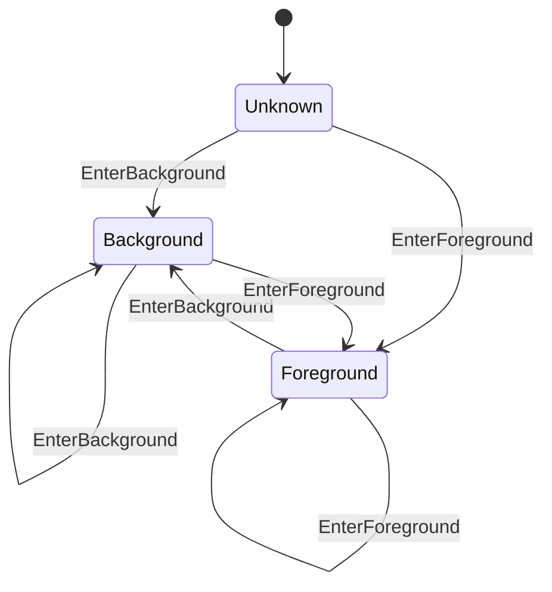
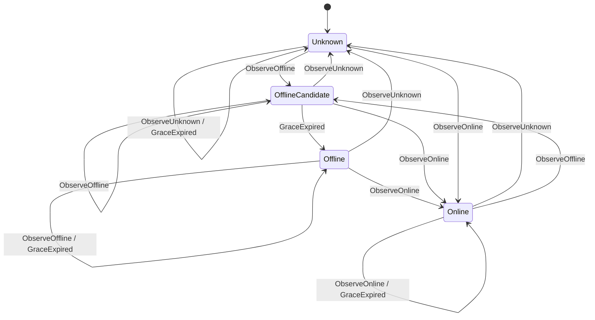
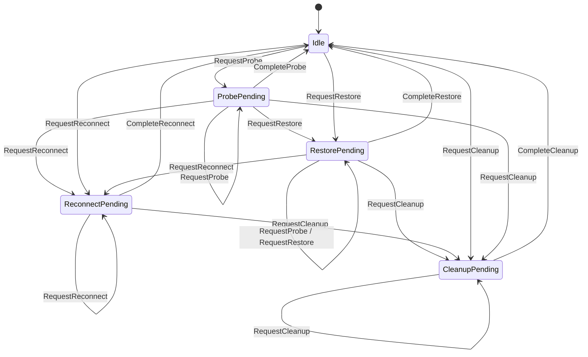
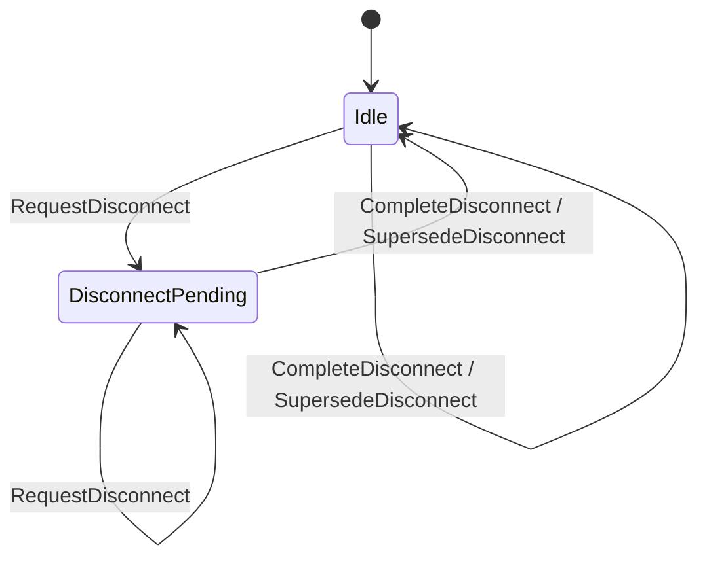
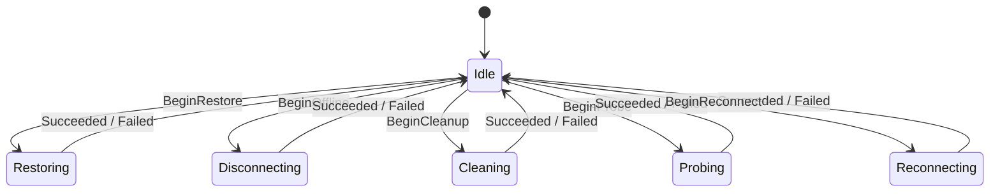

# RFC-0400: Event-driven hierarchical connection recovery

- Status: Proposed
- Date: 2026-07-18
- RFC PR: [#401](https://github.com/Actrium/actr/pull/401)
- Tracking issue: [#400](https://github.com/Actrium/actr/issues/400)
- Superseded by: None
- Related: [Implementation draft #399](https://github.com/Actrium/actr/pull/399)

## Summary

Actr connection recovery will be governed by orthogonal hierarchical state
machines and generation-checked asynchronous effects. A successful transition
must advance when its event arrives rather than after a fixed sleep or polling
interval. Timers remain only when time is part of the product or protocol
semantics, bounds a failure, backs off after a real failure, or supports an
explicitly documented compatibility fallback.

The design separates app lifecycle, network-path facts, recovery intent,
offline teardown, and asynchronous execution instead of encoding their
Cartesian product in flags or one flat state machine. It also defines
single-flight ownership, cancellation behavior, compare-and-commit rules, and
timer policy for signaling, WebRTC, destination transports, wire pools,
mailboxes, and runtime quotas.

## Motivation

Connection recovery crosses several independently changing layers in
`core/hyper`:

- `core/hyper/src/lifecycle/network_event.rs` receives app and network facts;
- `core/hyper/src/lifecycle/node.rs` owns the runtime lifecycle;
- `core/hyper/src/wire/webrtc/signaling.rs` owns the signaling socket and
  automatic reconnect work;
- `core/hyper/src/wire/webrtc/coordinator.rs` owns WebRTC peer recovery;
- `core/hyper/src/transport/peer_transport.rs` and
  `core/hyper/src/transport/wire_pool.rs` publish destination transports;
- mailbox and WASM runtime code wait for work or capacity.

Historically, these paths combined independent facts in booleans and
order-sensitive fields. Some paths used fixed debounce windows or periodic
polling to discover that another task had already changed state. This creates
three classes of failure:

1. **Lost intent.** Recreating or partially resetting recovery state can forget
   work that should survive an event batch, an offline interval, or a
   foreground/background transition.
2. **Stale completion.** An old asynchronous attempt can complete after a newer
   attempt and publish, remove, or resurrect the wrong connection.
3. **Artificial latency.** A state change that is already observable can still
   wait for the next 10, 100, or 500 millisecond polling tick.

The problem is not solved by putting every field into one global FSM. App
lifecycle, path reachability, desired recovery work, effect execution,
signaling sessions, and multiple peer sessions are orthogonal dimensions.
Flattening them creates a large Cartesian product and encourages invalid
cross-layer transitions.

The expected outcome is deterministic recovery policy, immediate successful
transitions, explicit ownership of destructive delays, and concurrency
invariants that can be tested without depending on scheduler timing.

This RFC does not change the wire format or peer protocol. It defines internal
runtime concurrency and timing semantics that implementations and language
bindings can rely on.

## Detailed design

### Goals

The design MUST:

- keep independent state dimensions independent;
- make the owner of every state transition explicit;
- retain recovery intent until it is acknowledged by the matching effect;
- prevent stale or cancelled work from committing;
- make built-in production paths event-driven on successful transitions;
- classify and justify every production timer;
- preserve the stronger compile-time guarantees already provided by Rust
  typestate;
- expose enough structured context to diagnose transitions and discarded work.

The design MUST NOT:

- create one global FSM containing all peers and transport layers;
- use elapsed time as evidence that a state change probably happened;
- delay a successful event merely to coalesce work;
- let a timeout, cancellation, or dropped future poison single-flight
  ownership;
- let a public observer callback become the authoritative state store.

### State decomposition

The lifecycle reconciler owns one persistent `ConnectionSupervisor`. It
contains four policy state machines:

```text
AppPhase
  Unknown | Foreground | Background

PathFact
  Unknown | Online | OfflineCandidate { deadline } | Offline

RecoveryIntent
  Idle | ProbePending | RestorePending | ReconnectPending | CleanupPending

OfflineWork
  Idle | DisconnectPending
```

Asynchronous effect execution is a separate state machine:

```text
Execution
  Idle
  | Disconnecting { action_id }
  | Probing { action_id }
  | Restoring { action_id }
  | Reconnecting { action_id }
  | Cleaning { action_id }
```

The policy states answer what is true and what work is desired. `Execution`
answers which side effect currently owns the single-flight execution slot.
`Online`, `Ready`, and `Failed` are not execution states. A failure is an effect
result with diagnostic data; the policy layer decides whether intent remains
pending and whether a later retry is allowed.

YASM is used for deterministic synchronous transitions where its transition
table and invalid-transition checks improve reviewability. Numeric sequence
values, deadlines, connection handles, cancellation tokens, and error details
remain extended context rather than being expanded into states.

Rust compile-time typestate such as
`Node<Init> -> Node<Attached> -> Node<Registered> -> Node<Running>` remains
compile-time state. Replacing it with a runtime FSM would weaken the API.

### Generated YASM documentation

The diagrams and transition-table rows in this section were emitted by YASM
0.6.0 from the concrete machines in implementation draft #399. They are not
independently hand-drawn interpretations of the design.

The crate-local tests can regenerate them with:

```rust
StateMachineDoc::<Machine>::generate_mermaid();
StateMachineDoc::<Machine>::generate_transition_table();
```

The generated transition-table heading is omitted below so it does not disturb
this RFC's document hierarchy. Mermaid edge ordering is not normative because
YASM may emit the same edge set in a different order.

#### App phase



<details>
<summary>YASM-generated app-phase transition table</summary>

| Current State | Input | Next State |
|---------------|-------|------------|
| Unknown | EnterForeground | Foreground |
| Unknown | EnterBackground | Background |
| Foreground | EnterForeground | Foreground |
| Foreground | EnterBackground | Background |
| Background | EnterForeground | Foreground |
| Background | EnterBackground | Background |

</details>

#### Network path



<details>
<summary>YASM-generated network-path transition table</summary>

| Current State | Input | Next State |
|---------------|-------|------------|
| Unknown | ObserveUnknown | Unknown |
| Unknown | ObserveOnline | Online |
| Unknown | ObserveOffline | OfflineCandidate |
| Unknown | GraceExpired | Unknown |
| Online | ObserveUnknown | Unknown |
| Online | ObserveOnline | Online |
| Online | ObserveOffline | OfflineCandidate |
| Online | GraceExpired | Online |
| OfflineCandidate | ObserveUnknown | Unknown |
| OfflineCandidate | ObserveOnline | Online |
| OfflineCandidate | ObserveOffline | OfflineCandidate |
| OfflineCandidate | GraceExpired | Offline |
| Offline | ObserveUnknown | Unknown |
| Offline | ObserveOnline | Online |
| Offline | ObserveOffline | Offline |
| Offline | GraceExpired | Offline |

</details>

#### Recovery intent



<details>
<summary>YASM-generated recovery-intent transition table</summary>

| Current State | Input | Next State |
|---------------|-------|------------|
| Idle | RequestProbe | ProbePending |
| Idle | RequestRestore | RestorePending |
| Idle | RequestReconnect | ReconnectPending |
| Idle | RequestCleanup | CleanupPending |
| ProbePending | RequestProbe | ProbePending |
| ProbePending | RequestRestore | RestorePending |
| ProbePending | RequestReconnect | ReconnectPending |
| ProbePending | RequestCleanup | CleanupPending |
| ProbePending | CompleteProbe | Idle |
| RestorePending | RequestProbe | RestorePending |
| RestorePending | RequestRestore | RestorePending |
| RestorePending | RequestReconnect | ReconnectPending |
| RestorePending | RequestCleanup | CleanupPending |
| RestorePending | CompleteRestore | Idle |
| ReconnectPending | RequestProbe | ReconnectPending |
| ReconnectPending | RequestRestore | ReconnectPending |
| ReconnectPending | RequestReconnect | ReconnectPending |
| ReconnectPending | RequestCleanup | CleanupPending |
| ReconnectPending | CompleteReconnect | Idle |
| CleanupPending | RequestProbe | CleanupPending |
| CleanupPending | RequestRestore | CleanupPending |
| CleanupPending | RequestReconnect | CleanupPending |
| CleanupPending | RequestCleanup | CleanupPending |
| CleanupPending | CompleteCleanup | Idle |

</details>

#### Offline work



<details>
<summary>YASM-generated offline-work transition table</summary>

| Current State | Input | Next State |
|---------------|-------|------------|
| Idle | RequestDisconnect | DisconnectPending |
| Idle | CompleteDisconnect | Idle |
| Idle | SupersedeDisconnect | Idle |
| DisconnectPending | RequestDisconnect | DisconnectPending |
| DisconnectPending | CompleteDisconnect | Idle |
| DisconnectPending | SupersedeDisconnect | Idle |

</details>

#### Recovery execution



<details>
<summary>YASM-generated recovery-execution transition table</summary>

| Current State | Input | Next State |
|---------------|-------|------------|
| Idle | BeginOffline | Disconnecting |
| Idle | BeginProbe | Probing |
| Idle | BeginRestore | Restoring |
| Idle | BeginReconnect | Reconnecting |
| Idle | BeginCleanup | Cleaning |
| Disconnecting | Succeeded | Idle |
| Disconnecting | Failed | Idle |
| Probing | Succeeded | Idle |
| Probing | Failed | Idle |
| Restoring | Succeeded | Idle |
| Restoring | Failed | Idle |
| Reconnecting | Succeeded | Idle |
| Reconnecting | Failed | Idle |
| Cleaning | Succeeded | Idle |
| Cleaning | Failed | Idle |

</details>

### Input events

Inputs are facts or effect completions, not requests to assign arbitrary state.
Representative events include:

```text
AppEnteredForeground
AppEnteredBackground
NetworkSnapshot { sequence, semantic_path }
OfflineGraceExpired { candidate_id }
CleanupRequested
EffectCompleted { action_id, generation, outcome }
SignalingGenerationChanged { generation }
PeerStateChanged { peer, session_id, state }
ShutdownRequested
```

Every network snapshot carries a monotonic sequence within its source. A
snapshot whose sequence is not newer than the last accepted snapshot is
discarded before policy transition. Consecutive snapshots that are semantically
equivalent are structurally deduplicated.

Semantic equality concerns routing behavior, not object identity or incidental
metadata. A material route change while online is immediately visible to the
recovery policy.

### Reconciliation and action priority

Handling an input has three stages:

1. apply the input to the relevant policy state machine;
2. derive at most one executable action from the combined policy snapshot;
3. if `Execution` is `Idle`, start that action and record its `action_id`.

Action selection uses this priority:

```text
Cleanup > confirmed offline disconnect > probe > restore > reconnect
```

Priority exists only at the action-selection boundary. It does not merge the
state machines or erase lower-priority pending intent.

Cleanup is a receive-batch boundary. Facts received after cleanup are processed
in a new decision cycle, so cleanup cannot accidentally acknowledge later
online or recovery work.

`Background` gates active probe, restore, and reconnect work. It does not turn a
healthy connection into a disconnected one, erase pending intent, or block
explicit cleanup. Returning to `Foreground` re-evaluates existing intent and
unblocks automatic reconnect; it does not automatically create a redundant
second connection attempt.

An effect completion is accepted only if its `action_id` and generation match
the current execution state. Accepted completion returns `Execution` to `Idle`
and triggers reconciliation. A stale completion is logged and discarded
without mutating policy state.

### Offline hysteresis

An unavailable path first enters `OfflineCandidate` and owns a 400 millisecond
deadline. The purpose is narrowly defined: avoid a destructive disconnect for
a transient path flap.

The deadline is not a global debounce window:

- an online event immediately rolls `OfflineCandidate` back to `Online`;
- material online route changes are not delayed;
- cleanup bypasses the grace period;
- probe, restore, and reconnect do not inherit a 400 millisecond delay;
- expiry is accepted only for the current candidate identity;
- repeated equivalent unavailable facts do not extend the deadline.

This is business hysteresis because the product intentionally prefers retaining
a possibly healthy session for a short interval over performing an expensive
disconnect. If product evidence later supports a different interval, the
constant may change without changing the state model.

### Generation and session commit gates

Every asynchronous resource family has a monotonic identity:

- signaling connection attempts use `connection_generation`;
- destination connection flights use identity-bearing shared flight objects;
- WebRTC peers use `session_id` and, where required, an ICE generation;
- lifecycle effects use `action_id`.

Starting a replacement invalidates the identity that an older completion would
need to commit. Producing a resource is not sufficient to publish it. The
producer MUST re-enter the authoritative owner and compare its identity with
the current generation or flight under the same synchronization boundary used
by close and replacement.

The commit rule is:

```text
commit(resource, identity) succeeds
  iff identity is still current and the owner is still open
```

On failed commit, the producer closes or drops the resource it created. It MUST
NOT remove the replacement's state.

Disconnect invalidates both explicit and automatic in-flight signaling
attempts. Pausing automatic reconnect is a different operation and MUST NOT
implicitly cancel a valid explicit attempt.

### Cancellation-safe single-flight

Single-flight ownership is represented by an RAII guard or identity-bearing
flight object. If the creator future is aborted, reaches a deadline, is
cancelled by lifecycle, or is dropped by its caller, guard destruction releases
only that exact ownership generation and wakes waiters.

Waiters MUST:

1. register for notification;
2. recheck authoritative state;
3. wait only if the desired transition has not already happened.

This ordering prevents lost wakeups. Notification primitives are hints to
re-read authoritative state; a notification is not itself the state.

Wire-pool close and successful connection publication are linearized under the
same lock. A late successful connection therefore cannot move a closed slot
back to ready.

### Event-driven observation

If a successful state change is already observable, the implementation MUST use
that event source. The built-in paths use:

- DataChannel open callbacks or notifications;
- buffered-low callbacks for graceful send-buffer drain;
- WebRTC peer-connection state broadcasts for initial readiness;
- ICE gathering callbacks and completion notifications;
- ICE restart generation/state broadcasts;
- mailbox enqueue notifications plus concurrent observation of in-flight
  reply/ack completion;
- permit-release notifications for WASM quota;
- peer-state notifications plus the nearest exact stale deadline;
- cancellation tokens for lifecycle and shutdown.

A receiver observing a closed channel exits immediately. It does not sleep
before checking again.

The mailbox event loop waits concurrently for shutdown, new enqueue work, and
the next in-flight reply/ack completion. Waiting only for enqueue when storage
is empty is invalid because it can starve completions that are already in
flight.

### Timer policy

Every production use of `sleep`, `sleep_until`, `interval`, `timeout`, or an
equivalent primitive MUST belong to one of these categories:

| Category | Allowed purpose | Successful transition behavior |
|---|---|---|
| Business hysteresis | Confirm an offline candidate before destructive disconnect | An opposing fact rolls back immediately |
| Protocol clock | Ping, heartbeat, lease, or runtime preemption required by a protocol or safety contract | The clock initiates protocol work; it does not poll for completion |
| Failure bound | Limit connect, I/O, RPC, hook, shutdown, ICE, or drain duration | Event/future success wins immediately |
| Failure backoff | Avoid a hot loop after an observed failure | Entered only after failure and interrupted by lifecycle/shutdown when an event source exists |
| Compatibility fallback | Support an implementation that cannot emit the required event | Explicitly documented and not used by the built-in production backend |

Timers MUST NOT:

- sequence ordinary successful transitions;
- be used as a substitute for an available callback or notification;
- add a grace period above an existing failure deadline;
- periodically scan state when the next exact deadline and state-change event
  are available;
- reset a deadline because a duplicate state event was received.

A failure timeout races the actual operation. It does not add latency when the
operation succeeds.

The built-in SQLite mailbox implements depth/enqueue observation and therefore
does not use empty-queue polling. For compatibility, a third-party mailbox that
does not implement `MailboxDepthObserver` may use the documented fallback
interval. Making observation mandatory is a separate breaking public-API
proposal.

### Authoritative state and public observers

Callbacks, broadcasts, and notifications wake consumers; they are not
authoritative state. A laggable broadcast MUST NOT be the sole source of a
business-critical send gate. Consumers re-read an authoritative snapshot or
watch value before acting.

Public observer delivery is decoupled from the underlying connection state
machine. A slow observer may delay its own notification stream but MUST NOT
block transport progress or become able to publish stale state.

### Diagnostics

Recovery logs and tracing spans SHOULD include, when applicable:

- `connection_generation`;
- peer identity and `session_id`;
- network event sequence;
- `action_id`;
- old state, input, and new state;
- reason a stale completion or duplicate fact was discarded;
- timer category and deadline when a timer is armed;
- elapsed operation duration.

Logging MUST use the repository's canonical `ActrId::to_string_repr()` and
`ActrType::to_string_repr()` representations.

### Required invariants

Implementations conforming to this RFC must demonstrate:

1. Duplicate or stale snapshots cannot mutate path state.
2. Fast offline-to-online rollback performs no disconnect.
3. Cleanup cannot acknowledge a later recovery fact.
4. Background preserves recovery intent while gating active recovery.
5. Recovery side effects are single-flight.
6. A stale signaling generation cannot publish `Connected`.
7. A cancelled creator releases ownership without erasing its replacement.
8. Only the current destination flight may commit transport state.
9. Close and late connection success are linearized.
10. Duplicate peer-state events do not extend stale-peer lifetime.
11. Empty mailbox storage does not starve in-flight reply/ack completion.
12. Ordinary successful transitions do not wait for a fixed polling interval.

## Drawbacks

The design introduces more explicit state types and identities than a
flag-based implementation. Engineers must decide which layer owns each new
fact, and debugging requires understanding policy state separately from
execution state.

Event-driven code can still contain lost-wakeup bugs if notification
registration and authoritative-state rechecks are ordered incorrectly.
Generation checks and RAII guards also add implementation discipline and test
surface.

The 400 millisecond offline hysteresis intentionally delays a destructive
disconnect. This is not minimum latency for confirmed physical loss, but it
avoids substantially more expensive reconnect churn during transient path
events.

Compatibility with mailboxes that cannot emit enqueue/depth events means the
SDK cannot guarantee zero polling for arbitrary third-party implementations
without a future breaking API change.

## Alternatives

### One global connection FSM

A single FSM could enumerate app phase, path, signaling, recovery action, and
every peer state. It gives one transition table but creates a Cartesian product
whose size grows with the number of peers. It also permits transitions that
cross ownership boundaries. Orthogonal state machines with one reconciliation
boundary preserve explicit policy without flattening independent dimensions.

### Flags and procedural conditionals

Keeping booleans such as `connected`, `connecting`, `recovering`, and
`suppressed` minimizes type definitions. It does not define which combinations
are valid or which write wins. Pending work can be cleared accidentally, and a
stale task can commit unless every call site independently remembers the same
rules.

### Global debounce or event batching

A fixed settle window can merge noisy input and reduce action count, but it
adds its full duration to unrelated actions and makes correctness depend on
arrival order within the window. Structural deduplication removes equivalent
facts without delay. The only retained window belongs to the reversible
offline candidate because it protects a destructive action.

### Periodic polling

Polling is simple when a dependency exposes only a getter. Where callbacks,
channels, notifications, watches, or exact deadlines exist, polling adds
latency and wakeups and complicates shutdown. The RFC permits a documented
compatibility fallback only when the implementation cannot provide an event
source.

### Make mailbox observation mandatory immediately

Requiring `MailboxDepthObserver` would remove the final compatibility fallback,
but it would break third-party mailbox implementations in the current public
API. This RFC makes the built-in backend event-driven and leaves the breaking
trait change to a dedicated proposal.

### Actorize every state owner

Serial actor mailboxes can provide clear ownership, but converting every
transport object would be a broad architectural migration. The required
properties are authoritative ownership, generation checking, and linearized
commit, which can be implemented with the existing Tokio synchronization
model. Actorization remains a possible future implementation technique.

### Make no change

The SDK would retain order-sensitive recovery, stale-completion races,
avoidable polling latency, and timers with ambiguous semantics. These failures
become more likely on mobile lifecycle transitions and unstable networks, where
events from several layers arrive concurrently.

## Compatibility and phasing

This RFC changes no wire format, protocol message, or required public API.
Internal state types, synchronization, and observer wiring may change without
using the 0.x breaking-change window.

The proposal is phased as follows:

### Phase 1: policy state and tests

- introduce persistent hierarchical recovery policy and execution state;
- retain recovery intent across batches and lifecycle transitions;
- cover duplicate, stale, offline rollback, cleanup boundary, and background
  gating scenarios.

Acceptance criteria: invariants 1 through 5 pass under paused-time deterministic
tests where practical.

### Phase 2: generation and cancellation safety

- apply generation/session commit gates to signaling, destination flights,
  peers, and wire-pool publication;
- make creator ownership cancellation-safe;
- linearize close and successful publication.

Acceptance criteria: invariants 6 through 9 pass, including aborted creator and
late completion tests.

### Phase 3: event-driven production paths

- replace successful-path transport, ICE, mailbox, quota, and stale-peer
  polling with notifications, callbacks, watches, broadcasts, or exact
  deadlines;
- make retry backoff interruptible by lifecycle/shutdown where the owner has an
  event source;
- document compatibility fallback behavior.

Acceptance criteria: invariants 10 through 12 pass and a source audit classifies
every production timer.

### Phase 4: integration validation

- run formatting, compile checks, strict Clippy, library tests, concurrent
  dispatch, signaling reconnect, ICE restart, mobile recovery, and
  large-message recovery suites;
- validate supported language bindings and the minimum Rust version in CI.

Acceptance criteria: all enabled checks pass; ignored/manual tests remain
explicitly identified.

Draft implementation PR #399 may be used to validate the proposal, but its
existence does not imply RFC acceptance. Maintainers may require the
implementation to change during RFC review.

## Unresolved questions

- Should the explicit nonzero network-event debounce compatibility option
  remain long term, or be deprecated once downstream callers migrate to
  structural deduplication?
- Should a future breaking release require mailbox enqueue/depth observation,
  or introduce a separate event-capable mailbox trait?
- Should signaling socket-resource state and automatic-reconnect task state be
  implemented as two additional YASM machines or as typed enums behind one
  authoritative commit facade?
- What production telemetry should determine whether 400 milliseconds remains
  the appropriate offline hysteresis?
- Which authoritative snapshot/watch should replace business gating derived
  from laggable peer broadcasts?

## Future possibilities

A follow-up RFC may make mailbox observation mandatory and remove the
third-party polling fallback.

Signaling can further separate socket-resource state from reconnect-task state
behind a single commit facade. WebRTC peers can similarly split lifecycle,
negotiation, ICE generation, and public projection into explicit sub-state
machines.

Hook contexts can read identity and credentials from `SessionState` at delivery
time, eliminating captured legacy copies during hard rebind. Peer send gates can
read authoritative coordinator snapshots while keeping broadcasts solely for
notification and diagnostics.

Structured transition events may support state diagrams, recovery-latency
histograms, discarded-generation counters, and deterministic replay of
production incident traces.
