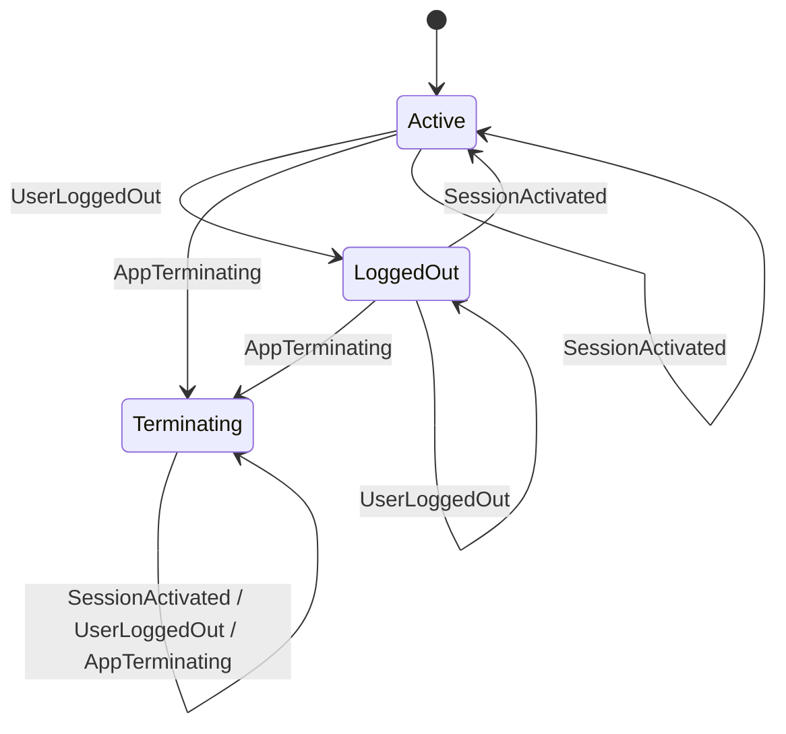
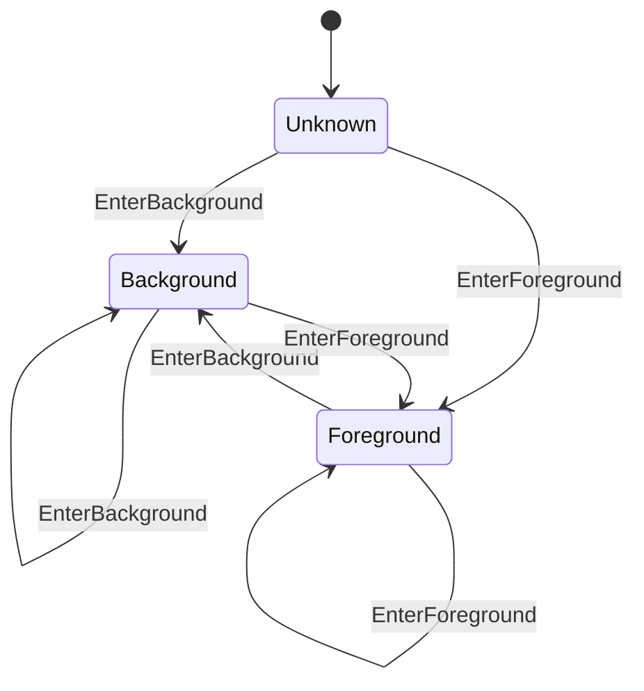
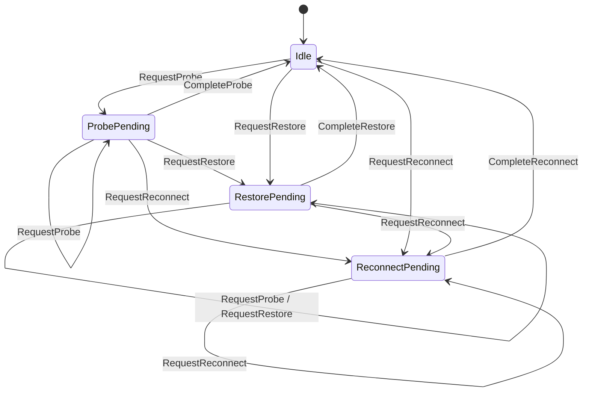
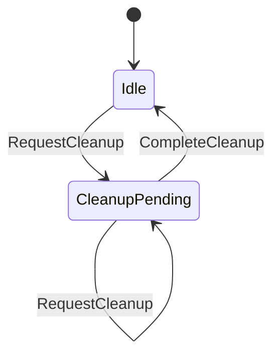
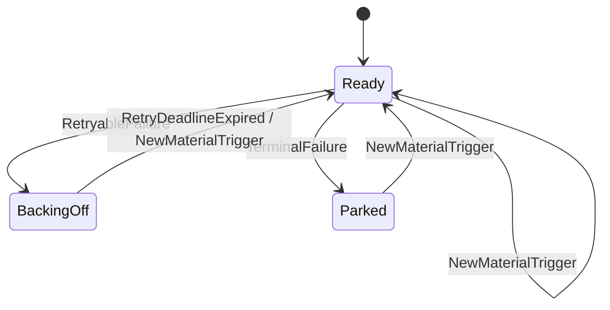
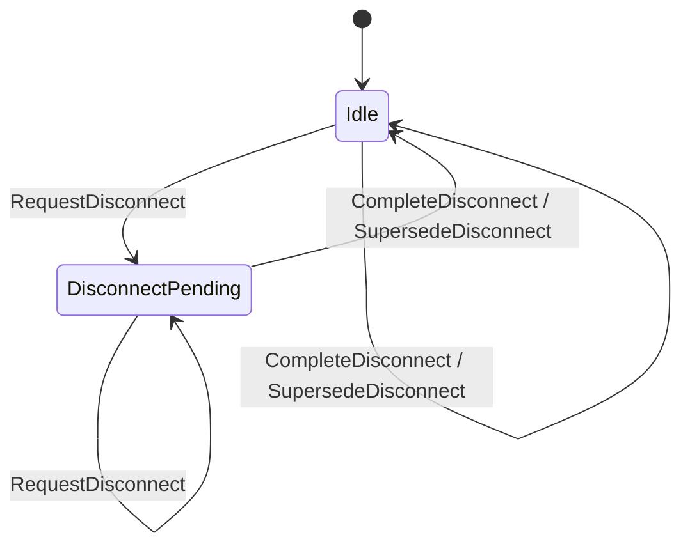
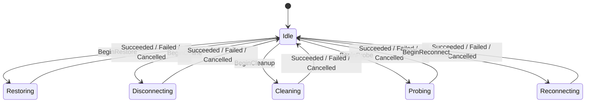
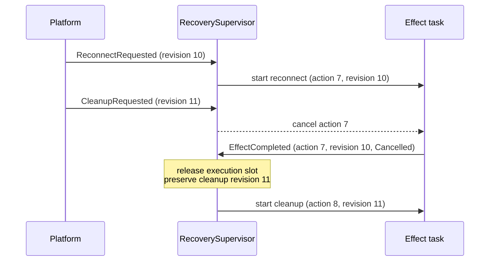
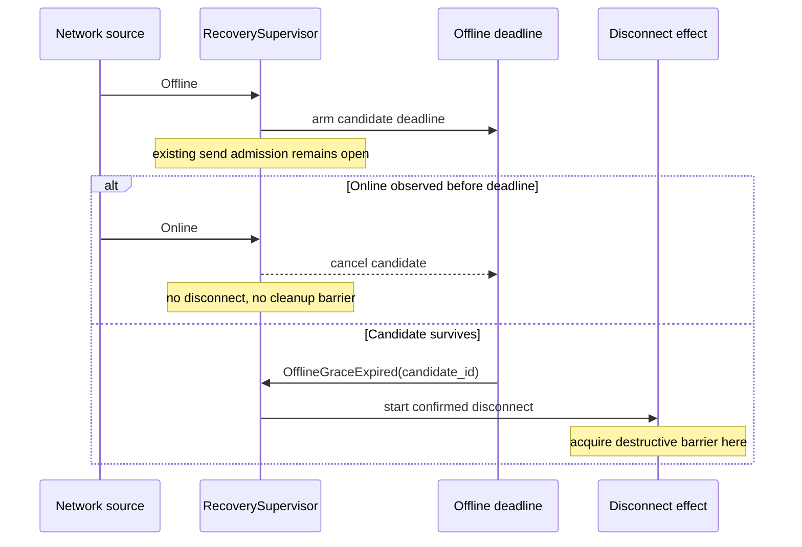
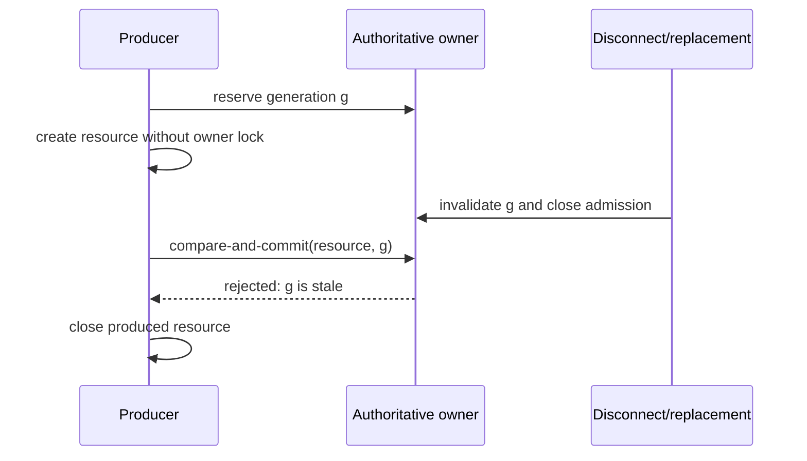

# RFC-0400: Event-driven layered connection recovery

- Status: Proposed
- Date: 2026-07-18
- RFC PR: [#401](https://github.com/Actrium/actr/pull/401)
- Tracking issue: [#400](https://github.com/Actrium/actr/issues/400)
- Superseded by: None
- Related: [Implementation draft #399](https://github.com/Actrium/actr/pull/399),
  [YASM](https://github.com/kookyleo/yasm)

## Summary

One responsive `RecoverySupervisor` owns connection-recovery policy. Small,
orthogonal state machines describe what is true and what work is pending;
generation-checked effect tasks perform asynchronous I/O without blocking the
supervisor. Successful transitions advance when their event arrives, not after
a fixed sleep or polling tick. Time remains only when it has an explicit
product, protocol, retention, failure, backoff, or compatibility meaning. The
design also defines cancellation-safe single-flight ownership and
compare-and-commit rules for signaling, WebRTC, destination transports, wire
pools, mailboxes, and runtime quotas.

## Motivation

Connection recovery crosses several independently changing layers in
`core/hyper`:

- `core/hyper/src/lifecycle/network_event.rs` receives app and network facts;
- `core/hyper/src/lifecycle/node.rs` owns the runtime lifecycle;
- `core/hyper/src/wire/webrtc/signaling.rs` owns the signaling socket and
  automatic reconnect work;
- `core/hyper/src/wire/webrtc/coordinator.rs` owns WebRTC peer recovery;
- `core/hyper/src/transport/peer_transport.rs` and
  `core/hyper/src/transport/wire_pool.rs` publish destination transports;
- mailbox and WASM runtime code wait for work or capacity.

Historically, these paths combined independent facts in booleans and
order-sensitive fields. Some paths used fixed debounce windows or periodic
polling to discover that another task had already changed state. This creates
three classes of failure:

1. **Lost intent.** Recreating or partially resetting recovery state can forget
   work that should survive an event batch, an offline interval, or a
   foreground/background transition.
2. **Stale completion.** An old asynchronous attempt can complete after a newer
   attempt and publish, remove, or resurrect the wrong connection.
3. **Artificial latency.** A state change that is already observable can still
   wait for the next 10, 100, or 500 millisecond polling tick.

The problem is not solved by putting every field into one global FSM. App
lifecycle, path reachability, desired recovery work, effect execution,
signaling sessions, and multiple peer sessions are orthogonal dimensions.
Flattening them creates a large Cartesian product and encourages invalid
cross-layer transitions.

The expected outcome is deterministic recovery policy, a supervisor that stays
responsive while effects execute, immediate successful transitions, explicit
ownership of destructive delays, and concurrency invariants that can be tested
without depending on scheduler timing.

This RFC does not change the wire format or peer protocol. It defines internal
runtime concurrency and timing semantics that implementations and language
bindings can rely on.

## Detailed design

### Goals

The design MUST:

- keep independent state dimensions independent;
- keep the lifecycle supervisor responsive while an asynchronous effect runs;
- make the owner of every state transition explicit;
- retain recovery intent until a matching effect acknowledges the exact policy
  revision that it covered;
- prevent stale or cancelled work from committing;
- make built-in production paths event-driven on successful transitions;
- classify and justify every production timer;
- preserve the stronger compile-time guarantees already provided by Rust
  typestate;
- expose enough structured context to diagnose transitions and discarded work.

The design MUST NOT:

- create one global FSM containing all peers and transport layers;
- hold a policy-state lock across signaling, transport, or peer I/O;
- use elapsed time as evidence that a state change probably happened;
- delay a successful event merely to coalesce work in the built-in policy;
- let a timeout, cancellation, or dropped future poison single-flight
  ownership;
- let a public observer callback become the authoritative state store.

### Terms

| Term | Meaning in this RFC |
|---|---|
| Fact | An observed condition, such as app phase or network path. |
| Intent | Work that remains required until a matching effect acknowledges it. |
| Effect | Asynchronous I/O started by policy, such as probe, reconnect, or cleanup. |
| Owner | The only component allowed to mutate a state domain. |
| Revision | A monotonic version assigned to material non-completion policy inputs. |
| Generation / session | The identity of one resource-creation attempt or resource lifetime. |
| Commit | Publish a produced resource as current after validating its identity. |
| Single-flight | At most one effect or creation attempt owns a scoped execution slot. |
| Hysteresis | A deliberate, bounded delay before a destructive policy decision. |
| Structural duplicate | An input whose meaningful policy fields equal the last accepted value. |
| Linearize | Make concurrent operations appear in one order at an explicit owner boundary. |

### State decomposition

One persistent `RecoverySupervisor` actor is the sole writer of lifecycle
recovery policy. It continues receiving facts and completions while an effect
runs. Its state has three layers.

#### Facts and gates

These machines describe current conditions. They do not describe work or I/O:

```text
RecoveryMode
  Active | LoggedOut | Terminating

AppPhase
  Unknown | Foreground | Background

NetworkPath
  Unknown | Online | OfflineCandidate | Offline
```

`NetworkPath` is the supervisor's policy view of accepted path observations,
not a mirror of every platform field. `OfflineCandidate` and `Offline` mean
that policy has respectively delayed or committed the offline decision.
The latest raw snapshot remains extended context.

#### Pending work

These machines describe desired work. Each domain can remain pending
independently:

```text
RecoveryIntent
  Idle | ProbePending | RestorePending | ReconnectPending

CleanupWork
  Idle | CleanupPending

OfflineWork
  Idle | DisconnectPending
```

Every non-idle pending-work record is qualified by its own retry gate:

```text
RetryGate
  Ready | BackingOff | Parked
```

`RetryGate` separates "work is still required" from "work may start now".
`Ready` is eligible, `BackingOff` owns one exact retry deadline, and `Parked`
waits for a new material fact or explicit command after automatic retries are
exhausted. Dropping or superseding the pending work also drops its gate.
Duplicate facts never reset an attempt count or deadline.

The retry gate also owns extended context:

```text
{ attempt, retry_id, deadline }
```

`attempt` counts consecutive failures of the current work. `retry_id`
identifies the one armed deadline; it changes whenever that deadline is
replaced. It is a runtime instance identity, distinct from the timer
inventory's stable source ID. A material fact that changes the failed attempt's
assumptions, or an applicable explicit command, sends `NewMaterialTrigger`,
cancels the old deadline, and makes the work `Ready`. A structural duplicate
does none of these. Retry limits, error classification, and backoff calculation
are centralized policy by effect kind rather than decisions made at call sites.

Each effect kind defines one reviewed error-classification table, retry budget,
backoff curve, and maximum delay. Failures likely to affect many clients at
once use bounded jitter to avoid a reconnect herd; the random source is injected
for deterministic tests. Authentication, configuration, and invariant errors
that cannot improve by repeating the same operation are terminal under the
current facts. A backoff deadline is computed once and never extended by a
duplicate event.

`RecoveryMode` answers whether automatic recovery may start at all.
`AppPhase` answers whether active recovery is currently foreground-eligible.
They remain separate because backgrounding is reversible and preserves
recovery intent, while logout and termination inhibit recovery until an
explicit session activation.

The `OfflineCandidate` deadline and identity, the latest network snapshot, and
the revision attached to each pending work domain are extended state owned by
the supervisor. They do not expand the discrete state graph.

#### Effect execution

Asynchronous I/O is represented by a separate single-flight state machine:

```text
Execution
  Idle
  | Disconnecting
  | Probing
  | Restoring
  | Reconnecting
  | Cleaning
```

Every non-idle execution carries:

```text
EffectContext
  { action_id, kind, policy_revision, cancellation, cancel_reason, started_at }
```

Conceptually, the supervisor's extended work state is:

```text
policy_revision: u64
recovery: Option<{ kind, revision, retry: RetryGateContext }>
cleanup: Option<{ reason, revision, retry: RetryGateContext }>
offline_disconnect: Option<{ candidate_id, revision, retry: RetryGateContext }>
effect: Option<EffectContext>
```

The policy states answer what is true and what work is desired. `Execution`
answers which side effect currently owns the single-flight execution slot.
`EffectContext` is present exactly when `Execution` is not `Idle`. The effect
runs in a separate task and reports a message back to the supervisor; the
supervisor never awaits effect I/O in an actor turn or carries a resource lock
across it.

This slot serializes lifecycle-wide policy effects, not every network
operation. One effect executes its dependency graph in the minimum required
order and runs independent child operations concurrently under one overall
deadline. Destination-scoped peer recovery keeps its own single-flight slot and
may run concurrently when it cannot conflict with the lifecycle effect's
generation or teardown scope. This avoids both unsafe overlap and unnecessary
global serialization.

`Online`, `Ready`, and `Failed` are not execution states. A failure is an effect
result with diagnostic data; the policy layer decides whether intent remains
pending and whether a later retry is allowed.

YASM is used for deterministic synchronous transitions where its transition
table and invalid-transition checks improve reviewability. Numeric sequence
values, deadlines, connection handles, cancellation tokens, and error details
remain extended context rather than being expanded into states.

Rust compile-time typestate such as
`Node<Init> -> Node<Attached> -> Node<Registered> -> Node<Running>` remains
compile-time state. Replacing it with a runtime FSM would weaken the API.

### Executable state-machine reference

The following diagrams and tables are the normative target. Phase 1 implements
them with YASM and provides one checked generator using:

```rust
StateMachineDoc::<Machine>::generate_mermaid();
StateMachineDoc::<Machine>::generate_transition_table();
```

The generator replaces marked regions in this RFC and has a CI `--check` mode.
It strips YASM's document-level table heading and sorts transition tuples by
`(current_state, input, next_state)`. Mermaid output groups equal
`(current_state, next_state)` pairs and sorts their input labels. This is
required because YASM 0.6.0 builds Mermaid groups with hash maps and does not
promise raw output order. Phase 1 MUST either apply that canonicalization or pin
a later YASM release with an equivalent stable order; checking nondeterministic
raw bytes is invalid. Transition tuples are normative, while their current
presentation order is not.

The generated machines cover local transitions only; the composite decision,
preemption, retry, and revision rules later in this RFC are equally normative.

Implementation draft #399 does not yet implement every target machine in this
revision. Until it does, this RFC is the design authority. RFC-0400 cannot be
accepted until its marked regions have been regenerated canonically and the
checked generator produces no diff.

<details>
<summary>Expand state diagrams and transition tables</summary>

#### Recovery mode

The recovery-mode machine has these normative transitions:

<!-- BEGIN GENERATED: recovery-mode-mermaid -->



<!-- END GENERATED: recovery-mode-mermaid -->

<!-- BEGIN GENERATED: recovery-mode-table -->

| Current State | Input | Next State |
|---|---|---|
| Active | SessionActivated | Active |
| Active | UserLoggedOut | LoggedOut |
| Active | AppTerminating | Terminating |
| LoggedOut | SessionActivated | Active |
| LoggedOut | UserLoggedOut | LoggedOut |
| LoggedOut | AppTerminating | Terminating |
| Terminating | SessionActivated | Terminating |
| Terminating | UserLoggedOut | Terminating |
| Terminating | AppTerminating | Terminating |

<!-- END GENERATED: recovery-mode-table -->

`Terminating` is terminal for one supervisor lifetime. `ManualReset` and
`StaleConnectionSuspected` request cleanup without changing recovery mode.
`UserLogout` enters `LoggedOut`; a later network fact cannot reactivate
recovery. Only a successfully committed new session emits `SessionActivated`.

#### App phase

<!-- BEGIN GENERATED: app-phase-mermaid -->



<!-- END GENERATED: app-phase-mermaid -->

<details>
<summary>YASM-generated app-phase transition table</summary>

<!-- BEGIN GENERATED: app-phase-table -->

| Current State | Input | Next State |
|---------------|-------|------------|
| Unknown | EnterForeground | Foreground |
| Unknown | EnterBackground | Background |
| Foreground | EnterForeground | Foreground |
| Foreground | EnterBackground | Background |
| Background | EnterForeground | Foreground |
| Background | EnterBackground | Background |

<!-- END GENERATED: app-phase-table -->

</details>

#### Network path

<!-- BEGIN GENERATED: network-path-mermaid -->


<!-- END GENERATED: network-path-mermaid -->

<details>
<summary>YASM-generated network-path transition table</summary>

<!-- BEGIN GENERATED: network-path-table -->

| Current State | Input | Next State |
|---------------|-------|------------|
| Unknown | ObserveUnknown | Unknown |
| Unknown | ObserveOnline | Online |
| Unknown | ObserveOffline | OfflineCandidate |
| Unknown | CommitOffline | Unknown |
| Online | ObserveUnknown | Unknown |
| Online | ObserveOnline | Online |
| Online | ObserveOffline | OfflineCandidate |
| Online | CommitOffline | Online |
| OfflineCandidate | ObserveUnknown | Unknown |
| OfflineCandidate | ObserveOnline | Online |
| OfflineCandidate | ObserveOffline | OfflineCandidate |
| OfflineCandidate | CommitOffline | Offline |
| Offline | ObserveUnknown | Unknown |
| Offline | ObserveOnline | Online |
| Offline | ObserveOffline | Offline |
| Offline | CommitOffline | Offline |

<!-- END GENERATED: network-path-table -->

</details>

#### Recovery intent

<!-- BEGIN GENERATED: recovery-intent-mermaid -->



<!-- END GENERATED: recovery-intent-mermaid -->

<details>
<summary>Target YASM recovery-intent transition table</summary>

<!-- BEGIN GENERATED: recovery-intent-table -->

| Current State | Input | Next State |
|---------------|-------|------------|
| Idle | RequestProbe | ProbePending |
| Idle | RequestRestore | RestorePending |
| Idle | RequestReconnect | ReconnectPending |
| ProbePending | RequestProbe | ProbePending |
| ProbePending | RequestRestore | RestorePending |
| ProbePending | RequestReconnect | ReconnectPending |
| ProbePending | CompleteProbe | Idle |
| RestorePending | RequestProbe | RestorePending |
| RestorePending | RequestRestore | RestorePending |
| RestorePending | RequestReconnect | ReconnectPending |
| RestorePending | CompleteRestore | Idle |
| ReconnectPending | RequestProbe | ReconnectPending |
| ReconnectPending | RequestRestore | ReconnectPending |
| ReconnectPending | RequestReconnect | ReconnectPending |
| ReconnectPending | CompleteReconnect | Idle |

<!-- END GENERATED: recovery-intent-table -->

</details>

#### Cleanup work

<!-- BEGIN GENERATED: cleanup-work-mermaid -->



<!-- END GENERATED: cleanup-work-mermaid -->

<details>
<summary>Target YASM cleanup-work transition table</summary>

<!-- BEGIN GENERATED: cleanup-work-table -->

| Current State | Input | Next State |
|---------------|-------|------------|
| Idle | RequestCleanup | CleanupPending |
| CleanupPending | RequestCleanup | CleanupPending |
| CleanupPending | CompleteCleanup | Idle |

<!-- END GENERATED: cleanup-work-table -->

</details>

#### Retry gate

<!-- BEGIN GENERATED: retry-gate-mermaid -->



<!-- END GENERATED: retry-gate-mermaid -->

<details>
<summary>Retry-gate transition table</summary>

<!-- BEGIN GENERATED: retry-gate-table -->

| Current State | Input | Next State |
|---------------|-------|------------|
| Ready | RetryableFailure | BackingOff |
| Ready | TerminalFailure | Parked |
| Ready | NewMaterialTrigger | Ready |
| BackingOff | RetryDeadlineExpired | Ready |
| BackingOff | NewMaterialTrigger | Ready |
| Parked | NewMaterialTrigger | Ready |

<!-- END GENERATED: retry-gate-table -->

</details>

#### Offline work

<!-- BEGIN GENERATED: offline-work-mermaid -->



<!-- END GENERATED: offline-work-mermaid -->

<details>
<summary>YASM-generated offline-work transition table</summary>

<!-- BEGIN GENERATED: offline-work-table -->

| Current State | Input | Next State |
|---------------|-------|------------|
| Idle | RequestDisconnect | DisconnectPending |
| Idle | CompleteDisconnect | Idle |
| Idle | SupersedeDisconnect | Idle |
| DisconnectPending | RequestDisconnect | DisconnectPending |
| DisconnectPending | CompleteDisconnect | Idle |
| DisconnectPending | SupersedeDisconnect | Idle |

<!-- END GENERATED: offline-work-table -->

</details>

#### Recovery execution

<!-- BEGIN GENERATED: recovery-execution-mermaid -->



<!-- END GENERATED: recovery-execution-mermaid -->

<details>
<summary>Target YASM recovery-execution transition table</summary>

<!-- BEGIN GENERATED: recovery-execution-table -->

| Current State | Input | Next State |
|---------------|-------|------------|
| Idle | BeginOffline | Disconnecting |
| Idle | BeginProbe | Probing |
| Idle | BeginRestore | Restoring |
| Idle | BeginReconnect | Reconnecting |
| Idle | BeginCleanup | Cleaning |
| Disconnecting | Succeeded | Idle |
| Disconnecting | Failed | Idle |
| Disconnecting | Cancelled | Idle |
| Probing | Succeeded | Idle |
| Probing | Failed | Idle |
| Probing | Cancelled | Idle |
| Restoring | Succeeded | Idle |
| Restoring | Failed | Idle |
| Restoring | Cancelled | Idle |
| Reconnecting | Succeeded | Idle |
| Reconnecting | Failed | Idle |
| Reconnecting | Cancelled | Idle |
| Cleaning | Succeeded | Idle |
| Cleaning | Failed | Idle |
| Cleaning | Cancelled | Idle |

<!-- END GENERATED: recovery-execution-table -->

</details>

</details>

### Event model and ordering

Supervisor inputs are facts, commands, internal deadlines, or effect
completions. They request policy evaluation rather than assigning arbitrary
state:

```text
AppEnteredForeground
AppEnteredBackground
SessionActivated { session_generation }
NetworkSnapshot { source_epoch, sequence, observed_at, semantic_path }
RecoveryRequested { minimum: Probe | Restore | Reconnect, reason }
CleanupRequested { reason }
OfflineGraceExpired { candidate_id }
RetryDeadlineExpired { domain, work_revision, retry_id }
EffectCompleted {
  action_id,
  kind,
  policy_revision,
  outcome:
    Succeeded
    | Failed { class: Retryable | Terminal }
    | Cancelled
    | Aborted
}
ShutdownRequested
```

`CleanupRequested { reason: UserLogout }` drives both `CleanupWork` and the
`UserLoggedOut` input of `RecoveryMode` in one supervisor turn.
`ShutdownRequested` similarly enters `Terminating` and requests cleanup.
Probe and Restore may be derived from lifecycle or path facts;
`RecoveryRequested` also represents explicit reconnect and diagnostic commands.

Resource owners receive a separate class of identity-bearing events:

```text
SignalingGenerationChanged { generation, state }
PeerStateChanged { peer, session_id, state }
WireSlotChanged { slot, generation, state }
```

These resource events do not mutate supervisor policy directly. Their owner
first validates generation or session identity, commits its retained state, and
then emits a normalized supervisor fact when policy must change.

The supervisor processes one input at a time and assigns every dequeued input a
monotonic `event_id`. This order, not receive batching or task scheduling, is
the policy order.

`policy_revision` is the causality version of desired policy. A non-completion
input allocates the next revision only when it materially changes a fact, gate,
or pending-work domain. Structural duplicates allocate an `event_id` for
diagnostics but do not advance `policy_revision`. `EffectCompleted` never
creates a new revision; it can only acknowledge work covered by the revision
captured when that effect started.

`RetryDeadlineExpired` is accepted only when its domain, work revision, and
`retry_id` still match a `BackingOff` pending record. Acceptance advances the
policy revision, moves that record to `Ready`, updates its work revision, and
retains its consecutive-failure count before reconciling immediately. A stale
expiry is only logged. When eligibility is
temporarily lost, an implementation may stop the timer task but retains the
absolute deadline. On restored eligibility, an elapsed deadline is delivered
immediately; a future deadline is rearmed for only its remaining duration.

An external fact or command is a `NewMaterialTrigger` only when the policy for
that pending domain says it can change the failed attempt's outcome. Examples
include a new route, a committed session generation, foreground re-entry after
background made the failed work ineligible, or an explicit retry/reconnect
command. Acceptance
advances the policy revision, moves the work to `Ready`, resets its consecutive
failure count, and updates its work revision. A same-or-weaker command received
while matching work is already ready or running is coalesced; the same command
received while that work is backing off or parked is a deliberate retry and is
material. Repeating the same observed fact is never a material trigger.

Every network snapshot carries a source epoch and a sequence that is monotonic
within that epoch. The supervisor allocates a monotonically increasing
`source_epoch` when a platform path monitor is attached or restarted; the
monitor MUST NOT reset the sequence inside an existing epoch. A snapshot from
the current epoch whose sequence is not newer than the last accepted snapshot,
or from an older epoch, is discarded before policy transition. This prevents
both stale replay and the "sequence reset makes every future snapshot stale"
failure.

Consecutive snapshots that are semantically equivalent are structurally
deduplicated. A structural duplicate does not advance policy revision or reset
a deadline.

Semantic equality concerns routing behavior, not object identity or incidental
metadata. A material route change while online is immediately visible to the
recovery policy and advances `policy_revision`.

`observed_at` is stamped in the supervisor's monotonic clock domain. A platform
timestamp may be converted only when the binding can prove a stable mapping to
that domain; otherwise supervisor enqueue time is used. The first accepted offline
observation sets `deadline = observed_at + offline_grace`; an already elapsed
deadline is immediately eligible. `observed_at` never reorders accepted inputs
and is never treated as evidence that an asynchronous operation completed.

### Reconciliation and action priority

Handling an input has three stages:

1. apply the input to the relevant policy state machine;
2. derive at most one executable action from the combined policy snapshot;
3. if `Execution` is `Idle`, start that action in a separate task and record its
   `EffectContext`.

Action names have these contracts:

| Action | Contract on success |
|---|---|
| Probe | Verify the current signaling and transport path without replacing a healthy generation. |
| Restore | Establish required missing connectivity while retaining healthy current resources; success includes the Probe guarantee. |
| Reconnect | Invalidate the relevant old generation, tear it down, and restore a new one; success includes the Restore and Probe guarantees. |
| Confirmed offline disconnect | Stop path-dependent activity after offline policy commits; it does not erase future recovery intent. |
| Cleanup | Tear down scoped connection resources without restoring them; its reason may change recovery mode. |

Action selection uses this priority:

```text
Cleanup > confirmed offline disconnect > reconnect > restore > probe
```

Recovery intents have one ordered strength:

```text
Probe < Restore < Reconnect
```

A stronger recovery request replaces a weaker pending request because the
stronger effect semantically covers it. A weaker request cannot downgrade a
stronger pending request. This does not lose intent because every stronger
action includes the success guarantee of the weaker one. Promotion creates a
new `Ready` retry gate with zero failures; a completion from the replaced
attempt cannot mutate it.

Cleanup is deliberately not in this order: cleanup-only does not satisfy a
request to restore connectivity. Cleanup is held in `CleanupWork`, and
confirmed path disconnect is held in `OfflineWork`, because teardown and future
recovery intent may coexist.

Each pending-work domain stores the revision that most recently required it.
By default, work from a revision newer than a running effect is not covered by
that effect. A rule may declare coverage only when the newer input cannot
change the effect's assumptions or result; such rules belong in the executable
composite decision table rather than at individual call sites.

A cleanup-only command explicitly supersedes recovery intent whose revision is
not newer than the cleanup command; it does not semantically "cover" that
intent. Later facts receive newer revisions and remain pending. This revision
ordering replaces correctness based on receive-batch timing: batching may be
used for throughput, but it is not a policy boundary.

On `CleanupRequested { reason }`, the supervisor atomically allocates revision
`r`, records `CleanupWork::CleanupPending(r)`, and removes recovery intent with
revision `<= r`. `UserLogout` additionally enters `LoggedOut`;
`AppTerminating` enters `Terminating`; other cleanup reasons leave
`RecoveryMode` unchanged. A later fact has revision `> r` and therefore cannot
be cleared by completion of that cleanup.

`Background` gates active probe, restore, and reconnect work. It does not turn
a healthy connection into a disconnected one, erase pending intent, or block
explicit cleanup. Only a real `Background -> Foreground` transition may derive
foreground recovery work. A duplicate `Foreground` observation is a self-loop
and cannot create a second connection attempt. The supervisor records
background entry in its own monotonic clock domain; the real foreground
transition selects Probe or Reconnect from that duration and configured policy
rather than trusting a repeated caller-supplied duration.

Entering `Background` does not by itself cancel an effect already in flight.
If a platform capability policy requires cancellation because execution cannot
continue in the background, that policy records the cancellation reason and
preserves the pending work. Foreground re-entry then makes the work eligible
without inventing a new settle delay.

`LoggedOut` and `Terminating` gate every automatic probe, restore, and reconnect
regardless of app phase. Required cleanup remains eligible. `SessionActivated`
returns `LoggedOut` to `Active` only after the new session generation is
authoritatively committed.

#### Composite action decision

The following table is evaluated top to bottom when `Execution` is `Idle`.
`Eligible` means app phase is not `Background` and recovery mode is `Active`.
`Ready` means the selected pending record's `RetryGate` is `Ready`. A higher
priority pending domain shadows every lower domain even while backing off or
parked; for example, failed cleanup cannot be bypassed by starting reconnect.

| Recovery mode / app phase | Path | Pending work | Selected action |
|---|---|---|---|
| Any | Any | `CleanupPending`, not Ready | None |
| Any | Any | `CleanupPending`, Ready | Cleanup |
| Any | `Offline` | `DisconnectPending`, not Ready | None |
| Any | `Offline` | `DisconnectPending`, Ready | Confirmed offline disconnect |
| `LoggedOut` or `Terminating` | Any | Any recovery intent | None |
| `Active` / `Background` | Any | Probe, restore, or reconnect | None |
| Eligible | `OfflineCandidate` or `Offline` | Probe, restore, or reconnect | None |
| Eligible | `Unknown` or `Online` | Recovery intent, not Ready | None |
| Eligible | `Unknown` or `Online` | `ReconnectPending`, Ready | Reconnect |
| Eligible | `Unknown` or `Online` | `RestorePending`, Ready | Restore |
| Eligible | `Unknown` or `Online` | `ProbePending`, Ready | Probe |
| Any | Any | No pending work | None |

Explicit cleanup does not wait for offline hysteresis. A terminating or logout
cleanup is still eligible because it reduces resources rather than restoring
them.

#### Derived send policy

Outbound path admission is a read-only projection of authoritative policy, not
another independently mutable flag:

| Projection | Condition | Behavior |
|---|---|---|
| `Normal` | Path is `Unknown` or `Online`, with no teardown gate | Existing sends and new connection creation may proceed. |
| `ExistingOnly` | Path is `OfflineCandidate`, with no cleanup request | Existing committed sessions may send; new negotiation does not start. |
| `Blocked` | Path is confirmed `Offline`, cleanup is pending/running, or recovery mode is `LoggedOut`/`Terminating` | New outbound work fails fast or waits through an explicit caller deadline; it never waits on the 400 ms candidate timer by accident. |

Reconnect and peer-recovery effects may impose their own destination-scoped
gate, but broadcasts are never the authoritative source of this projection.

#### Effect preemption

The supervisor remains responsive while an effect task runs. Same or weaker
work is coalesced. A stronger requirement or policy reversal requests
cancellation according to this table:

| New policy condition | Running work it preempts |
|---|---|
| Cleanup | Disconnect, probe, restore, reconnect |
| Path returns to `Unknown` or `Online` | Confirmed offline disconnect |
| Confirmed offline disconnect | Probe, restore, reconnect |
| Reconnect | Probe, restore |
| Restore | Probe |
| Probe or same/weaker work | None |

Preemption cancels the running task but does not directly mutate its execution
state. Before requesting cancellation, the authoritative resource owner
invalidates any commit right that the old effect must no longer exercise. The
task, its owner guard, or a join monitor then reports a terminal
`EffectCompleted` outcome. A stronger effect starts after the single-flight
slot returns to `Idle`; immediate generation invalidation, not cooperative
cancellation speed, is the correctness boundary.

A path reversal sends `SupersedeDisconnect` to `OfflineWork` and requests
cancellation of a running disconnect. The disconnect effect checks cancellation
before each destructive commit boundary. If teardown already crossed such a
boundary, the recovered path derives Restore immediately after the old slot is
released; it does not wait for a polling tick or another path event. Explicit
Cleanup is not reversed by a path observation.

#### Completion and acknowledgement

An effect completion is accepted only when `action_id`, `kind`, and captured
`policy_revision` all match the current `EffectContext`. A stale or malformed
completion is logged and discarded without mutating policy state. For the
current action:

1. return `Execution` to `Idle`;
2. locate the pending domain and revision that the effect attempted;
3. on success, acknowledge only work whose revision is no newer than the
   effect's captured `policy_revision` and whose required impact is covered by
   the completed effect;
4. on a retryable failure of still-current work, increment its attempt and
   enter `BackingOff` with one policy-computed absolute deadline, or enter
   `Parked` if its retry budget is exhausted;
5. on a terminal failure of still-current work, enter `Parked`;
6. on supervisor-requested cancellation, retain work without incrementing its
   attempt; changed facts or stronger pending work make the cancelled action
   ineligible, so it cannot immediately restart unchanged;
7. treat an unexpected `Aborted` outcome as a retryable failure after recording
   the diagnostic distinction;
8. preserve newer or stronger pending work, then reconcile immediately.

Immediate reconciliation may start other eligible work. It cannot restart the
same failed work because that record is no longer `Ready`. A completion for
work that has already been superseded releases only the execution slot; it
does not create a retry gate or alter the replacement's attempt count.

`Cancelled` is valid only when `EffectContext.cancel_reason` records a
supervisor cancellation request. A task that ends as cancelled without that
record is normalized to `Aborted`; this prevents an unexplained cancellation
from bypassing failure policy.

Acknowledgement domains are explicit:

- Probe, Restore, and Reconnect acknowledge only `RecoveryIntent`, according to
  `Probe < Restore < Reconnect`;
- confirmed offline disconnect acknowledges only `OfflineWork`;
- Cleanup acknowledges matching `CleanupWork` and may supersede older
  `OfflineWork` because the physical teardown covers it;
- Cleanup never acknowledges a later recovery intent.

The supervisor dispatches a YASM completion input only when the corresponding
pending domain and covered revision still match. For example, `CompleteProbe`
is not sent to a `ReconnectPending` recovery machine after intent promotion.
The completion still releases its matching execution slot, but it cannot cause
an invalid policy transition.

For example, if Cleanup is requested while Probe runs, Probe completion may
release the Probe execution slot but cannot clear Cleanup. If a material route
fact arrives while Reconnect runs, completion of that older Reconnect cannot
acknowledge work derived from the newer route fact.

An aborted or dropped effect task MUST produce a terminal outcome or have its
ownership synchronously reclaimed by an identity-bearing guard. It cannot
leave `Execution` permanently non-idle. The supervisor normalizes `Aborted` to
the execution machine's `Cancelled` input to release the slot, while policy
handles it as the retryable failure described above.

Platform event submission and effect completion are separate observations. A
platform callback receives `event_id` and `policy_revision` once the fact is
normalized and authoritatively owned by the supervisor; it does not
synchronously wait for teardown or reconnection. Callers that need the final
outcome observe a revision/action status stream; an `action_id` is added when
pending work actually starts. A local result timeout does not cancel an already
accepted effect.



### Offline hysteresis

An unavailable path first enters `OfflineCandidate` and owns a 400 millisecond
deadline. The purpose is narrowly defined: avoid a destructive disconnect for
a transient path flap.

The deadline is not a global debounce window:

- an online event immediately rolls `OfflineCandidate` back to `Online`;
- material online route changes are not delayed;
- cleanup bypasses the grace period;
- probe, restore, and reconnect do not acquire their own 400 millisecond timer;
  their eligibility is controlled by path state;
- expiry is accepted only for the current candidate identity;
- repeated equivalent unavailable facts do not extend the deadline.

Entering `OfflineCandidate` MUST NOT acquire a destructive cleanup barrier or
implicitly block every outbound send. The confirmed offline-disconnect effect
acquires that barrier only after the candidate commits. During the candidate
interval, `ExistingOnly` permits traffic on an existing committed session but
does not start a new negotiation. The 400 milliseconds cannot be hidden inside
an unrelated cleanup guard.

The deadline boundary is deterministic because both path snapshots and
`OfflineGraceExpired` are serialized through the supervisor mailbox. The
deadline owner enqueues the expiry when it becomes ready. A snapshot dequeued
before the matching expiry may roll the candidate back; an expiry dequeued
first commits it. A timestamp never retroactively changes that order, and the
implementation MUST NOT delay expiry to wait for another input or add a second
settle window.

After validating `candidate_id`, `OfflineGraceExpired` sends the path machine's
semantic `CommitOffline` input and creates `OfflineWork`. Cleanup may send the
same path input while deliberately assigning teardown to `CleanupWork`.

A later `ObserveOnline` or `ObserveUnknown` input invalidates the candidate,
supersedes `OfflineWork`, and applies the reversal rule above. This remains true
after the disconnect effect starts; the generation and cancellation checks,
not elapsed time, decide whether an old destructive step may still commit.

An explicit reconnect received during `OfflineCandidate` is retained
immediately. It cannot run until the path becomes eligible, but its intent
timestamp and revision are not shifted by 400 milliseconds. Explicit cleanup
preempts the candidate immediately: it invalidates the candidate timer, commits
the path to `Offline` for policy purposes, and lets `CleanupWork` own the
teardown instead of creating duplicate `OfflineWork`. A later authoritative
path fact may move the path back to `Online`.



This is business hysteresis because the product intentionally prefers retaining
a possibly healthy session for a short interval over performing an expensive
disconnect. If product evidence later supports a different interval, the
constant may change without changing the state model.

### Generation and session commit gates

Every asynchronous resource family has a monotonic identity:

- signaling connection attempts use `connection_generation`;
- destination connection flights use identity-bearing shared flight objects;
- WebRTC peers use `session_id` and, where required, an ICE generation;
- lifecycle effects use `action_id` and captured `policy_revision`;
- wire-pool slots use a per-slot generation in addition to the pool's closed
  generation.

Starting a replacement invalidates the identity that an older completion would
need to commit. Producing a resource is not sufficient to publish it. The
producer MUST re-enter the authoritative owner and compare its identity with
the current generation or flight under the same synchronization boundary used
by close and replacement.

The commit rule is:

```text
commit(resource, identity) succeeds
  iff identity is still current and the owner is still open
```

On failed commit, the producer closes or drops the resource it created. It MUST
NOT remove the replacement's state.

Disconnect invalidates both explicit and automatic in-flight signaling
attempts. Pausing automatic reconnect is a different operation and MUST NOT
implicitly cancel a valid explicit attempt.

For signaling, generation validation, socket publication, and the transition to
`Connected` occur under one authoritative commit facade shared with disconnect.
It is invalid to check generation, release the synchronization boundary, and
then publish sink, stream, state, hooks, or public events. Observer hooks run
after commit and cannot block the transport owner.

For destination transports, closing state and the current connection flight
belong to one owner or obey one documented lock order. Code MUST NOT await a
closing-state lock while holding a transport-map lock if the close path can
take them in the opposite order. `close_all` first closes admission for the
whole registry, then detaches flights; no new flight can enter between the
drain and per-destination closing marks.



### Cancellation-safe single-flight

Single-flight ownership is represented by an RAII guard or identity-bearing
flight object. If the creator future is aborted, reaches a deadline, is
cancelled by lifecycle, or is dropped by its caller, guard destruction releases
only that exact ownership generation and wakes waiters.

Waiters MUST:

1. register for notification;
2. recheck authoritative state;
3. wait only if the desired transition has not already happened.

This ordering prevents lost wakeups. Notification primitives are hints to
re-read authoritative state; a notification is not itself the state.

Level state observed by multiple waiters, such as DataChannel readiness, ICE
gathering phase, signaling generation, quota availability, or pool readiness,
SHOULD use `watch`, a semaphore, or an equivalent retained-state primitive. A
single transition MUST NOT rely on `notify_one()` when every current waiter
must re-evaluate. If `Notify` is used, the implementation must distinguish
stored single permits from `notify_waiters()` generation semantics and prove
registration ordering with deterministic tests.

Wire-pool close, add, replacement, and successful connection publication are
linearized through one authoritative pool state containing `closed` and slot
generations. `add_connection` rejects a closed pool before publishing
`Connecting`. A late success or failure can mutate a slot only if its generation
is still current. Close cancels and joins, or otherwise observes terminal
completion of, detached connection tasks before reporting quiescence.

### Event-driven observation

If a successful state change is already observable, the implementation MUST use
that event source. The built-in paths use:

- DataChannel open callbacks or notifications;
- buffered-low callbacks for graceful send-buffer drain;
- WebRTC peer-connection state broadcasts for initial readiness;
- ICE gathering callbacks and completion notifications;
- ICE restart generation/state broadcasts;
- mailbox enqueue notifications plus concurrent observation of in-flight
  reply/ack completion;
- permit-release notifications for WASM quota;
- peer-state notifications plus the nearest exact stale deadline;
- cancellation tokens for lifecycle and shutdown.

For every callback-to-wait bridge, the consumer subscribes or registers before
the final authoritative read. Initial WebRTC readiness therefore subscribes
before checking both peer and DataChannel state; ICE gathering registers before
the final gathering-state read; signaling-generation waits install their
receiver before checking the generation. A broadcast-only event is insufficient
unless a retained authoritative snapshot is re-read after subscription.

A DataChannel Open or Closed transition wakes every sender waiting on that level
state. Graceful buffer drain also observes channel closure, so a closed channel
does not wait for the complete drain failure deadline.

The stale-peer reaper reads state and `last_state_change` from one authoritative
snapshot. It cannot combine live peer-connection state with the timestamp of an
older cached state. Quota waits register before retrying authoritative
acquisition, and quota release is resource-specific or semaphore-backed so
multiple releases cannot collapse while capacity remains available.

A receiver observing a closed channel exits immediately. It does not sleep
before checking again.

The mailbox event loop waits concurrently for shutdown, new enqueue work, and
the next in-flight reply/ack completion. Waiting only for enqueue when storage
is empty is invalid because it can starve completions that are already in
flight.

### Timer policy

Every production use of `sleep`, `sleep_until`, `interval`, `timeout`, or an
equivalent primitive MUST belong to one of these categories:

| Category | Allowed purpose | Exit or wake behavior |
|---|---|---|
| Business hysteresis | Confirm an offline candidate before destructive disconnect | An opposing fact rolls back immediately |
| Protocol selection | Prefer a better protocol candidate, such as an ICE candidate class, within a bounded window | The first candidate meeting the configured selection policy wins; the window is not generic synchronization |
| Protocol schedule | Run or rate-limit ping, heartbeat, lease, offer, or runtime-preemption work required by a protocol or safety contract | The schedule initiates or admits protocol work; it does not poll for completion |
| Retention expiry | Expire stale peers, deduplication records, reassembly state, caches, or other retained state at its exact lifetime boundary | A state change cancels or recomputes the nearest deadline; there is no periodic full scan when an exact deadline is available |
| Failure deadline | Bound connect, I/O, RPC, hook, shutdown, ICE, or drain duration | Event or future success wins immediately |
| Failure backoff | Avoid a hot loop after an observed failure | A material trigger wakes work immediately; lost eligibility may suspend the timer but never resets its absolute deadline |
| Compatibility polling | Support an external implementation that cannot emit the required event | Explicitly documented and not used by the built-in production backend |
| Compatibility debounce | Preserve an explicitly selected legacy coalescing contract during migration | Only opted-in callers pay the delay; it is deprecated and never used for correctness |

Outside the explicitly deprecated compatibility adapters, timers MUST NOT:

- sequence ordinary successful transitions;
- be used as a substitute for an available callback or notification;
- add a grace period above an existing failure deadline;
- periodically scan state when the next exact deadline and state-change event
  are available;
- reset a deadline because a duplicate state event was received;
- multiply one end-to-end failure budget by awaiting child tasks sequentially
  with a fresh full timeout for each child.

A failure timeout races the actual operation. It does not add latency when the
operation succeeds. Parallel shutdown or close work shares one overall deadline
and joins children concurrently; after that deadline, remaining children are
cancelled or aborted according to their ownership contract.

ICE candidate acceptance waits are protocol selection, not polling.
The implementation draft's host/srflx/prflx/relay defaults of
`0/20/40/100 ms` remain valid policy defaults until interoperability or
production telemetry justifies changing them. This RFC's requirement to remove
unnecessary waits does not mean setting protocol selection windows to zero.

#### Auditable timer inventory

Principles alone are insufficient to prove that every timer is intentional.
Production code MUST create timers through one audited timer facade or macro
that requires a stable timer ID and category. Direct
`tokio::time::{sleep, sleep_until, interval, timeout, timeout_at}` calls are
allowed only inside that facade and test-only code. Equivalent timers owned by
external libraries, such as ICE candidate-selection durations, are registered
through the same policy API.

The facade generates a source-controlled inventory with one entry for every
production timer ID. Each entry records:

| Field | Meaning |
|---|---|
| Stable ID and source owner | The timer and subsystem that owns it |
| Category | One category from the table above |
| Duration source | Constant, configuration, protocol field, or computed exact deadline |
| Arm condition | The fact or failure that makes the timer eligible |
| Success signal | Future, callback, watch, semaphore, or authoritative state that wins immediately |
| Interrupt source | Lifecycle, shutdown, replacement generation, or none with justification |
| Expiry effect | The exact state transition or failure produced |
| Reset rule | Which material event may replace the deadline; duplicates never do |

CI MUST fail on an unaudited raw timer call, an unregistered external timer, an
unused inventory entry, a duplicate stable ID, or generated state-machine
documentation drift. A timer trace records its stable ID, category, deadline,
owner identity, and elapsed duration.

The initial inventory MUST explicitly include at least:

| Timer family | Category |
|---|---|
| 400 ms offline candidate | Business hysteresis |
| ICE candidate acceptance 0/20/40/100 ms | Protocol selection |
| Heartbeat, ping, lease, ICE offer throttle, Wasmtime epoch tick | Protocol schedule |
| Stale peer, deduplication, activity, reassembly, and cache expiry | Retention expiry |
| Connect, send, RPC, hook, close, drain, ICE and shutdown deadlines | Failure deadline |
| Signaling, credential, connection and ICE restart retry delays | Failure backoff |
| Third-party mailbox empty-queue interval | Compatibility polling |
| Legacy nonzero network-event debounce | Compatibility debounce |

The built-in SQLite mailbox implements depth/enqueue observation and therefore
does not use empty-queue polling. For compatibility, a third-party mailbox that
does not implement `MailboxDepthObserver` may use the documented fallback
interval. Making observation mandatory is a separate breaking public-API
proposal.

### Authoritative state and public observers

Callbacks, broadcasts, and notifications wake consumers; they are not
authoritative state. A laggable broadcast MUST NOT be the sole source of a
business-critical send gate. Consumers re-read an authoritative snapshot or
watch value before acting.

Public observer delivery is decoupled from the underlying connection state
machine. A slow observer may delay its own notification stream but MUST NOT
block transport progress or become able to publish stale state.

### Verification strategy

Correctness is demonstrated at five levels:

1. YASM transition tests cover every declared transition and reject invalid
   normalized inputs.
2. A pure reference reducer checks the composite action table, revision
   acknowledgement, retry gating, and derived send policy over bounded input
   sequences that include an effect in flight.
3. Deterministic race tests use injected barriers to place disconnect,
   replacement, cancellation, and state notification at each commit boundary.
   They do not rely on wall-clock sleeps to "increase the chance" of a race.
4. Paused-time tests verify exact deadlines, duplicate-event behavior, and the
   absence of successful-path polling latency. They also prove that retry
   expiry fires once, stale expiry cannot wake replacement work, and
   background/foreground suspension never grants a fresh full backoff.
5. Integration tests cover signaling reconnect, ICE restart, mobile
   foreground/background transitions, full disconnect recovery, mailbox
   progress, and graceful shutdown.

Where practical, lock and atomic ownership code SHOULD also run under a
systematic concurrency checker such as Loom. A passing end-to-end test cannot
substitute for a missing deterministic invariant test.

Performance validation records enqueue-to-decision and event-to-effect-start
latency at p50, p95, and p99, plus idle wakeups and reconnect-attempt counts.
Successful paths must show no fixed latency floor, and an idle instance has no
wakeup source beyond its documented protocol schedules or exact deadlines.
Benchmarks include concurrent destination flights so global policy ownership
cannot hide accidental resource-level serialization.

### Diagnostics

Recovery logs and tracing spans SHOULD include, when applicable:

- `connection_generation`;
- peer identity and `session_id`;
- `event_id`;
- network `source_epoch` and sequence;
- `policy_revision`, `action_id`, and captured effect revision;
- pending-work domain, retry-gate state, attempt, `retry_id`, and failure class;
- old state, input, and new state;
- reason a stale completion or duplicate fact was discarded;
- timer inventory ID, category, and deadline when a timer is armed;
- elapsed operation duration.

Logging MUST use the repository's canonical `ActrId::to_string_repr()` and
`ActrType::to_string_repr()` representations.

### Required invariants

Implementations conforming to this RFC must demonstrate:

1. Duplicate or stale snapshots cannot mutate path state, while a new source
   epoch can begin a fresh monotonic sequence.
2. Fast offline-to-online rollback performs no disconnect. A reversal after
   offline commit supersedes pending disconnect, cancels a running disconnect
   at its next commit boundary, and derives immediate restoration if teardown
   already committed.
3. `OfflineCandidate` allows existing-session traffic, starts no new
   negotiation, and places no destructive cleanup barrier in front of sends.
4. Cleanup cannot acknowledge a later recovery fact.
5. `LoggedOut` and `Terminating` cannot be reactivated by network facts.
6. Duplicate foreground observations do not create recovery work.
7. Background preserves recovery intent and healthy sessions while gating new
   active recovery; it cancels in-flight work only under an explicit platform
   capability policy.
8. Lifecycle-wide recovery effects are single-flight while the supervisor
   remains responsive; independent resource-scoped flights are not serialized
   unless their generation or teardown scopes conflict.
9. A completion with stale or mismatched action, kind, or revision cannot
   acknowledge work; a weaker effect cannot acknowledge newer or stronger
   intent.
10. Failed work cannot hot-loop: it is in `BackingOff` or `Parked`, a duplicate
    input cannot reset its retry state, and only a matching deadline or material
    trigger can make it `Ready`.
11. Event acceptance does not wait for effect completion, and a caller timeout
    cannot silently cancel or orphan accepted work.
12. A stale signaling generation cannot publish `Connected` or invoke a
    connected observer.
13. A cancelled creator releases ownership without erasing its replacement.
14. Only the current destination flight may commit transport state.
15. Close and late connection success or failure are linearized.
16. Transport creation racing per-peer or close-all teardown cannot deadlock.
17. Every DataChannel state waiter wakes on an Open or Closed transition.
18. Initial readiness and ICE gathering cannot lose a transition between state
    read and event subscription.
19. Duplicate peer-state events do not extend stale-peer lifetime, and the
    reaper never combines a new state with an old state's timestamp.
20. Empty mailbox storage does not starve in-flight reply/ack completion.
21. Available quota cannot remain idle because several release notifications
    collapsed into one.
22. Ordinary successful transitions do not wait for a fixed polling interval or
    consume a failure deadline after their success event.
23. Parallel shutdown is bounded by one overall deadline rather than the number
    of registered child tasks multiplied by a per-child timeout.
24. Every production timer uses the audited facade and has exactly one valid
    inventory classification.

## Drawbacks

The design introduces more explicit state types and identities than a
flag-based implementation. Engineers must decide which layer owns each new
fact, maintain effect and resource generations, and understand policy state
separately from execution state.

Event-driven code can still contain lost-wakeup bugs if notification
registration and authoritative-state rechecks are ordered incorrectly.
Generation checks and RAII guards also add implementation discipline and test
surface.

The 400 millisecond offline hysteresis intentionally delays a destructive
disconnect. This is not minimum latency for confirmed physical loss, but it
avoids substantially more expensive reconnect churn during transient path
events. It does not delay cleanup or place an implicit 400 millisecond barrier
in front of outbound sends.

Protocol selection windows, including ICE candidate-class acceptance waits, can
intentionally delay selection of a merely usable candidate in order to obtain a
better one. Their values require protocol and production evidence rather than a
blanket zero-latency rule.

Compatibility with mailboxes that cannot emit enqueue/depth events means the
SDK cannot guarantee zero polling for arbitrary third-party implementations
without a future breaking API change.

## Alternatives

### One global connection FSM

A single FSM could enumerate app phase, path, signaling, recovery action, and
every peer state. It gives one transition table but creates a Cartesian product
whose size grows with the number of peers. It also permits transitions that
cross ownership boundaries. Orthogonal state machines with one reconciliation
boundary preserve explicit policy without flattening independent dimensions.

### Flags and procedural conditionals

Keeping booleans such as `connected`, `connecting`, `recovering`, and
`suppressed` minimizes type definitions. It does not define which combinations
are valid or which write wins. Pending work can be cleared accidentally, and a
stale task can commit unless every call site independently remembers the same
rules.

### Global debounce or event batching

A fixed settle window can merge noisy input and reduce action count, but it
adds its full duration to unrelated actions and makes correctness depend on
arrival order within the window. Structural deduplication removes equivalent
facts without delay. The only retained window belongs to the reversible
offline candidate because it protects a destructive action.

### Periodic polling

Polling is simple when a dependency exposes only a getter. Where callbacks,
channels, notifications, watches, or exact deadlines exist, polling adds
latency and wakeups and complicates shutdown. The RFC permits a documented
compatibility-polling path only when the implementation cannot provide an event
source.

### Make mailbox observation mandatory immediately

Requiring `MailboxDepthObserver` would remove the final compatibility-polling
path,
but it would break third-party mailbox implementations in the current public
API. This RFC makes the built-in backend event-driven and leaves the breaking
trait change to a dedicated proposal.

### Actorize every resource owner

This RFC makes the lifecycle `RecoverySupervisor` an actor because it must stay
responsive while effects execute and has one natural policy owner. Converting
every signaling socket, peer, transport, and wire slot into an actor would be a
broader migration with its own overhead and failure model. Resource owners may
instead use typed state behind one synchronization facade, provided generation
checking and close/publication are linearized and no lock-order cycle exists.

### Make no change

The SDK would retain order-sensitive recovery, stale-completion races,
avoidable polling latency, and timers with ambiguous semantics. These failures
become more likely on mobile lifecycle transitions and unstable networks, where
events from several layers arrive concurrently.

## Compatibility and phasing

This RFC changes no peer wire format or signaling protocol message. Internal
state types, synchronization, and observer wiring may change freely within the
0.x compatibility policy.

Platform bindings may preserve their existing network-callback signatures
through an adapter that attaches the supervisor-issued `source_epoch`, a
sequence, and `observed_at`. The supervisor still assigns `event_id` when it
dequeues the input. Existing callbacks that currently wait for teardown or
reconnection must either:

- change their documented result to mean "accepted by the supervisor"; or
- gain a new acceptance API while the old completion-waiting API is deprecated.

The SDK MUST NOT silently keep a five-second callback contract while allowing
the effect to continue after the caller receives a timeout. Final effect status
is observed separately by revision and `action_id`.

`MailboxDepthObserver` remains optional in this RFC, so third-party mailbox
implementations retain the documented compatibility-polling path.

The proposal is phased as follows:

### Phase 1: executable policy documentation

- add `RecoveryMode`, separate `CleanupWork`, reusable `RetryGate`, and update
  the cancellation-aware YASM machines;
- generate deterministically sorted diagrams, local transition tables, and the
  composite decision table through a checked documentation command;
- establish a source-controlled timer inventory and CI drift checks.

Acceptance criteria: generated documentation matches the target policy in this
RFC, and every existing production timer has one inventory entry.

### Phase 2: responsive policy and effect execution

- introduce the persistent layered recovery supervisor and execution state;
- run effects outside the supervisor and pass versioned completion messages
  back to it;
- retain recovery intent across receive cycles and lifecycle transitions;
- implement recovery gating, foreground self-loop, preemption, revision
  acknowledgement, retry gating, and offline barrier semantics;
- separate event acceptance from effect completion.

Acceptance criteria: invariants 1 through 11 pass under paused-time and
deterministic interleaving tests without scheduler sleeps.

### Phase 3: generation and cancellation safety

- apply generation/session commit gates to signaling, destination flights,
  peers, and wire-pool publication;
- make creator ownership cancellation-safe;
- linearize close and successful or failed publication;
- remove destination lock-order cycles and close-all admission gaps.

Acceptance criteria: invariants 12 through 16 pass, including generation-check
versus disconnect, aborted creator, close-all versus creation, late completion,
and lock-order interleavings.

### Phase 4: event-driven production paths

- replace successful-path transport, ICE, mailbox, quota, and stale-peer
  polling with notifications, callbacks, watches, broadcasts, or exact
  deadlines;
- use retained level-state observation for multi-waiter readiness;
- replace subsystem-local blind retry sleeps with exact, identity-bearing
  backoff deadlines that material events can interrupt without resetting;
- document compatibility polling and debounce behavior and classify every new
  timer.

Acceptance criteria: invariants 17 through 24 pass. Race tests place transitions
inside the former subscription windows through injected barriers rather than
probabilistic sleeps.

### Phase 5: integration validation

- run formatting, compile checks, strict Clippy, library tests, concurrent
  dispatch, signaling reconnect, ICE restart, mobile recovery, and
  large-message recovery suites;
- run recovery-latency, idle-wakeup, and concurrent-flight benchmarks and
  compare them with the pre-migration baseline;
- validate supported language bindings and the minimum Rust version in CI.

Acceptance criteria: all enabled checks pass; ignored/manual tests remain
explicitly identified. The RFC documentation generator and timer-inventory
checker also pass in CI. Benchmarks show no fixed successful-path latency floor
or undocumented idle wakeup; any throughput or tail-latency regression requires
an explicit review decision.

Draft implementation PR #399 may be used to validate the proposal, but its
existence does not imply RFC acceptance. Maintainers may require the
implementation to change during RFC review.

## Unresolved questions

No design question blocks acceptance. This RFC makes these choices:

- the built-in network-event debounce is zero; the explicit nonzero option is a
  deprecated compatibility path and is classified as compatibility debounce;
- mailbox observation remains optional until a separate breaking API proposal;
- offline hysteresis defaults to 400 milliseconds and is measured by rollback,
  avoided-reconnect, and time-to-recovery telemetry;
- the audited timer facade is normative; its concrete generated-inventory
  format is an implementation detail;
- supervisor enqueue time is the default `observed_at`; a platform timestamp is
  used only after proven conversion into the same monotonic clock domain.

A later material change to these choices requires a follow-up RFC rather than an
implementation-only deviation.

## Future possibilities

A follow-up RFC may make mailbox observation mandatory and remove the
third-party polling fallback.

Signaling may represent socket-resource state and reconnect-task state as
additional YASM machines or typed enums behind the required single commit
facade. WebRTC peers can similarly split lifecycle, negotiation, ICE
generation, and public projection into explicit sub-state machines.

Hook contexts can read identity and credentials from `SessionState` at delivery
time, eliminating captured legacy copies during hard rebind. Peer send gates can
read authoritative coordinator snapshots while keeping broadcasts solely for
notification and diagnostics.

Structured transition events may support state diagrams, recovery-latency
histograms, discarded-generation counters, and deterministic replay of
production incident traces.
