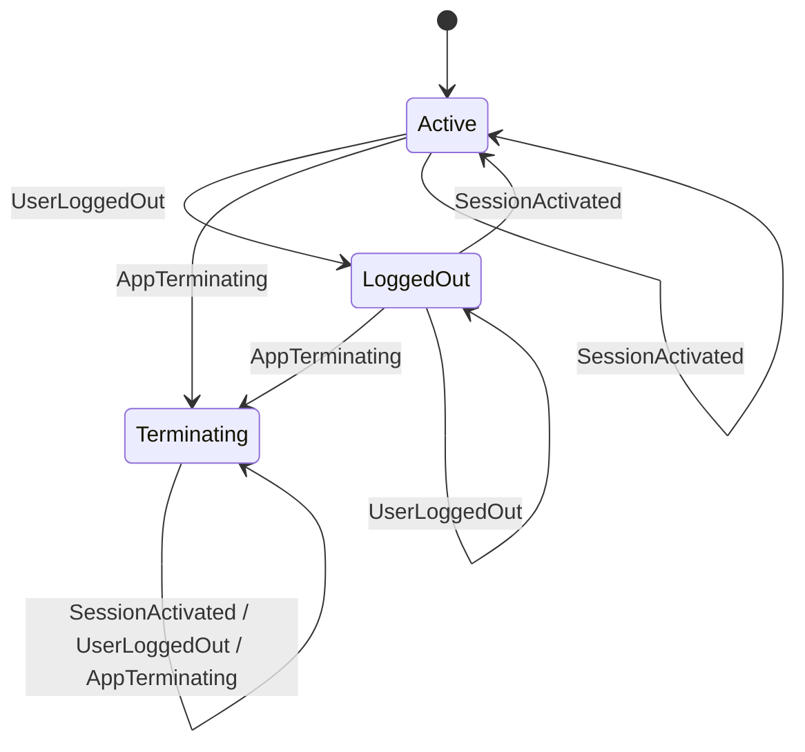
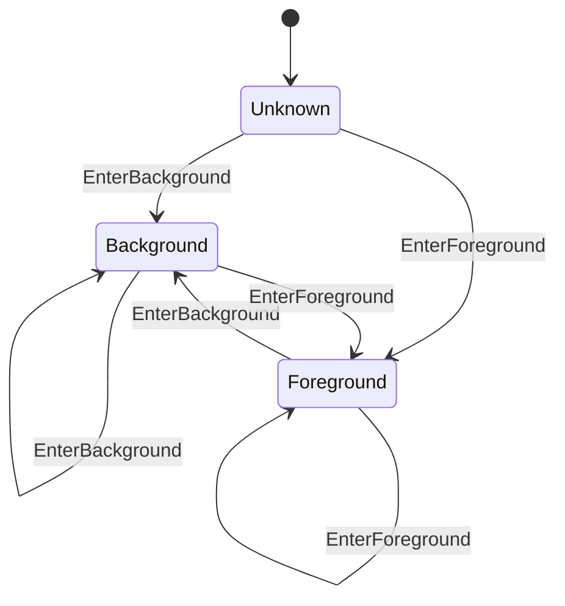
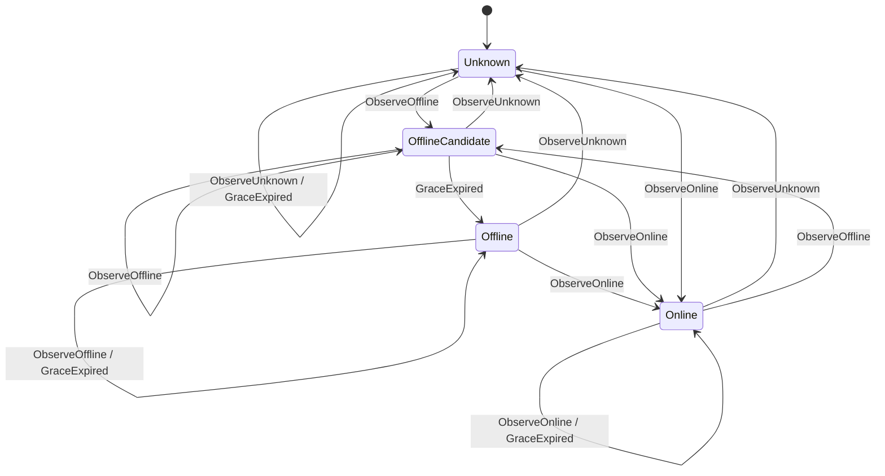
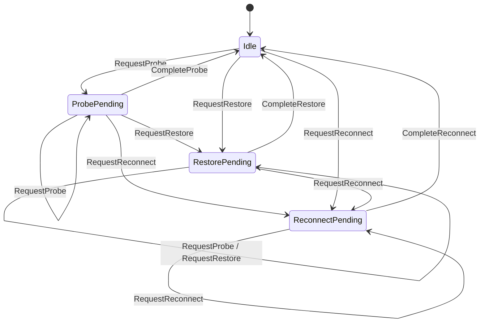
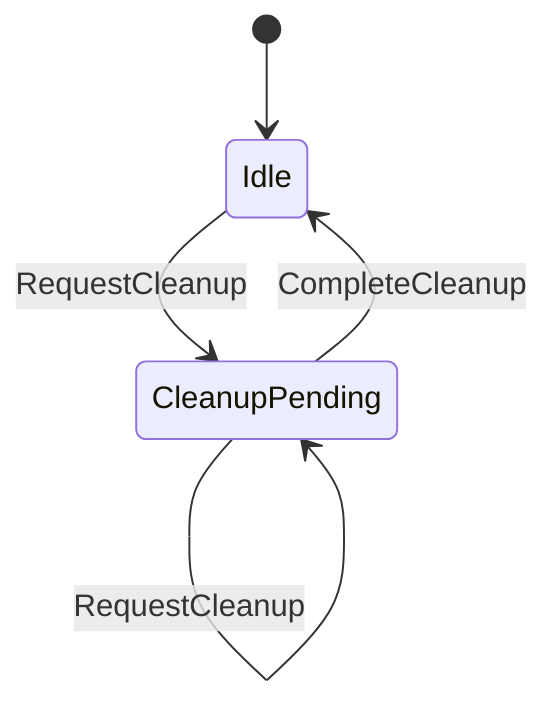
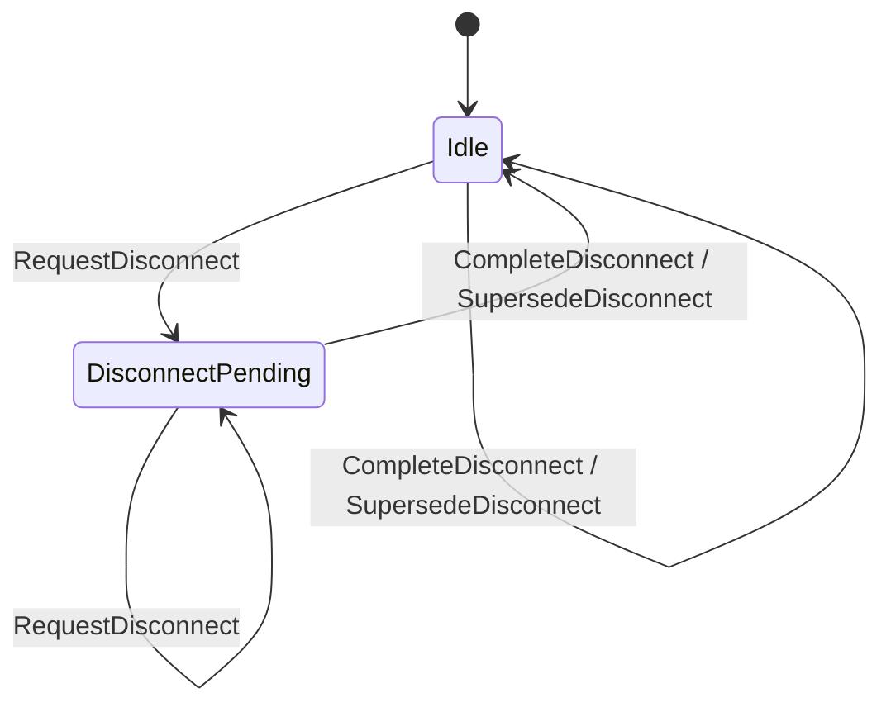
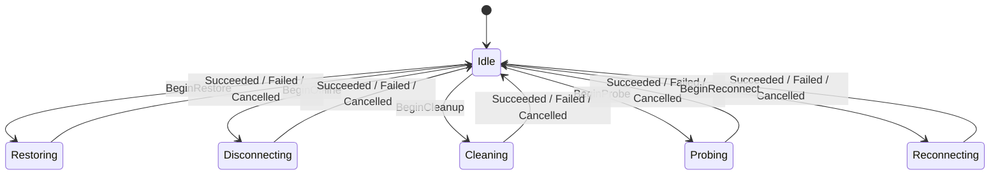
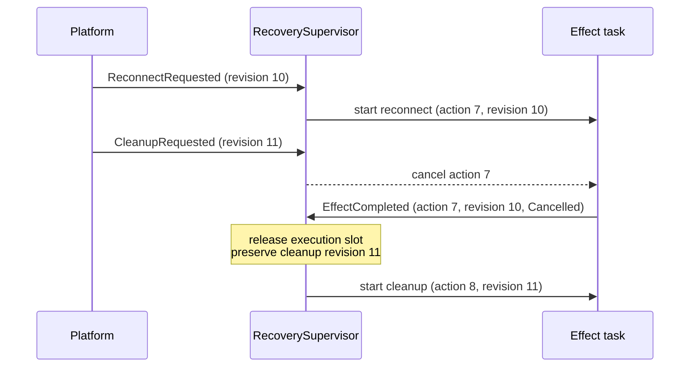
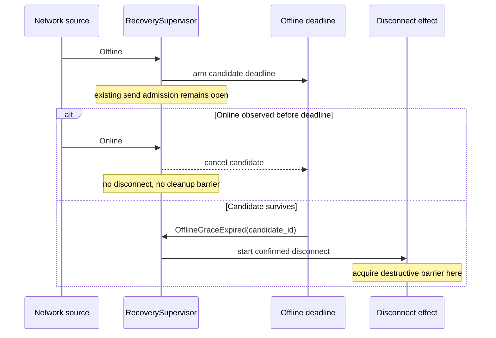
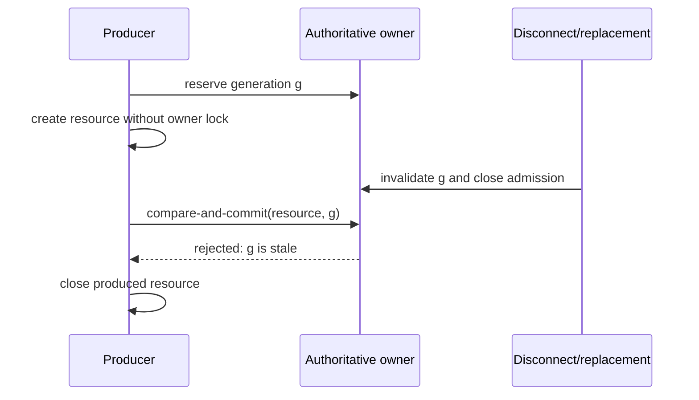

# RFC-0400: Event-driven layered connection recovery

- Status: Proposed
- Date: 2026-07-18
- RFC PR: [#401](https://github.com/Actrium/actr/pull/401)
- Tracking issue: [#400](https://github.com/Actrium/actr/issues/400)
- Superseded by: None
- Related: [Implementation draft #399](https://github.com/Actrium/actr/pull/399)

## Summary

Actr connection recovery will be governed by orthogonal policy state machines,
a single responsive supervisor, and generation-checked asynchronous effects.
A successful transition must advance when its event arrives rather than after
a fixed sleep or polling interval. Timers remain only when time is part of the
product, protocol, or candidate-selection semantics, bounds a failure, backs
off after a real failure, or supports an explicitly documented compatibility
fallback.

The design separates recovery admission, app lifecycle, network-path facts,
recovery intent, offline teardown, and asynchronous execution instead of
encoding their Cartesian product in flags or one flat state machine. These
machines are layered and orthogonal; they are not one classical hierarchical
state machine with parent-state transition inheritance. The design also
defines effect revisioning, single-flight ownership, cancellation behavior,
compare-and-commit rules, and timer policy for signaling, WebRTC, destination
transports, wire pools, mailboxes, and runtime quotas.

## Motivation

Connection recovery crosses several independently changing layers in
`core/hyper`:

- `core/hyper/src/lifecycle/network_event.rs` receives app and network facts;
- `core/hyper/src/lifecycle/node.rs` owns the runtime lifecycle;
- `core/hyper/src/wire/webrtc/signaling.rs` owns the signaling socket and
  automatic reconnect work;
- `core/hyper/src/wire/webrtc/coordinator.rs` owns WebRTC peer recovery;
- `core/hyper/src/transport/peer_transport.rs` and
  `core/hyper/src/transport/wire_pool.rs` publish destination transports;
- mailbox and WASM runtime code wait for work or capacity.

Historically, these paths combined independent facts in booleans and
order-sensitive fields. Some paths used fixed debounce windows or periodic
polling to discover that another task had already changed state. This creates
three classes of failure:

1. **Lost intent.** Recreating or partially resetting recovery state can forget
   work that should survive an event batch, an offline interval, or a
   foreground/background transition.
2. **Stale completion.** An old asynchronous attempt can complete after a newer
   attempt and publish, remove, or resurrect the wrong connection.
3. **Artificial latency.** A state change that is already observable can still
   wait for the next 10, 100, or 500 millisecond polling tick.

The problem is not solved by putting every field into one global FSM. App
lifecycle, path reachability, desired recovery work, effect execution,
signaling sessions, and multiple peer sessions are orthogonal dimensions.
Flattening them creates a large Cartesian product and encourages invalid
cross-layer transitions.

The expected outcome is deterministic recovery policy, a supervisor that stays
responsive while effects execute, immediate successful transitions, explicit
ownership of destructive delays, and concurrency invariants that can be tested
without depending on scheduler timing.

This RFC does not change the wire format or peer protocol. It defines internal
runtime concurrency and timing semantics that implementations and language
bindings can rely on.

## Detailed design

### Goals

The design MUST:

- keep independent state dimensions independent;
- keep the lifecycle supervisor responsive while an asynchronous effect runs;
- make the owner of every state transition explicit;
- retain recovery intent until a matching effect acknowledges the exact policy
  revision that it covered;
- prevent stale or cancelled work from committing;
- make built-in production paths event-driven on successful transitions;
- classify and justify every production timer;
- preserve the stronger compile-time guarantees already provided by Rust
  typestate;
- expose enough structured context to diagnose transitions and discarded work.

The design MUST NOT:

- create one global FSM containing all peers and transport layers;
- hold a policy-state lock across signaling, transport, or peer I/O;
- use elapsed time as evidence that a state change probably happened;
- delay a successful event merely to coalesce work;
- let a timeout, cancellation, or dropped future poison single-flight
  ownership;
- let a public observer callback become the authoritative state store.

### State decomposition

One persistent `RecoverySupervisor` actor is the sole writer of lifecycle
recovery policy. It continues receiving facts and completions while an effect
runs. The supervisor contains six orthogonal policy state machines:

```text
AdmissionMode
  Active | LoggedOut | Terminating

AppPhase
  Unknown | Foreground | Background

PathFact
  Unknown | Online | OfflineCandidate | Offline

RecoveryIntent
  Idle | ProbePending | RestorePending | ReconnectPending

CleanupWork
  Idle | CleanupPending

OfflineWork
  Idle | DisconnectPending
```

`AdmissionMode` answers whether automatic recovery may start at all.
`AppPhase` answers whether active recovery is currently foreground-eligible.
They remain separate because backgrounding is reversible and preserves
recovery intent, while logout and termination inhibit recovery until an
explicit session activation.

The `OfflineCandidate` deadline and identity, the latest network snapshot, and
the revision attached to each pending work domain are extended state owned by
the supervisor. They do not expand the discrete state graph.

Asynchronous effect execution is a separate single-flight state machine:

```text
Execution
  Idle
  | Disconnecting
  | Probing
  | Restoring
  | Reconnecting
  | Cleaning

EffectContext
  { action_id, kind, policy_revision, cancellation, started_at }
```

Conceptually, the supervisor's extended work state is:

```text
policy_revision: u64
recovery: Option<{ kind: Probe | Restore | Reconnect, revision }>
cleanup: Option<{ reason, revision }>
offline_disconnect: Option<{ candidate_id, revision }>
effect: Option<EffectContext>
```

The policy states answer what is true and what work is desired. `Execution`
answers which side effect currently owns the single-flight execution slot.
`EffectContext` is present exactly when `Execution` is not `Idle`. The effect
runs in a separate task and reports a message back to the supervisor; the
supervisor never holds its state lock across effect I/O.

`Online`, `Ready`, and `Failed` are not execution states. A failure is an effect
result with diagnostic data; the policy layer decides whether intent remains
pending and whether a later retry is allowed.

YASM is used for deterministic synchronous transitions where its transition
table and invalid-transition checks improve reviewability. Numeric sequence
values, deadlines, connection handles, cancellation tokens, and error details
remain extended context rather than being expanded into states.

Rust compile-time typestate such as
`Node<Init> -> Node<Attached> -> Node<Registered> -> Node<Running>` remains
compile-time state. Replacing it with a runtime FSM would weaken the API.

#### Admission mode

The admission machine has these normative transitions:



| Current State | Input | Next State |
|---|---|---|
| Active | SessionActivated | Active |
| Active | UserLoggedOut | LoggedOut |
| Active | AppTerminating | Terminating |
| LoggedOut | SessionActivated | Active |
| LoggedOut | UserLoggedOut | LoggedOut |
| LoggedOut | AppTerminating | Terminating |
| Terminating | SessionActivated | Terminating |
| Terminating | UserLoggedOut | Terminating |
| Terminating | AppTerminating | Terminating |

`Terminating` is terminal for one supervisor lifetime. `ManualReset` and
`StaleConnectionSuspected` request cleanup without changing admission mode.
`UserLogout` enters `LoggedOut`; a later network fact cannot reactivate
recovery. Only a successfully committed new session emits `SessionActivated`.

### Generated YASM documentation

The app-phase, network-path, and offline-work artifacts in this section were
emitted by YASM 0.6.0 from implementation draft #399. This revision's
recovery-intent, admission-mode, cleanup-work, and cancellation-aware execution
tables are the normative target definitions: cleanup is no longer mixed into
the recovery impact lattice. Before this RFC can be accepted, the draft MUST
implement all six policy machines and regenerate all state-machine
documentation, including `AdmissionMode`, from code.

The Phase 1 checked generator uses:

```rust
StateMachineDoc::<Machine>::generate_mermaid();
StateMachineDoc::<Machine>::generate_transition_table();
```

The generated transition-table heading is omitted below so it does not disturb
this RFC's document hierarchy. The repository MUST provide a generation command
with checked source markers and a CI `--check` mode. Generated Mermaid edges and
table rows MUST be sorted deterministically; documentation drift or ordering
churn is a failed check, not a review convention.

These local transition tables specify only the discrete machines. They do not
specify cross-machine action selection, effect preemption, or revision
acknowledgement; the composite decision and effect rules later in this RFC are
equally normative.

#### App phase



<details>
<summary>YASM-generated app-phase transition table</summary>

| Current State | Input | Next State |
|---------------|-------|------------|
| Unknown | EnterForeground | Foreground |
| Unknown | EnterBackground | Background |
| Foreground | EnterForeground | Foreground |
| Foreground | EnterBackground | Background |
| Background | EnterForeground | Foreground |
| Background | EnterBackground | Background |

</details>

#### Network path



<details>
<summary>YASM-generated network-path transition table</summary>

| Current State | Input | Next State |
|---------------|-------|------------|
| Unknown | ObserveUnknown | Unknown |
| Unknown | ObserveOnline | Online |
| Unknown | ObserveOffline | OfflineCandidate |
| Unknown | GraceExpired | Unknown |
| Online | ObserveUnknown | Unknown |
| Online | ObserveOnline | Online |
| Online | ObserveOffline | OfflineCandidate |
| Online | GraceExpired | Online |
| OfflineCandidate | ObserveUnknown | Unknown |
| OfflineCandidate | ObserveOnline | Online |
| OfflineCandidate | ObserveOffline | OfflineCandidate |
| OfflineCandidate | GraceExpired | Offline |
| Offline | ObserveUnknown | Unknown |
| Offline | ObserveOnline | Online |
| Offline | ObserveOffline | Offline |
| Offline | GraceExpired | Offline |

</details>

#### Recovery intent



<details>
<summary>Target YASM recovery-intent transition table</summary>

| Current State | Input | Next State |
|---------------|-------|------------|
| Idle | RequestProbe | ProbePending |
| Idle | RequestRestore | RestorePending |
| Idle | RequestReconnect | ReconnectPending |
| ProbePending | RequestProbe | ProbePending |
| ProbePending | RequestRestore | RestorePending |
| ProbePending | RequestReconnect | ReconnectPending |
| ProbePending | CompleteProbe | Idle |
| RestorePending | RequestProbe | RestorePending |
| RestorePending | RequestRestore | RestorePending |
| RestorePending | RequestReconnect | ReconnectPending |
| RestorePending | CompleteRestore | Idle |
| ReconnectPending | RequestProbe | ReconnectPending |
| ReconnectPending | RequestRestore | ReconnectPending |
| ReconnectPending | RequestReconnect | ReconnectPending |
| ReconnectPending | CompleteReconnect | Idle |

</details>

#### Cleanup work



<details>
<summary>Target YASM cleanup-work transition table</summary>

| Current State | Input | Next State |
|---------------|-------|------------|
| Idle | RequestCleanup | CleanupPending |
| CleanupPending | RequestCleanup | CleanupPending |
| CleanupPending | CompleteCleanup | Idle |

</details>

#### Offline work



<details>
<summary>YASM-generated offline-work transition table</summary>

| Current State | Input | Next State |
|---------------|-------|------------|
| Idle | RequestDisconnect | DisconnectPending |
| Idle | CompleteDisconnect | Idle |
| Idle | SupersedeDisconnect | Idle |
| DisconnectPending | RequestDisconnect | DisconnectPending |
| DisconnectPending | CompleteDisconnect | Idle |
| DisconnectPending | SupersedeDisconnect | Idle |

</details>

#### Recovery execution



<details>
<summary>Target YASM recovery-execution transition table</summary>

| Current State | Input | Next State |
|---------------|-------|------------|
| Idle | BeginOffline | Disconnecting |
| Idle | BeginProbe | Probing |
| Idle | BeginRestore | Restoring |
| Idle | BeginReconnect | Reconnecting |
| Idle | BeginCleanup | Cleaning |
| Disconnecting | Succeeded | Idle |
| Disconnecting | Failed | Idle |
| Disconnecting | Cancelled | Idle |
| Probing | Succeeded | Idle |
| Probing | Failed | Idle |
| Probing | Cancelled | Idle |
| Restoring | Succeeded | Idle |
| Restoring | Failed | Idle |
| Restoring | Cancelled | Idle |
| Reconnecting | Succeeded | Idle |
| Reconnecting | Failed | Idle |
| Reconnecting | Cancelled | Idle |
| Cleaning | Succeeded | Idle |
| Cleaning | Failed | Idle |
| Cleaning | Cancelled | Idle |

</details>

### Input events

Inputs are facts or effect completions, not requests to assign arbitrary state.
Representative events include:

```text
AppEnteredForeground
AppEnteredBackground
SessionActivated { session_generation }
UserLoggedOut
NetworkSnapshot { source_epoch, sequence, observed_at, semantic_path }
OfflineGraceExpired { candidate_id }
CleanupRequested { reason }
EffectCompleted {
  action_id,
  policy_revision,
  outcome: Succeeded | Failed | Cancelled | Aborted
}
SignalingGenerationChanged { generation }
PeerStateChanged { peer, session_id, state }
ShutdownRequested
```

Every network snapshot carries a source epoch and a sequence that is monotonic
within that epoch. The supervisor allocates a monotonically increasing
`source_epoch` when a platform path monitor is attached or restarted; the
monitor MUST NOT reset the sequence inside an existing epoch. A snapshot from
the current epoch whose sequence is not newer than the last accepted snapshot,
or from an older epoch, is discarded before policy transition. This prevents
both stale replay and the "sequence reset makes every future snapshot stale"
failure.

Consecutive snapshots that are semantically equivalent are structurally
deduplicated. A structural duplicate does not advance policy revision or reset
a deadline.

Semantic equality concerns routing behavior, not object identity or incidental
metadata. A material route change while online is immediately visible to the
recovery policy and advances `policy_revision`.

`observed_at` is stamped in the supervisor's monotonic clock domain. A platform
timestamp may be converted only when the binding can prove a stable mapping to
that domain; otherwise enqueue time is used. The value defines only the
offline-deadline boundary and is never treated as evidence that an asynchronous
operation completed.

### Reconciliation and action priority

Handling an input has three stages:

1. apply the input to the relevant policy state machine;
2. derive at most one executable action from the combined policy snapshot;
3. if `Execution` is `Idle`, start that action in a separate task and record its
   `EffectContext`.

Action selection uses this priority:

```text
Cleanup > confirmed offline disconnect > reconnect > restore > probe
```

Recovery intent is a monotonic impact lattice:

```text
Probe < Restore < Reconnect
```

A stronger recovery request replaces a weaker pending request because the
stronger effect semantically covers it. A weaker request cannot downgrade a
stronger pending request. This replacement is not loss of intent: the
subsumption relationship is part of the policy contract.

Cleanup is deliberately not in this lattice: cleanup-only does not satisfy a
request to restore connectivity. Cleanup is held in `CleanupWork`, and
confirmed path disconnect is held in `OfflineWork`, because teardown and future
recovery intent may coexist.

Every material policy change receives a monotonically increasing
`policy_revision`. A pending recovery intent stores the revision that most
recently required it. A duplicate normalized fact does not allocate a revision.
By default, a fact newer than a running effect is not covered by that effect;
an explicit rule may declare coverage only when the newer fact cannot affect
the effect's assumptions or result.

A cleanup-only command explicitly supersedes recovery intent whose revision is
not newer than the cleanup command; it does not semantically "cover" that
intent. Later facts receive newer revisions and remain pending. This revision
ordering replaces correctness based on receive-batch timing: batching may be
used for throughput, but it is not a policy boundary.

On `CleanupRequested { reason }`, the supervisor atomically allocates revision
`r`, records `CleanupWork::CleanupPending(r)`, and removes recovery intent with
revision `<= r`. `UserLogout` additionally enters `LoggedOut`;
`AppTerminating` enters `Terminating`; other cleanup reasons leave
`AdmissionMode` unchanged. A later fact has revision `> r` and therefore cannot
be cleared by completion of that cleanup.

`Background` gates active probe, restore, and reconnect work. It does not turn
a healthy connection into a disconnected one, erase pending intent, or block
explicit cleanup. Only a real `Background -> Foreground` transition may derive
foreground recovery work. A duplicate `Foreground` observation is a self-loop
and cannot create a second connection attempt. The supervisor records
background entry in its own monotonic clock domain; the real foreground
transition selects Probe or Reconnect from that duration and configured policy
rather than trusting a repeated caller-supplied duration.

`LoggedOut` and `Terminating` gate every automatic probe, restore, and reconnect
regardless of app phase. Required cleanup remains eligible. `SessionActivated`
returns `LoggedOut` to `Active` only after the new session generation is
authoritatively committed.

#### Composite action decision

The following table is evaluated top to bottom when `Execution` is `Idle`.
`Eligible` means app phase is not `Background` and admission mode is `Active`.

| Admission / phase | Path | Pending work | Selected action |
|---|---|---|---|
| Any | Any | `CleanupWork::CleanupPending` | Cleanup |
| Any | `Offline` | `DisconnectPending` | Confirmed offline disconnect |
| `LoggedOut` or `Terminating` | Any | Any recovery intent | None |
| `Active` / `Background` | Any | Probe, restore, or reconnect | None |
| Eligible | `OfflineCandidate` or `Offline` | Probe, restore, or reconnect | None |
| Eligible | `Unknown` or `Online` | `ReconnectPending` | Reconnect |
| Eligible | `Unknown` or `Online` | `RestorePending` | Restore |
| Eligible | `Unknown` or `Online` | `ProbePending` | Probe |
| Any | Any | No pending work | None |

Explicit cleanup does not wait for offline hysteresis. A terminating or logout
cleanup is still eligible because it reduces resources rather than restoring
them.

#### Effect preemption

The supervisor remains responsive while an effect task runs. New work is
coalesced or requests cancellation according to this impact order:

| New required work | Running work it preempts |
|---|---|
| Cleanup | Disconnect, probe, restore, reconnect |
| Confirmed offline disconnect | Probe, restore, reconnect |
| Reconnect | Probe, restore |
| Restore | Probe |
| Probe or same/weaker work | None |

Preemption cancels the running task but does not directly mutate its execution
state. The task, its owner guard, or a join monitor reports a terminal
`EffectCompleted` outcome. Resource generation checks remain the correctness
boundary even when cancellation is delayed or ignored by an underlying I/O
operation.

#### Completion and acknowledgement

An effect completion is accepted only when `action_id` identifies the current
`EffectContext`. A stale completion is logged and discarded without mutating
policy state. For the current action:

1. return `Execution` to `Idle`;
2. on failure or cancellation, retain pending policy work unless a newer fact
   has superseded it;
3. on success, acknowledge only work whose revision is no newer than the
   effect's captured `policy_revision` and whose required impact is covered by
   the completed effect;
4. preserve newer or stronger pending work;
5. reconcile immediately.

Acknowledgement domains are explicit:

- Probe, Restore, and Reconnect acknowledge only `RecoveryIntent`, according to
  `Probe < Restore < Reconnect`;
- confirmed offline disconnect acknowledges only `OfflineWork`;
- Cleanup acknowledges matching `CleanupWork` and may supersede older
  `OfflineWork` because the physical teardown covers it;
- Cleanup never acknowledges a later recovery intent.

For example, if Cleanup is requested while Probe runs, Probe completion may
release the Probe execution slot but cannot clear Cleanup. If a material route
fact arrives while Reconnect runs, completion of that older Reconnect cannot
acknowledge work derived from the newer route fact.

An aborted or dropped effect task MUST produce a terminal outcome or have its
ownership synchronously reclaimed by an identity-bearing guard. It cannot
leave `Execution` permanently non-idle. The supervisor normalizes `Aborted` to
the execution machine's `Cancelled` input after recording the diagnostic
distinction.

Platform event submission and effect completion are separate observations. A
platform callback receives `event_id` and `policy_revision` once the fact is
normalized and authoritatively owned by the supervisor; it does not
synchronously wait for teardown or reconnection. Callers that need the final
outcome observe a revision/action status stream; an `action_id` is added when
pending work actually starts. A local result timeout does not cancel an already
accepted effect.



### Offline hysteresis

An unavailable path first enters `OfflineCandidate` and owns a 400 millisecond
deadline. The purpose is narrowly defined: avoid a destructive disconnect for
a transient path flap.

The deadline is not a global debounce window:

- an online event immediately rolls `OfflineCandidate` back to `Online`;
- material online route changes are not delayed;
- cleanup bypasses the grace period;
- probe, restore, and reconnect do not acquire their own 400 millisecond timer;
  their eligibility is controlled by path state;
- expiry is accepted only for the current candidate identity;
- repeated equivalent unavailable facts do not extend the deadline.

Entering `OfflineCandidate` MUST NOT acquire a destructive cleanup barrier or
implicitly block every outbound send. The confirmed offline-disconnect effect
acquires that barrier only after the candidate commits. Send admission during
the candidate interval is an explicit policy, with the default remaining open
for an existing session; an implementation may expose fail-fast behavior for a
platform that knows the path is unusable, but it cannot hide the 400
milliseconds inside an unrelated cleanup guard.

The deadline boundary is deterministic. An opposing fact already queued with
`observed_at <= deadline` wins over `OfflineGraceExpired`; a fact observed after
the deadline does not retroactively cancel the committed disconnect. The actor
may prioritize an already-ready input branch over the timer branch to drain
such facts, but it MUST NOT add a second settle window.

An explicit reconnect received during `OfflineCandidate` is retained
immediately. It cannot run until the path becomes eligible, but its intent
timestamp and revision are not shifted by 400 milliseconds. Explicit cleanup
preempts the candidate immediately.



This is business hysteresis because the product intentionally prefers retaining
a possibly healthy session for a short interval over performing an expensive
disconnect. If product evidence later supports a different interval, the
constant may change without changing the state model.

### Generation and session commit gates

Every asynchronous resource family has a monotonic identity:

- signaling connection attempts use `connection_generation`;
- destination connection flights use identity-bearing shared flight objects;
- WebRTC peers use `session_id` and, where required, an ICE generation;
- lifecycle effects use `action_id` and captured `policy_revision`;
- wire-pool slots use a per-slot generation in addition to the pool's closed
  generation.

Starting a replacement invalidates the identity that an older completion would
need to commit. Producing a resource is not sufficient to publish it. The
producer MUST re-enter the authoritative owner and compare its identity with
the current generation or flight under the same synchronization boundary used
by close and replacement.

The commit rule is:

```text
commit(resource, identity) succeeds
  iff identity is still current and the owner is still open
```

On failed commit, the producer closes or drops the resource it created. It MUST
NOT remove the replacement's state.

Disconnect invalidates both explicit and automatic in-flight signaling
attempts. Pausing automatic reconnect is a different operation and MUST NOT
implicitly cancel a valid explicit attempt.

For signaling, generation validation, socket publication, and the transition to
`Connected` occur under one authoritative commit facade shared with disconnect.
It is invalid to check generation, release the synchronization boundary, and
then publish sink, stream, state, hooks, or public events. Observer hooks run
after commit and cannot block the transport owner.

For destination transports, closing state and the current connection flight
belong to one owner or obey one documented lock order. Code MUST NOT await a
closing-state lock while holding a transport-map lock if the close path can
take them in the opposite order. `close_all` first closes admission for the
whole registry, then detaches flights; no new flight can enter between the
drain and per-destination closing marks.



### Cancellation-safe single-flight

Single-flight ownership is represented by an RAII guard or identity-bearing
flight object. If the creator future is aborted, reaches a deadline, is
cancelled by lifecycle, or is dropped by its caller, guard destruction releases
only that exact ownership generation and wakes waiters.

Waiters MUST:

1. register for notification;
2. recheck authoritative state;
3. wait only if the desired transition has not already happened.

This ordering prevents lost wakeups. Notification primitives are hints to
re-read authoritative state; a notification is not itself the state.

Level state observed by multiple waiters, such as DataChannel readiness, ICE
gathering phase, signaling generation, quota availability, or pool readiness,
SHOULD use `watch`, a semaphore, or an equivalent retained-state primitive. A
single transition MUST NOT rely on `notify_one()` when every current waiter
must re-evaluate. If `Notify` is used, the implementation must distinguish
stored single permits from `notify_waiters()` generation semantics and prove
registration ordering with deterministic tests.

Wire-pool close, add, replacement, and successful connection publication are
linearized through one authoritative pool state containing `closed` and slot
generations. `add_connection` rejects a closed pool before publishing
`Connecting`. A late success or failure can mutate a slot only if its generation
is still current. Close cancels and joins, or otherwise observes terminal
completion of, detached connection tasks before reporting quiescence.

### Event-driven observation

If a successful state change is already observable, the implementation MUST use
that event source. The built-in paths use:

- DataChannel open callbacks or notifications;
- buffered-low callbacks for graceful send-buffer drain;
- WebRTC peer-connection state broadcasts for initial readiness;
- ICE gathering callbacks and completion notifications;
- ICE restart generation/state broadcasts;
- mailbox enqueue notifications plus concurrent observation of in-flight
  reply/ack completion;
- permit-release notifications for WASM quota;
- peer-state notifications plus the nearest exact stale deadline;
- cancellation tokens for lifecycle and shutdown.

For every callback-to-wait bridge, the consumer subscribes or registers before
the final authoritative read. Initial WebRTC readiness therefore subscribes
before checking both peer and DataChannel state; ICE gathering registers before
the final gathering-state read; signaling-generation waits install their
receiver before checking the generation. A broadcast-only event is insufficient
unless a retained authoritative snapshot is re-read after subscription.

A DataChannel Open or Closed transition wakes every sender waiting on that level
state. Graceful buffer drain also observes channel closure, so a closed channel
does not wait for the complete drain failure bound.

The stale-peer reaper reads state and `last_state_change` from one authoritative
snapshot. It cannot combine live peer-connection state with the timestamp of an
older cached state. Quota waits register before retrying authoritative
acquisition, and quota release is resource-specific or semaphore-backed so
multiple releases cannot collapse while capacity remains available.

A receiver observing a closed channel exits immediately. It does not sleep
before checking again.

The mailbox event loop waits concurrently for shutdown, new enqueue work, and
the next in-flight reply/ack completion. Waiting only for enqueue when storage
is empty is invalid because it can starve completions that are already in
flight.

### Timer policy

Every production use of `sleep`, `sleep_until`, `interval`, `timeout`, or an
equivalent primitive MUST belong to one of these categories:

| Category | Allowed purpose | Successful transition behavior |
|---|---|---|
| Business hysteresis | Confirm an offline candidate before destructive disconnect | An opposing fact rolls back immediately |
| Protocol selection window | Prefer a better protocol candidate, such as an ICE candidate class, within a bounded window | The first candidate meeting the configured selection policy wins; the window is not generic synchronization |
| Protocol clock or rate limit | Ping, heartbeat, lease, offer throttle, or runtime preemption required by a protocol or safety contract | The clock initiates or admits protocol work; it does not poll for completion |
| Lifecycle expiry | Expire stale peers, deduplication records, reassembly state, caches, or other retained state at its exact lifetime boundary | A state change cancels or recomputes the nearest deadline; there is no periodic full scan when an exact deadline is available |
| Failure bound | Limit connect, I/O, RPC, hook, shutdown, ICE, or drain duration | Event/future success wins immediately |
| Failure backoff | Avoid a hot loop after an observed failure | Entered only after failure and interrupted by lifecycle/shutdown when an event source exists |
| Compatibility fallback | Support an implementation that cannot emit the required event | Explicitly documented and not used by the built-in production backend |

Timers MUST NOT:

- sequence ordinary successful transitions;
- be used as a substitute for an available callback or notification;
- add a grace period above an existing failure deadline;
- periodically scan state when the next exact deadline and state-change event
  are available;
- reset a deadline because a duplicate state event was received;
- multiply one end-to-end failure budget by awaiting child tasks sequentially
  with a fresh full timeout for each child.

A failure timeout races the actual operation. It does not add latency when the
operation succeeds. Parallel shutdown or close work shares one overall deadline
and joins children concurrently; after that deadline, remaining children are
cancelled or aborted according to their ownership contract.

ICE candidate acceptance waits are protocol selection windows, not polling.
The implementation draft's host/srflx/prflx/relay defaults of
`0/20/40/100 ms` remain valid policy defaults until interoperability or
production telemetry justifies changing them. This RFC's requirement to remove
unnecessary waits does not mean setting protocol selection windows to zero.

#### Auditable timer inventory

Principles alone are insufficient to prove that every timer is intentional.
The implementation MUST maintain a source-controlled timer inventory with one
entry for every production timer call site. Each entry records:

| Field | Meaning |
|---|---|
| Stable ID and source owner | The timer and subsystem that owns it |
| Category | One category from the table above |
| Duration source | Constant, configuration, protocol field, or computed exact deadline |
| Arm condition | The fact or failure that makes the timer eligible |
| Success signal | Future, callback, watch, semaphore, or authoritative state that wins immediately |
| Interrupt source | Lifecycle, shutdown, replacement generation, or none with justification |
| Expiry effect | The exact state transition or failure produced |
| Reset rule | Which material event may replace the deadline; duplicates never do |

CI MUST fail when a production timer call site is added without an inventory
entry, when an inventory entry has no call site, or when generated state-machine
documentation drifts. A timer trace records its stable ID, category, deadline,
owner identity, and elapsed duration.

The initial inventory MUST explicitly include at least:

| Timer family | Category |
|---|---|
| 400 ms offline candidate | Business hysteresis |
| ICE candidate acceptance 0/20/40/100 ms | Protocol selection window |
| Heartbeat, ping, lease, ICE offer throttle, Wasmtime epoch tick | Protocol clock or rate limit |
| Stale peer, deduplication, activity, reassembly, and cache expiry | Lifecycle expiry |
| Connect, send, RPC, hook, close, drain, ICE and shutdown deadlines | Failure bound |
| Signaling, credential, connection and ICE restart retry delays | Failure backoff |
| Third-party mailbox empty-queue interval and legacy nonzero network debounce | Compatibility fallback |

The built-in SQLite mailbox implements depth/enqueue observation and therefore
does not use empty-queue polling. For compatibility, a third-party mailbox that
does not implement `MailboxDepthObserver` may use the documented fallback
interval. Making observation mandatory is a separate breaking public-API
proposal.

### Authoritative state and public observers

Callbacks, broadcasts, and notifications wake consumers; they are not
authoritative state. A laggable broadcast MUST NOT be the sole source of a
business-critical send gate. Consumers re-read an authoritative snapshot or
watch value before acting.

Public observer delivery is decoupled from the underlying connection state
machine. A slow observer may delay its own notification stream but MUST NOT
block transport progress or become able to publish stale state.

### Diagnostics

Recovery logs and tracing spans SHOULD include, when applicable:

- `connection_generation`;
- peer identity and `session_id`;
- `event_id`;
- network `source_epoch` and sequence;
- `policy_revision`, `action_id`, and captured effect revision;
- old state, input, and new state;
- reason a stale completion or duplicate fact was discarded;
- timer inventory ID, category, and deadline when a timer is armed;
- elapsed operation duration.

Logging MUST use the repository's canonical `ActrId::to_string_repr()` and
`ActrType::to_string_repr()` representations.

### Required invariants

Implementations conforming to this RFC must demonstrate:

1. Duplicate or stale snapshots cannot mutate path state, while a new source
   epoch can begin a fresh monotonic sequence.
2. Fast offline-to-online rollback performs no disconnect.
3. `OfflineCandidate` does not block outbound sends through a destructive
   cleanup barrier.
4. Cleanup cannot acknowledge a later recovery fact.
5. `LoggedOut` and `Terminating` cannot be reactivated by network facts.
6. Duplicate foreground observations do not create recovery work.
7. Background preserves recovery intent while gating active recovery.
8. Recovery side effects are single-flight while the supervisor remains
   responsive to new facts.
9. A stale, cancelled, or weaker effect completion cannot acknowledge newer or
   stronger intent.
10. A stale signaling generation cannot publish `Connected` or invoke a
    connected observer.
11. A cancelled creator releases ownership without erasing its replacement.
12. Only the current destination flight may commit transport state.
13. Close and late connection success or failure are linearized.
14. Transport creation racing per-peer or close-all teardown cannot deadlock.
15. Every DataChannel state waiter wakes on an Open or Closed transition.
16. Initial readiness and ICE gathering cannot lose a transition between state
    read and event subscription.
17. Duplicate peer-state events do not extend stale-peer lifetime, and the
    reaper never combines a new state with an old state's timestamp.
18. Empty mailbox storage does not starve in-flight reply/ack completion.
19. Available quota cannot remain idle because several release notifications
    collapsed into one.
20. Ordinary successful transitions do not wait for a fixed polling interval or
    consume a failure deadline after their success event.
21. Parallel shutdown is bounded by one overall deadline rather than the number
    of registered child tasks multiplied by a per-child timeout.
22. Every production timer has exactly one valid inventory classification.

## Drawbacks

The design introduces more explicit state types and identities than a
flag-based implementation. Engineers must decide which layer owns each new
fact, maintain effect and resource generations, and understand policy state
separately from execution state.

Event-driven code can still contain lost-wakeup bugs if notification
registration and authoritative-state rechecks are ordered incorrectly.
Generation checks and RAII guards also add implementation discipline and test
surface.

The 400 millisecond offline hysteresis intentionally delays a destructive
disconnect. This is not minimum latency for confirmed physical loss, but it
avoids substantially more expensive reconnect churn during transient path
events. It does not delay cleanup or place an implicit 400 millisecond barrier
in front of outbound sends.

Protocol selection windows, including ICE candidate-class acceptance waits, can
intentionally delay selection of a merely usable candidate in order to obtain a
better one. Their values require protocol and production evidence rather than a
blanket zero-latency rule.

Compatibility with mailboxes that cannot emit enqueue/depth events means the
SDK cannot guarantee zero polling for arbitrary third-party implementations
without a future breaking API change.

## Alternatives

### One global connection FSM

A single FSM could enumerate app phase, path, signaling, recovery action, and
every peer state. It gives one transition table but creates a Cartesian product
whose size grows with the number of peers. It also permits transitions that
cross ownership boundaries. Orthogonal state machines with one reconciliation
boundary preserve explicit policy without flattening independent dimensions.

### Flags and procedural conditionals

Keeping booleans such as `connected`, `connecting`, `recovering`, and
`suppressed` minimizes type definitions. It does not define which combinations
are valid or which write wins. Pending work can be cleared accidentally, and a
stale task can commit unless every call site independently remembers the same
rules.

### Global debounce or event batching

A fixed settle window can merge noisy input and reduce action count, but it
adds its full duration to unrelated actions and makes correctness depend on
arrival order within the window. Structural deduplication removes equivalent
facts without delay. The only retained window belongs to the reversible
offline candidate because it protects a destructive action.

### Periodic polling

Polling is simple when a dependency exposes only a getter. Where callbacks,
channels, notifications, watches, or exact deadlines exist, polling adds
latency and wakeups and complicates shutdown. The RFC permits a documented
compatibility fallback only when the implementation cannot provide an event
source.

### Make mailbox observation mandatory immediately

Requiring `MailboxDepthObserver` would remove the final compatibility fallback,
but it would break third-party mailbox implementations in the current public
API. This RFC makes the built-in backend event-driven and leaves the breaking
trait change to a dedicated proposal.

### Actorize every resource owner

This RFC makes the lifecycle `RecoverySupervisor` an actor because it must stay
responsive while effects execute and has one natural policy owner. Converting
every signaling socket, peer, transport, and wire slot into an actor would be a
broader migration with its own overhead and failure model. Resource owners may
instead use typed state behind one synchronization facade, provided generation
checking and close/publication are linearized and no lock-order cycle exists.

### Make no change

The SDK would retain order-sensitive recovery, stale-completion races,
avoidable polling latency, and timers with ambiguous semantics. These failures
become more likely on mobile lifecycle transitions and unstable networks, where
events from several layers arrive concurrently.

## Compatibility and phasing

This RFC changes no wire format, protocol message, or required public API.
Internal state types, synchronization, and observer wiring may change without
using the 0.x breaking-change window.

The proposal is phased as follows:

### Phase 1: executable policy documentation

- add `AdmissionMode` and update the YASM policy machines;
- generate deterministically sorted diagrams, local transition tables, and the
  composite decision table through a checked documentation command;
- establish a source-controlled timer inventory and CI drift checks.

Acceptance criteria: generated documentation matches the target policy in this
RFC, and every existing production timer has one inventory entry.

### Phase 2: responsive policy and effect execution

- introduce the persistent layered recovery supervisor and execution state;
- run effects outside the supervisor and pass versioned completion messages
  back to it;
- retain recovery intent across batches and lifecycle transitions;
- implement admission, foreground self-loop, preemption, revision
  acknowledgement, and offline barrier semantics;
- separate event acceptance from effect completion.

Acceptance criteria: invariants 1 through 9 pass under paused-time and
deterministic interleaving tests without scheduler sleeps.

### Phase 3: generation and cancellation safety

- apply generation/session commit gates to signaling, destination flights,
  peers, and wire-pool publication;
- make creator ownership cancellation-safe;
- linearize close and successful or failed publication;
- remove destination lock-order cycles and close-all admission gaps.

Acceptance criteria: invariants 10 through 14 pass, including generation-check
versus disconnect, aborted creator, close-all versus creation, late completion,
and lock-order interleavings.

### Phase 4: event-driven production paths

- replace successful-path transport, ICE, mailbox, quota, and stale-peer
  polling with notifications, callbacks, watches, broadcasts, or exact
  deadlines;
- use retained level-state observation for multi-waiter readiness;
- make retry backoff interruptible by lifecycle/shutdown where the owner has an
  event source;
- document compatibility fallback behavior and classify every new timer.

Acceptance criteria: invariants 15 through 22 pass. Race tests place transitions
inside the former subscription windows through injected barriers rather than
probabilistic sleeps.

### Phase 5: integration validation

- run formatting, compile checks, strict Clippy, library tests, concurrent
  dispatch, signaling reconnect, ICE restart, mobile recovery, and
  large-message recovery suites;
- validate supported language bindings and the minimum Rust version in CI.

Acceptance criteria: all enabled checks pass; ignored/manual tests remain
explicitly identified. The RFC documentation generator and timer-inventory
checker also pass in CI.

Draft implementation PR #399 may be used to validate the proposal, but its
existence does not imply RFC acceptance. Maintainers may require the
implementation to change during RFC review.

## Unresolved questions

- Should the explicit nonzero network-event debounce compatibility option
  remain long term, or be deprecated once downstream callers migrate to
  structural deduplication?
- Should a future breaking release require mailbox enqueue/depth observation,
  or introduce a separate event-capable mailbox trait?
- What production telemetry should determine whether 400 milliseconds remains
  the appropriate offline hysteresis?
- Should the timer inventory be a manifest checked against instrumented wrapper
  types, or be generated directly from those wrappers? Either form must enforce
  the same one-entry-per-call-site invariant.
- Which platform bindings can provide a monotonic network `observed_at`, and
  which must use supervisor enqueue time? This affects only exact deadline tie
  diagnostics, not the state model.

## Future possibilities

A follow-up RFC may make mailbox observation mandatory and remove the
third-party polling fallback.

Signaling may represent socket-resource state and reconnect-task state as
additional YASM machines or typed enums behind the required single commit
facade. WebRTC peers can similarly split lifecycle, negotiation, ICE
generation, and public projection into explicit sub-state machines.

Hook contexts can read identity and credentials from `SessionState` at delivery
time, eliminating captured legacy copies during hard rebind. Peer send gates can
read authoritative coordinator snapshots while keeping broadcasts solely for
notification and diagnostics.

Structured transition events may support state diagrams, recovery-latency
histograms, discarded-generation counters, and deterministic replay of
production incident traces.
